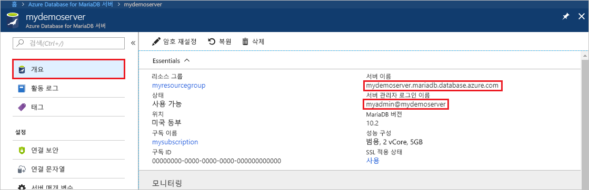
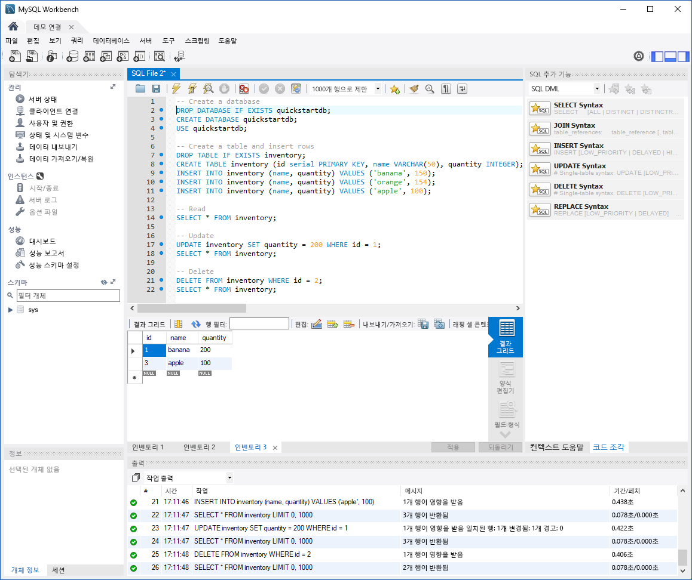

# <a name="azure-database-for-mariadb-use-mysql-workbench-to-connect-and-query-data"></a>Azure Database for MariaDB: MySQL Workbench를 사용하여 데이터 연결 및 쿼리

이 빠른 시작에서는 MySQL Workbench를 사용하여 Azure Database for MariaDB 인스턴스에 연결하는 방법을 보여 줍니다. 

## <a name="prerequisites"></a>필수 조건

이 빠른 시작에서는 다음과 같은 가이드 중 하나에서 만들어진 리소스를 시작 지점으로 사용합니다.

- [Azure Portal을 사용하여 Azure Database for MariaDB 서버 만들기](./quickstart-create-mariadb-server-database-using-azure-portal.md)
- [Azure CLI를 사용하여 Azure Database for MariaDB 서버 만들기](./quickstart-create-mariadb-server-database-using-azure-cli.md)

## <a name="install-mysql-workbench"></a>MySQL Workbench 설치

[MySQL Workbench](https://dev.mysql.com/downloads/workbench/)를 다운로드하여 컴퓨터에 설치합니다.

## <a name="get-connection-information"></a>연결 정보 가져오기

Azure Database for MariaDB 인스턴스에 연결하는 데 필요한 연결 정보를 가져옵니다. 정규화된 서버 이름 및 로그인 자격 증명이 필요합니다.

1. [Azure Portal](https://portal.azure.com/)에 로그인합니다.

2. Azure Portal의 왼쪽 메뉴에서 **모든 리소스**를 선택합니다. 그런 다음, 만든 서버(예:**mydemoserver**)를 검색합니다.

3. 서버 이름을 선택합니다.

4. 서버의 **개요 페이지**에서 **서버 이름** 및 **서버 관리자 로그인 이름**의 값을 기록해 둡니다. 암호를 잊어버리면 이 페이지에서 암호를 재설정할 수 있습니다.

 

## <a name="connect-to-the-server-by-using-mysql-workbench"></a>MySQL Workbench를 사용하여 서버에 연결

MySQL Workbench를 사용하여 Azure Database for MariaDB 서버에 연결하려면 

1.  컴퓨터에서 MySQL Workbench를 엽니다. 

2.  **새 연결 설정** 대화 상자의 **매개 변수** 탭에서 다음 정보를 입력합니다.

    | 설정 | 제안 값 | 필드 설명 |
    |---|---|---|
    |   연결 이름 | **데모 연결** | 이 연결에 대한 레이블을 지정합니다. |
    | 연결 방법 | **표준(TCP/IP)** | 표준(TCP/IP)이면 충분합니다. |
    | 호스트 이름 | *서버 이름* | Azure Database for MariaDB 인스턴스를 만들 때 사용한 서버 이름 값을 지정합니다. 예제 서버는 **mydemoserver.mariadb.database.azure.com**입니다. 예제와 같이 정규화된 도메인 이름(\*.mariadb.database.azure.com)을 사용합니다. 서버 이름을 잊어버린 경우 이전 섹션의 단계를 완료하여 연결 정보를 가져옵니다.  |
    | 포트 | **3306** | Azure Database for MariaDB에 연결할 때는 항상 포트 3306을 사용합니다. |
    | 사용자 이름 |  *서버 관리자 로그인 이름* | Azure Database for MariaDB 인스턴스를 만들 때 사용한 서버 관리자 로그인 사용자 이름을 입력합니다. 예제 사용자 이름은 **myadmin@mydemoserver**입니다. 서버 관리자 로그인 이름을 잊어버린 경우 이전 섹션의 단계를 완료하여 연결 정보를 가져옵니다. 형식은 *username@servername*입니다.
    | 암호 | *사용자 암호* | 암호를 저장하려면 **자격 증명 모음에 저장**을 선택합니다. |

    

3.   모든 매개 변수가 올바르게 구성되었는지 테스트하려면 **연결 테스트**를 선택합니다. 

4.   **확인**을 클릭하여 해당 연결을 저장합니다. 

5.   **MySQL 연결**에서 서버에 해당하는 타일을 선택합니다. 연결이 설정될 때까지 기다립니다.

    새 SQL 탭이 쿼리를 입력할 수 있는 빈 편집기로 열립니다.
    
    > [!NOTE]
    > 기본적으로 SSL 연결 보안이 필요하며 Azure Database for MariaDB 서버에서 적용됩니다. 일반적으로 SSL 인증서가 있는 추가 구성은 MySQL Workbench에서 서버에 연결하는 데 필요하지 않지만, MySQL Workbench와 SSL CA 인증을 바인딩하는 것이 좋습니다. SSL을 사용하지 않도록 설정하려면 Azure Portal의 서버 개요 페이지 메뉴에서 **연결 보안** 메뉴를 선택합니다. **SSL 연결 적용**에서 **사용하지 않음**을 선택합니다.

## <a name="create-table-and-insert-read-update-and-delete-data"></a>테이블 만들기 및 삽입, 데이터 읽기, 업데이트 및 삭제

1. 몇 가지 샘플 데이터를 설명하기 위해 다음 샘플 SQL 코드를 빈 SQL 탭 페이지에 복사하여 붙여넣습니다.

    이 코드는 **quickstartdb**라는 빈 데이터베이스를 만듭니다. 그런 다음, 이름이 **inventory**인 샘플 테이블을 만듭니다. 이 코드는 일부 행을 삽입한 다음, 행을 읽습니다. 데이터가 update 문으로 변경되고 다시 행을 읽습니다. 마지막으로 코드가 행을 삭제하고 다시 행을 읽습니다.
    
    ```sql
    -- Create a database
    -- DROP DATABASE IF EXISTS quickstartdb;
    CREATE DATABASE quickstartdb;
    USE quickstartdb;
    
    -- Create a table and insert rows
    DROP TABLE IF EXISTS inventory;
    CREATE TABLE inventory (id serial PRIMARY KEY, name VARCHAR(50), quantity INTEGER);
    INSERT INTO inventory (name, quantity) VALUES ('banana', 150);
    INSERT INTO inventory (name, quantity) VALUES ('orange', 154);
    INSERT INTO inventory (name, quantity) VALUES ('apple', 100);
    
    -- Read
    SELECT * FROM inventory;
    
    -- Update
    UPDATE inventory SET quantity = 200 WHERE id = 1;
    SELECT * FROM inventory;
    
    -- Delete
    DELETE FROM inventory WHERE id = 2;
    SELECT * FROM inventory;
    ```

    스크린샷은 MySQL Workbench에서의 SQL 코드 예제와 실행 후 출력을 보여 줍니다.
    
    

2. 샘플 SQL 코드를 실행하려면 **SQL 파일** 탭의 도구 모음에서 번갯불 아이콘을 클릭합니다.
3. 페이지 중앙의 **결과 그리드** 섹션에서 세 개의 탭 결과를 확인합니다. 
4. 페이지 하단에서 **출력** 목록을 확인합니다. 각 명령의 상태가 표시됩니다. 

이 빠른 시작에서는 MySQL Workbench를 사용하여 Azure Database for MariaDB에 연결했고 SQL 언어를 사용하여 데이터를 쿼리했습니다.

<!--
## Next steps
> [!div class="nextstepaction"]
> [Migrate your database using Export and Import](./concepts-migrate-import-export.md)
-->