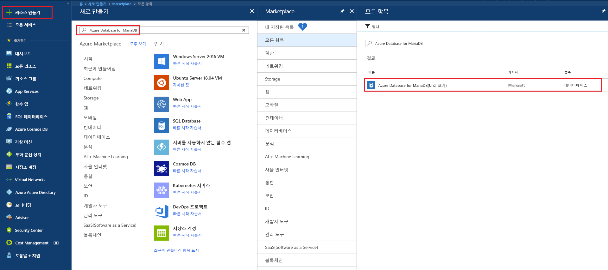
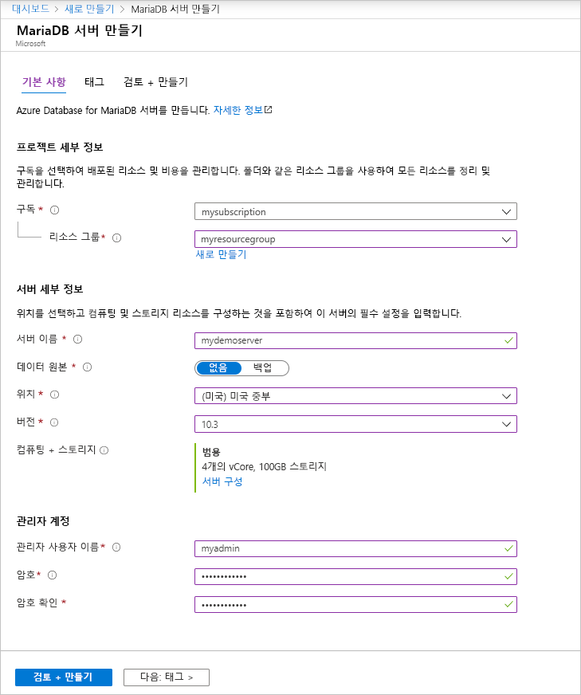
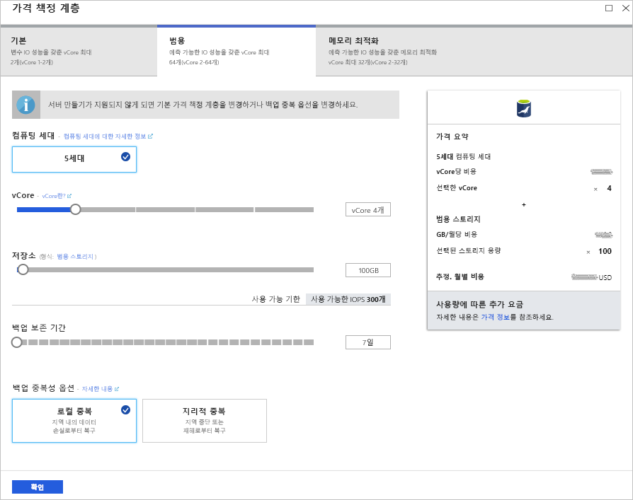
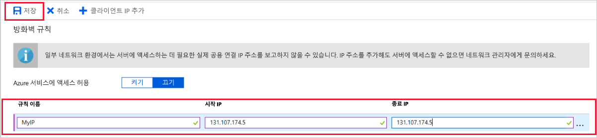
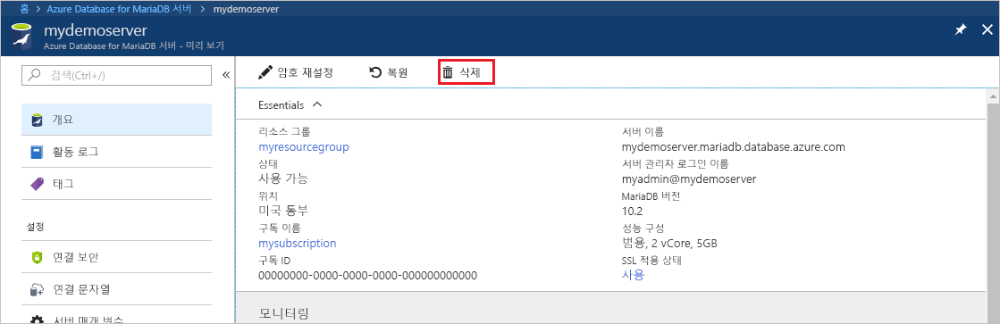

# <a name="create-an-azure-database-for-mariadb-server-by-using-the-azure-portal"></a>Azure Portal을 사용하여 Azure Database for MariaDB 서버 만들기

Azure Database for MariaDB는 클라우드에서 고가용성 MariaDB 데이터베이스를 실행, 관리 및 확장하는 데 사용하는 관리 서비스입니다. 이 빠른 시작에서는 Azure Portal을 사용하여 약 5분 안에 Azure Database for MariaDB 서버를 만드는 방법을 보여 줍니다.  

Azure 구독이 아직 없는 경우 시작하기 전에 [Azure 체험 계정](https://azure.microsoft.com/free/)을 만듭니다.

## <a name="sign-in-to-the-azure-portal"></a>Azure Portal에 로그인

웹 브라우저에서 [Azure Portal](https://portal.azure.com/)로 이동합니다. 자격 증명을 입력하여 포털에 로그인합니다. 기본 보기는 서비스 대시보드입니다.

## <a name="create-an-azure-database-for-mariadb-server"></a>Azure Database for MariaDB 서버 만들기

Azure Database for MariaDB 서버는 정의된 [계산 및 스토리지 리소스](concepts-pricing-tiers.md) 세트를 사용하여 만듭니다. 서버는 [Azure 리소스 그룹](../azure-resource-manager/resource-group-overview.md) 내에 만듭니다.

Azure Database for MariaDB 서버를 만들려면

1. 포털의 왼쪽 상단 모서리에서 **리소스 만들기** 단추(+)를 선택합니다.

2. **데이터베이스** > **Azure Database for MariaDB**를 차례로 선택합니다. 검색 상자에서 **MariaDB**를 입력하여 해당 서비스를 찾을 수도 있습니다.

   

3. 다음 서버 세부 정보를 입력하거나 선택합니다.
   
   

    설정 | 제안 값 | 설명
    ---|---|---
    서버 이름 | *고유 서버 이름* | Azure Database for MariaDB 서버를 식별하는 고유한 이름을 선택합니다. 예를 들어 **mydemoserver**가 있습니다. 입력한 서버 이름에 도메인 이름 *.mariadb.database.azure.com*이 추가됩니다. 서버 이름은 소문자, 숫자 및 하이픈(-) 문자만 포함할 수 있으며, 3~63자여야 합니다.
    구독 | *구독* | 서버에 사용할 Azure 구독을 선택합니다. 구독이 여러 개인 경우 해당 리소스에 대해 요금이 청구되는 적절한 구독을 선택합니다.
    리소스 그룹 | **myresourcegroup** | 리소스 그룹 이름을 입력하거나 기존 리소스 그룹을 선택합니다. 
    원본 선택 | **비어 있음** | 새 서버를 처음부터 만들려면 **비어 있음**을 선택합니다. 기존 Azure Database for MariaDB 서버의 지역 백업에서 서버를 만드는 경우 **백업**을 선택합니다.
    서버 관리자 로그인 | **myadmin** | 서버에 연결할 때 사용할 로그인 계정입니다. 관리자 로그인 이름은 **azure_superuser**, **admin**, **administrator**, **root**, **guest** 또는 **public**일 수 없습니다.
    암호 | *사용자 선택* | 서버 관리자 계정의 새 암호를 입력합니다. 8-128자여야 합니다. 사용자 암호는 다음 범주 중 세 개의 문자를 포함해야 합니다. 영문 대문자, 영문 소문자, 숫자(0-9) 및 영숫자가 아닌 문자(!, $, #, % 등).
    암호 확인 | *사용자 선택*| 관리자 계정 암호를 확인합니다.
    위치 | *사용자와 가장 가까운 지역*| 사용자 또는 다른 Azure 애플리케이션에 가장 가까운 위치를 선택합니다.
    버전 | *최신 버전*| 최신 버전입니다(다른 버전을 사용하는 특정 요구 사항이 없는 경우).
    가격 책정 계층  | 설명을 참조하세요. | 새 서버에 대한 계산, 스토리지 및 백업 구성입니다. **가격 책정 계층** > **범용**을 선택합니다. 다음 설정에 대해 기본값을 그대로 유지합니다.<br><ul><li>**컴퓨팅 세대**(Gen 5)</li><li>**vCore**(vCore 4개)</li><li>**스토리지**(100GB)</li><li>**백업 보존 기간**(7일)</li></ul><br>지역 중복 저장소에서 서버 백업을 사용하도록 설정하려면 **백업 중복 옵션**에서 **지역 중복**을 선택합니다. <br><br>이 가격 책정 계층 선택을 저장하려면 **확인**을 선택합니다. 다음 스크린샷은 이러한 선택을 캡처한 것입니다.
  
   > [!NOTE]
   > 워크로드에 가벼운 컴퓨팅 및 I/O가 적합한 경우 기본 가격 책정 계층을 고려합니다. 기본 가격 책정 계층에서 만든 서버는 나중에 범용으로 또는 메모리 최적화되도록 확장할 수 없습니다. 자세한 내용은 [가격 책정 페이지](https://azure.microsoft.com/pricing/details/mariadb/)를 참조하세요.
   > 

   

4.  **만들기**를 선택하여 서버를 프로비전합니다. 프로비전에는 최대 20분이 걸릴 수 있습니다.
   
5.  배포 프로세스를 모니터링하려면 도구 모음에서 **알림**(종 아이콘)을 클릭합니다.
   
기본적으로 서버 아래에 **information_schema**, **mysql**, **performance_schema** 및 **sys** 데이터베이스가 만들어집니다.


## <a name="configure-firewall-rule"></a>서버 수준 방화벽 규칙 구성

Azure Database for MariaDB 서비스는 서버 수준에서 방화벽을 만듭니다. 방화벽 규칙을 만들어 특정 IP 주소에 대한 방화벽을 열지 않는 한 이 방화벽은 외부 애플리케이션과 도구에서 서버 및 서버의 데이터베이스에 연결되는 것을 방지합니다. 

서버 수준 방화벽 규칙을 만들려면

1. 배포가 완료되면 서버를 찾습니다. 필요한 경우 검색할 수 있습니다. 예를 들어 왼쪽 메뉴에서 **모든 리소스**를 선택합니다. 그런 다음, 서버 이름을 입력합니다. 예를 들어 **mydemoserver**를 입력하여 새로 만든 서버를 검색합니다. 검색 결과 목록에서 서버 이름을 선택합니다. 서버에 대한 **개요** 페이지가 열립니다. 이 페이지에서 추가 설정을 변경할 수 있습니다.

2. 서버 개요 페이지에서 **연결 보안**을 선택합니다.

3. **방화벽 규칙** 아래에서 **규칙 이름** 열의 빈 텍스트 상자를 선택하여 방화벽 규칙을 만들기 시작합니다. 이 서버에 연결하는 클라이언트의 정확한 IP 범위를 지정합니다.
   
   

4. **연결 보안** 페이지의 위쪽 도구 모음에서 **저장**을 선택합니다. 계속하기 전에 업데이트가 성공적으로 완료되었다는 알림이 나타날 때까지 기다립니다. 

   > [!NOTE]
   > Azure Database for MariaDB에 대한 연결은 포트 3306을 통해 통신합니다. 회사 네트워크 내에서 연결하려고 하면 3306 포트를 통한 아웃바운드 트래픽이 허용되지 않을 수 있습니다. 이 경우 서버에 연결하려면 IT 부서에서 3306 포트를 열어야 합니다.
   > 

## <a name="get-connection-information"></a>연결 정보 가져오기

데이터베이스 서버에 연결하려면 전체 서버 이름 및 관리자 로그인 자격 증명이 필요합니다. 이 문서의 앞부분에서 이러한 값을 기록했을 수도 있습니다. 그렇지 않은 경우 Azure Portal의 서버 **개요** 페이지 또는 **속성** 페이지에서 서버 이름과 로그인 정보를 쉽게 찾을 수 있습니다.

1. 서버의 **개요** 페이지로 이동합니다. **서버 이름** 및 **서버 관리자 로그인 이름**의 값을 기록해 둡니다. 

2. 값을 복사하려면 복사할 필드 위에 커서를 놓습니다. 텍스트의 오른쪽에 복사 아이콘이 나타납니다. 필요에 따라 복사 아이콘을 선택하여 값을 복사합니다.

이 예에서 서버 이름은 **mydemoserver.mariadb.database.azure.com**이고, 서버 관리자 로그인 이름은 **myadmin\@mydemoserver**입니다.

## <a name="connect-to-azure-database-for-mariadb-by-using-the-mysql-command-line"></a>Mysql 명령줄을 사용하여 Azure Database for MariaDB에 연결

다양한 애플리케이션을 사용하여 Azure Database for MariaDB 서버에 연결할 수 있습니다.

먼저 [mysql](https://dev.mysql.com/doc/refman/5.7/en/mysql.html) 명령줄 도구를 사용하여 서버에 연결하는 방법을 자세히 설명해 보겠습니다. 소프트웨어 설치 없이 브라우저 및 Azure Cloud Shell을 사용할 수도 있습니다. mysql 유틸리티를 로컬로 설치한 경우 여기서도 연결할 수 있습니다.

1. Azure Portal의 오른쪽 도구 모음 위에 있는 터미널 아이콘( **>_** )을 통해 Azure Cloud Shell을 시작합니다.
   

2. 브라우저에서 Azure Cloud Shell을 엽니다. Cloud Shell의 bash 셸 명령을 사용할 수 있습니다.

   

3. Cloud Shell 프롬프트에서 mysql 명령줄을 입력하여 Azure Database for MariaDB 서버에 연결합니다.

    mysql 유틸리티를 사용하여 Azure Database for MariaDB 서버에 연결하려면 다음 형식을 사용합니다.

    ```bash
    mysql --host <fully qualified server name> --user <server admin login name>@<server name> -p
    ```

    예를 들어 다음 명령은 예제 서버에 연결합니다.

    ```azurecli-interactive
    mysql --host mydemoserver.mariadb.database.azure.com --user myadmin@mydemoserver -p
    ```

    mysql 매개 변수 |제안 값|설명
    ---|---|---
    --host | *서버 이름* | Azure Database for MariaDB 서버를 만들 때 사용한 서버 이름 값입니다. 예제 서버는 **mydemoserver.mariadb.database.azure.com**입니다. 예제와 같이 정규화된 도메인 이름( **\*.mariadb.database.azure.com**)을 사용합니다. 서버 이름을 잊어버린 경우 이전 섹션의 단계를 완료하여 연결 정보를 가져옵니다.
    --user | *서버 관리자 로그인 이름* |Azure Database for MariaDB 서버를 만들 때 사용한 서버 관리자 로그인 이름 값입니다. 사용자 이름을 잊어버린 경우 이전 섹션의 단계를 완료하여 연결 정보를 가져옵니다. 형식은 *username\@servername*입니다.
    -p | *사용자 암호*<br>(메시지가 표시될 때까지 대기) |메시지가 표시되면 서버를 만드는 데 사용한 암호를 입력합니다. 입력한 암호 문자는 입력하는 동안 Bash 프롬프트에 표시되지 않습니다. 암호를 입력한 후 Enter 키를 누릅니다.

   mysql 유틸리티가 연결되면 `mysql>` 프롬프트가 표시됩니다. 프롬프트에서 명령을 입력할 수 있습니다. 

   다음은 mysql 출력의 예입니다.

    ```bash
    Welcome to the MySQL monitor.  Commands end with ; or \g.
    Your MySQL connection id is 65505
    Server version: 5.6.39.0 MariaDB Server
    
    Copyright (c) 2000, 2017, Oracle and/or its affiliates. All rights reserved.
    
    Oracle is a registered trademark of Oracle Corporation and/or its
    affiliates. Other names may be trademarks of their respective
    owners.

    Type 'help;' or '\h' for help. Type '\c' to clear the current input statement.
    
    mysql>
    ```
    
    > [!TIP]
    > 방화벽이 Azure Cloud Shell의 IP 주소를 허용하도록 구성되지 않은 경우 다음 오류가 발생합니다.
    >
    >   오류 2003(28000): IP 주소가 123.456.789.0인 클라이언트는 서버에 액세스할 수 없습니다.
    >
    > 이 오류를 해결하려면 서버 구성이 문서의 [서버 수준 방화벽 규칙 구성](#configure-firewall-rule)에서 설명한 단계와 일치하는지 확인합니다.

4. 연결을 확인하려면 `mysql>` 프롬프트에서 **status**를 입력하여 서버 상태를 확인합니다.

    ```sql
    status
    ```

   > [!TIP]
   > 다른 명령은 [MySQL 5.7 참조 설명서 - 4.5.1장](https://dev.mysql.com/doc/refman/5.7/en/mysql.html)을 참조하세요.

5. `mysql>` 프롬프트에서 다음 명령을 입력하여 빈 데이터베이스를 만듭니다.

   ```sql
   CREATE DATABASE quickstartdb;
   ```
   이 명령을 완료하는 데 몇 분 정도 걸릴 수 있습니다. 

   Azure Database for MariaDB 서버에서 하나 이상의 데이터베이스를 만들 수 있습니다. 서버당 단일 데이터베이스를 만들어 모든 리소스를 활용하도록 하거나 여러 데이터베이스를 만들어 리소스를 공유하도록 할 수 있습니다. 만들 수 있는 데이터베이스의 수는 제한되지 않지만, 여러 데이터베이스에서 동일한 서버 리소스를 공유합니다. 

6. 데이터베이스를 나열하려면 `mysql>` 프롬프트에서 다음 명령을 입력합니다.

    ```sql
    SHOW DATABASES;
    ```

7. **\q**를 입력한 다음, ENTER 키를 눌러 mysql 도구를 중지합니다. 그러면 Azure Cloud Shell을 종료할 수 있습니다.

Azure Database for MariaDB 서버에 연결되어 빈 사용자 데이터베이스를 만들었습니다. 다음 섹션에서는 다른 일반적인 도구인 MySQL Workbench를 사용하여 동일한 서버에 연결합니다.

## <a name="connect-to-the-server-by-using-mysql-workbench"></a>MySQL Workbench를 사용하여 서버에 연결

MySQL Workbench를 사용하여 서버에 연결하려면

1. 클라이언트 컴퓨터에서 MySQL Workbench를 엽니다. MySQL Workbench를 다운로드하여 설치하려면 [MySQL Workbench 다운로드](https://dev.mysql.com/downloads/workbench/)로 이동합니다.

2. 새 연결을 만들려면 **MySQL 연결** 제목 옆의 더하기 아이콘( **+** )을 선택합니다.

3. **새 연결 설정** 대화 상자의 **매개 변수** 탭에 서버 연결 정보를 입력합니다. 자리 표시자 값은 예로 표시됩니다. **호스트 이름**, **사용자 이름** 및 **암호**를 원하는 값으로 대체합니다.

   

    |설정 |제안 값|필드 설명|
    |---|---|---|
     연결 이름 | **데모 연결** | 이 연결에 대한 레이블입니다. |
    연결 방법 | **표준(TCP/IP)** | 표준(TCP/IP)이면 충분합니다. |
    호스트 이름 | *서버 이름* | Azure Database for MariaDB 서버를 만들 때 사용한 서버 이름 값입니다. 예제 서버는 **mydemoserver.mariadb.database.azure.com**입니다. 예제와 같이 정규화된 도메인 이름( **\*.mariadb.database.azure.com**)을 사용합니다. 서버 이름을 잊어버린 경우 이 문서의 이전 섹션 단계를 완료하여 연결 정보를 가져옵니다.|
     포트 | 3306 | Azure Database for MariaDB 서버에 연결할 때 사용할 포트입니다. |
    사용자 이름 |  *서버 관리자 로그인 이름* | Azure Database for MariaDB 서버를 만들 때 사용한 서버 관리자 로그인 정보입니다. 예제의 사용자 이름은 **myadmin\@mydemoserver**입니다. 사용자 이름을 잊어버린 경우 이 문서의 이전 섹션 단계를 완료하여 연결 정보를 가져옵니다. 형식은 *username\@servername*입니다.
    암호 | *사용자 암호* | 암호를 저장하려면 **자격 증명 모음에 저장...** 을 선택합니다. |

4. 모든 매개 변수가 올바르게 구성되었는지 테스트하려면 **연결 테스트**를 선택합니다. 그런 다음, **확인**을 클릭하여 해당 연결을 저장합니다. 

    > [!NOTE]
    > SSL은 서버에서 기본적으로 적용됩니다. 성공적으로 연결하려면 추가 구성이 필요합니다. 자세한 내용은 [Azure Database for MariaDB에 안전하게 연결하기 위한 사용자 애플리케이션의 SSL 연결 구성](./howto-configure-ssl.md)을 참조하세요. 이 빠른 시작에 대해 SSL을 사용하지 않도록 설정하기 위해 Azure portal의 서버 개요 페이지에서 **연결 보안** 메뉴를 선택합니다. **SSL 연결 적용**에서 **사용 안함**을 선택합니다.
    >

## <a name="clean-up-resources"></a>리소스 정리

이 빠른 시작에서 만든 리소스는 두 가지 방법으로 정리할 수 있습니다. [Azure 리소스 그룹](../azure-resource-manager/resource-group-overview.md)을 삭제할 수 있습니다. 이 옵션은 리소스 그룹에 있는 모든 리소스를 삭제합니다. 다른 리소스를 그대로 유지하려면 하나의 서버 리소스만 삭제합니다.

> [!TIP]
> 이 컬렉션의 다른 빠른 시작은 이 빠른 시작을 기반으로 하여 빌드됩니다. Azure Database for MariaDB 빠른 시작을 계속 사용하려면 이 빠른 시작에서 만든 리소스를 정리하지 마세요. 계속 사용하지 않을 경우 다음 단계에 따라 이 빠른 시작에서 만든 모든 리소스를 삭제할 수 있습니다.
>

새로 만든 서버를 비롯하여 전체 리소스 그룹을 삭제하려면

1.  Azure Portal에서 리소스 그룹을 찾습니다. 왼쪽 메뉴에서 **리소스 그룹**을 선택한 다음, 리소스 그룹의 이름(예: **myresourcegroup**)을 선택합니다.

2.  리소스 그룹 페이지에서 **삭제**를 선택합니다. 리소스 그룹의 이름(예: **myresourcegroup**)을 입력하고 삭제를 확인합니다. **삭제**를 선택합니다.

새로 만든 서버를 삭제하려면

1. Azure Portal에서 서버를 찾습니다(아직 열려 있지 않은 경우). 왼쪽 메뉴에서 **모든 리소스**를 선택합니다. 그런 다음, 만든 서버를 검색합니다.

2. **개요** 페이지에서 **삭제**를 선택합니다. 

   

3. 삭제하려는 서버의 이름을 확인합니다. 삭제의 영향을 받는 데이터베이스가 표시됩니다. 서버 이름을 입력하여(예: **mydemoserver**) 삭제를 확인합니다. **삭제**를 선택합니다.

## <a name="next-steps"></a>다음 단계

- [첫 번째 Azure Database for MariaDB 데이터베이스 설계](./tutorial-design-database-using-portal.md)
