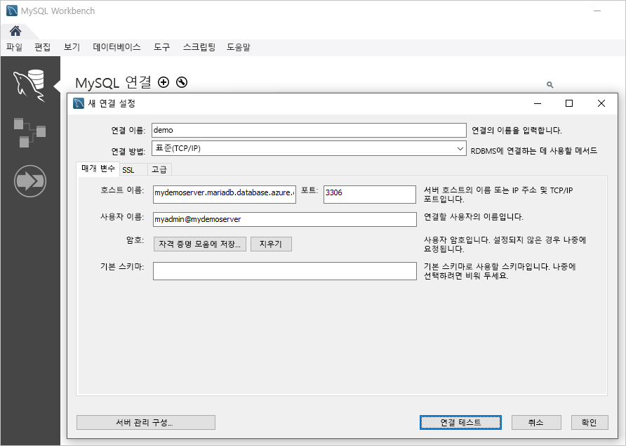

# <a name="quickstart-create-an-azure-database-for-mariadb-server-using-powershell"></a>빠른 시작: PowerShell을 사용하여 Azure Database for MariaDB 서버 만들기

이 빠른 시작에서는 PowerShell을 사용하여 Azure 리소스 그룹에서 Azure Database for MariaDB 서버를 만드는 방법에 대해 설명합니다. PowerShell을 사용하여 대화형으로 또는 스크립트에서 Azure 리소스를 만들고 관리할 수 있습니다.

## <a name="prerequisites"></a>필수 구성 요소

Azure 구독이 아직 없는 경우 시작하기 전에 [체험](https://azure.microsoft.com/free/) 계정을 만듭니다.

PowerShell을 로컬로 사용하도록 선택하는 경우 이 문서에서는 Az PowerShell 모듈을 설치하고 [Connect-AzAccount](https://docs.microsoft.com/powershell/module/az.accounts/connect-azaccount) cmdlet을 사용하여 Azure 계정에 연결해야 합니다. Az PowerShell 모듈을 설치하는 방법에 대한 자세한 내용은 [Azure PowerShell 설치](https://docs.microsoft.com/powershell/azure/install-az-ps)를 참조하세요.

> [!IMPORTANT]
> Az.MariaDb PowerShell 모듈이 미리 보기에 있지만 `Install-Module -Name Az.MariaDb -AllowPrerelease` 명령을 사용하여 Az PowerShell 모듈과 별도로 설치해야 합니다.
> Az.MariaDb PowerShell 모듈이 일반 공급되면 이후 Az PowerShell 모듈 릴리스에 포함되며 Azure Cloud Shell 내에서 기본적으로 사용할 수 있습니다.

Azure Database for MariaDB 서비스를 처음 사용하는 경우 **Microsoft.DBforMariaDB** 리소스 공급자를 등록해야 합니다.

```azurepowershell-interactive
Register-AzResourceProvider -ProviderNamespace Microsoft.DBforMariaDB
```

[!INCLUDE [cloud-shell-try-it](../../includes/cloud-shell-try-it.md)]

여러 Azure 구독이 있는 경우 리소스에 대한 요금이 청구되는 적절한 구독을 선택합니다. [Set-AzContext](https://docs.microsoft.com/powershell/module/az.accounts/set-azcontext) cmdlet을 사용하여 특정 구독 ID를 선택합니다.

```azurepowershell-interactive
Set-AzContext -SubscriptionId 00000000-0000-0000-0000-000000000000
```

## <a name="create-a-resource-group"></a>리소스 그룹 만들기

[New-AzResourceGroup](https://docs.microsoft.com/powershell/module/az.resources/new-azresourcegroup) cmdlet을 사용하여 [Azure 리소스 그룹](https://docs.microsoft.com/azure/azure-resource-manager/resource-group-overview)을 만듭니다. 리소스 그룹은 Azure 리소스가 그룹으로 배포되고 관리되는 논리 컨테이너입니다.

다음 예제에서는 **myresourcegroup**이라는 리소스 그룹을 **미국 서부** 지역에 만듭니다.

```azurepowershell-interactive
New-AzResourceGroup -Name myresourcegroup -Location westus
```

## <a name="create-an-azure-database-for-mariadb-server"></a>Azure Database for MariaDB 서버 만들기

`New-AzMariaDbServer` cmdlet을 사용하여 Azure Database for MariaDB 서버를 만듭니다. 서버는 여러 데이터베이스를 관리할 수 있습니다. 일반적으로 각 프로젝트 또는 각 사용자에 대해 별도의 데이터베이스가 사용됩니다.

다음 표에는 `New-AzMariaDbServer` cmdlet에 일반적으로 사용되는 매개 변수 및 샘플 값의 목록이 나와 있습니다.

|        **설정**         | **샘플 값** |                                                                                                                                                             **설명**                                                                                                                                                              |
| -------------------------- | ---------------- | ---------------------------------------------------------------------------------------------------------------------------------------------------------------------------------------------------------------------------------------------------------------------------------------------------------------------------------------- |
| Name                       | mydemoserver     | Azure에서 Azure Database for MariaDB 서버를 식별하는 전역적으로 고유한 이름을 선택합니다. 서버 이름은 문자, 숫자 및 하이픈(-) 문자만 포함할 수 있습니다. 지정된 모든 대문자는 만들기 프로세스 중에 자동으로 소문자로 변환됩니다. 3-63자여야 합니다. |
| ResourceGroupName          | myresourcegroup  | Azure 리소스 그룹의 이름을 입력합니다.                                                                                                                                                                                                                                                                                            |
| SKU                        | GP_Gen5_2        | SKU의 이름입니다. 축약형 **pricing-tier\_compute-generation\_vCores** 규칙을 따릅니다. Sku 매개 변수에 대한 자세한 내용은 이 표 뒤에 나오는 정보를 참조하세요.                                                                                                                                           |
| BackupRetentionDay         | 7                | 백업을 보존하는 기간입니다. 단위는 일입니다. 범위는 7-35입니다.                                                                                                                                                                                                                                                                       |
| GeoRedundantBackup         | 사용          | 이 서버에 지역 중복 백업을 사용할 것인지 여부를 결정합니다. 기본 가격 책정 계층의 서버에는 이 값을 사용할 수 없으며, 서버를 만든 후에는 변경할 수 없습니다. 허용되는 값은 다음과 같습니다. 사용, 사용 안 함                                                                                                      |
| 위치                   | westus           | 서버에 대한 Azure 지역입니다.                                                                                                                                                                                                                                                                                                         |
| SslEnforcement             | 사용          | 이 서버에 SSL을 사용할 것인지 여부를 결정합니다. 허용되는 값은 다음과 같습니다. 사용, 사용 안 함                                                                                                                                                                                                                                                 |
| StorageInMb                | 51200            | 서버의 스토리지 용량입니다(단위는 메가바이트). 유효한 StorageInMb는 최소 5,120MB이며, 1,024MB씩 증가합니다. 스토리지 크기 제한에 대한 자세한 내용은 [Azure Database for MariaDB 가격 책정 계층](./concepts-pricing-tiers.md)을 참조하세요.                                                                               |
| 버전                    | 5.7              | MariaDB 주 버전입니다.                                                                                                                                                                                                                                                                                                                 |
| AdministratorUserName      | myadmin          | 관리자 로그인에 대한 사용자 이름입니다. **azure_superuser**, **admin**, **administrator**, **root**, **guest** 또는 **public**을 사용할 수 없습니다.                                                                                                                                                                                            |
| AdministratorLoginPassword | `<securestring>` | 관리자 사용자에 대한 보안 문자열 형식의 암호입니다. 8-128자여야 합니다. 사용자 암호는 다음 범주 중 세 개의 문자를 포함해야 합니다. 영문 대문자, 영문 소문자, 숫자 및 영숫자가 아닌 문자                                       |

**Sku** 매개 변수 값은 다음 예제와 같이 **pricing-tier\_compute-generation\_vCores** 규칙을 따릅니다.

- `-Sku B_Gen5_1`은 기본, 5세대 및 1개 vCore에 매핑됩니다. 이 옵션은 사용 가능한 가장 작은 SKU입니다.
- `-Sku GP_Gen5_32`는 범용, 5세대 및 vCore 32개에 매핑됩니다.
- `-Sku MO_Gen5_2`는 메모리 최적화, 5세대 및 vCore 2개에 매핑됩니다.

지역별 및 계층별 유효한 **Sku** 값에 대한 자세한 내용은 [Azure Database for MariaDB 가격 책정 계층](./concepts-pricing-tiers.md)을 참조하세요.

다음 예제에서는 **myadmin**의 서버 관리자 로그인을 사용하여 **myresourcegroup** 리소스 그룹의 **mydemoserver**라는 MariaDB 서버를 **미국 서부** 지역에 만듭니다. 이는 2개 vCore 및 지역 중복 백업을 사용하도록 설정된 범용 가격 책정 계층의 5세대 서버입니다. MariaDB 서버 관리자 계정의 암호이므로 예제의 첫 번째 줄에 사용되는 암호를 문서화합니다.

> [!TIP]
> 서버 이름은 DNS 이름에 매핑되며 Azure에서 글로벌하게 고유해야 합니다.

```azurepowershell-interactive
$Password = Read-Host -Prompt 'Please enter your password' -AsSecureString
New-AzMariaDbServer -Name mydemoserver -ResourceGroupName myresourcegroup -Sku GP_Gen5_2 -GeoRedundantBackup Enabled -Location westus -AdministratorUsername myadmin -AdministratorLoginPassword $Password
```

간단한 컴퓨팅 및 I/O가 워크로드에 적합한 경우 기본 가격 책정 계층을 사용하는 것이 좋습니다.

> [!IMPORTANT]
> 기본 가격 책정 계층에서 만든 서버는 나중에 범용 또는 메모리 최적화로 크기 조정할 수 없으며 지리적으로 복제할 수 없습니다.

## <a name="configure-a-firewall-rule"></a>방화벽 규칙 구성

`New-AzMariaDbFirewallRule` cmdlet을 사용하여 Azure Database for MariaDB 서버 수준 방화벽 규칙을 만듭니다. 서버 수준 방화벽 규칙을 사용하면 `mysql` 명령줄 도구 또는 외부 애플리케이션(예: MariaDB Workbench)에서 Azure Database for MariaDB 서비스 방화벽을 통해 서버에 연결할 수 있습니다.

다음 예제에서는 특정 192.168.0.1 IP 주소에서 연결하도록 허용하는 **AllowMyIP**라는 방화벽 규칙을 만듭니다. 연결하는 위치에 해당하는 IP 주소 또는 IP 주소 범위로 바꿉니다.

```azurepowershell-interactive
New-AzMariaDbFirewallRule -Name AllowMyIP -ResourceGroupName myresourcegroup -ServerName mydemoserver -StartIPAddress 192.168.0.1 -EndIPAddress 192.168.0.1
```

> [!NOTE]
> Azure Database for MariaDB에 대한 연결은 포트 3306을 통해 통신합니다. 회사 네트워크 내에서 연결하려고 하면 3306 포트를 통한 아웃바운드 트래픽이 허용되지 않을 수 있습니다. 이 시나리오에서는 IT 부서에서 3306 포트를 여는 경우에만 서버에 연결할 수 있습니다.

## <a name="configure-ssl-settings"></a>SSL 설정 구성

기본적으로 서버와 클라이언트 애플리케이션 간에 SSL 연결이 적용됩니다. 이 기본 설정은 인터넷을 통해 데이터 스트림을 암호화하여 _이동 중_ 데이터를 보호할 수 있습니다. 이 빠른 시작에서는 서버에 SSL 연결을 사용하지 않겠습니다. 자세한 내용은 [Azure Database for MariaDB에 안전하게 연결하기 위한 사용자 애플리케이션의 SSL 연결 구성](./howto-configure-ssl.md)을 참조하세요.

> [!WARNING]
> SSL 비활성화는 프로덕션 서버에는 권장되지 않습니다.

다음 예제에서는 Azure Database for MariaDB 서버에서 SSL을 사용하지 않도록 설정합니다.

```azurepowershell-interactive
Update-AzMariaDbServer -Name mydemoserver -ResourceGroupName myresourcegroup -SslEnforcement Disabled
```

## <a name="get-the-connection-information"></a>연결 정보 가져오기

서버에 연결하려면 호스트 정보와 액세스 자격 증명을 제공해야 합니다. 다음 예제를 사용하여 연결 정보를 확인합니다. **FullyQualifiedDomainName** 및 **AdministratorLogin** 값을 적어 둡니다.

```azurepowershell-interactive
Get-AzMariaDbServer -Name mydemoserver -ResourceGroupName myresourcegroup |
  Select-Object -Property FullyQualifiedDomainName, AdministratorLogin
```

```Output
FullyQualifiedDomainName                    AdministratorLogin
------------------------                    ------------------
mydemoserver.mariadb.database.azure.com       myadmin
```

## <a name="connect-to-the-server-using-the-mysql-command-line-tool"></a>mysql 명령줄 도구를 사용하여 서버에 연결

`mysql` 명령줄을 사용하여 서버에 연결합니다. 명령줄 도구를 다운로드하여 설치하려면 [MySQL 커뮤니티 다운로드](https://dev.mysql.com/downloads/shell/)를 참조하세요. 이 문서의 코드 샘플에서 **사용해 보세요** 단추를 선택하여 Azure Cloud Shell에서 미리 설치된 버전의 `mysql` 명령줄 도구에 액세스할 수도 있습니다. Azure Cloud Shell에 액세스하는 또 다른 방법으로, Azure Portal의 오른쪽 위 도구 모음에서 **>_** 단추를 선택하거나 [shell.azure.com](https://shell.azure.com/)을 방문합니다.

1. `mysql` 명령줄 도구를 사용하여 서버에 연결합니다.

   ```azurepowershell-interactive
   mysql -h <servername>.mariadb.database.azure.com -u myadmin@<servername> -p
   ```

1. 서버 상태를 확인합니다.

   ```sql
   mysql> status
   ```

   ```Output
   C:\Users\>mysql -h mydemoserver.mariadb.database.azure.com -u myadmin@mydemoserver -p
   Enter password: *************
   Welcome to the MySQL monitor.  Commands end with ; or \g.
   Your MySQL connection id is 64793
   Server version: 5.6.42.0 MariaDB Server

   Copyright (c) 2000, 2020, Oracle and/or its affiliates. All rights reserved.

   Oracle is a registered trademark of Oracle Corporation and/or its
   affiliates. Other names may be trademarks of their respective
   owners.

   Type 'help;' or '\h' for help. Type '\c' to clear the current input statement.

   mysql> status
   --------------
   /usr/bin/mysql  Ver 14.14 Distrib 5.7.29, for Linux (x86_64) using  EditLine wrapper

   Connection id:          64793
   Current database:
   Current user:           myadmin@myipaddress
   SSL:                    Cipher in use is ECDHE-RSA-AES256-GCM-SHA384
   Current pager:          stdout
   Using outfile:          ''
   Using delimiter:        ;
   Server version:         5.6.42.0 MariaDB Server
   Protocol version:       10
   Connection:             mydemoserver.mariadb.database.azure.com via TCP/IP
   Server characterset:    latin1
   Db     characterset:    latin1
   Client characterset:    utf8
   Conn.  characterset:    utf8
   TCP port:               3306
   Uptime:                 17 min 4 sec

   Threads: 19  Questions: 482  Slow queries: 0  Opens: 50  Flush tables: 3  Open tables: 12  Queries per second avg: 0.470
   --------------

   mysql>
   ```

다른 명령은 [MySQL 5.7 참조 설명서 - 4.5.1장](https://dev.mysql.com/doc/refman/5.7/en/mysql.html)을 참조하세요.

## <a name="connect-to-the-server-using-mariadb-workbench"></a>MariaDB Workbench를 사용하여 서버에 연결

1. 클라이언트 컴퓨터에서 MySQL Workbench 애플리케이션을 실행합니다. MySQL Workbench를 다운로드하여 설치하려면 [MySQL Workbench 다운로드](https://dev.mysql.com/downloads/workbench/)를 참조하세요.

1. **새 연결 설정** 대화 상자의 **매개 변수** 탭에서 다음 정보를 입력합니다.

   

    |    **설정**    |            **제안 값**            |                      **설명**                       |
    | ----------------- | ----------------------------------------- | ---------------------------------------------------------- |
    | 연결 이름   | 내 연결                             | 이 연결에 대한 레이블 지정                        |
    | 연결 방법 | 표준(TCP/IP)                         | TCP/IP 프로토콜을 사용하여 Azure Database for MariaDB에 연결 |
    | Hostname          | `mydemoserver.mariadb.database.azure.com` | 이전에 적어 둔 서버 이름                           |
    | 포트              | 3306                                      | MariaDB의 기본 포트                                 |
    | 사용자 이름          | myadmin@mydemoserver                      | 이전에 적어 둔 서버 관리자 로그인                |
    | 암호          | *************                             | 이전에 구성한 관리자 계정 암호 사용      |

1. 매개 변수가 올바르게 구성되었는지 테스트하려면 **연결 테스트** 단추를 클릭합니다.

1. 서버에 연결할 연결을 선택합니다.

## <a name="clean-up-resources"></a>리소스 정리

이 빠른 시작에서 만든 리소스가 다른 빠른 시작 또는 자습서에 필요하지 않은 경우 다음 예제를 실행하여 해당 리소스를 삭제할 수 있습니다.

> [!CAUTION]
> 다음 예제에서는 지정된 리소스 그룹과 해당 그룹에 포함된 모든 리소스를 삭제합니다.
> 이 빠른 시작의 범위에 속하지 않는 리소스가 지정된 리소스 그룹에 있는 경우에도 해당 리소스가 삭제됩니다.

```azurepowershell-interactive
Remove-AzResourceGroup -Name myresourcegroup
```

리소스 그룹을 삭제하지 않고 이 빠른 시작에서 만든 서버만 삭제하려면 `Remove-AzMariaDbServer` cmdlet을 사용합니다.

```azurepowershell-interactive
Remove-AzMariaDbServer -Name mydemoserver -ResourceGroupName myresourcegroup
```

## <a name="next-steps"></a>다음 단계

> [!div class="nextstepaction"]
> [PowerShell을 사용하여 Azure Database for MariaDB 디자인](tutorial-design-database-using-powershell.md)
