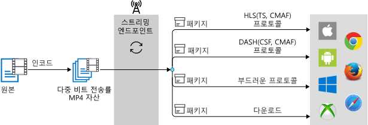

# Media Services를 사용하여 인코딩

Azure Media Services를 사용 하면 다양 한 브라우저 및 장치에서 콘텐츠를 재생할 수 있도록 고품질 디지털 미디어 파일을 적응 비트 전송률 MP4 파일로 인코딩할 수 있습니다. Media Services 인코딩 작업을 성공적으로 만들고 출력 자산을 적응 비트 전송률 mp4 및 스트리밍 구성 파일의 집합입니다. 구성 파일에는.ism,.ismc,.mpi, 및 기타 파일을 수정 하면 안을 포함 됩니다. 인코딩 작업이 완료 되 면 있습니다 활용할 수 있습니다 [동적 패키징](dynamic-packaging-overview.md) 스트리밍을 시작 하 고 있습니다.

출력에 비디오를 확인 하려면 재생에 대 한 클라이언트에서 사용할 자산을 생성 해야는 **스트리밍 로케이터** 스트리밍 Url 작성 및 합니다. 그런 다음 매니페스트에 지정된 된 형식에 따라 클라이언트 스트림을 받을 선택 된 프로토콜입니다.

다음 다이어그램은 동적 패키징 워크플로 사용 하 여 주문형 스트리밍 보여줍니다.

이 항목에서는 Media Services v3을 사용하여 콘텐츠를 인코딩하는 방법에 대한 지침을 제공합니다.

## 변환 및 작업

Media Services v3을 사용하여 인코딩하려면 [변환](https://docs.microsoft.com/rest/api/media/transforms) 및 [작업](https://docs.microsoft.com/rest/api/media/jobs)을 만들어야 합니다. 변환은 인코딩 설정 및 출력에 대한 방법을 정의하며 작업은 방법의 인스턴스입니다. 자세한 내용은 [Transform 및 Job](transforms-jobs-concept.md)을 참조하세요.

Media Services를 사용하여 인코딩하는 경우 미리 설정을 사용하여 입력 미디어 파일을 처리하는 방법을 인코더에 알려줍니다. 예를 들어 인코딩된 콘텐츠에서 원하는 비디오 해상도 및/또는 오디오 채널 수를 지정할 수 있습니다. 

업계 모범 사례에 따라 권장되는 기본 제공 미리 설정 중 하나를 사용하여 빠르게 시작하거나 특정 시나리오 또는 디바이스 요구 사항을 대상으로 지정하는 사용자 지정 미리 설정을 작성할 수 있습니다. 자세한 내용은 [사용자 지정 변환을 사용하여 인코딩](customize-encoder-presets-how-to.md)을 참조하세요. 

2019년 1월부터 Media Encoder Standard로 인코딩하여 MP4 파일을 생성하는 경우 새 .mpi 파일이 생성되고 출력 자산에 추가됩니다. 이 MPI 파일은 [동적 패키징](dynamic-packaging-overview.md) 및 스트리밍 시나리오의 성능을 향상하기 위해 사용합니다.

> [!NOTE]
> MPI 파일을 수정 또는 제거하거나 해당 파일의 존재 여부에 따른 종속성을 서비스에서 사용하지 않아야 합니다.

## 기본 제공 미리 설정

Media Services에서 현재 지원하는 기본 제공 인코딩 미리 설정은 다음과 같습니다.  

### BuiltInStandardEncoderPreset 미리 설정

[BuiltInStandardEncoderPreset](https://docs.microsoft.com/rest/api/media/transforms/createorupdate#builtinstandardencoderpreset)은 표준 인코더로 입력 비디오를 인코딩하는 기본 제공 미리 설정을 지정하는 데 사용됩니다. 

현재 지원되는 미리 설정은 다음과 같습니다.

- **EncoderNamedPreset.AACGoodQualityAudio** - 192kbps로 인코딩된 스테레오 오디오만 포함된 단일 MP4 파일을 생성합니다.
- **EncoderNamedPreset.AdaptiveStreaming**(권장) - 자세한 내용은 [비트 전송률 사다리 자동 생성](autogen-bitrate-ladder.md)을 참조하세요.
- **EncoderNamedPreset.ContentAwareEncodingExperimental** -콘텐츠 인식 인코딩에 실험적 미리 설정을 노출 합니다. 서비스 입력된 내용을 지정 되 면 자동으로 적응 스트리밍을 통해 계층, 적절 한 비트 전송률 및 해상도 설정을 배달에 대 한 최적 수를 확인 하려고 합니다. 기본 알고리즘은 시간이 지나면서 계속 됩니다. 출력은 비디오 및 인터리브 오디오로 MP4 파일에 포함 됩니다. 자세한 내용은 [콘텐츠를 인식 하는 인코딩 사전 설정을 실험적](cae-experimental.md)합니다.
- **EncoderNamedPreset.H264MultipleBitrate1080p** - 스테레오 AAC 오디오 및 6,000~400kbps 범위의 8GOP 정렬 MP4 파일 집합을 생성합니다. 해상도는 1,080p에서 시작하여 360p까지 낮아집니다.
- **EncoderNamedPreset.H264MultipleBitrate720p** - 스테레오 AAC 오디오 및 3,400~400kbps 범위의 6GOP 정렬 MP4 파일 집합을 생성합니다. 해상도는 720p에서 시작하여 360p까지 낮아집니다.
- **EncoderNamedPreset.H264MultipleBitrateSD** - 스테레오 AAC 오디오 및 1,600~400kbps 범위의 5GOP 정렬 MP4 파일 집합을 생성합니다. 해상도는 480p에서 시작하여 360p까지 낮아집니다.
- **EncoderNamedPreset.H264SingleBitrate1080p** -비디오 6750kbps 및 1080 픽셀의 그림 높이 H.264 코덱으로 인코딩된 않았고 64kbps AAC-LC 코덱으로 인코딩된 스테레오 오디오 MP4 파일을 생성 합니다.
- **EncoderNamedPreset.H264SingleBitrate720p** -비디오 4500kbps, 그림 높이 720 픽셀에서 H.264 코덱으로 인코딩된 않았고 64kbps AAC-LC 코덱으로 인코딩된 스테레오 오디오 MP4 파일을 생성 합니다.
- **EncoderNamedPreset.H264SingleBitrateSD** -비디오 2200kbps 및 그림 높이는 480 픽셀 H.264 코덱으로 인코딩된 않았고 64kbps AAC-LC 코덱으로 인코딩된 스테레오 오디오 MP4 파일을 생성 합니다.

최신 사전 설정 목록은 참조 하세요 [비디오를 encoding에 사용 되는 기본 제공 사전 설정](https://docs.microsoft.com/rest/api/media/transforms/createorupdate#encodernamedpreset)합니다.

기본 설정을 사용 하는 방법을 보려면, 체크 아웃 [업로드, 인코딩 및 스트리밍 파일](stream-files-tutorial-with-api.md)합니다.

### StandardEncoderPreset 미리 설정

[StandardEncoderPreset](https://docs.microsoft.com/rest/api/media/transforms/createorupdate#standardencoderpreset)은 표준 인코더로 입력 비디오를 인코딩할 때 사용할 설정을 설명합니다. Transform 미리 설정을 사용자 지정할 때 이 미리 설정을 사용합니다. 

#### 고려 사항

사용자 지정 사전 설정을 만들 때 다음 사항을 고려해 야 합니다.

- 높이 너비 AVC 내용에 대 한 모든 값은 4의 배수 여야 합니다.
- Azure Media Services v3에서는 인코딩 비트 전송률 모두 비트 / 초입니다. 이 킬로 비트/초 단위로 v2 Api 사용 하 여 사전 설정에서 다릅니다. 예를 들어 v2의 비트 전송률 (k b/초) 128로 지정 된, 경우 v3에서 것은에 설정할 128000 (비트/초)입니다.

#### 예

Media Services는 특정 인코딩 필요 및 요구 사항을 충족하기 위해 미리 설정에 포함된 모든 값을 완전히 사용자 지정할 수 있도록 지원합니다. 인코더 사전 설정을 사용자 지정 하는 방법을 보여 주는 예제를 참조 하세요.

- [.NET을 사용 하 여 사전 설정 사용자 지정](customize-encoder-presets-how-to.md)
- [CLI 사용 하 여 사전 설정 사용자 지정](custom-preset-cli-howto.md)
- [REST 사용 하 여 사전 설정 사용자 지정](custom-preset-rest-howto.md)

## v3에서 인코딩 크기 조정

미디어 처리 크기를 조정 하려면 참조 [CLI 사용 하 여 Scale](media-reserved-units-cli-how-to.md)합니다.

## 피드백 제공

[Azure Media Services 커뮤니티](media-services-community.md) 문서를 체크 아웃하여 다양한 방법으로 질문을 하고, 피드백을 제공하고, Media Services에 대한 업데이트를 가져올 수 있습니다.

## 다음 단계

* [기본 제공 사전 설정을 사용 하는 HTTPS URL에서 인코딩](job-input-from-http-how-to.md)
* [기본 제공 사전 설정을 사용 하 여 로컬 파일 인코딩](job-input-from-local-file-how-to.md)
* [특정 시나리오 또는 장치 요구 사항을 대상으로 사전 설정 사용자 지정 빌드](customize-encoder-presets-how-to.md)
* [Media Services를 사용하여 업로드, 인코딩 및 스트리밍](stream-files-tutorial-with-api.md)
