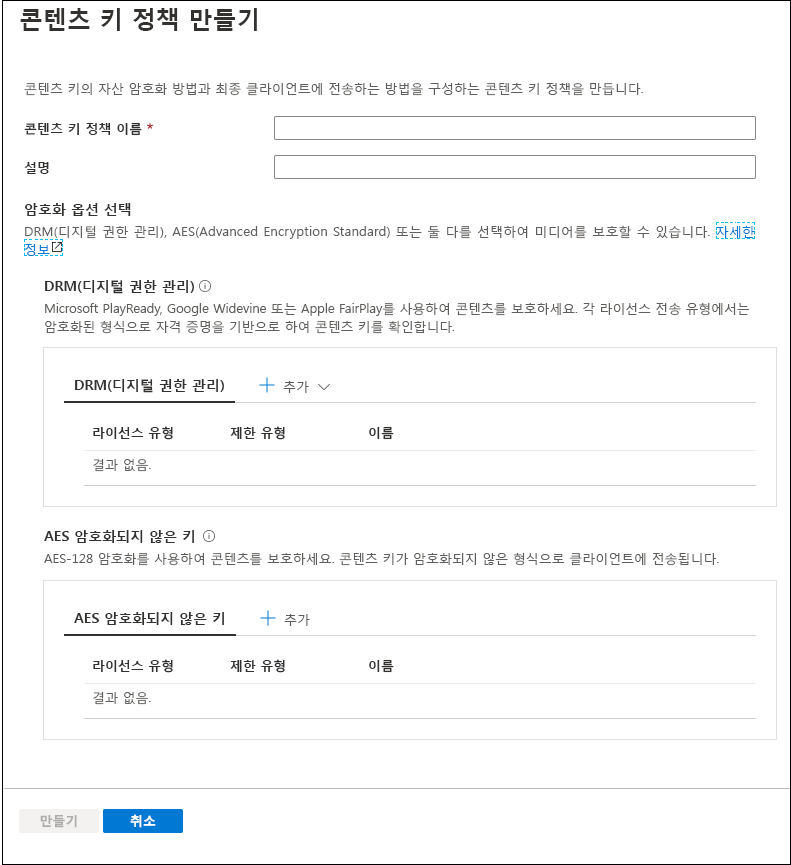
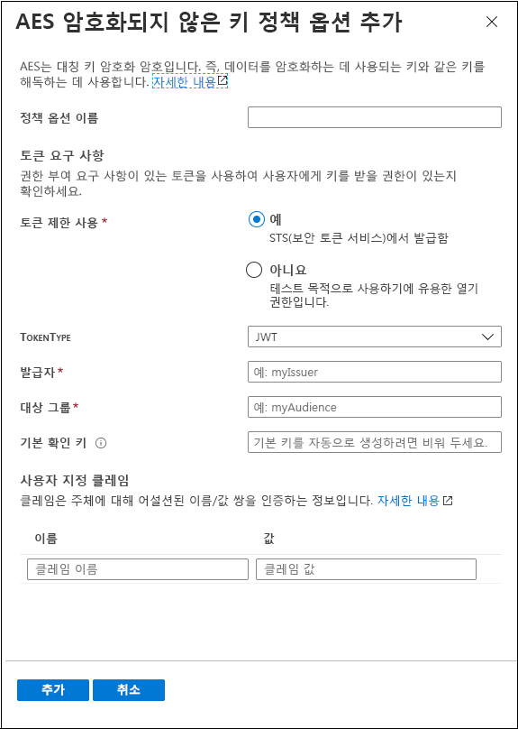
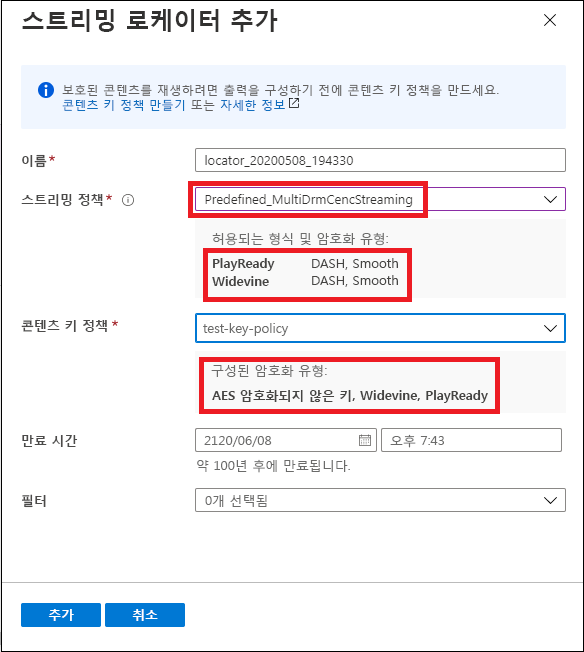

# 빠른 시작: 포털을 사용한 콘텐츠 암호화

[!INCLUDE [media services api v3 logo](./includes/v3-hr.md)]

Azure Media Services를 사용하여 컴퓨터를 떠날 때부터 스토리지, 처리 및 배달에 이르는 과정 내내 미디어를 보호할 수 있습니다. Media Services를 사용하면 Advanced Encryption Standard(AES-128) 또는 Microsoft PlayReady, Google Widevine 및 Apple FairPlay 등 세 가지 주요 DRM(디지털 권한 관리) 시스템 중 하나로 동적 암호화된 라이브 콘텐츠 및 주문형 콘텐츠를 제공할 수 있습니다. 또한 Media Services는 인증된 클라이언트에게 AES 키 및DRM(PlayReady, Widevine 및 FairPlay) 라이선스를 배달하는 서비스를 제공합니다. 
 
스트림에 대한 암호화 옵션(있는 경우)을 지정하려면 **스트리밍 정책**을 사용하여 해당 정책을 스트리밍 로케이터에 연결합니다. **콘텐츠 키 정책**을 만들어 **자산**에 대한 보안 액세스를 제공하는 콘텐츠 키가 최종 클라이언트에 배달되는 방식을 구성합니다. 키를 지정된 구성을 사용하여 클라이언트에게 배달하기 위해 충족되어야 하는 콘텐츠 키 정책에 대한 요구 사항(제한)을 설정해야 합니다. 

> [!NOTE]
> 콘텐츠 키 정책은 투명한 스트리밍 또는 다운로드에 필요하지 않습니다.

플레이어가 스트림을 요청하면 Media Services는 지정된 키를 사용하고 AES 암호화되지 않은 키 또는 DRM 암호화를 사용하여 동적으로 사용자의 콘텐츠를 암호화합니다. 스트림을 해독하기 위해 플레이어는 Media Services 키 배달 서비스 또는 지정한 키 배달 서비스에서 키를 요청합니다. 사용자에게 키를 얻을 권한이 있는지 여부를 결정하기 위해 서비스는 키에 지정한 **콘텐츠 키 정책**을 평가합니다.

이 빠른 시작에서는 자산을 스트리밍할 때 어떤 암호화를 적용해야 하는지를 지정하는 콘텐츠 키 정책을 만드는 방법을 보여 줍니다. 또한 빠른 시작에서는 자산에 대해 구성된 암호화를 설정하는 방법을 보여 줍니다.

### 추천 참고 자료

* [동적 암호화 및 키 배달](content-protection-overview.md)
* [스트리밍 로케이터](streaming-locators-concept.md)
* [스트리밍 정책](streaming-policy-concept.md)
* [콘텐츠 키 정책](content-key-policy-concept.md)

## 필수 구성 요소

[Azure Portal에서 자산 관리](manage-assets-quickstart.md)에서 설명한 대로 콘텐츠를 업로드하고 처리합니다.

## 콘텐츠 키 정책 만들기

**콘텐츠 키 정책**을 만들어 **자산**에 대한 보안 액세스를 제공하는 콘텐츠 키가 최종 클라이언트에 배달되는 방식을 구성합니다.

1. [Azure Portal](https://portal.azure.com/)에 로그인합니다.
1. Media Services 계정을 찾아 클릭합니다.
1. **콘텐츠 키 정책(신규)** 을 선택합니다.
1. 창 위쪽에서 **+ 콘텐츠 키 정책 추가**를 누릅니다. 

**콘텐츠 키 정책 만들기** 창이 나타납니다. 이 창에서 암호화 옵션을 선택합니다. DRM(디지털 권한 관리), AES(Advanced Encryption Standard) 또는 둘 다를 선택하여 미디어를 보호할 수 있습니다.  

DRM 옵션 중 하나를 선택하거나 AES-128 암호화되지 않은 키 옵션을 선택하는 경우에는 제한을 구성하는 방식을 지정하는 것이 좋습니다. 개방형 또는 토큰 제한을 갖도록 선택할 수 있습니다. 자세한 설명은 [콘텐츠 액세스 제어](content-protection-overview.md#controlling-content-access)를 참조하세요.

### DRM 콘텐츠 키 추가

Microsoft PlayReady 및/또는 Google Widevine 또는 Apple FairPlay를 사용하여 콘텐츠를 보호하도록 선택할 수 있습니다. 각 라이선스 배달 유형은 암호화된 형식의 자격 증명을 기반으로 하는 콘텐츠 키를 확인합니다.

#### 라이선스 템플릿

라이선스 템플릿에 대한 자세한 내용은 다음을 참조하세요.

* [Google Widevine 라이선스 템플릿](widevine-license-template-overview.md)

    > [!NOTE]
    > 값 없이 “{}”만 포함하여 빈 라이선스 템플릿을 만들 수 있습니다. 그러면 라이선스 템플릿이 기본값으로 생성됩니다. 기본값은 대부분의 경우 적합합니다.
* [Apple FairPlay 라이선스 요구 사항 및 구성](fairplay-license-overview.md)
* [PlayReady 라이선스 템플릿](playready-license-template-overview.md)

### AES 암호화되지 않은 키 추가

또한 콘텐츠에 AES-128 암호화되지 않은 키 암호화를 추가할 수 있습니다. 콘텐츠 키는 암호화되지 않은 형식으로 클라이언트에게 전송됩니다.

## 자산에 대한 스트리밍 로케이터 만들기

1. Media Services 계정을 찾아 클릭합니다.
1. **자산(신규)** 을 선택합니다.
1. 자산 목록에서 암호화하려는 자산을 선택합니다.  
1. 선택한 자산에 대한 **스트리밍 로케이터** 섹션에서 **+ 스트리밍 로케이터 추가**를 누릅니다. 
1. 구성된 **콘텐츠 키 정책**에 적절한 **스트리밍 정책**을 선택합니다.

    [스트리밍 정책](streaming-policy-concept.md) 항목에서는 콘텐츠 키 정책과 일치하는 스트리밍 정책에 대한 세부 정보를 제공합니다.
1. 적절한 스트리밍 정책을 선택한 후 드롭다운 목록에서 콘텐츠 키 정책을 선택할 수 있습니다.
1. **추가**를 눌러 자산에 스트리밍 로케이터를 추가합니다.

    그러면 자산이 게시되고 스트리밍 URL이 생성됩니다.

## 리소스 정리

다른 빠른 시작을 시도하려면 생성된 리소스를 유지해야 합니다. 그렇지 않으면 Azure Portal로 이동하여 리소스 그룹을 찾고 이 빠른 시작을 실행한 리소스 그룹을 선택한 후 모든 리소스를 삭제합니다.

## 다음 단계

[자산 관리](manage-assets-quickstart.md)
