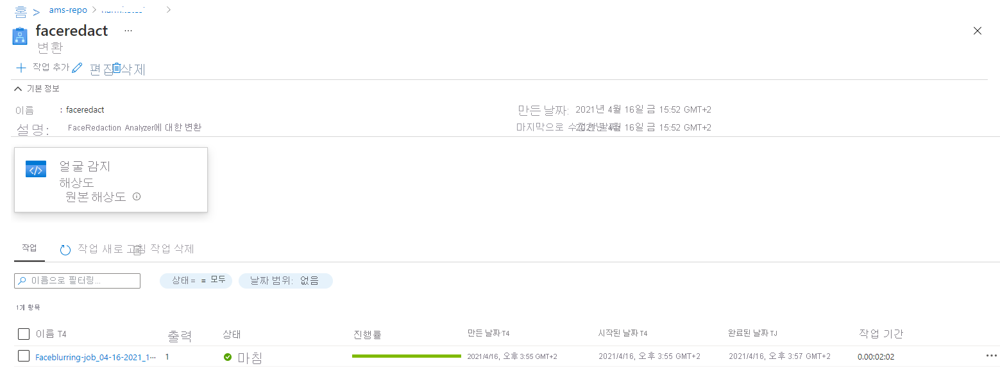

# <a name="event-based-face-redaction"></a>이벤트 기반 얼굴 편집

[!INCLUDE [media services api v3 logo](./includes/v3-hr.md)]

## <a name="introduction"></a>소개
 
일부 시나리오나 사용 사례에서 Azure Media Services는 비디오가 데이터 저장소에 도달하는 순간 비디오를 처리하거나 분석해야 합니다. 사용 사례의 예로는 팀이 사이트나 플랜트의 비디오를 분석하여 사이트에서 사용자가 보안 지침을 따르는지(예: 헬멧 착용) 확인하려는 경우가 있을 수 있습니다. 이 사용 사례의 경우 사이트에서 Edge 디바이스는 동작이 검색될 때 비디오를 캡처한 다음, Azure로 보낼 수 있습니다. 프라이버시 표준을 준수하려면 팀에서 비디오를 분석하기 전에 비디오에서 캡처된 사용자의 얼굴을 편집해야 합니다. 보강된 비디오를 팀과 최대한 빨리 공유할 수 있으려면 비디오가 Azure에 도달하는 순간 얼굴 편집 단계를 수행해야 합니다. 이 빠른 시작에서는 Azure의 이벤트 기반 시나리오에서 Azure Media Services를 사용하는 방법을 보여 줍니다. 스토리지 계정에 업로드된 비디오는 Azure Media Services에서 작업을 사용하여 변환됩니다. 여기에는 Media Service v3 API가 사용됩니다.

사용될 특정 변환을 [Face Redactor](./analyze-face-redaction-concept.md)라고 합니다. 이는 선택된 개인의 얼굴을 흐리게 표시하여 비디오를 수정할 수 있는 Azure 미디어 분석 사전 설정입니다.

빠른 시작이 끝나면 비디오에서 얼굴을 편집할 수 있습니다.

 

## <a name="solution-overview"></a>솔루션 개요

 
          
이 빠른 시작에서는 위 솔루션 개요에서 찾을 수 있는 솔루션을 배포하는 방법을 보여 줍니다. 스토리지 계정(Azure Data Lake Storage Gen2)과 여기에 연결되어 새 .mp4 파일이 스토리지 계정에 업로드될 때 Azure 함수를 트리거하는 이벤트 수신기(Event Grid)로 시작합니다. Azure 함수는 Azure Media Services의 미리 구성된 변환에 작업을 제출합니다. 결과 편집된 비디오는 Blob Storage 계정에 저장됩니다.

## <a name="prerequisites"></a>사전 요구 사항

- Azure 구독이 아직 없는 경우 시작하기 전에 [체험 계정](https://azure.microsoft.com/free/?WT.mc_id=A261C142F)을 만듭니다.
- 이 빠른 시작에 사용할 리소스 그룹을 만듭니다.

## <a name="get-the-sample-and-understand-its-deployment"></a>샘플 가져오기 및 배포 이해

[Python 샘플 리포지토리](https://github.com/Azure-Samples/media-services-v3-python)의 포크를 만듭니다. 이 빠른 시작에서는 FaceRedactorEventBased 샘플을 사용하고 있습니다.

이 샘플의 배포는 Azure 서비스를 배포하여 전체 솔루션을 설정하고, 새 파일이 업로드될 때 Azure Media Services에 작업을 제출하는 함수 앱을 배포하고, Eventgrid 트리거를 구성하는 세 단계로 구성됩니다. 해당 단계를 수행하는 GitHub Actions 워크플로를 만들었습니다. 따라서 GitHub 환경에 필요한 변수를 추가하여 이 솔루션을 배포할 수 있습니다. 즉, 로컬 개발 도구가 필요하지 않습니다.

## <a name="create-a-service-principal"></a>서비스 주체 만들기

GitHub Actions 워크플로를 실행하려면 먼저 리소스 그룹에서 ‘기여자’ 및 ‘Storage Blob 데이터 읽기 권한자’ 역할을 가진 서비스 주체를 만들어야 합니다.  이 서비스 주체는 GitHub Actions를 대신하여 모든 Azure 서비스를 프로비저닝하고 구성하는 앱이 됩니다. 서비스 주체는 솔루션이 배포된 후 처리해야 하는 비디오의 SAS 토큰을 생성하는 데도 사용됩니다.

서비스 주체를 만들고 리소스 그룹에 필요한 역할을 제공하려면 다음 bash 명령에서 변수를 입력하고 Cloud Shell에서 명령을 실행합니다.
```bash
# Replace <subscription-id>, <name-of-resource-group> and <name-of-app> with the corresponding values. 
# Make sure to use a unique name for the app name parameter.

app_name="<name-of-app>"
resource_group="<name-of-resource-group>"
subscription_id="<subscription-id>"

az ad sp create-for-rbac --name $app_name --role contributor \
                     --scopes /subscriptions/$subscription_id/resourceGroups/$resource_group \
                     --sdk-auth

object_id=$(az ad sp list --display-name $app_name --query [0].objectId -o tsv)

az role assignment create --assignee $object_id --role "Storage Blob Data Reader" \
                      --scope /subscriptions/$subscription_id/resourceGroups/$resource_group
```
  
명령은 다음과 유사한 JSON 개체를 출력합니다.
   
```json
{
  "clientId": "<GUID>",
  "clientSecret": "<GUID>",
  "subscriptionId": "<GUID>",
  "tenantId": "<GUID>",
  (...)
}
```
출력을 복사하고 다음 단계에서 사용할 수 있도록 해야 합니다.
 
## <a name="add-service-principal-details-to-github-secrets"></a>GitHub 비밀에 서비스 주체 세부 정보 추가 

GitHub Actions가 Azure 내에서 필요한 서비스를 배포하고 구성할 수 있도록 서비스 주체 세부 정보를 [GitHub 비밀](https://docs.github.com/en/actions/reference/encrypted-secrets)로 저장해야 합니다. 리포지토리 설정 -> 포크된 리포지토리의 비밀로 이동하고 ‘새 비밀 만들기’를 클릭합니다. 다음 비밀을 만듭니다.
 - ‘AZURE_CREDENTIALS’를 만들고 이전 단계(전체 JSON)의 출력을 붙여넣습니다. GitHub 작업 워크플로에서 이 비밀은 Azure에 대한 연결을 만드는 데 사용됩니다. 
 - ‘CLIENT_ID’를 만들고 이전 단계의 ‘clientId’ 값을 붙여넣습니다.
 - ‘CLIENT_SECRET’을 만들고 이전 단계의 ‘clientSecret’ 값을 붙여넣습니다.
 - ‘TENANT_ID’를 만들고 이전 단계의 ‘tenantId’ 값을 붙여넣습니다.
 
## <a name="create-the-env-file"></a>.env 파일 만들기

VideoAnalytics/FaceRedactorEventBased 폴더의 포크된 리포지토리에 있는 sample.env 파일의 콘텐츠를 복사합니다. 그런 다음, 파일 추가 -> 새 파일 만들기를 클릭하여 고유한 .env 파일을 만듭니다. *.env* 파일의 이름을 지정하고 변수를 입력합니다. 완료되면 ‘새 파일 커밋’을 클릭합니다. 이제 솔루션을 배포할 준비가 되었지만 먼저 사용할 코드 파일을 검사합니다.

## <a name="examine-the-code-for-provisioning-the-azure-resources"></a>Azure 리소스를 프로비저닝하기 위한 코드 검사

아래 bash 스크립트는 이 솔루션에 사용되는 Azure 서비스를 프로비저닝합니다. Bash 스크립트는 Azure CLI를 사용하고 다음 작업을 실행합니다.
- 환경 변수를 지역 변수에 로드합니다.
- ADLSgen2, 일반 Azure Storage 계정, Azure Media Services, Azure 함수 앱, Event Grid 시스템 토픽 및 구독의 이름을 정의합니다.
- 정의된 Azure 서비스를 프로비저닝합니다.

[!code-bash[Main](../../../media-services-v3-python/VideoAnalytics/FaceRedactorEventBased/AzureServicesProvisioning/deploy_resources.azcli)]

## <a name="examine-azure-function-code"></a>Azure 함수 코드 검사

Azure 리소스를 성공적으로 프로비저닝한 후 Python 코드를 Azure 함수에 배포할 준비가 됩니다. **/azure-function/EventGrid_AMSJob/__init__.py** 파일에는 파일이 Azure Data Lake Gen2 파일 시스템에 도달할 때마다 AMS 작업을 트리거하는 논리가 포함됩니다. 스크립트는 다음 단계를 수행합니다.
- 종속성과 라이브러리를 가져옵니다.
- 함수 바인더를 사용하여 Azure Event Grid를 수신 대기합니다.
- 이벤트 스키마에서 변수를 선택하고 정의합니다.
- AMS 작업의 입출력 자산을 만듭니다.
- DataLakeService 클라이언트를 사용하여 Azure Data Lake Gen2에 연결하고 AMS 작업 입력의 인증으로 사용할 SAS 토큰을 생성합니다.
- 작업을 구성하고 만듭니다.

[!code-python[Main](../../../media-services-v3-python/VideoAnalytics/FaceRedactorEventBased/AzureFunction/EventGrid_AMSJob/__init__.py)]

## <a name="examine-the-code-for-configuring-the-azure-resources"></a>Azure 리소스를 구성하기 위한 코드 검사 

아래 bash 스크립트는 프로비저닝된 후 리소스를 구성하는 데 사용됩니다. 이 스크립트를 실행하는 작업은 함수 코드를 배포한 후 솔루션 배포의 마지막 단계입니다. 스크립트는 다음 단계를 실행합니다.
- 함수 앱의 앱 설정을 구성합니다.
- Azure Event Grid 시스템 토픽을 만듭니다.
- ADLSg2 Raw 폴더에 Blob을 만들 때 Azure 함수가 트리거되도록 이벤트 구독을 만듭니다.
- REST API 호출을 사용하여 Azure Media Services 변환을 만듭니다. 이 변환은 Azure 함수에서 호출됩니다.

> [!NOTE]
> 현재 Azure Media Services v3 Python SDK와 Azure CLI는 둘 다 FaceRedaction 변환 만들기를 지원하지 않았습니다. 따라서 REST API 메서드를 사용하여 변환 작업을 만듭니다.

[!code-bash[Main](../../../media-services-v3-python/VideoAnalytics/FaceRedactorEventBased/AzureServicesProvisioning/configure_resources.azcli)]
 
## <a name="enable-github-actions-pipeline"></a>GitHub Actions 파이프라인 사용
 이 리포지토리의 워크플로 파일에는 이 솔루션의 배포를 실행하는 단계가 포함됩니다. 워크플로를 시작하려면 고유한 리포지토리에 대해 사용하도록 설정해야 합니다. 워크플로를 사용하도록 설정하려면 리포지토리의 작업 탭으로 이동하고, ‘내 워크플로를 이해합니다. 계속 진행하여 사용하도록 설정합니다.’를 선택합니다.
 
  
 
GitHub Actions를 사용하도록 설정한 후 [.github/workflows/main.yml](https://github.com/Azure-Samples/media-services-v3-python/blob/main/.github/workflows/main.yml)에서 워크로드 파일을 찾을 수 있습니다.  트리거 외에도 몇 단계가 포함된 빌드 작업이 있습니다. 다음 단계가 포함됩니다.
- **환경**: 여기에서 이전에 추가한 GitHub 비밀을 참조하는 여러 환경 파일이 정의됩니다.
- **환경 파일 읽기**: 빌드 작업에 대한 환경 파일을 읽습니다.
- **Pip를 사용하여 프로젝트 종속성 해결**: Azure 함수의 필요한 라이브러리가 GitHub Actions 환경으로 로드됩니다.
- **Azure 로그인**: 이 단계에서는 서비스 주체 세부 정보를 통해 Azure CLI에 로그인하는 데 GitHub 비밀을 사용합니다.
- **Azure CLI 스크립트 파일을 사용하여 Azure 리소스 배포**: Azure 리소스를 프로비저닝하기 위한 배포 스크립트를 실행합니다.
- **Azure 함수 코드 배포**: 이 단계에서는 ‘./azure-function’ 디렉터리에서 Azure 함수를 패키지하고 배포합니다. Azure 함수가 성공적으로 배포되면 ‘EventGrid_AMSJob’이라는 이름으로 Azure Portal에 표시됩니다.
 

- **Azure CLI 스크립트 파일을 사용하여 Azure 리소스 구성**: 모두 올바른 경우 마지막 단계에서는 이벤트 수신기를 활성화하도록 배포된 Azure 서비스를 구성합니다.

워크플로를 사용하도록 설정한 후 ‘Azure Media Service FaceRedaction 솔루션 배포’ 워크플로를 선택하고 ‘워크플로 실행’을 선택합니다. 이제 솔루션은 이전 단계에서 추가된 변수를 사용하여 배포됩니다. 몇 분 정도 기다렸다가 워크플로가 성공적으로 실행되었는지 확인합니다.

 

## <a name="test-your-solution"></a>솔루션 테스트
Azure Portal에서 ADLS Gen2의 스토리지 탐색기로 이동합니다. Raw 컨테이너에 비디오를 업로드합니다. 테스트 비디오를 검색할 경우 [이 웹 사이트](https://www.pexels.com/search/videos/group/)에서 다운로드합니다. ADLS Gen2 스토리지 계정에 비디오를 업로드하는 방법에 관한 지침은 아래 이미지를 참조하세요.

 

Azure Media Services 계정으로 이동하여 작업이 생성되는 Azure Media Services 인스턴스가 있는지 확인하고 메뉴에서 변환 + 작업을 선택합니다. 그런 다음, Face Redactor 변환을 선택합니다.

 

이 페이지에는 Azure 함수에서 실행된 작업이 표시됩니다. 작업이 완료되거나 계속 처리 중일 수 있습니다.

  

작업을 선택하여 특정 작업에 관한 몇 가지 세부 정보를 볼 수 있습니다. 출력 자산 이름을 선택하고 여기에 연결된 스토리지 컨테이너의 링크를 사용하는 경우 작업이 완료되면 처리된 비디오를 볼 수 있습니다.

  

## <a name="clean-up-resources"></a>리소스 정리

빠른 시작을 완료한 경우 리소스 그룹에 생성된 리소스를 삭제합니다. 또한 포크된 리포지토리를 삭제할 수 있습니다.

## <a name="next-steps"></a>다음 단계

이 예제를 수정하려는 경우 코드를 로컬로 실행하려고 할 수 있습니다. 로컬 개발의 경우 사용자 계정이 로컬로 설치된 Azure CLI에 로그인된 경우 서비스 주체가 필요하지 않으므로 sample.env 파일의 변수로 충분합니다. Azure 함수를 로컬로 사용하는 방법에 관한 지침은 [이 문서](../../azure-functions/create-first-function-vs-code-python.md)를 참조하세요.
