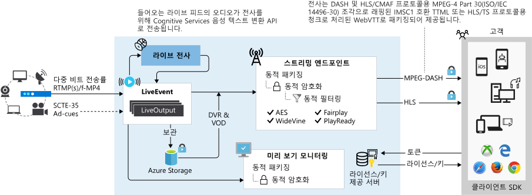

# 라이브 이벤트 및 라이브 출력

Azure Media Services를 사용하면 Azure 클라우드에서 고객에게 라이브 이벤트를 전달할 수 있습니다. Media Services v3의 라이브 스트리밍 이벤트를 구성 하려면이 문서에서 설명 하는 개념을 이해 해야 합니다.  섹션 목록 페이지의 오른쪽에 나열 됩니다.

## 라이브 이벤트

[라이브 이벤트](https://docs.microsoft.com/rest/api/media/liveevents)는 라이브 비디오 피드 수집 및 처리를 담당합니다. 라이브 이벤트를 만들면 원격 인코더에서 라이브 신호를 보내는 데 사용할 수 있는 입력 엔드포인트가 생성됩니다. 원격 라이브 인코더는 [RTMP](https://www.adobe.com/devnet/rtmp.html) 또는 [부드러운 스트리밍](https://msdn.microsoft.com/library/ff469518.aspx)(조각난 MP4) 프로토콜을 사용하여 이 입력 엔드포인트에 기여 피드를 전송합니다. 부드러운 스트리밍 수집 프로토콜의 경우 지원되는 URL 체계는 `http://` 또는 `https://`입니다. RTMP 수집 프로토콜의 경우 지원되는 URL 체계는 `rtmp://` 또는 `rtmps://`입니다. 

## 라이브 이벤트 유형

[라이브 이벤트](https://docs.microsoft.com/rest/api/media/liveevents)는 통과 및 라이브 인코딩의 두 가지 형식 중 하나일 수 있습니다. 

### 통과

통과 **라이브 이벤트**를 사용하는 경우 온-프레미스 라이브 인코더에 의존하여 다중 비트 전송률이 있는 비디오 스트림을 생성하고 이 스트림을 기여 피드로 하여 LiveEvent에 전송(RTMP 또는 조각난 MP4 프로토콜 사용)할 수 있습니다. 그러면 라이브 이벤트는 들어오는 비디오 스트림을 추가 처리 없이 제공합니다. 이러한 통과 LiveEvent는 장기 실행 라이브 이벤트 또는 연중무휴 선형 라이브 스트리밍에 최적화되어 있습니다. 이 형식의 라이브 이벤트를 만들 경우 None(LiveEventEncodingType.None)을 지정합니다.

H.264/AVC 또는 H.265/HEVC 비디오 코덱 및 AAC(AAC-LC, HE-AACv1 또는 HE-AACv2) 오디오 코덱을 사용하여 최대 4K의 해상도 및 초당 60프레임의 프레임 속도로 기여 피드를 전송할 수 있습니다.  자세한 내용은 [라이브 이벤트 유형 비교](live-event-types-comparison.md) 문서를 참조하세요.

> [!NOTE]
> 통과 방법을 사용하면 긴 기간 동안 여러 이벤트를 수행하고 온-프레미스 인코더에 이미 투자한 경우 라이브 스트리밍을 수행하는 가장 경제적인 방법입니다. [가격 책정](https://azure.microsoft.com/pricing/details/media-services/) 세부 정보를 참조하세요.
> 

[MediaV3LiveApp](https://github.com/Azure-Samples/media-services-v3-dotnet-core-tutorials/blob/master/NETCore/Live/MediaV3LiveApp/Program.cs#L126)의 .NET 코드 예제를 참조하세요.

### 라이브 인코딩  

Media Services에서 라이브 인코딩을 사용하는 경우 단일 비트 전송률 비디오를 기여 피드로 하여 라이브 이벤트에 전송(RTMP 또는 조각난 Mp4 프로토콜 사용)하도록 온-프레미스 라이브 인코더를 구성합니다. 라이브 이벤트는 들어오는 단일 비트 전송률 스트림을 [다중 비트 전송률이 있는 비디오 스트림](https://en.wikipedia.org/wiki/Adaptive_bitrate_streaming)으로 인코딩하고 MPEG-DASH, HLS, 부드러운 스트리밍 등과 같은 프로토콜을 통해 디바이스를 재생하도록 이 스트림을 전달 가능하게 만듭니다. 이 형식의 라이브 이벤트를 만들 경우 인코딩 형식을 **표준**(LiveEventEncodingType.Standard)으로 지정합니다.

H.264/AVC 비디오 코덱과 AAC(AAC-LC, HE-AACv1 또는 HE-AACv2) 오디오 코덱을 사용하여 최대 1080p의 해상도 및 초당 30프레임의 프레임 속도로 기여 피드를 전송할 수 있습니다. 자세한 내용은 [라이브 이벤트 유형 비교](live-event-types-comparison.md) 문서를 참조하세요.

라이브 인코딩을 사용 하는 경우(라이브 이벤트를 **표준**으로 설정) 인코딩 사전 설정은 수신 스트림을 다중 비트 전송률 또는 레이어로 인코딩하는 방법을 정의합니다. 자세한 내용은 [시스템 미리 설정](live-event-types-comparison.md#system-presets)을 참조하세요.

> [!NOTE]
> 현재 표준 형식의 라이브 이벤트에 허용되는 유일한 미리 설정 값은 *Default720p*입니다. 사용자 지정 라이브 인코딩 미리 설정을 사용해야 하는 경우 amshelp@microsoft.com으로 문의하세요. 원하는 해상도 및 비트 전송률 표를 지정해야 합니다. 720p에서 레이어가 하나만 있고, 6레이어 이하인지 확인합니다.

## 라이브 이벤트 만들기 옵션

라이브 이벤트를 만들 때 다음 옵션을 지정할 수 있습니다.

* 라이브 이벤트의 스트리밍 프로토콜(현재 RTMP 및 부드러운 스트리밍 프로토콜이 지원됨). 라이브 이벤트 또는 연결된 라이브 출력이 실행 중인 동안에는 프로토콜 옵션을 변경할 수 없습니다. 다른 프로토콜을 요청하는 경우 각각의 스트리밍 프로토콜에 대한 별도의 라이브 이벤트를 만들어야 합니다.  
* 수집 및 미리 보기에서 IP 제한입니다. 이 라이브 이벤트에 비디오를 수집하도록 허용된 IP 주소를 정의할 수 있습니다. 허용된 IP 주소는 단일 IP 주소(예: '10.0.0.1'), IP 주소 및 CIDR 서브넷 마스크를 사용하는 IP 범위(예: '10.0.0.1/22') 또는 IP 주소와 점으로 구분된 십진수 서브넷 마스크를 사용하는 IP 범위(예: '10.0.0.1(255.255.252.0)')로 지정할 수 있습니다. 지정된 IP 주소가 없고 정의된 규칙이 없는 경우, IP 주소가 허용되지 않습니다. 모든 IP 주소를 허용하려면 규칙을 만들고 0.0.0.0/0으로 설정합니다. IP 주소가 다음 형식 중 하나에 있어야 합니다. 4개의 숫자를 사용하는 IpV4 주소, CIDR 주소 범위.
* 이벤트를 만들 때 자동 시작을 지정할 수 있습니다.  Autostart가 true로 설정되어 있는 경우 Live Event가 생성 후 시작됩니다. 라이브 이벤트가 실행되는 즉시 청구가 시작됩니다. 추가 청구를 중지하려면 라이브 이벤트 리소스에 대해 명시적으로 Stop을 호출해야 합니다. 또는 스트리밍을 시작할 준비가 되었을 때 이벤트를 시작해도 됩니다. 

    자세한 내용은 [라이브 이벤트 상태 및 청구](live-event-states-billing.md)를 참조하세요.

## 라이브 이벤트 수집 URL

라이브 이벤트가 생성되면 라이브 온-프레미스 인코더에 제공할 수집 URL을 구할 수 있습니다. 라이브 인코더는 이러한 URL을 사용하여 라이브 스트림을 입력합니다. 자세한 내용은 [권장 온-프레미스 라이브 인코더](recommended-on-premises-live-encoders.md)를 참조하세요. 

비베니티 URL 또는 베니티 URL을 사용할 수 있습니다. 

* 비베니티 URL

    비베니티 URL은 AMS v3의 기본 모드입니다. 잠재적으로 라이브 이벤트를 빠르게 가져오지만 수집 URL은 라이브 이벤트를 시작할 때 알려집니다. URL은 라이브 이벤트를 중지/시작하는 경우 변경됩니다.  비베니티는 최종 사용자가 앱에서 라이브 이벤트를 가능한 빨리 가져오고 동적 수집 URL이 문제가 되지 않는 앱을 사용하여 스트리밍하려는 경우 시나리오에서 유용합니다.
* 베니티 URL

    베니티 모드는 하드웨어 브로드캐스트 인코더를 사용하고 라이브 이벤트를 시작할 때 해당 인코더를 다시 구성하지 않으려는 대형 미디어 브로드캐스터에서 선호합니다. 시간이 지나도 변경되지 않는 예측 수집 URL을 원합니다.

> [!NOTE] 
> 수집 URL을 예측하려면 "베니티" 모드를 사용하고 사용자 고유의 액세스 토큰을 전달해야 합니다(URL에서 무작위 토큰을 방지하기 위해).

### 라이브 수집 URL 명명 규칙

아래 *임의* 문자열은 128비트 16진수 숫자입니다(0-9 a-f의 32문자로 구성됨). 
아래 *액세스 토큰*은 고정 URL에 대해 지정해야 하는 것입니다. 128비트 16진수 숫자입니다.

#### 비베니티 URL

##### RTMP

`rtmp://<random 128bit hex string>.channel.media.azure.net:1935/<access token>`
`rtmp://<random 128bit hex string>.channel.media.azure.net:1936/<access token>`
`rtmps://<random 128bit hex string>.channel.media.azure.net:2935/<access token>`
`rtmps://<random 128bit hex string>.channel.media.azure.net:2936/<access token>`

##### 부드러운 스트리밍

`http://<random 128bit hex string>.channel.media.azure.net/<access token>/ingest.isml`
`https://<random 128bit hex string>.channel.media.azure.net/<access token>/ingest.isml`

#### 베니티 URL

##### RTMP

`rtmp://<live event name>-<ams account name>-<region abbrev name>.channel.media.azure.net:1935/<access token>`
`rtmp://<live event name>-<ams account name>-<region abbrev name>.channel.media.azure.net:1936/<access token>`
`rtmps://<live event name>-<ams account name>-<region abbrev name>.channel.media.azure.net:2935/<access token>`
`rtmps://<live event name>-<ams account name>-<region abbrev name>.channel.media.azure.net:2936/<access token>`

##### 부드러운 스트리밍

`http://<live event name>-<ams account name>-<region abbrev name>.channel.media.azure.net/<access token>/ingest.isml`
`https://<live event name>-<ams account name>-<region abbrev name>.channel.media.azure.net/<access token>/ingest.isml`

## 라이브 이벤트 미리 보기 URL

**라이브 이벤트**가 기여 피드를 수신하기 시작하면 미리 보기 엔드포인트를 사용하여 추가 게시 전에 라이브 스트림을 수신하고 있음을 미리 보고 확인할 수 있습니다. 미리 보기 스트림이 양호한지 확인한 후에는 LiveEvent를 사용하여 하나 이상의 (미리 생성된) **스트리밍 엔드포인트**를 통해 라이브 스트림을 전달 가능하도록 만들 수 있습니다. 이를 수행하려면 **라이브 이벤트**에 새 [라이브 출력](https://docs.microsoft.com/rest/api/media/liveoutputs)을 만듭니다. 

> [!IMPORTANT]
> 계속하기 전에 비디오가 미리 보기 URL로 전달되고 있는지 확인합니다.

## 라이브 이벤트 장기 실행 작업

세부 정보를 참조 하세요. [장기 실행 작업](media-services-apis-overview.md#long-running-operations)

## 라이브 출력

라이브 이벤트로 들어오는 스트림이 있으면 [자산](https://docs.microsoft.com/rest/api/media/assets), [라이브 출력](https://docs.microsoft.com/rest/api/media/liveoutputs) 및 [스트리밍 로케이터](https://docs.microsoft.com/rest/api/media/streaminglocators)를 만들어 스트리밍 이벤트를 시작할 수 있습니다. 라이브 출력은 스트림을 보관하고 [스트리밍 엔드포인트](https://docs.microsoft.com/rest/api/media/streamingendpoints)를 통해 시청자가 스트림을 사용할 수 있도록 합니다.  

> [!NOTE]
> 라이브 출력은 생성과 동시에 시작되고 삭제되면 중지됩니다. 라이브 출력을 삭제해도 기본 자산과 자산의 콘텐츠는 삭제되지 않습니다. 

**라이브 이벤트**와 **라이브 출력** 간의 관계는 기존 TV 방송과 비슷하므로 채널(**라이브 이벤트**)은 일정한 비디오 스트림을 나타내고 녹음/녹화(**라이브 출력**)는 특정 시간 세그먼트의 범위로 지정됩니다(예: 오후 6시 30분부터 오후 7시까지의 저녁 뉴스). DVR(디지털 비디오 녹화기)을 사용하여 TV를 녹화할 수 있으며, 이와 동등한 라이브 이벤트의 기능은 **ArchiveWindowLength** 속성을 통해 관리됩니다. 이 속성은 DVR의 용량을 지정하는 ISO-8601 타임스팬 기간(예: PTHH:MM:SS)이며, 최소 3분에서 최대 25시간까지 설정할 수 있습니다.

**라이브 출력** 개체는 테이프 레코더처럼 라이브 스트림을 포착하고 Media Services 계정의 자산에 기록합니다. 기록된 콘텐츠는 계정에 연결된 Azure Storage 계정뿐 아니라 자산 리소스에서 정의한 컨테이너에서도 유지됩니다. **라이브 출력**을 사용하면 보관 기록에 보관되는 스트림의 양(예: 클라우드 DVR의 용량), 시청자가 라이브 스트림을 보기 시작할 수 있는지 여부 등의 나가는 라이브 스트림의 일부 속성을 제어할 수 있습니다. 디스크의 보관은 **라이브 출력**의 **archiveWindowLength** 속성에 지정된 양의 콘텐츠만 보유하는 순환식 보관 “기간”입니다. 이 기간을 벗어나는 콘텐츠는 스토리지 컨테이너에서 자동으로 삭제되며 복구할 수 없습니다. **라이브 이벤트**에서 보관 기간 및 설정이 서로 다른 여러 개의 **라이브 출력**(최대 3개)을 만들 수 있습니다.  

**스트리밍 로케이터**를 사용하여 **라이브 출력**의 **자산**을 게시한 경우 스트리밍 로케이터의 만료 또는 삭제 중 어느 것이 먼저 발생할 때까지 **라이브 이벤트**(DVR 기간까지)를 계속 시청할 수 있습니다.

자세한 내용은 [클라우드 DVR 사용](live-event-cloud-dvr.md)을 참조하세요.

## 피드백 제공

[Azure Media Services 커뮤니티](media-services-community.md) 문서를 체크 아웃하여 다양한 방법으로 질문을 하고, 피드백을 제공하고, Media Services에 대한 업데이트를 가져올 수 있습니다.

## 다음 단계

[라이브 스트리밍 자습서](stream-live-tutorial-with-api.md)
