# Azure Media Services 라이브 스트림 만들기

이 빠른 시작은 Azure Portal 및 Telestream Wirecast를 사용하여 Azure Media Services 라이브 스트림을 만드는 데 유용합니다. 여기에서는 Azure 구독이 있고 Media Services 계정을 만들었다고 가정합니다.

Azure 구독이 아직 없는 경우 시작하기 전에 [체험 계정](https://azure.microsoft.com/free/)을 만듭니다.

## Azure Portal에 로그인

먼저 웹 브라우저를 열고 [Microsoft Azure Portal](https://portal.azure.com/)로 이동합니다. 자격 증명을 입력하여 포털에 로그인합니다. 기본 보기는 서비스 대시보드입니다.

이 빠른 시작에서 설명하는 내용은 다음과 같습니다.

- Telestream Wirecast 평가판을 사용하여 온-프레미스 인코더 설정
- 라이브 스트림 설정
- 라이브 스트림 출력 설정
- 기본 스트리밍 엔드포인트 실행
- Azure Media Player를 사용하여 라이브 스트림 및 주문형 출력 보기

간단히 유지하기 위해 Wirecast의 Azure Media Services, 통과 클라우드 인코딩 및 RTMP에 대한 인코딩 미리 설정을 사용합니다.

## Wirecast를 사용하여 온-프레미스 인코더 설정

1. [Telestream 웹 사이트](https://www.telestream.net)에서 운영 체제용 Wirecast를 다운로드하여 설치합니다.
1. 애플리케이션을 시작하고, 즐겨찾는 이메일 주소를 사용하여 제품을 등록합니다. 애플리케이션을 열어 둡니다.
1. 받은 이메일에서 이메일 주소를 확인합니다. 그러면 애플리케이션이 평가판을 시작합니다.
1. 권장: 애플리케이션 열기 화면에서 비디오 자습서를 시청합니다.

## Azure Media Services 라이브 스트림 설정

1. 포털 내의 Azure Media Services 계정으로 이동한 후 **Media Services** 목록에서 **라이브 스트리밍**을 선택합니다.

   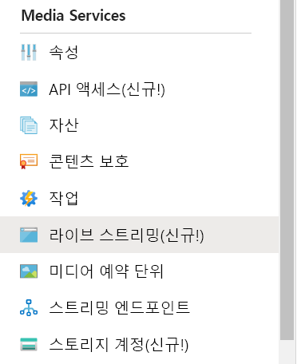
1. **라이브 이벤트 추가**를 선택하여 새 라이브 스트리밍 이벤트를 만듭니다.

   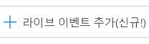
1. **라이브 이벤트 이름** 상자에 새 이벤트의 이름(예: *TestLiveEvent*)을 입력합니다.

   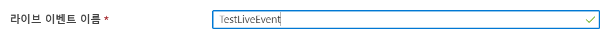
1. **설명** 상자에 이벤트에 대한 설명(선택 사항)을 입력합니다.
1. **통과 – 클라우드 인코딩 없음** 옵션을 선택합니다.

   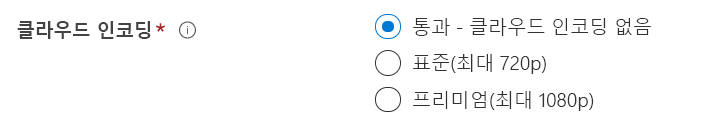
1. **RTMP** 옵션을 선택합니다.
1. 라이브 이벤트가 준비되기 전에 이 이벤트에 대한 요금이 청구되지 않도록 **시작 라이브 이벤트**에 대해 **아니요** 옵션을 선택해야 합니다. (라이브 이벤트가 시작되면 청구가 시작됩니다.)

   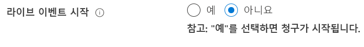
1. **검토 + 만들기** 단추를 선택하여 설정을 검토합니다.
1. **만들기** 단추를 선택하여 라이브 이벤트를 만듭니다. 그러면 라이브 이벤트 목록으로 돌아갑니다.
1. 방금 만든 라이브 이벤트의 링크를 선택합니다. 이벤트가 중지되었습니다.
1. 브라우저에서 이 페이지를 열어 둡니다. 나중에 다시 살펴보겠습니다.

## Wirecast Studio를 사용하여 라이브 스트림 설정

1. Wirecast 애플리케이션의 주 메뉴에서 **빈 문서 만들기**를 선택한 다음, **계속**을 선택합니다.

   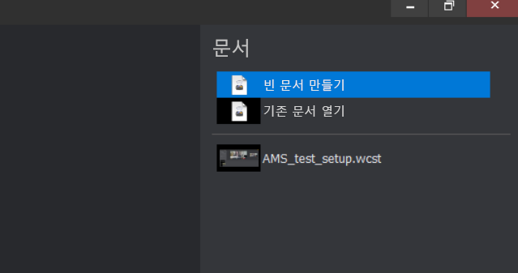
1. **Wirecast layers**(Wirecast 레이어) 영역의 첫 번째 레이어를 마우스로 가리킵니다.  표시되는 **추가** 아이콘을 선택하고, 스트리밍할 비디오 입력을 선택합니다.

   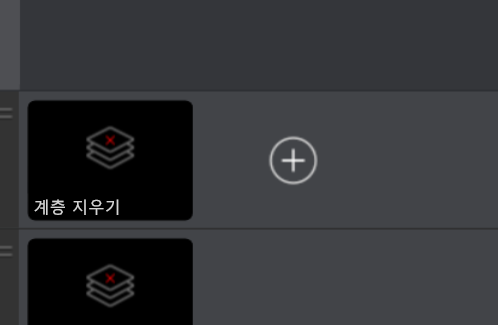

   **Master Layer 1**(마스터 레이어 1) 대화 상자가 열립니다.
1. 메뉴에서 **비디오 캡처**를 선택한 다음, 사용할 카메라를 선택합니다.

   

   카메라의 뷰가 미리 보기 영역에 나타납니다.
1. **Wirecast layers**(Wirecast 레이어) 영역의 두 번째 레이어를 마우스로 가리킵니다. 표시되는 **추가** 아이콘을 선택하고, 스트리밍할 오디오 입력을 선택합니다. **Master Layer 2**(마스터 레이어 2) 대화 상자가 열립니다.
1. 메뉴에서 **오디오 캡처**를 선택한 다음, 사용하려는 오디오 입력을 선택합니다.

   
1. 주 메뉴에서 **출력 설정**을 선택합니다. **Select an Output Destination**(출력 대상 선택) 대화 상자가 나타납니다
1. **대상** 드롭다운 목록에서 **Azure Media Services**를 선택합니다. Azure Media Services에 대한 출력 설정은 *대부분*의 출력 설정을 자동으로 채웁니다.

   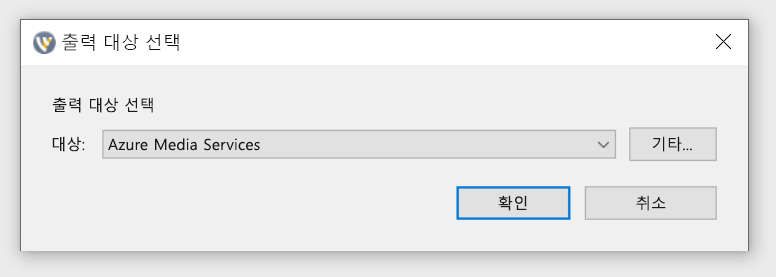

다음 절차에서는 브라우저의 Azure Media Services로 돌아가서 입력 URL을 복사하여 출력 설정에 입력합니다.

1. 포털의 Azure Media Services 페이지에서 **시작**을 선택하여 라이브 스트림 이벤트를 시작합니다. (이제 청구가 시작됩니다.)

   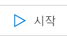
2. **보안/보안되지 않음** 토글을 **보안되지 않음**으로 설정합니다. 이 단계는 프로토콜을 RTMPS 대신 RTMP로 설정합니다.
3. **입력 URL** 상자에서 URL을 클립보드에 복사합니다.

   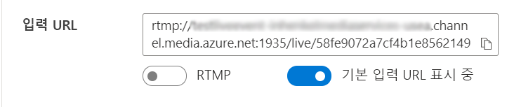
4. Wirecast 애플리케이션으로 전환하고, **입력 URL**을 출력 설정의 **주소** 상자에 붙여넣습니다.

   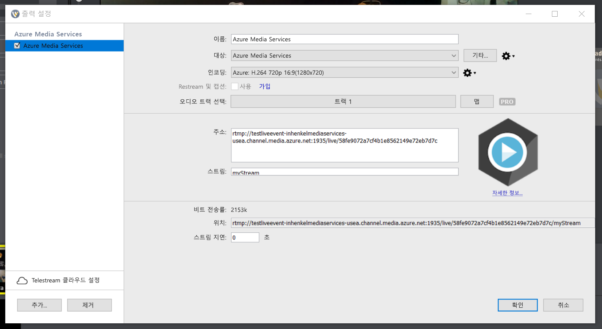
5. **확인**을 선택합니다.

## 출력 설정

여기서는 출력을 설정하고, 라이브 스트림의 기록을 저장할 수 있도록 합니다.  

> [!NOTE]
> 이 출력을 스트리밍하려면 스트리밍 엔드포인트가 실행되고 있어야 합니다. 나중에 [기본 스트리밍 엔드포인트 실행](#run-the-default-streaming-endpoint) 섹션을 참조하세요.

1. **출력** 비디오 뷰어의 아래에 있는 **출력 만들기** 링크를 선택합니다.
1. 원하는 경우 나중에 쉽게 찾을 수 있도록 **이름** 상자의 출력 이름을 사용자에게 더 친숙한 이름으로 편집합니다.
   
   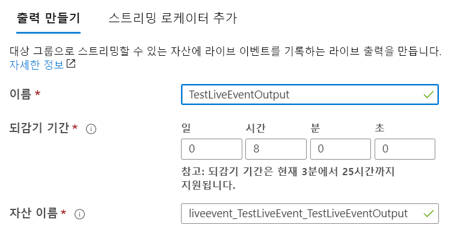
1. 지금은 나머지 상자를 모두 그대로 둡니다.
1. **다음**을 선택하여 스트리밍 로케이터를 추가합니다.
1. 원하는 경우 로케이터 이름을 사용자에게 더 친숙한 이름으로 변경합니다.
   
   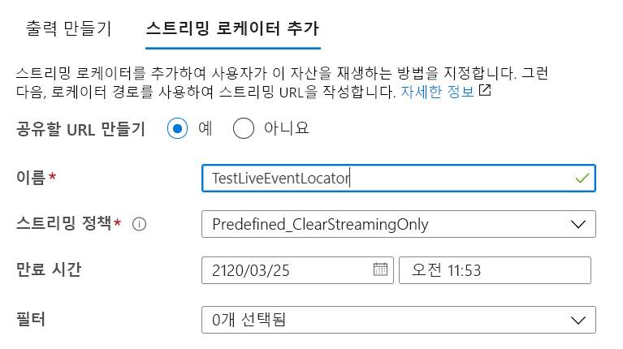
1. 지금은 이 화면의 다른 모든 항목을 그대로 둡니다.
1. **만들기**를 선택합니다.

## 브로드캐스트 시작

1. Wirecast의 주 메뉴에서 **Output** > **Start / Stop Broadcasting** > **Start Azure Media Services: Azure Media Services**를 선택합니다.

   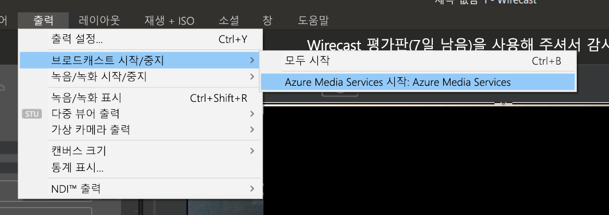

   스트림이 라이브 이벤트로 전송되면 Wirecast의 **Live** 창이 Azure Media Services의 라이브 이벤트 페이지에 있는 비디오 플레이어에 나타납니다.

1. 미리 보기 창 아래의 **이동** 단추를 선택하여 Wirecast 레이어에 대해 선택한 비디오 및 오디오 브로드캐스팅을 시작합니다.

   

   > [!TIP]
   > 오류가 있으면 플레이어 위쪽에 있는 **플레이어 다시 로드** 링크를 선택하여 플레이어를 다시 로드해 봅니다.

## 기본 스트리밍 엔드포인트 실행

1. Media Services 목록에서 **스트리밍 엔드포인트**를 선택합니다.

   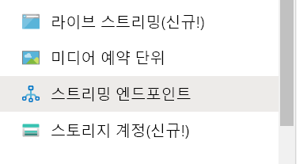
1. 기본 스트리밍 엔드포인트 상태가 중지됨이면 선택합니다. 그러면 해당 엔드포인트의 페이지로 이동합니다.
1. **시작**을 선택합니다.
   
   

## Azure Media Player를 사용하여 출력 브로드캐스트 재생

1. **출력** 비디오 플레이어 아래에 스트리밍 URL을 복사합니다.
1. 웹 브라우저에서 [Azure Media Player 데모](https://ampdemo.azureedge.net/azuremediaplayer.html)를 엽니다.
1. 스트리밍 URL을 Azure Media Player의 **URL** 상자에 붙여넣습니다.
1. **플레이어 업데이트** 단추를 선택합니다.
1. 비디오에서 **재생** 아이콘을 선택하여 라이브 스트림을 봅니다.

## 브로드캐스트 중지

콘텐츠를 충분히 스트리밍했다고 생각되면 브로드캐스트를 중지합니다.

1. Wirecast에서 **브로드캐스트** 단추를 선택합니다. 그러면 Wirecast에서 브로드캐스트가 중지됩니다.
1. 포털에서 **중지**를 선택합니다. 라이브 스트림이 중지되지만 출력이 이제 주문형 자산이 된다는 경고 메시지가 표시됩니다.
1. 경고 메시지에서 **중지**를 선택합니다. 이제 라이브 스트림을 더 이상 사용할 수 없으므로 Azure Media Player에 오류가 표시됩니다.

## Azure Media Player를 사용하여 주문형 출력 재생

이제 스트리밍 엔드포인트가 실행되는 동안에는 사용자가 만든 출력을 주문형 스트리밍에 사용할 수 있습니다.

1. Media Services 목록으로 이동하여 **자산**을 선택합니다.
1. 이전에 만든 이벤트 출력을 찾아서 자산에 대한 링크를 선택합니다. 자산 출력 페이지가 열립니다.
1. 자산에 대한 비디오 플레이어 아래에 스트리밍 URL을 복사합니다.
1. 브라우저에서 Azure Media Player로 돌아가서 스트리밍 URL을 URL 상자에 붙여넣습니다.
1. **플레이어 업데이트**를 선택합니다.
1. 비디오에서 **재생** 아이콘을 선택하여 주문형 자산을 봅니다.

## 리소스 정리

> [!IMPORTANT]
> 서비스를 중지하세요! 이 빠른 시작 단계를 완료한 후에는 라이브 이벤트 및 스트리밍 엔드포인트를 중지해야 합니다. 그렇지 않으면 계속 실행되는 시간에 대한 요금이 청구됩니다. 라이브 이벤트를 중지하려면 [브로드캐스트 중지](#stop-the-broadcast) 절차의 2단계와 3단계를 참조하세요.

스트리밍 엔드포인트를 중지하려면:

1. Media Services 목록에서 **스트리밍 엔드포인트**를 선택합니다.
2. 이전에 시작한 기본 스트리밍 엔드포인트를 선택합니다. 그러면 엔드포인트 페이지가 열립니다.
3. **중지**를 선택합니다.

> [!TIP]
> 이 이벤트의 자산을 유지하지 않으려면 스토리지에 대한 요금이 청구되지 않도록 해당 자산을 삭제해야 합니다.

## 다음 단계
> [!div class="nextstepaction"]
> [Media Services의 라이브 이벤트 및 라이브 출력](./live-events-outputs-concept.md)
