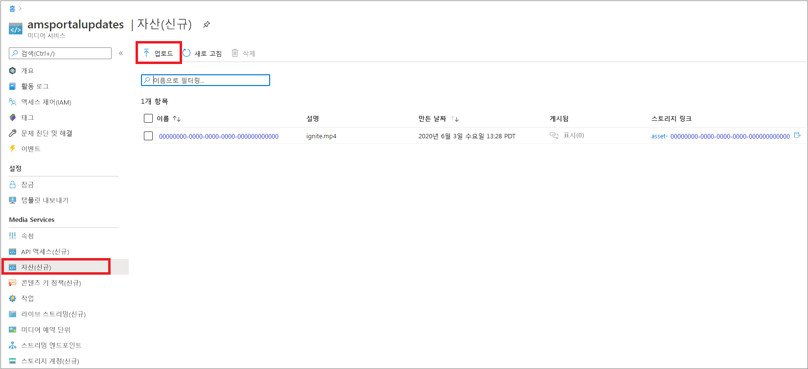
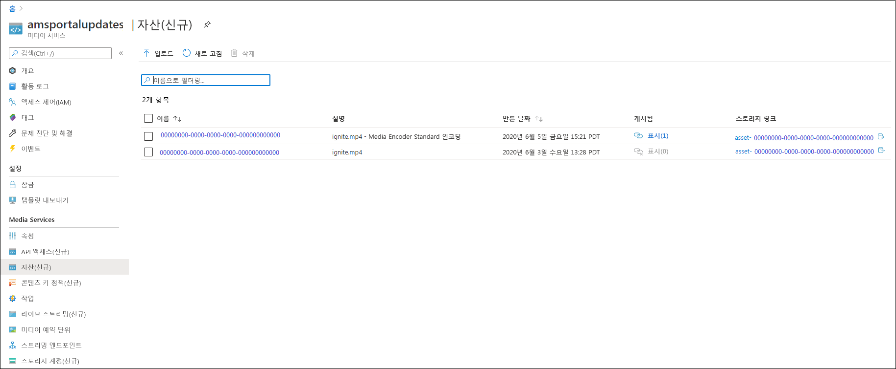
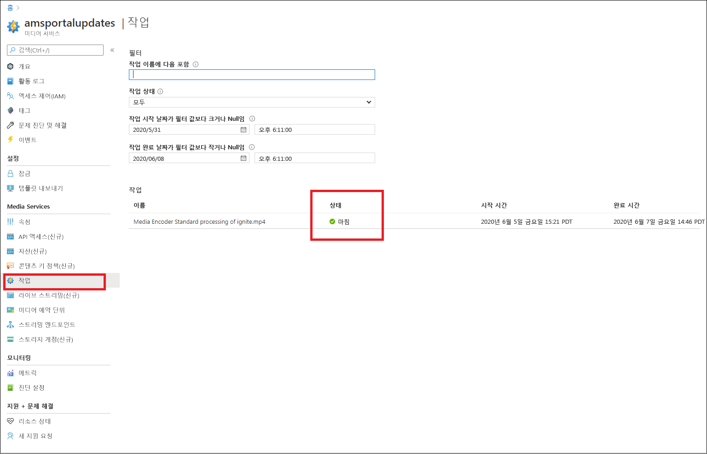
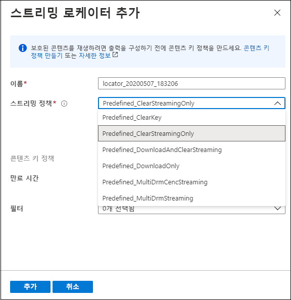

# 빠른 시작: 포털을 사용하여 콘텐츠 업로드, 인코딩 및 스트리밍

[!INCLUDE [media services api v3 logo](./includes/v3-hr.md)]

이 빠른 시작에서는 Azure Portal을 사용하여 Azure Media Services를 통해 콘텐츠를 업로드, 인코딩 및 스트림하는 방법을 보여 줍니다.

> [!NOTE]
> [Media Services v3에 대한 Azure Portal 제한 사항](frequently-asked-questions.md#what-are-the-azure-portal-limitations-for-media-services-v3)을 검토하세요.
  
## 개요

* Azure에서 미디어 콘텐츠를 관리, 암호화, 인코딩, 분석 및 스트리밍하려면 Media Services 계정을 만들고 고품질 디지털 미디어 파일을 **자산**에 업로드해야 합니다. 
    
    > [!NOTE]
    > 이전에 Media Services v3 API를 사용하여 비디오를 Media Services 계정에 업로드했거나 라이브 출력을 기반으로 콘텐츠가 생성된 경우 Azure Portal에서 **인코딩**, **분석** 또는 **암호화** 단추가 표시되지 않습니다. Media Services v3 API를 사용하여 이러한 작업을 수행합니다.

    검토할 사항은 다음과 같습니다. 

  * [클라우드 업로드 및 스토리지](storage-account-concept.md)
  * [자산 개념](assets-concept.md)
* 고품질 디지털 미디어 파일을 자산(입력 자산)에 업로드하면 이를 처리(인코딩 또는 분석)할 수 있습니다. 처리된 콘텐츠가 다른 자산(출력 자산)으로 이동합니다. 
    * 다양한 브라우저 및 디바이스에서 재생할 수 있는 형식으로 업로드한 파일을 [인코딩](encoding-concept.md)합니다.
    * 업로드된 파일을 [분석](analyzing-video-audio-files-concept.md)합니다. 

        현재 Azure Portal을 사용 중인 경우 TTML 및 WebVTT 선택 자막 파일을 생성할 수 있습니다. 이러한 형식의 파일은 청각 장애가 있는 사용자가 액세스할 수 있는 오디오 및 비디오 파일을 만드는 데 사용할 수 있습니다. 또한 콘텐츠에서 키워드를 추출할 수 있습니다.

        비디오 및 오디오 파일에서 정보를 추출할 수 있는 다양한 환경을 위해 [자습서: Media Services v3으로 비디오 분석](analyze-videos-tutorial-with-api.md)에 설명된 대로 Media Services v3 사전 설정을 사용합니다.  더 자세한 인사이트가 필요하면 [Video Indexer](../video-indexer/index.yml)를 직접 사용해 보세요.    
* 콘텐츠를 처리한 후에는 미디어 콘텐츠를 클라이언트 플레이어에게 제공할 수 있습니다. 출력 자산의 비디오를 클라이언트가 재생할 수 있도록 하려면 **스트리밍 로케이터**를 만들어야 합니다. **스트리밍 로케이터**를 만드는 경우 **스트리밍 정책**을 지정해야 합니다. **스트리밍 정책**을 사용하면 **스트리밍 로케이터**에 대한 스트리밍 프로토콜 및 암호화 옵션(있는 경우)을 정의할 수 있습니다.
    
    검토:

    * [스트리밍 로케이터](streaming-locators-concept.md)
    * [스트리밍 정책](streaming-policy-concept.md)
    * [패키징 및 제공](dynamic-packaging-overview.md)
    * [필터](filters-concept.md)
* AES-128(Advanced Encryption Standard) 또는/및 세 가지 주요 DRM 시스템을 사용하여 콘텐츠를 암호화하여 보호할 수 있습니다. 동적 암호화된 라이브 콘텐츠 및 주문형 콘텐츠를 제공할 수 있습니다. [Azure Portal을 통한 콘텐츠 암호화](encrypt-content-quickstart.md) 빠른 시작에서는 콘텐츠 보호를 구성하는 방법을 보여 줍니다.
        
## 필수 구성 요소

[!INCLUDE [quickstarts-free-trial-note](../../../includes/quickstarts-free-trial-note.md)]

[Media Services 계정 만들기](create-account-howto.md#use-the-azure-portal)

## 업로드

1. [Azure Portal](https://portal.azure.com/)에 로그인합니다.
1. Media Services 계정을 찾아 클릭합니다.
1. **자산(신규)** 을 선택합니다.
1. 창 맨 위에 있는 **업로드**를 누릅니다. 
1. 업로드하려는 파일을 끌어서 놓거나 이동합니다.

자산 창으로 이동하면 새 자산이 목록에 추가된 것을 볼 수 있습니다.

## 인코딩

1. **자산(신규)** 을 선택합니다.
1. 새 자산을 선택합니다(마지막 단계에서 추가됨).
1. 창 위쪽에서 **인코딩**을 클릭합니다.

    이 단추를 누르면 인코딩 작업이 시작됩니다. 성공적으로 완료되면 인코딩된 콘텐츠를 포함하는 출력 자산을 생성합니다.

자산 창으로 이동하면 출력 자산이 목록에 추가된 것을 볼 수 있습니다.

## 작업 진행률 모니터링

작업 상태를 보려면 **작업**으로 이동합니다. 작업은 일반적으로 예약됨, 대기, 처리 중, 마침(최종 상태) 상태를 거칩니다. 작업에서 오류가 발생하면 오류 상태가 표시됩니다.

## 게시 및 스트리밍

이제 자산을 게시하려면 자산에 스트리밍 로케이터를 추가해야 합니다.

### 스트리밍 로케이터 

1. **스트리밍 로케이터** 섹션에서 **+ 스트리밍 로케이터 추가**를 누릅니다.
    그러면 자산이 게시되고 스트리밍 URL이 생성됩니다.

    > [!NOTE]
    > 스트림을 암호화하려는 경우 콘텐츠 키 정책을 만들고 스트리밍 로케이터에 설정해야 합니다. 자세한 내용은 [Azure Portal을 통한 콘텐츠 암호화](encrypt-content-quickstart.md)를 참조하세요.
1. **스트리밍 로케이터 추가** 창에서 미리 정의된 스트리밍 정책 중 하나를 선택합니다. 자세한 내용은 [스트리밍 정책](streaming-policy-concept.md)을 참조하세요.

    

자산이 게시되면 포털에서 바로 스트리밍할 수 있습니다. 

또는 스트리밍 URL을 복사하여 클라이언트 플레이어에서 사용합니다.

> [!NOTE]
> [스트리밍 엔드포인트](streaming-endpoint-concept.md)가 실행 중인지 확인합니다. 미디어 서비스 계정을 처음 만들 때 기본 스트리밍 엔드포인트가 생성되고 중지된 상태이므로 콘텐츠를 스트리밍하려면 먼저 시작해야 합니다. 스트리밍 엔드포인트가 실행 중인 상태일 때만 요금이 청구됩니다.

## 리소스 정리

다른 빠른 시작을 시도하려면 생성된 리소스를 유지해야 합니다. 그렇지 않으면 Azure Portal로 이동하여 리소스 그룹을 찾고 이 빠른 시작을 실행한 리소스 그룹을 선택한 후 모든 리소스를 삭제합니다.

## 다음 단계

[포털을 사용한 콘텐츠 암호화](encrypt-content-quickstart.md)
