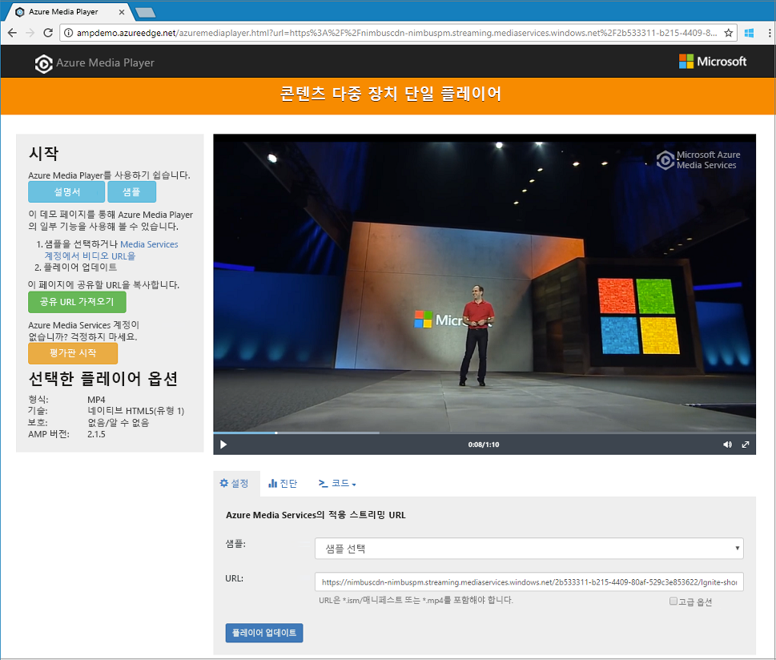

# <a name="tutorial-stream-video-files---cli"></a>자습서: 비디오 파일 스트리밍 - CLI

이 자습서는 Azure Media Services 및 Azure CLI를 사용하여 다양한 브라우저 및 디바이스에서 비디오를 쉽게 인코딩하고 스트리밍하는 방법을 보여줍니다. Azure Blob 스토리지에서 HTTPS 또는 SAS URL, 파일 경로를 사용하여 입력 콘텐츠를 지정할 수 있습니다.

이 문서의 예제에서는 콘텐츠를 인코딩하여 HTTPS URL을 통해 액세스할 수 있게 만듭니다. 현재 Media Services v3는 HTTPS URL을 통한 청크 분할 전송 인코딩을 지원하지 않습니다.

이 자습서가 끝나면 비디오를 스트리밍할 수 있습니다.  



[!INCLUDE [quickstarts-free-trial-note](../../../includes/quickstarts-free-trial-note.md)]

## <a name="create-a-media-services-account"></a>Media Services 계정 만들기

Azure에서 미디어 콘텐츠를 암호화, 인코딩, 분석, 관리 및 스트리밍하려면 먼저 Media Services 계정을 만들어야 합니다. 이 계정은 하나 이상의 스토리지 계정과 연결되어야 합니다.

Media Services 계정 및 연결된 모든 스토리지 계정은 동일한 Azure 구독에 포함되어야 합니다. Media Services 계정과 동일한 위치에 있는 스토리지 계정을 사용하여 대기 시간 및 데이터 송신 비용을 제한하는 것이 좋습니다.

### <a name="create-a-resource-group"></a>리소스 그룹 만들기

```azurecli
az group create -n amsResourceGroup -l westus2
```

### <a name="create-an-azure-storage-account"></a>Azure 저장소 계정 만들기

이 예제에서는 범용 v2, 표준 LRS 계정을 만듭니다.

스토리지 계정을 실험하려면 `--sku Standard_LRS`를 사용합니다. 프로덕션용 SKU를 선택하는 경우 비즈니스 연속성을 위해 지리적 복제를 제공하는 `--sku Standard_RAGRS`를 사용하는 것이 좋습니다. 자세한 내용은 [스토리지 계정](https://docs.microsoft.com/cli/azure/storage/account?view=azure-cli-latest)을 참조하세요.
 
```azurecli
az storage account create -n amsstorageaccount --kind StorageV2 --sku Standard_LRS -l westus2 -g amsResourceGroup
```

### <a name="create-an-azure-media-services-account"></a>Azure Media Services 계정 만들기

```azurecli
az ams account create --n amsaccount -g amsResourceGroup --storage-account amsstorageaccount -l westus2
```

다음과 같은 응답이 표시됩니다.

```
{
  "id": "/subscriptions/<id>/resourceGroups/amsResourceGroup/providers/Microsoft.Media/mediaservices/amsaccount",
  "location": "West US 2",
  "mediaServiceId": "8b569c2e-d648-4fcb-9035-c7fcc3aa7ddf",
  "name": "amsaccount",
  "resourceGroup": "amsResourceGroupTest",
  "storageAccounts": [
    {
      "id": "/subscriptions/<id>/resourceGroups/amsResourceGroup/providers/Microsoft.Storage/storageAccounts/amsstorageaccount",
      "resourceGroup": "amsResourceGroupTest",
      "type": "Primary"
    }
  ],
  "tags": null,
  "type": "Microsoft.Media/mediaservices"
}
```

## <a name="start-the-streaming-endpoint"></a>스트리밍 엔드포인트 시작

다음 Azure CLI 명령은 기본 **스트리밍 엔드포인트**를 시작합니다.

```azurecli
az ams streaming-endpoint start  -n default -a amsaccount -g amsResourceGroup
```

다음과 같은 응답이 표시됩니다.

```
az ams streaming-endpoint start  -n default -a amsaccount -g amsResourceGroup
{
  "accessControl": null,
  "availabilitySetName": null,
  "cdnEnabled": true,
  "cdnProfile": "AzureMediaStreamingPlatformCdnProfile-StandardVerizon",
  "cdnProvider": "StandardVerizon",
  "created": "2019-02-06T21:58:03.604954+00:00",
  "crossSiteAccessPolicies": null,
  "customHostNames": [],
  "description": "",
  "freeTrialEndTime": "2019-02-21T22:05:31.277936+00:00",
  "hostName": "amsaccount-usw22.streaming.media.azure.net",
  "id": "/subscriptions/<id>/resourceGroups/amsResourceGroup/providers/Microsoft.Media/mediaservices/amsaccount/streamingendpoints/default",
  "lastModified": "2019-02-06T21:58:03.604954+00:00",
  "location": "West US 2",
  "maxCacheAge": null,
  "name": "default",
  "provisioningState": "Succeeded",
  "resourceGroup": "amsResourceGroup",
  "resourceState": "Running",
  "scaleUnits": 0,
  "tags": {},
  "type": "Microsoft.Media/mediaservices/streamingEndpoints"
}
```

스트리밍 엔드포인트가 이미 실행 중인 경우 다음 메시지가 표시됩니다.

```
(InvalidOperation) The server cannot execute the operation in its current state.
```

## <a name="create-a-transform-for-adaptive-bitrate-encoding"></a>적응 비트 전송률 인코딩을 위한 변환 만들기

**Transform**(변환)을 만들어 비디오 인코딩 또는 분석에 대한 일반적인 작업을 구성합니다. 다음 예제에서는 적응 비트 전송률 인코딩을 수행합니다. 그런 다음, 만든 변환 아래에서 작업을 제출합니다. 해당 작업은 지정된 비디오 또는 오디오 콘텐츠 입력에 변환을 적용하도록 요구하는 Media Services에 대한 요청입니다.

```azurecli
az ams transform create --name testEncodingTransform --preset AdaptiveStreaming --description 'a simple Transform for Adaptive Bitrate Encoding' -g amsResourceGroup -a amsaccount
```

다음과 같은 응답이 표시됩니다.

```
{
  "created": "2019-02-15T00:11:18.506019+00:00",
  "description": "a simple Transform for Adaptive Bitrate Encoding",
  "id": "/subscriptions/<id>/resourceGroups/amsResourceGroup/providers/Microsoft.Media/mediaservices/amsaccount/transforms/testEncodingTransform",
  "lastModified": "2019-02-15T00:11:18.506019+00:00",
  "name": "testEncodingTransform",
  "outputs": [
    {
      "onError": "StopProcessingJob",
      "preset": {
        "odatatype": "#Microsoft.Media.BuiltInStandardEncoderPreset",
        "presetName": "AdaptiveStreaming"
      },
      "relativePriority": "Normal"
    }
  ],
  "resourceGroup": "amsResourceGroup",
  "type": "Microsoft.Media/mediaservices/transforms"
}
```

## <a name="create-an-output-asset"></a>출력 자산 만들기

인코딩 작업의 출력으로 사용할 출력 **자산**을 만듭니다.

```azurecli
az ams asset create -n testOutputAssetName -a amsaccount -g amsResourceGroup
```

다음과 같은 응답이 표시됩니다.

```
{
  "alternateId": null,
  "assetId": "96427438-bbce-4a74-ba91-e38179b72f36",
  "container": null,
  "created": "2019-02-14T23:58:19.127000+00:00",
  "description": null,
  "id": "/subscriptions/<id>/resourceGroups/amsResourceGroup/providers/Microsoft.Media/mediaservices/amsaccount/assets/testOutputAssetName",
  "lastModified": "2019-02-14T23:58:19.127000+00:00",
  "name": "testOutputAssetName",
  "resourceGroup": "amsResourceGroup",
  "storageAccountName": "amsstorageaccount",
  "storageEncryptionFormat": "None",
  "type": "Microsoft.Media/mediaservices/assets"
}
```

## <a name="start-a-job-by-using-https-input"></a>HTTPS 입력을 사용하여 작업 시작

비디오를 처리할 작업을 제출할 때 입력 비디오를 찾을 위치를 Media Services에 알려줘야 합니다. 한 가지 옵션은 다음 예제와 같이 HTTPS URL을 작업 입력으로 지정하는 것입니다.

`az ams job start`를 실행하면 레이블을 작업의 출력에 설정할 수 있습니다. 레이블을 사용하여 출력 자산의 용도를 식별할 수 있습니다.

- 값을 레이블에 할당하는 경우 '--output-assets'를 "assetname=label"로 설정합니다.
- 값을 레이블에 할당하지 않는 경우 '--output-assets'를 "assetname="로 설정합니다.

  "="을 `output-assets`에 추가합니다.

```azurecli
az ams job start --name testJob001 --transform-name testEncodingTransform --base-uri 'https://nimbuscdn-nimbuspm.streaming.mediaservices.windows.net/2b533311-b215-4409-80af-529c3e853622/' --files 'Ignite-short.mp4' --output-assets testOutputAssetName= -a amsaccount -g amsResourceGroup 
```

다음과 같은 응답이 표시됩니다.

```
{
  "correlationData": {},
  "created": "2019-02-15T05:08:26.266104+00:00",
  "description": null,
  "id": "/subscriptions/<id>/resourceGroups/amsResourceGroup/providers/Microsoft.Media/mediaservices/amsaccount/transforms/testEncodingTransform/jobs/testJob001",
  "input": {
    "baseUri": "https://nimbuscdn-nimbuspm.streaming.mediaservices.windows.net/2b533311-b215-4409-80af-529c3e853622/",
    "files": [
      "Ignite-short.mp4"
    ],
    "label": null,
    "odatatype": "#Microsoft.Media.JobInputHttp"
  },
  "lastModified": "2019-02-15T05:08:26.266104+00:00",
  "name": "testJob001",
  "outputs": [
    {
      "assetName": "testOutputAssetName",
      "error": null,
      "label": "",
      "odatatype": "#Microsoft.Media.JobOutputAsset",
      "progress": 0,
      "state": "Queued"
    }
  ],
  "priority": "Normal",
  "resourceGroup": "amsResourceGroup",
  "state": "Queued",
  "type": "Microsoft.Media/mediaservices/transforms/jobs"
}
```

### <a name="check-status"></a>상태 확인

5분 후에 작업 상태를 확인합니다. "마침"이어야 합니다. 완료되지 않으면 몇 분 후에 다시 확인합니다. 완료되었으면 다음 단계로 이동한 후 **스트리밍 로케이터**를 만듭니다.

```azurecli
az ams job show -a amsaccount -g amsResourceGroup -t testEncodingTransform -n testJob001
```

## <a name="create-a-streaming-locator-and-get-a-path"></a>스트리밍 로케이터 만들기 및 경로 가져오기

인코딩이 완료되면 다음 단계는 클라이언트에서 출력 자산의 비디오를 재생할 수 있게 만드는 것입니다. 이렇게 하려면 먼저 스트리밍 로케이터를 만듭니다. 그런 후 클라이언트가 사용할 수 있는 스트리밍 URL을 빌드합니다.

### <a name="create-a-streaming-locator"></a>스트리밍 로케이터 만들기

```azurecli
az ams streaming-locator create -n testStreamingLocator --asset-name testOutputAssetName --streaming-policy-name Predefined_ClearStreamingOnly  -g amsResourceGroup -a amsaccount 
```

다음과 같은 응답이 표시됩니다.

```
{
  "alternativeMediaId": null,
  "assetName": "output-3b6d7b1dffe9419fa104b952f7f6ab76",
  "contentKeys": [],
  "created": "2019-02-15T04:35:46.270750+00:00",
  "defaultContentKeyPolicyName": null,
  "endTime": "9999-12-31T23:59:59.999999+00:00",
  "id": "/subscriptions/<id>/resourceGroups/amsResourceGroup/providers/Microsoft.Media/mediaservices/amsaccount/streamingLocators/testStreamingLocator",
  "name": "testStreamingLocator",
  "resourceGroup": "amsResourceGroup",
  "startTime": null,
  "streamingLocatorId": "e01b2be1-5ea4-42ca-ae5d-7fe704a5962f",
  "streamingPolicyName": "Predefined_ClearStreamingOnly",
  "type": "Microsoft.Media/mediaservices/streamingLocators"
}
```

### <a name="get-streaming-locator-paths"></a>스트리밍 로케이터 경로 가져오기

```azurecli
az ams streaming-locator get-paths -a amsaccount -g amsResourceGroup -n testStreamingLocator
```

다음과 같은 응답이 표시됩니다.

```
{
  "downloadPaths": [],
  "streamingPaths": [
    {
      "encryptionScheme": "NoEncryption",
      "paths": [
        "/e01b2be1-5ea4-42ca-ae5d-7fe704a5962f/ignite.ism/manifest(format=m3u8-aapl)"
      ],
      "streamingProtocol": "Hls"
    },
    {
      "encryptionScheme": "NoEncryption",
      "paths": [
        "/e01b2be1-5ea4-42ca-ae5d-7fe704a5962f/ignite.ism/manifest(format=mpd-time-csf)"
      ],
      "streamingProtocol": "Dash"
    },
    {
      "encryptionScheme": "NoEncryption",
      "paths": [
        "/e01b2be1-5ea4-42ca-ae5d-7fe704a5962f/ignite.ism/manifest"
      ],
      "streamingProtocol": "SmoothStreaming"
    }
  ]
}
```

HLS(HTTP 라이브 스트리밍) 경로를 복사합니다. 이 예제의 경우 `/e01b2be1-5ea4-42ca-ae5d-7fe704a5962f/ignite.ism/manifest(format=m3u8-aapl)`입니다.

## <a name="build-the-url"></a>URL 작성 

### <a name="get-the-streaming-endpoint-host-name"></a>스트리밍 엔드포인트 호스트 이름 가져오기

```azurecli
az ams streaming-endpoint list -a amsaccount -g amsResourceGroup -n default
```
`hostName` 값을 복사합니다. 이 예제의 경우 `amsaccount-usw22.streaming.media.azure.net`입니다.

### <a name="assemble-the-url"></a>URL 어셈블

"https:// " + &lt;hostName 값&gt; + &lt;Hls 경로 값&gt;

예를 들면 다음과 같습니다.

`https://amsaccount-usw22.streaming.media.azure.net/7f19e783-927b-4e0a-a1c0-8a140c49856c/ignite.ism/manifest(format=m3u8-aapl)`

## <a name="test-playback-by-using-azure-media-player"></a>Azure Media Player를 사용하여 재생 테스트

> [!NOTE]
> 플레이어가 HTTPS 사이트에 호스트될 경우 URL을 "https"로 시작해야 합니다.

1. 웹 브라우저를 열고 [https://aka.ms/azuremediaplayer/](https://aka.ms/azuremediaplayer/)으로 이동합니다.
2. **URL** 상자에 이전 섹션에서 작성한 URL을 붙여넣습니다. HLS, Dash 또는 Smooth 형식에서 URL을 붙여넣을 수 있습니다. Azure Media Player는 디바이스에서 재생할 때 적절한 스트리밍 프로토콜을 자동으로 사용합니다.
3. **플레이어 업데이트**를 선택합니다.

>[!NOTE]
>Azure Media Player는 테스트용으로 사용할 수 있지만 프로덕션 환경에서는 사용할 수 없습니다.

## <a name="clean-up-resources"></a>리소스 정리

이 자습서를 위해 만든 Media Services 및 스토리지 계정을 비롯하여 리소스 그룹의 어떠한 리소스도 더 이상 필요하지 않은 경우 리소스 그룹을 삭제합니다.

다음 CLI 명령을 실행합니다.

```azurecli
az group delete --name amsResourceGroup
```

## <a name="next-steps"></a>다음 단계

[Media Services 개요](media-services-overview.md)

