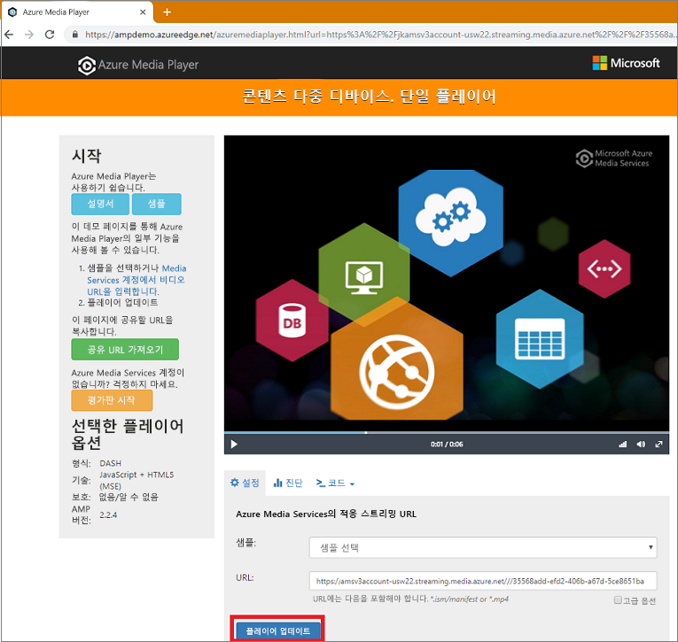

# <a name="tutorial-stream-video-files---nodejs"></a>자습서: 비디오 파일 스트리밍 - Node.js

이 자습서는 Azure Media Services를 사용하여 다양한 브라우저 및 디바이스에서 비디오 스트리밍을 인코딩하고 시작하는 것이 얼마나 쉬운지 보여줍니다. 입력 내용은 HTTPS URL, SAS URL 또는 Azure Blob Storage에 있는 파일 경로를 사용하여 지정할 수 있습니다.

이 문서의 샘플에서는 콘텐츠를 인코딩하여 HTTPS URL을 통해 액세스할 수 있게 만듭니다. 현재 AMS v3은 HTTPS URL을 통한 청크 분할 전송 인코딩을 지원하지 않습니다.

자습서가 끝나면 비디오를 스트리밍할 수 있습니다.  



[!INCLUDE [quickstarts-free-trial-note](../../../includes/quickstarts-free-trial-note.md)]

## <a name="prerequisites"></a>필수 조건

- [Node.js](https://nodejs.org/en/download/)
- [Media Services 계정 만들기](create-account-cli-how-to.md)<br/>리소스 그룹 이름 및 Media Services 계정 이름에 사용한 값을 기억해 두세요.
- [Azure CLI를 사용하여 Azure Media Services API 액세스](access-api-cli-how-to.md)의 단계를 수행하고 자격 증명을 저장합니다. API에 액세스할 때 필요합니다.

## <a name="download-and-configure-the-sample"></a>샘플 다운로드 및 구성

다음 명령을 사용하여 스트리밍 Node.js 샘플이 포함된 GitHub 리포지토리를 머신에 복제합니다.  

 ```bash
 git clone https://github.com/Azure-Samples/media-services-v3-node-tutorials.git
 ```

샘플은 [StreamFilesSample](https://github.com/Azure-Samples/media-services-v3-node-tutorials/tree/master/AMSv3Samples/StreamFilesSample) 폴더에 있습니다.

다운로드한 프로젝트에서 [index.js](https://github.com/Azure-Samples/media-services-v3-node-tutorials/blob/master/AMSv3Samples/StreamFilesSample/index.js#L25)를 엽니다. `endpoint config` 값을 [API에 액세스](access-api-cli-how-to.md)하여 가져온 자격 증명으로 바꿉니다.

샘플은 다음 작업을 수행합니다.

1. **변환**을 만듭니다(먼저 지정된 변환이 있는지 확인합니다). 
2. 인코딩 **작업**의 출력으로 사용되는 출력 **자산**을 만듭니다.
3. HTTPS URL을 기반으로 하는 **작업**의 입력을 만듭니다.
4. 앞서 만든 입력 및 출력을 사용하여 인코딩 **작업**을 제출합니다.
5. 작업의 상태를 확인합니다.
6. **스트리밍 로케이터**를 만듭니다.
7. 스트리밍 URL을 빌드합니다.

## <a name="run-the-sample-app"></a>샘플 앱 실행

1. 앱에서 인코딩된 파일이 다운로드됩니다. 출력 파일을 배치할 폴더를 만들고 [index.js](https://github.com/Azure-Samples/media-services-v3-node-tutorials/blob/master/AMSv3Samples/StreamFilesSample/index.js#L39) 파일에서 **outputFolder** 변수의 값을 업데이트합니다.
1. **명령 프롬프트**를 열고 샘플 디렉터리로 이동하여 다음 명령을 실행합니다.

    ```
    npm install 
    node index.js
    ```

실행이 완료되면 유사한 출력이 표시됩니다.


## <a name="test-with-azure-media-player"></a>Azure Media Player로 테스트

이 문서에서는 스트림을 테스트하기 위해 Azure Media Player를 사용합니다. 

> [!NOTE]
> 플레이어가 https 사이트에 호스트 될 경우 URL을 "https"로 업데이트해야 합니다.

1. 웹 브라우저를 열고 [https://aka.ms/azuremediaplayer/](https://aka.ms/azuremediaplayer/)로 이동합니다.
2. 애플리케이션을 실행할 때 얻은 URL 값 중 하나를 **URL:** 상자에 붙여넣습니다. 
 
     URL을 HLS, Dash 또는 부드러운 스트리밍 형식으로 붙여넣을 수 있으며, Azure Media Player는 디바이스에서 재생하기 위한 적절한 스트리밍 프로토콜로 자동으로 전환합니다.
3. **플레이어 업데이트**를 누릅니다.

Azure Media Player는 테스트용으로 사용할 수 있지만 프로덕션 환경에서는 사용할 수 없습니다. 

## <a name="clean-up-resources"></a>리소스 정리

이 자습서를 위해 만든 Media Services 및 스토리지 계정을 비롯하여 리소스 그룹의 어떠한 리소스도 더 이상 필요하지 않은 경우 리소스 그룹을 삭제합니다.

다음 CLI 명령을 실행합니다.

```azurecli
az group delete --name amsResourceGroup
```

## <a name="see-also"></a>참고 항목

[작업 오류 코드](https://docs.microsoft.com/rest/api/media/jobs/get#joberrorcode).

## <a name="next-steps"></a>다음 단계

> [!div class="nextstepaction"]
> [Media Services 개념](concepts-overview.md)
