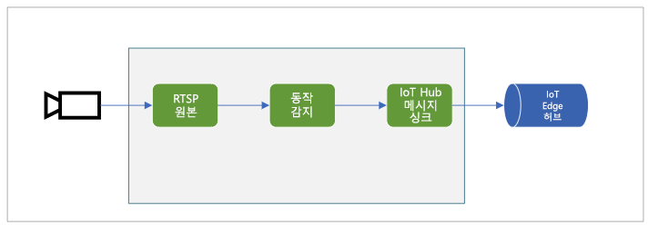

# <a name="quickstart-detect-motion-and-emit-events"></a>빠른 시작: 동작 감지 및 이벤트 내보내기

이 빠른 시작에서는 Live Video Analytics on IoT Edge를 시작하는 단계를 안내합니다. Azure VM을 IoT Edge 디바이스와 시뮬레이션된 라이브 비디오 스트림으로 사용합니다. 설치 단계가 완료되면 해당 스트림에서 동작을 감지하고 보고하는 미디어 그래프를 통해 시뮬레이션된 라이브 비디오 스트림을 실행할 수 있습니다. 다음 다이어그램은 해당 미디어 그래프의 그래픽 표현을 보여 줍니다.

 

이 문서의 모든 [샘플 코드](https://github.com/Azure-Samples/live-video-analytics-iot-edge-csharp)는 C#으로 작성되었습니다.

## <a name="prerequisites"></a>필수 구성 요소

* 활성 구독이 있는 Azure 계정. 계정이 아직 없는 경우 [체험 계정을 만듭니다](https://azure.microsoft.com/free/?WT.mc_id=A261C142F).
* [Visual Studio Code](https://code.visualstudio.com/)(다음 확장 포함):
    * [Azure IoT Tools](https://marketplace.visualstudio.com/items?itemName=vsciot-vscode.azure-iot-tools)
    * [C#](https://marketplace.visualstudio.com/items?itemName=ms-dotnettools.csharp)
* [.NET Core 3.1 SDK](https://dotnet.microsoft.com/download/dotnet-core/3.1). 

> [!TIP]
> Azure IoT Tools 확장을 설치하는 동안 Docker를 설치하라는 메시지가 표시될 수 있습니다. 이 메시지는 무시할 수 있습니다.

## <a name="set-up-azure-resources"></a>Azure 리소스 설정

이 자습서를 사용하려면 다음과 같은 Azure 리소스가 필요합니다.

* IoT Hub
* 스토리지 계정
* Azure Media Services 계정
* [IoT Edge 런타임](../../iot-edge/how-to-install-iot-edge-linux.md)이 설치된 Azure의 Linux VM

이 빠른 시작에서는 [Live Video Analytics 리소스 설치 스크립트](https://github.com/Azure/live-video-analytics/tree/master/edge/setup)를 사용하여 Azure 구독에 필요한 리소스를 배포하는 것이 좋습니다. 이렇게 하려면 다음 단계를 따르십시오.

1. [Azure Cloud Shell](https://shell.azure.com)을 엽니다.
1. Cloud Shell을 처음 사용하는 경우 스토리지 계정 및 Microsoft Azure Files 공유를 만들 구독을 선택하라는 메시지가 표시됩니다. **스토리지 만들기**를 선택하여 Cloud Shell 세션 정보에 대한 스토리지 계정을 만듭니다. 이 스토리지 계정은 Azure Media Services 계정에서 사용하기 위해 스크립트에서 만드는 계정과는 다릅니다.
1. Cloud Shell 창 왼쪽의 드롭다운 메뉴에서 사용자 환경으로 **Bash**를 선택합니다.

    

1. 다음 명령을 실행합니다.

```
bash -c "$(curl -sL https://aka.ms/lva-edge/setup-resources-for-samples)"
```

스크립트가 성공적으로 완료되면 구독에 필요한 모든 리소스가 표시됩니다.

1. 스크립트가 완료되면 중괄호를 선택하여 폴더 구조를 표시합니다. *~/clouddrive/lva-sample* 디렉터리에 몇 개의 파일이 표시됩니다. 이 빠른 시작에서 유의해야 할 사항은 다음과 같습니다.

     * ***~/clouddrive/lva-sample/edge-deployment/.env*** - 이 파일에는 Visual Studio Code가 에지 디바이스에 모듈을 배포하는 데 사용하는 속성이 포함되어 있습니다.
     * ***~/clouddrive/lva-sample/appsetting.json*** - Visual Studio Code에서 샘플 코드를 실행하는 데 이 파일을 사용합니다.
     
다음 섹션의 Visual Studio Code에서 개발 환경을 설정할 때 이러한 파일이 필요합니다. 지금은 로컬 파일에 복사하는 것이 좋습니다.

 

## <a name="set-up-your-development-environment"></a>개발 환경 설정

1. https://github.com/Azure-Samples/live-video-analytics-iot-edge-csharp 에서 리포지토리를 복제합니다.
1. Visual Studio Code에서 리포지토리를 다운로드한 폴더를 엽니다.
1. Visual Studio Code에서 *src/cloud-to-device-console-app*으로 이동합니다. 여기에서 파일을 만들고 이름을 *appsettings.json*으로 지정합니다. 이 파일에는 프로그램을 실행하는 데 필요한 설정이 포함됩니다.
1. 이 빠른 시작의 앞부분에서 만든 *~/clouddrive/lva-sample/appsettings.json* 파일의 콘텐츠를 복사합니다.

    텍스트는 다음 출력과 비슷합니다.

```
{  
    "IoThubConnectionString" : "HostName=xxx.azure-devices.net;SharedAccessKeyName=iothubowner;SharedAccessKey=XXX",  
    "deviceId" : "lva-sample-device",  
    "moduleId" : "lvaEdge"  
}
```
5. *src/edge* 폴더로 이동하고, *.env*라는 파일을 만듭니다.
1. */clouddrive/lva-sample/edge-deployment/.env* 파일의 콘텐츠를 복사합니다. 텍스트는 다음 코드와 비슷합니다.

```
SUBSCRIPTION_ID="<Subscription ID>"  
RESOURCE_GROUP="<Resource Group>"  
AMS_ACCOUNT="<AMS Account ID>"  
IOTHUB_CONNECTION_STRING="HostName=xxx.azure-devices.net;SharedAccessKeyName=iothubowner;SharedAccessKey=xxx"  
AAD_TENANT_ID="<AAD Tenant ID>"  
AAD_SERVICE_PRINCIPAL_ID="<AAD SERVICE_PRINCIPAL ID>"  
AAD_SERVICE_PRINCIPAL_SECRET="<AAD SERVICE_PRINCIPAL ID>"  
INPUT_VIDEO_FOLDER_ON_DEVICE="/home/lvaadmin/samples/input"  
OUTPUT_VIDEO_FOLDER_ON_DEVICE="/var/media"
APPDATA_FOLDER_ON_DEVICE="/var/local/mediaservices"
CONTAINER_REGISTRY_USERNAME_myacr="<your container registry username>"  
CONTAINER_REGISTRY_PASSWORD_myacr="<your container registry password>"      
```

## <a name="examine-the-sample-files"></a>샘플 파일 검사

1. Visual Studio Code에서 *src/edge*로 이동합니다. *.env* 파일 및 몇 가지 배포 템플릿 파일이 표시됩니다.

    배포 템플릿은 변수가 일부 속성에 사용된 에지 디바이스에 대한 배포 매니페스트를 나타냅니다. *.env* 파일에는 이러한 변수에 대한 값이 포함되어 있습니다.
1. *src/cloud-to-device-console-app* 폴더로 이동합니다. 여기에는 *appsettings.json* 파일 및 몇 가지 다른 파일이 표시됩니다.

    * ***c2d-console-app.csproj*** - Visual Studio Code에 대한 프로젝트 파일입니다.
    * ***operations.json*** - 프로그램을 실행하려는 작업의 목록입니다.
    * ***Program.cs*** - 샘플 프로그램 코드입니다. 이 코드에서는 다음을 수행합니다.
    
      * 앱 설정을 로드합니다.
      * Live Video Analytics on IoT Edge 모듈에서 노출되는 직접 메서드를 호출합니다. 모듈을 사용하면 [직접 메서드](direct-methods.md)를 호출하여 라이브 비디오 스트림을 분석할 수 있습니다.
      * **터미널** 창에서 프로그램의 출력을 검사하고, **출력** 창에서 모듈에서 생성된 이벤트를 검사할 수 있도록 일시 중지합니다.
      * 리소스를 정리하는 직접 메서드를 호출합니다.   

## <a name="generate-and-deploy-the-deployment-manifest"></a>배포 매니페스트 생성 및 배포

배포 매니페스트는 에지 디바이스에 배포되는 모듈을 정의합니다. 또한 해당 모듈에 대한 구성 설정을 정의합니다. 

다음 단계에 따라 템플릿 파일에서 매니페스트를 생성한 다음, 에지 디바이스에 배포합니다.

1. Visual Studio Code를 엽니다.
1. **AZURE IOT HUB** 창 옆에 있는 **추가 작업** 아이콘을 선택하여 IoT Hub 연결 문자열을 설정합니다. *src/cloud-to-device-console-app/appsettings.json* 파일에서 문자열을 복사할 수 있습니다. 

    

1. **src/edge/deployment.template.json**을 마우스 오른쪽 단추로 클릭하고 **IoT Edge 배포 매니페스트 생성**을 선택합니다.

    

    이렇게 하면 *src/edge/config* 폴더에 *deployment.amd64.json*이라는 매니페스트 파일이 생성됩니다.
1. **src/edge/config/deployment.amd64.json**을 마우스 오른쪽 단추로 클릭하고 **단일 디바이스용 배포 만들기**를 선택하고 에지 디바이스의 이름을 선택합니다.

    

1. IoT Hub 디바이스를 선택하라는 메시지가 표시되면 드롭다운 메뉴에서 **lva-sample-device**를 선택합니다.
1. 약 30초 후 창의 왼쪽 아래 모서리에서 Azure IoT Hub가 새로 고쳐집니다. 이제 에지 디바이스에 다음과 같은 배포된 모듈이 표시됩니다.

    * Live Video Analytics on IoT Edge(`lvaEdge` 모듈 이름)
    * RTSP(Real-Time Streaming Protocol) 시뮬레이터(`rtspsim` 모듈 이름)

RTSP 시뮬레이터 모듈은 [Live Video Analytics 리소스 설치 스크립트](https://github.com/Azure/live-video-analytics/tree/master/edge/setup)를 실행할 때 에지 디바이스에 복사된 비디오 파일을 사용하여 라이브 비디오 스트림을 시뮬레이션합니다. 

> [!NOTE]
> 설치 스크립트를 통해 프로비저닝된 에지 디바이스 대신 사용자 고유의 에지 디바이스를 사용하는 경우 에지 디바이스로 이동하고, **관리자 권한**으로 다음 명령을 실행하여 이 빠른 시작에 사용되는 샘플 비디오 파일을 가져와 저장합니다.  

```
mkdir /home/lvaadmin/samples      
mkdir /home/lvaadmin/samples/input    
curl https://lvamedia.blob.core.windows.net/public/camera-300s.mkv > /home/lvaadmin/samples/input/camera-300s.mkv  
chown -R lvaadmin /home/lvaadmin/samples/  
```
이 단계에서는 모듈이 배포되었지만 미디어 그래프가 활성화되지 않았습니다.

## <a name="prepare-to-monitor-events"></a>이벤트 모니터링 준비

Live Video Analytics on IoT Edge 모듈을 사용하여 들어오는 라이브 비디오 스트림에서 동작을 감지하고 IoT Hub에 이벤트를 전송합니다. 이러한 이벤트를 보려면 다음 단계를 수행합니다.

1. Visual Studio Code에서 탐색기 창을 열고, 왼쪽 아래 모서리에서 Azure IoT Hub를 찾습니다.
1. **디바이스** 노드를 확장합니다.
1. **lva-sample-device**를 마우스 오른쪽 단추로 클릭하고, **기본 제공 이벤트 엔드포인트 모니터링 시작**을 선택합니다.

    

## <a name="run-the-sample-program"></a>샘플 프로그램 실행

샘플 코드를 실행하려면 다음 단계를 수행합니다.

1. Visual Studio Code에서 *src/cloud-to-device-console-app/operations.json*으로 이동합니다.
1. **GraphTopologySet** 노드에서 다음 값이 표시되는지 확인합니다.

    `"topologyUrl" : "https://raw.githubusercontent.com/Azure/live-video-analytics/master/MediaGraph/topologies/motion-detection/topology.json"`
1. **GraphInstanceSet** 및 **GraphTopologyDelete** 노드에서 `topologyName` 값이 그래프 토폴로지의 `name` 속성 값과 일치하는지 확인합니다.

    `"topologyName" : "MotionDetection"`
    
1. F5 키를 선택하여 디버깅 세션을 시작합니다. **터미널** 창에 몇 가지 메시지가 표시됩니다.
1. *operations.json* 파일은 `GraphTopologyList` 및 `GraphInstanceList`에 대한 호출로 시작됩니다. 이전 빠른 시작을 완료한 후에 리소스를 정리한 경우 이 프로세스에서 빈 목록을 반환한 다음, 일시 중지합니다. 계속하려면 Enter 키를 선택합니다.

```
--------------------------------------------------------------------------
Executing operation GraphTopologyList
-----------------------  Request: GraphTopologyList  --------------------------------------------------
{
    "@apiVersion": "1.0"
}
---------------  Response: GraphTopologyList - Status: 200  ---------------
{
    "value": []
}
--------------------------------------------------------------------------
Executing operation WaitForInput
Press Enter to continue
```

**터미널** 창에 다음 직접 메서드 호출 세트가 표시됩니다.
 * 이전 `topologyUrl`을 사용하는 `GraphTopologySet`에 대한 호출
 * 다음 본문을 사용하는 `GraphInstanceSet`에 대한 호출
     
```
{
  "@apiVersion": "1.0",
  "name": "Sample-Graph",
  "properties": {
    "topologyName": "MotionDetection",
    "description": "Sample graph description",
    "parameters": [
      {
        "name": "rtspUrl",
        "value": "rtsp://rtspsim:554/media/camera-300s.mkv"
      },
      {
        "name": "rtspUserName",
        "value": "testuser"
      },
      {
        "name": "rtspPassword",
        "value": "testpassword"
      }
    ]
  }
}
```
     
 * 그래프 인스턴스 및 비디오 흐름을 시작하는 `GraphInstanceActivate`에 대한 호출
 * 그래프 인스턴스가 실행 중 상태임을 보여 주는 `GraphInstanceList`에 대한 두 번째 호출
6. **터미널** 창의 출력이 `Press Enter to continue`에서 일시 중지됩니다. 아직 Enter 키를 선택하지 마세요. 위로 스크롤하여 호출한 직접 메서드에 대한 JSON 응답 페이로드를 확인합니다.
1. Visual Studio Code에서 **출력** 창으로 전환합니다. Live Video Analytics on IoT Edge 모듈에서 IoT 허브에 보내는 메시지가 표시됩니다. 이 빠른 시작의 다음 섹션에서는 이러한 메시지에 대해 설명합니다.
1. 미디어 그래프가 계속 실행되어 결과를 출력합니다. RTSP 시뮬레이터가 원본 비디오를 계속 반복합니다. 미디어 그래프를 중지하려면 **터미널** 창으로 돌아가서 Enter 키를 선택합니다. 

    일련의 다음 호출은 리소스를 정리합니다.
     * `GraphInstanceDeactivate`에 대한 호출은 그래프 인스턴스를 비활성화합니다.
     * `GraphInstanceDelete`에 대한 호출은 인스턴스를 삭제합니다.
     * `GraphTopologyDelete`에 대한 호출은 토폴로지를 삭제합니다.
     * `GraphTopologyList`에 대한 최종 호출은 목록이 비어 있음을 보여 줍니다.

## <a name="interpret-results"></a>결과 해석

미디어 그래프를 실행하면 동작 감지기 프로세서 노드의 결과가 IoT Hub 싱크 노드를 통해 IoT 허브에 전송됩니다. Visual Studio Code의 **출력** 창에 표시되는 메시지에는 `body` 섹션과 `applicationProperties` 섹션이 포함되어 있습니다. 자세한 내용은 [IoT Hub 메시지 만들기 및 읽기](../../iot-hub/iot-hub-devguide-messages-construct.md)를 참조하세요.

다음 메시지에서 Live Video Analytics 모듈은 애플리케이션 속성 및 본문의 콘텐츠를 정의합니다.

### <a name="mediasessionestablished-event"></a>MediaSessionEstablished 이벤트

미디어 그래프가 인스턴스화되면 RTSP 원본 노드가 rtspsim-live555 컨테이너에서 실행되는 RTSP 서버에 연결을 시도합니다. 연결에 성공하면 다음 이벤트가 출력됩니다.

```
[IoTHubMonitor] [9:42:18 AM] Message received from [lvaedgesample/lvaEdge]:  
{  
"body": {
"sdp": "SDP:\nv=0\r\no=- 1586450538111534 1 IN IP4 xxx.xxx.xxx.xxx\r\ns=Matroska video+audio+(optional)subtitles, streamed by the LIVE555 Media Server\r\ni=media/camera-300s.mkv\r\nt=0 0\r\na=tool:LIVE555 Streaming Media v2020.03.06\r\na=type:broadcast\r\na=control:*\r\na=range:npt=0-300.000\r\na=x-qt-text-nam:Matroska video+audio+(optional)subtitles, streamed by the LIVE555 Media Server\r\na=x-qt-text-inf:media/camera-300s.mkv\r\nm=video 0 RTP/AVP 96\r\nc=IN IP4 0.0.0.0\r\nb=AS:500\r\na=rtpmap:96 H264/90000\r\na=fmtp:96 packetization-mode=1;profile-level-id=4D0029;sprop-parameter-sets={SPS}\r\na=control:track1\r\n"  
},  
"applicationProperties": {  
    "dataVersion": "1.0",  
    "topic": "/subscriptions/{subscriptionID}/resourceGroups/{name}/providers/microsoft.media/mediaservices/hubname",  
    "subject": "/graphInstances/GRAPHINSTANCENAMEHERE/sources/rtspSource",  
    "eventType": "Microsoft.Media.MediaGraph.Diagnostics.MediaSessionEstablished",  
    "eventTime": "2020-04-09T16:42:18.1280000Z"  
    }  
}
```

앞의 출력에서, 
* 메시지는 진단 이벤트 `MediaSessionEstablished`입니다. RTSP 원본 노드(주체)에서 RTSP 시뮬레이터에 연결되었고 라이브 피드(시뮬레이션된)를 받기 시작했음을 나타냅니다.
* `applicationProperties`에서 `subject`는 메시지가 생성된 그래프 토폴로지의 노드를 참조합니다. 이 경우 메시지는 RTSP 원본 노드에서 시작됩니다.
* `applicationProperties`에서 `eventType`은 이 이벤트가 진단 이벤트임을 나타냅니다.
* `eventTime` 값은 이벤트가 발생한 시간을 나타냅니다.
* `body` 섹션에는 진단 이벤트에 대한 데이터가 포함됩니다. 이 경우 데이터는 [SDP(세션 설명 프로토콜)](https://en.wikipedia.org/wiki/Session_Description_Protocol) 세부 정보로 구성됩니다.


### <a name="motiondetection-event"></a>MotionDetection 이벤트

동작이 감지되면 Live Video Analytics on IoT Edge 모듈이 유추 이벤트를 보냅니다. `type`은 동작 감지 프로세서의 결과임을 나타내기 위해 `motion`으로 설정됩니다. `eventTime` 값은 동작이 발생한 시기(UTC)를 알려 줍니다. 

이 메시지의 예제는 다음과 같습니다.

```
  {  
  "body": {  
    "timestamp": 142843967343090,
    "inferences": [  
      {  
        "type": "motion",  
        "motion": {  
          "box": {  
            "l": 0.573222,  
            "t": 0.492537,  
            "w": 0.141667,  
            "h": 0.074074  
          }  
        }  
      }  
    ]  
  },  
  "applicationProperties": {  
    "topic": "/subscriptions/{subscriptionID}/resourceGroups/{name}/providers/microsoft.media/mediaservices/hubname",  
    "subject": "/graphInstances/GRAPHINSTANCENAME/processors/md",  
    "eventType": "Microsoft.Media.Graph.Analytics.Inference",  
    "eventTime": "2020-04-17T20:26:32.7010000Z",
    "dataVersion": "1.0"  
  }  
}  
```

이 예제에서: 

* `applicationProperties`에서 `subject`는 메시지가 생성된 미디어 그래프의 노드를 참조합니다. 이 경우 메시지는 동작 감지 프로세서 노드에서 시작됩니다.
* `applicationProperties`에서 `eventType`은 이 이벤트가 분석 이벤트임을 나타냅니다.
* `eventTime` 값은 이벤트가 발생한 시간을 나타냅니다.
* `body` 값은 분석 이벤트에 대한 데이터입니다. 이 경우 이벤트는 유추 이벤트이므로 본문에 `timestamp` 및 `inferences` 데이터가 포함됩니다.
* `inferences` 데이터는 `type`이 `motion`임을 나타냅니다. 해당 `motion` 이벤트에 대한 추가 데이터가 있습니다.
* `box` 섹션은 움직이는 개체 주위의 경계 상자에 대한 좌표를 포함합니다. 값은 비디오의 가로 및 세로 픽셀로 정규화됩니다. 예를 들어 너비는 1920이고 높이는 1080입니다.

    ```
    l - distance from left of image
    t - distance from top of image
    w - width of bounding box
    h - height of bounding box
    ```
    
## <a name="clean-up-resources"></a>리소스 정리

다른 빠른 시작을 시도하려면 생성된 리소스를 유지해야 합니다. 그렇지 않으면 Azure Portal에서 리소스 그룹으로 이동하고, 이 빠른 시작을 실행한 리소스 그룹을 선택한 다음, 모든 리소스를 삭제합니다.

## <a name="next-steps"></a>다음 단계

다른 빠른 시작을 실행합니다(예: 라이브 비디오 피드에서 개체 감지).        
