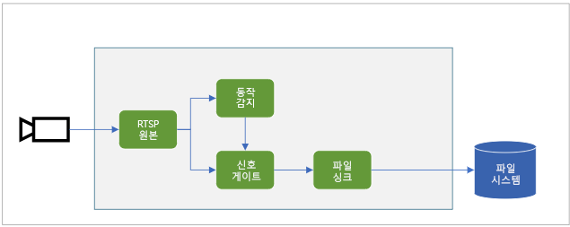
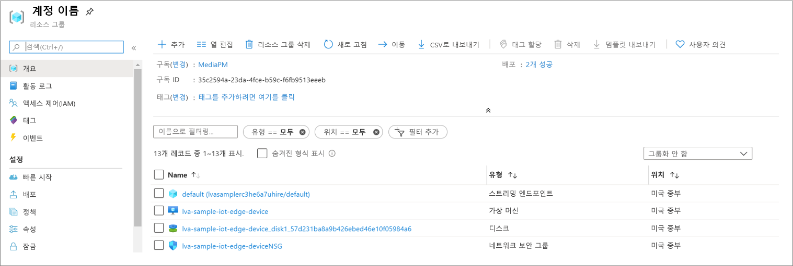

# <a name="quickstart-detect-motion-record-video-on-edge-devices"></a>빠른 시작: 동작을 감지하고 에지 디바이스에 비디오 녹화
 
이 빠른 시작에서는 Live Video Analytics on IoT Edge를 사용하여 시뮬레이션된 IP 카메라에서 라이브 비디오 피드를 분석하고, 동작이 있는지 감지하고, 해당하는 경우 에지 디바이스의 로컬 파일 시스템에 MP4 비디오 클립을 녹화하는 방법을 보여 줍니다. Azure VM을 IoT Edge 디바이스와 시뮬레이션된 라이브 비디오 스트림으로 사용합니다. 이 문서의 모든 샘플 코드는 C#으로 작성되었습니다.

이 문서는 [이 빠른 시작](detect-motion-emit-events-quickstart.md)을 기반으로 합니다. 

## <a name="prerequisites"></a>필수 구성 요소

* 활성 구독이 있는 Azure 계정. [체험 계정을 만듭니다](https://azure.microsoft.com/free/?WT.mc_id=A261C142F).
* 머신에 설치된 [Visual Studio Code](https://code.visualstudio.com/)(다음 확장 포함):
    * [Azure IoT Tools](https://marketplace.visualstudio.com/items?itemName=vsciot-vscode.azure-iot-tools)
    * [C#](https://marketplace.visualstudio.com/items?itemName=ms-dotnettools.csharp)
* 시스템에 설치된 [.NET Core 3.1 SDK](https://dotnet.microsoft.com/download/dotnet-core/3.1)
* 이전에 [이 빠른 시작](detect-motion-emit-events-quickstart.md)을 완료하지 않은 경우 다음 단계를 완료합니다.
     * [Azure 리소스 설정](detect-motion-emit-events-quickstart.md#set-up-azure-resources)
     * [개발 환경 설정](detect-motion-emit-events-quickstart.md#set-up-your-development-environment)
     * [IoT Edge 배포 매니페스트 생성 및 배포](detect-motion-emit-events-quickstart.md#generate-and-deploy-the-iot-edge-deployment-manifest)
     * [이벤트 모니터링 준비](detect-motion-emit-events-quickstart.md#prepare-for-monitoring-events)

> [!TIP]
> Azure IoT Tools를 설치할 때 docker를 설치할지 묻는 메시지가 표시될 수 있습니다. 이 메시지는 무시해도 됩니다.

## <a name="review-the-sample-video"></a>샘플 비디오 검토
위의 단계에 따라 Azure 리소스를 설정하면 주차장에 대한 (짧은) 비디오가 IoT Edge 디바이스로 사용되는 Azure의 Linux VM에 복사됩니다. 이 비디오 파일은 이 자습서의 라이브 스트림을 시뮬레이션하는 데 사용됩니다.

[VLC Player](https://www.videolan.org/vlc/)와 같은 애플리케이션을 사용하여 시작하고, Control+N을 누르고, [이 링크](https://lvamedia.blob.core.windows.net/public/lots_015.mkv)를 주차장 비디오에 붙여 넣어 재생을 시작할 수 있습니다. 5초 마크 정도에 흰색 차가 주차장을 통과합니다.

아래 단계를 완료하면 Live Video Analytics on IoT Edge를 사용하여 자동차의 동작을 감지하고 5초 마크 정도에 시작되는 비디오 클립을 녹화할 수 있습니다.

## <a name="overview"></a>개요



위의 다이어그램은 이 빠른 시작의 신호 흐름을 보여 줍니다. 에지 모듈(자세한 내용은 [여기](https://github.com/Azure/live-video-analytics/tree/master/utilities/rtspsim-live555) 참조)은 RTSP 서버를 호스트하는 IP 카메라를 시뮬레이션합니다. [RTSP 원본](media-graph-concept.md#rtsp-source) 노드는 이 서버에서 비디오 피드를 가져와서 비디오 프레임을 [동작 감지 프로세서](media-graph-concept.md#motion-detection-processor) 노드로 보냅니다. RTSP 원본은 이벤트에 의해 트리거될 때까지 닫힌 상태로 유지되는 [신호 게이트 프로세서](media-graph-concept.md#signal-gate-processor) 노드로 동일한 비디오 프레임을 보냅니다.

동작 감지 프로세서는 비디오에 동작이 있는 것을 확인하면 신호 게이트 프로세서 노드로 이벤트를 보내고 트리거합니다. 게이트가 구성된 시간 동안 열리고 [파일 싱크](media-graph-concept.md#file-sink) 노드로 비디오 프레임을 보냅니다. 이 싱크 노드는 구성된 위치에 있는 에지 디바이스의 로컬 파일 시스템에 MP4 파일로 비디오를 녹화합니다.

이 빠른 시작에서는 다음을 수행합니다.

1. 미디어 그래프를 만들고 배포
1. 결과 해석
1. 리소스 정리

## <a name="examine-and-edit-the-sample-files"></a>샘플 파일 검사 및 편집
필수 구성 요소의 일부인 샘플 코드를 폴더에 다운로드했습니다. Visual Studio Code를 시작하고 폴더를 엽니다.

1. Visual Studio Code에서 "src/edge"로 이동합니다. 사용자가 만든 .env 파일이 몇 가지 배포 템플릿 파일과 함께 표시됩니다.
    * 배포 템플릿은 일부 자리 표시자 값이 있는 에지 디바이스에 대한 배포 매니페스트를 나타냅니다. .env 파일에는 이러한 변수에 대한 값이 있습니다.
1. 그런 다음, "src/cloud-to-device-console-app" 폴더로 이동합니다. 여기에는 사용자가 만든 appsettings.json 파일과 몇 가지 다른 파일이 함께 표시됩니다.
    * c2d-console-app.csproj - Visual Studio Code에 대한 프로젝트 파일입니다.
    * operations.json - 이 파일에는 프로그램이 실행할 다양한 작업이 나열됩니다.
    * Program.cs- 다음을 수행하는 샘플 프로그램 코드입니다.

        * 앱 설정 로드
        * Live Video Analytics on IoT Edge 모듈에 의해 노출되는 직접 메서드를 호출합니다. 이 모듈을 통해 [직접 메서드](direct-methods.md)를 호출하여 라이브 비디오 스트림을 분석할 수 있습니다. 
        * 터미널 창에서 프로그램의 출력을 검토하고, 출력 창에서 모듈에 의해 생성된 이벤트를 살펴볼 수 있도록 일시 중지합니다.
        * 리소스를 정리하는 직접 메서드를 호출합니다.   

1. operations.json 파일을 다음과 같이 편집합니다.
    * 그래프 토폴로지에 대한 링크(`"topologyUrl" : "https://raw.githubusercontent.com/Azure/live-video-analytics/master/MediaGraph/topologies/evr-motion-files/topology.json"`)를 변경합니다.
    * GraphInstanceSet에서 위 링크의 값과 일치하도록 그래프 토폴로지의 이름(`"topologyName" : "EVRToFilesOnMotionDetection"`)을 편집합니다.
    * 또한 원하는 비디오 파일(`"value": "rtsp://rtspsim:554/media/lots_015.mkv"`)을 가리키도록 RTSP URL을 편집합니다.
    * GraphTopologyDelete에서 이름(`"name": "EVRToFilesOnMotionDetection"`)을 편집합니다.

## <a name="review---check-status-of-the-modules"></a>검토 - 모듈의 상태 확인
[IoT Edge 배포 매니페스트 생성 및 배포](detect-motion-emit-events-quickstart.md#generate-and-deploy-the-iot-edge-deployment-manifest) 단계에서 Visual Studio Code에서 AZURE IOT HUB(왼쪽 하단 섹션)의 "lva-sample-device" 노드를 확장하면 다음 모듈이 배포된 것을 볼 수 있습니다.

    1. Live Video Analytics 모듈(이름: "lvaEdge")
    1. RTSP 서버를 시뮬레이션하는 "rtspsim"이라는 모듈은 라이브 비디오 피드의 원본 역할을 합니다.

        


## <a name="review---prepare-for-monitoring-events"></a>검토 - 이벤트 모니터링 준비
[모니터링 이벤트 준비](detect-motion-emit-events-quickstart.md#prepare-for-monitoring-events) 단계를 완료했는지 확인


## <a name="run-the-sample-program"></a>샘플 프로그램 실행

1. 디버깅 세션을 시작합니다(F5 키 누름). 터미널 창에 출력된 일부 메시지가 보이기 시작합니다.
1. GraphTopologyList 및 GraphInstanceList 직접 메서드를 호출하면 operations.json이 시작됩니다. 이전 빠른 시작 후에 리소스를 정리한 경우 빈 목록이 반환되고 Enter 키를 누를 때까지 일시 중지됩니다.
```
--------------------------------------------------------------------------
Executing operation GraphTopologyList
-----------------------  Request: GraphTopologyList  --------------------------------------------------
{
  "@apiVersion": "1.0"
}
---------------  Response: GraphTopologyList - Status: 200  ---------------
{
  "value": []
}
--------------------------------------------------------------------------
Executing operation WaitForInput
Press Enter to continue
```
1. 터미널 창에서 "Enter" 키를 누르면 다음 직접 메서드 호출 세트가 생성됩니다.
     * 위의 topologyUrl을 사용한 GraphTopologySet 호출
     * 다음 본문을 사용한 GraphInstanceSet 호출
     ```
     {
       "@apiVersion": "1.0",
       "name": "Sample-Graph",
       "properties": {
         "topologyName": "EVRToFilesOnMotionDetection",
         "description": "Sample graph description",
         "parameters": [
           {
             "name": "rtspUrl",
             "value": "rtsp://rtspsim:554/media/lots_015.mkv"
           },
           {
             "name": "rtspUserName",
             "value": "testuser"
           },
           {
             "name": "rtspPassword",
             "value": "testpassword"
           }
         ]
       }
     }
     ```
     * 그래프 인스턴스를 시작하고 비디오 흐름을 시작하는 GraphInstanceActivate 호출
     * 그래프 인스턴스가 실제로 실행 중인 상태임을 보여 주기 위한 두 번째 GraphInstanceList 호출
1. 이제 터미널 창의 출력이 '계속하려면 Enter 키를 누르세요.'라는 메시지에서 일시 중지됩니다. 아직은 "Enter" 키를 누르지 마세요. 위로 스크롤하여 호출한 직접 메서드에 대한 JSON 응답 페이로드를 볼 수 있습니다.
1. 이제 Visual Studio Code의 출력 창으로 전환하면 Live Video Analytics on IoT Edge 모듈이 IoT Hub로 전송한 메시지가 표시됩니다.
     * 이러한 메시지는 아래 섹션에서 설명합니다.
1. 미디어 그래프가 계속 실행되고 결과가 출력됩니다. RTSP 시뮬레이터는 원본 비디오를 계속 반복합니다. 미디어 그래프를 중지하려면 터미널 창으로 돌아가서 "Enter" 키를 누릅니다. 리소스 정리를 위해 다음과 같은 일련의 호출을 수행합니다.
     * 그래프 인스턴스를 비활성화하는 GraphInstanceDeactivate 호출
     * 인스턴스를 삭제하는 GraphInstanceDelete 호출
     * 토폴로지를 삭제하는 GraphTopologyDelete 호출
     * 이제 목록이 비어 있음을 보여 주는 GraphTopologyList에 대한 최종 호출

## <a name="interpret-results"></a>결과 해석 
미디어 그래프를 실행하면 동작 감지기 프로세서 노드의 결과가 IoT Hub 싱크 노드를 통해 IoT Hub에 전송됩니다. Visual Studio Code의 출력 창에 표시되는 메시지에는 "body" 섹션과 "applicationProperties" 섹션이 포함되어 있습니다. 이러한 섹션이 나타내는 내용을 이해하려면 [이 문서](https://docs.microsoft.com/azure/iot-hub/iot-hub-devguide-messages-construct)를 참조하세요.

아래 메시지에서 애플리케이션 속성 및 본문의 내용은 Live Video Analytics 모듈에 의해 정의됩니다.

## <a name="mediasession-established-event"></a>MediaSession Established 이벤트

미디어 그래프가 인스턴스화되면 RTSP 원본 노드가 rtspsim-live555 컨테이너에서 실행되는 RTSP 서버에 연결을 시도합니다. 성공하면 이 이벤트가 출력됩니다.

```
[IoTHubMonitor] [05:37:21 AM] Message received from [lva-sample-device/lvaEdge]:
{  
"body": {
"sdp": "SDP:\nv=0\r\no=- 1586450538111534 1 IN IP4 xxx.xxx.xxx.xxx\r\ns=Matroska video+audio+(optional)subtitles, streamed by the LIVE555 Media Server\r\ni=media/camera-300s.mkv\r\nt=0 0\r\na=tool:LIVE555 Streaming Media v2020.03.06\r\na=type:broadcast\r\na=control:*\r\na=range:npt=0-300.000\r\na=x-qt-text-nam:Matroska video+audio+(optional)subtitles, streamed by the LIVE555 Media Server\r\na=x-qt-text-inf:media/camera-300s.mkv\r\nm=video 0 RTP/AVP 96\r\nc=IN IP4 0.0.0.0\r\nb=AS:500\r\na=rtpmap:96 H264/90000\r\na=fmtp:96 packetization-mode=1;profile-level-id=4D0029;sprop-parameter-sets={SPS}\r\na=control:track1\r\n"  
},  
"applicationProperties": {  
    "dataVersion": "1.0",  
    "topic": "/subscriptions/{subscriptionID}/resourceGroups/{name}/providers/microsoft.media/mediaservices/hubname",  
    "subject": "/graphInstances/Sample-Graph-1/sources/rtspSource",  
    "eventType": "Microsoft.Media.MediaGraph.Diagnostics.MediaSessionEstablished",  
    "eventTime": "2020-05-21T05:37:21.398Z",
    }  
}
```

* 메시지는 진단 이벤트입니다. MediaSessionEstablished는 RTSP 원본 노드(주체)가 RTSP 시뮬레이터와 연결을 설정할 수 있었으며, (시뮬레이션된) 라이브 피드를 받기 시작했음을 나타냅니다.
* applicationProperties의 "subject"는 메시지가 생성된 그래프 토폴로지의 노드를 나타냅니다. 이 경우 메시지는 RTSP 원본 노드에서 온 것입니다.
* applicationProperties의 "eventType"은 진단 이벤트임을 나타냅니다.
* "eventTime"은 이벤트가 발생한 시간을 나타냅니다.
* "body"에는 진단 이벤트에 대한 데이터가 포함됩니다. 이 경우에는 [SDP](https://en.wikipedia.org/wiki/Session_Description_Protocol) 세부 정보입니다.


## <a name="recording-started-event"></a>녹화가 시작됨 이벤트

[여기](#overview)에 설명된 대로 동작이 감지되면 신호 게이트 프로세서 노드가 활성화되고 미디어 그래프의 파일 싱크 노드가 MP4 파일 쓰기를 시작합니다. 파일 싱크 노드가 작업 이벤트를 보냅니다. 유형은 동작 감지 프로세서의 결과임을 나타내기 위해 "motion"으로 설정되고 eventTime은 동작이 발생한 시간(UTC)을 알려 줍니다. 예제는 아래와 같습니다.

```
[IoTHubMonitor] [05:37:27 AM] Message received from [lva-sample-device/lvaEdge]:
{
  "body": {
    "outputType": "filePath",
    "outputLocation": "/var/media/sampleFilesFromEVR-filesinkOutput-20200521T053726Z.mp4"
  },
  "applicationProperties": {
    "topic": "/subscriptions/{subscriptionID}/resourceGroups/{name}/providers/microsoft.media/mediaservices/hubname",  
    "subject": "/graphInstances/Sample-Graph-1/sinks/fileSink",
    "eventType": "Microsoft.Media.Graph.Operational.RecordingStarted",
    "eventTime": "2020-05-21T05:37:27.713Z",
    "dataVersion": "1.0"
  }
}
```

* applicationProperties의 "subject"는 메시지가 생성된 미디어 그래프의 노드를 나타냅니다. 이 경우 메시지는 파일 싱크 노드에서 온 것입니다.
* applicationProperties의 "eventType"은 작업 이벤트임을 나타냅니다.
* "eventTime"은 이벤트가 발생한 시간을 나타냅니다. 이는 MediaSessionEstablished 후 비디오 흐름이 시작된 지 5-6초가 되는 시점입니다. 이는 주차장으로 [자동차가 진입하기 시작한](#review-the-sample-video) 5-6초 마크에 해당합니다.
* "body"에는 작업 이벤트에 대한 데이터가 포함됩니다(이 경우 "outputType" 및 "outputLocation" 데이터).
* "outputType"은 이 정보가 파일 경로에 대한 것임을 나타냅니다.
* "outputLocation"은 에지 모듈 내에서 MP4 파일의 위치를 제공합니다.

## <a name="recording-stopped-and-available-events"></a>녹화가 중지됨 및 사용 가능 이벤트

[그래프 토폴로지](https://github.com/Azure/live-video-analytics/blob/master/MediaGraph/topologies/evr-motion-files/topology.json)에서 신호 게이트 프로세서 노드의 속성을 살펴보면 활성화 시간이 5초로 설정된 것을 볼 수 있습니다. 따라서 RecordingStarted 이벤트가 수신된 후 약 5초가 지나면 다음 이벤트가 수신됩니다.
* 녹화가 중지되었음을 나타내는 RecordingStopped 이벤트
* 이제 MP4 파일을 볼 수 있음을 나타내는 RecordingAvailable 이벤트

일반적으로 두 이벤트는 서로 몇 초 간격을 두고 내보내집니다.

### <a name="playing-back-the-mp4-clip"></a>MP4 클립 재생

1. MP4 파일은 OUTPUT_VIDEO_FOLDER_ON_DEVICE라는 키를 통해 .env 파일에 구성한 에지 디바이스의 디렉터리에 기록됩니다. 기본값으로 남겨 둔 경우 /home/lvaadmin/samples/output/에 결과가 있어야 합니다.
1. 리소스 그룹으로 이동하고, VM을 찾고, Bastion을 사용하여 연결합니다.

    
 
    
1. [이 단계](detect-motion-emit-events-quickstart.md#set-up-azure-resources)를 수행하는 동안 생성된 자격 증명을 사용하여 로그인한 후 명령 프롬프트에서 관련 디렉터리(기본값: /home/lvaadmin/samples/output)로 이동하면 MP4 파일이 표시됩니다. [scp를 통해 파일](https://docs.microsoft.com/azure/virtual-machines/linux/copy-files-to-linux-vm-using-scp)을 로컬 머신으로 전송하고 [VLC 플레이어](https://www.videolan.org/vlc/) 또는 다른 MP4 플레이어를 통해 재생할 수 있습니다.

    

## <a name="clean-up-resources"></a>리소스 정리

다른 빠른 시작을 시도하려면 생성된 리소스를 유지해야 합니다. 그렇지 않으면 Azure Portal로 이동하여 리소스 그룹을 찾고 이 빠른 시작을 실행한 리소스 그룹을 선택한 후 모든 리소스를 삭제합니다.

## <a name="next-steps"></a>다음 단계

* 라이브 비디오 피드에 AI를 적용하는 방법을 보여 주는 [사용자 고유의 모델로 Live Video Analytics 실행](use-your-model-quickstart.md) 빠른 시작을 실행합니다.
* 고급 사용자에 대한 추가 문제를 검토합니다.

    * RTSP 시뮬레이터를 사용하는 대신 RTSP를 지원하는 [IP 카메라](https://en.wikipedia.org/wiki/IP_camera)를 사용합니다. [ONVIF 규격 제품](https://en.wikipedia.org/wiki/IP_camera) 페이지에서 프로필 G, S 또는 T를 준수하는 디바이스를 찾아 RTSP를 지원하는 IP 카메라를 검색할 수 있습니다.
    * Azure Linux VM 대신 AMD64 또는 X64 Linux 디바이스를 사용합니다. 이 디바이스는 IP 카메라와 동일한 네트워크에 있어야 합니다. [Linux에 Azure IoT Edge 런타임 설치](https://docs.microsoft.com/azure/iot-edge/how-to-install-iot-edge-linux)의 지침을 따른 후 [가상 Linux 디바이스에 첫 번째 IoT Edge 모듈 배포](https://docs.microsoft.com/azure/iot-edge/quickstart-linux) 빠른 시작의 지침을 따라 Azure IoT Hub에 디바이스를 등록할 수 있습니다.
