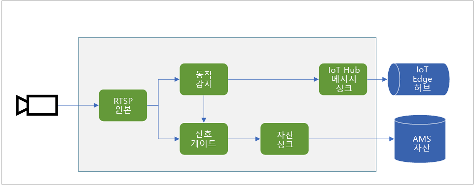
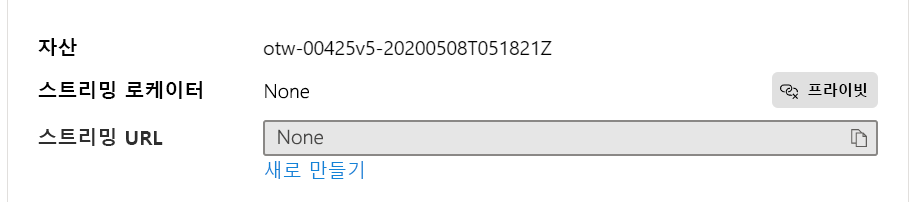

# <a name="quickstart-detect-motion-record-video-to-media-services"></a>빠른 시작: 동작을 감지하고 Media Services에 비디오 녹화

이 문서에서는 Live Video Analytics on IoT Edge를 [이벤트 기반 기록](event-based-video-recording-concept.md)에 사용하는 단계를 안내합니다. Azure의 Linux VM이 IoT Edge 디바이스이자 시뮬레이션된 라이브 비디오 스트림으로 사용됩니다. 이 비디오 스트림을 분석하여 움직이는 물체가 있는지 확인합니다. 동작이 감지되면 Azure IoT Hub에 이벤트를 보내고, 비디오 스트림의 관련 부분이 Azure Media Services에 자산으로 기록됩니다.

이 문서는 [빠른 시작: 시작](get-started-detect-motion-emit-events-quickstart.md)을 기반으로 합니다.

## <a name="prerequisites"></a>필수 구성 요소

* 활성 구독이 있는 Azure 계정. [체험 계정을 만듭니다](https://azure.microsoft.com/free/?WT.mc_id=A261C142F).
* 머신에 설치된 [Visual Studio Code](https://code.visualstudio.com/) 및 [Azure IoT Tools 확장](https://marketplace.visualstudio.com/items?itemName=vsciot-vscode.azure-iot-tools)
* 이전에 [빠른 시작: 시작](get-started-detect-motion-emit-events-quickstart.md)을 완료하지 않은 경우 다음 단계를 수행합니다.
    * [Azure 리소스 설정](get-started-detect-motion-emit-events-quickstart.md#set-up-azure-resources)
    * [모듈 배포](get-started-detect-motion-emit-events-quickstart.md#deploy-modules-on-your-edge-device)
    * [Visual Studio Code 구성](get-started-detect-motion-emit-events-quickstart.md#configure-the-azure-iot-tools-extension)

## <a name="review-the-sample-video"></a>샘플 비디오 검토

위의 단계에 따라 Azure 리소스를 설정하면 주차장에 대한 (짧은) 비디오가 IoT Edge 디바이스로 사용되는 Azure의 Linux VM에 복사됩니다. 이 비디오 파일은 이 자습서의 라이브 스트림을 시뮬레이션하는 데 사용됩니다.

[VLC Player](https://www.videolan.org/vlc/)와 같은 애플리케이션을 사용하여 시작하고, `Ctrl+N`을 누르고, [주차장 비디오 샘플](https://lvamedia.blob.core.windows.net/public/lots_015.mkv) 링크를 붙여넣어 재생을 시작할 수 있습니다. 5초 마크 정도에 흰색 차가 주차장을 통과합니다.

아래 단계를 완료하면 Live Video Analytics on IoT Edge를 사용하여 자동차의 동작을 감지하고 5초 마크 정도에 시작되는 비디오 클립을 녹화할 수 있습니다. 아래 다이어그램은 전체 흐름의 시각적 표현입니다.



## <a name="use-direct-method-calls"></a>직접 메서드 호출 사용

이 모듈을 통해 직접 메서드를 호출하여 라이브 비디오 스트림을 분석할 수 있습니다. 모듈에서 제공하는 모든 직접 메서드를 이해하려면 [Live Video Analytics on IoT Edge의 직접 메서드](direct-methods.md)를 읽어 보세요. 

### <a name="invoke-graphtopologylist"></a>GraphTopologyList 호출
이 단계를 수행하면 모듈에 모든 [그래프 토폴로지](media-graph-concept.md#media-graph-topologies-and-instances)가 열거됩니다.

1. "lvaEdge" 모듈을 마우스 오른쪽 단추로 클릭하고 바로 가기 메뉴에서 "모듈 직접 메서드 호출"을 선택합니다.
1. Visual Studio Code 창의 상단 가운데에 편집 상자 팝업 창이 표시됩니다. 편집 상자에 "GraphTopologyList"를 입력하고 Enter 키를 누릅니다.
1. 그런 다음, 편집 상자에 아래 JSON 페이로드를 복사하여 붙여넣고 Enter 키를 누릅니다.
    
```
{
    "@apiVersion" : "1.0"
}
```

몇 초 이내에 Visual Studio Code 팝업 창의 출력 창에 다음 응답이 표시됩니다.
    
```
[DirectMethod] Invoking Direct Method [GraphTopologyList] to [lva-sample-device/lvaEdge] ...
[DirectMethod] Response from [lva-sample-device/lvaEdge]:
{
  "status": 200,
  "payload": {
    "value": []
  }
}
```
    
생성된 그래프 토폴로지가 없으므로 위의 응답은 올바른 것입니다.

### <a name="invoke-graphtopologyset"></a>GraphTopologySet 호출

GraphTopologyList 호출에서 설명한 것과 동일한 단계를 따라 다음 JSON을 페이로드로 사용하여 GraphTopologySet를 호출하면 [그래프 토폴로지](media-graph-concept.md#media-graph-topologies-and-instances)를 설정할 수 있습니다. "EVRtoAssetsOnMotionDetection"이라는 그래프 토폴로지를 만듭니다.

```
{
    "@apiVersion": "1.0",
    "name": "EVRtoAssetsOnMotionDetection",
    "properties": {
      "description": "Event-based video recording to Assets based on motion events",
      "parameters": [
        {
            "name": "rtspUserName",
            "type": "String",
            "description": "rtsp source user name.",
            "default": "dummyUserName"
        },
        {
            "name": "rtspPassword",
            "type": "String",
            "description": "rtsp source password.",
            "default" : "dummyPassword"
        },
        {
            "name": "rtspUrl",
            "type": "String",
            "description": "rtsp Url"
        },
        {
            "name": "motionSensitivity",
            "type": "String",
            "description": "motion detection sensitivity",
            "default" : "medium"
        },
        {
            "name": "hubSinkOutputName",
            "type": "String",
            "description": "hub sink output name",
            "default" : "iothubsinkoutput"
        }                              
    ],         

      "sources": [
        {
          "@type": "#Microsoft.Media.MediaGraphRtspSource",
          "name": "rtspSource",
          "endpoint": {
            "@type": "#Microsoft.Media.MediaGraphUnsecuredEndpoint",
            "url": "${rtspUrl}",
            "credentials": {
              "@type": "#Microsoft.Media.MediaGraphUsernamePasswordCredentials",
              "username": "${rtspUserName}",
              "password": "${rtspPassword}"
            }
          }
        }
      ],
      "processors": [
        {
          "@type": "#Microsoft.Media.MediaGraphMotionDetectionProcessor",
          "name": "motionDetection",
          "sensitivity": "${motionSensitivity}",
          "inputs": [
            {
              "nodeName": "rtspSource"
            }
          ]
        },
        {
          "@type": "#Microsoft.Media.MediaGraphSignalGateProcessor",
          "name": "signalGateProcessor",
          "inputs": [
            {
              "nodeName": "motionDetection"
            },
            {
              "nodeName": "rtspSource"
            }
          ],
          "activationEvaluationWindow": "PT1S",
          "activationSignalOffset": "PT0S",
          "minimumActivationTime": "PT30S",
          "maximumActivationTime": "PT30S"
        }
      ],
      "sinks": [
        {
          "@type": "#Microsoft.Media.MediaGraphAssetSink",
          "name": "assetSink",
          "assetNamePattern": "sampleAssetFromEVR-LVAEdge-${System.DateTime}",
          "segmentLength": "PT0M30S",
          "localMediaCacheMaximumSizeMiB": "2048",
          "localMediaCachePath": "/var/lib/azuremediaservices/tmp/",
          "inputs": [
            {
              "nodeName": "signalGateProcessor"
            }
          ]
        },
        {
          "@type": "#Microsoft.Media.MediaGraphIoTHubMessageSink",
          "name": "hubSink",
          "hubOutputName": "${hubSinkOutputName}",
          "inputs": [
            {
              "nodeName": "motionDetection"
            }
          ]
        }
      ]
    }
}
```

위의 JSON 페이로드는 5개의 매개 변수(그 중 4개는 기본값)를 정의하는 그래프 토폴로지를 생성합니다. 토폴로지에는 원본 노드([RTSP 원본](media-graph-concept.md#rtsp-source)) 1개, 프로세서 노드 2개([동작 감지 프로세서](media-graph-concept.md#motion-detection-processor) 및 [신호 게이트 프로세서](media-graph-concept.md#signal-gate-processor)), 싱크 노드 2개(IoT Hub 싱크 및 [자산 싱크](media-graph-concept.md#asset-sink))가 있습니다. 토폴로지의 시각적 표현은 위에 나와 있습니다.

몇 초 이내에 출력 창에 다음 응답이 표시됩니다.

```
[DirectMethod] Invoking Direct Method [GraphTopologySet] to [lva-sample-device/lvaEdge] ...
[DirectMethod] Response from [lva-sample-device/lvaEdge]:
{
  "status": 201,
  "payload": {
    "systemData": {
      "createdAt": "2020-05-12T22:05:31.603Z",
      "lastModifiedAt": "2020-05-12T22:05:31.603Z"
    },
    "name": "EVRtoAssetsOnMotionDetection",
    "properties": {
      "description": "Event-based video recording to assets based on motion events",
      "parameters": [
        {
          "name": "rtspUserName",
          "type": "String",
          "description": "rtsp source user name.",
          "default": "dummyUserName"
        },
        {
          "name": "rtspPassword",
          "type": "String",
          "description": "rtsp source password.",
          "default": "dummyPassword"
        },
        {
          "name": "rtspUrl",
          "type": "String",
          "description": "rtsp Url"
        },
        {
          "name": "motionSensitivity",
          "type": "String",
          "description": "motion detection sensitivity",
          "default": "medium"
        },
        {
          "name": "hubSinkOutputName",
          "type": "String",
          "description": "hub sink output name",
          "default": "iothubsinkoutput"
        }
      ],
      "sources": [
        {
          "@type": "#Microsoft.Media.MediaGraphRtspSource",
          "name": "rtspSource",
          "transport": "Tcp",
          "endpoint": {
            "@type": "#Microsoft.Media.MediaGraphUnsecuredEndpoint",
            "url": "${rtspUrl}",
            "credentials": {
              "@type": "#Microsoft.Media.MediaGraphUsernamePasswordCredentials",
              "username": "${rtspUserName}",
              "password": "${rtspPassword}"
            }
          }
        }
      ],
      "processors": [
        {
          "@type": "#Microsoft.Media.MediaGraphMotionDetectionProcessor",
          "sensitivity": "${motionSensitivity}",
          "name": "motionDetection",
          "inputs": [
            {
              "nodeName": "rtspSource",
              "outputSelectors": []
            }
          ]
        },
        {
          "@type": "#Microsoft.Media.MediaGraphSignalGateProcessor",
          "activationEvaluationWindow": "PT1S",
          "activationSignalOffset": "PT0S",
          "minimumActivationTime": "PT30S",
          "maximumActivationTime": "PT30S",
          "name": "signalGateProcessor",
          "inputs": [
            {
              "nodeName": "motionDetection",
              "outputSelectors": []
            },
            {
              "nodeName": "rtspSource",
              "outputSelectors": []
            }
          ]
        }
      ],
      "sinks": [
        {
          "@type": "#Microsoft.Media.MediaGraphAssetSink",
          "localMediaCachePath": "/var/lib/azuremediaservices/tmp/",
          "localMediaCacheMaximumSizeMiB": "2048",
          "segmentLength": "PT0M30S",
          "assetNamePattern": "sampleAssetFromEVR-LVAEdge-${System.DateTime}",
          "name": "assetSink",
          "inputs": [
            {
              "nodeName": "signalGateProcessor",
              "outputSelectors": []
            }
          ]
        },
        {
          "@type": "#Microsoft.Media.MediaGraphIoTHubMessageSink",
          "hubOutputName": "${hubSinkOutputName}",
          "name": "hubSink",
          "inputs": [
            {
              "nodeName": "motionDetection",
              "outputSelectors": []
            }
          ]
        }
      ]
    }
  }
}
```

새 그래프 토폴로지가 생성되었음을 나타내는 상태 코드 201이 반환됩니다. 다음 단계로 아래의 직접 메서드를 사용해 보세요.

* GraphTopologySet를 다시 호출하고 상태 코드 200이 반환되는지 확인합니다. 상태 코드 200은 기존 그래프 토폴로지가 성공적으로 업데이트되었음을 나타냅니다.
* 설명 문자열을 변경하여 GraphTopologySet를 다시 호출합니다. 응답의 상태 코드가 200이고 설명이 새 값으로 업데이트되었는지 확인합니다.
* 이전 섹션에서 설명한 대로 GraphTopologyList를 호출하고, 반환된 페이로드에 "EVRtoAssetsOnMotionDetection" 그래프 토폴로지가 보이는지 확인합니다.

### <a name="invoke-graphtopologyget"></a>GraphTopologyGet 호출

이제 다음 페이로드를 사용하여 GraphTopologyGet을 호출합니다.
```

{
    "@apiVersion" : "1.0",
    "name" : "EVRtoAssetsOnMotionDetection"
}
```

몇 초 이내에 출력 창에 다음 응답이 표시됩니다.

```
[DirectMethod] Invoking Direct Method [GraphTopologyGet] to [lva-sample-device/lvaEdge] ...
[DirectMethod] Response from [lva-sample-device/lvaEdge]:
{
  "status": 200,
  "payload": {
    "systemData": {
      "createdAt": "2020-05-12T22:05:31.603Z",
      "lastModifiedAt": "2020-05-12T22:05:31.603Z"
    },
    "name": "EVRtoAssetsOnMotionDetection",
    "properties": {
      "description": "Event-based video recording to Assets based on motion events",
      "parameters": [
        {
          "name": "rtspUserName",
          "type": "String",
          "description": "rtsp source user name.",
          "default": "dummyUserName"
        },
        {
          "name": "rtspPassword",
          "type": "String",
          "description": "rtsp source password.",
          "default": "dummyPassword"
        },
        {
          "name": "rtspUrl",
          "type": "String",
          "description": "rtsp Url"
        },
        {
          "name": "motionSensitivity",
          "type": "String",
          "description": "motion detection sensitivity",
          "default": "medium"
        },
        {
          "name": "hubSinkOutputName",
          "type": "String",
          "description": "hub sink output name",
          "default": "iothubsinkoutput"
        }
      ],
      "sources": [
        {
          "@type": "#Microsoft.Media.MediaGraphRtspSource",
          "name": "rtspSource",
          "transport": "Tcp",
          "endpoint": {
            "@type": "#Microsoft.Media.MediaGraphUnsecuredEndpoint",
            "url": "${rtspUrl}",
            "credentials": {
              "@type": "#Microsoft.Media.MediaGraphUsernamePasswordCredentials",
              "username": "${rtspUserName}",
              "password": "${rtspPassword}"
            }
          }
        }
      ],
      "processors": [
        {
          "@type": "#Microsoft.Media.MediaGraphMotionDetectionProcessor",
          "sensitivity": "${motionSensitivity}",
          "name": "motionDetection",
          "inputs": [
            {
              "nodeName": "rtspSource",
              "outputSelectors": []
            }
          ]
        },
        {
          "@type": "#Microsoft.Media.MediaGraphSignalGateProcessor",
          "activationEvaluationWindow": "PT1S",
          "activationSignalOffset": "PT0S",
          "minimumActivationTime": "PT30S",
          "maximumActivationTime": "PT30S",
          "name": "signalGateProcessor",
          "inputs": [
            {
              "nodeName": "motionDetection",
              "outputSelectors": []
            },
            {
              "nodeName": "rtspSource",
              "outputSelectors": []
            }
          ]
        }
      ],
      "sinks": [
        {
          "@type": "#Microsoft.Media.MediaGraphAssetSink",
          "localMediaCachePath": "/var/lib/azuremediaservices/tmp/",
          "localMediaCacheMaximumSizeMiB": "2048",
          "segmentLength": "PT0M30S",
          "assetNamePattern": "sampleAssetFromEVR-LVAEdge-${System.DateTime}",
          "name": "assetSink",
          "inputs": [
            {
              "nodeName": "signalGateProcessor",
              "outputSelectors": []
            }
          ]
        },
        {
          "@type": "#Microsoft.Media.MediaGraphIoTHubMessageSink",
          "hubOutputName": "${hubSinkOutputName}",
          "name": "hubSink",
          "inputs": [
            {
              "nodeName": "motionDetection",
              "outputSelectors": []
            }
          ]
        }
      ]
    }
  }
}
```

응답 페이로드에서 다음 속성을 확인합니다.

* 상태 코드가 성공을 나타내는 200입니다.
* 페이로드에 "created" 및 "lastModified" 타임스탬프가 있습니다.

### <a name="invoke-graphinstanceset"></a>GraphInstanceSet 호출

다음으로, 위의 그래프 토폴로지를 참조하는 그래프 인스턴스를 만듭니다. [여기](media-graph-concept.md#media-graph-topologies-and-instances)에 설명된 대로, 그래프 인스턴스를 사용하면 동일한 그래프 토폴로지를 사용하는 여러 카메라의 라이브 비디오 스트림을 분석할 수 있습니다.

이제 다음 페이로드를 사용하여 GraphInstanceSet 직접 메서드를 호출합니다.

```
{
    "@apiVersion" : "1.0",
    "name" : "Sample-Graph-2",
    "properties" : {
        "topologyName" : "EVRtoAssetsOnMotionDetection",
        "description" : "Sample graph description",
        "parameters" : [
            { "name" : "rtspUrl", "value" : "rtsp://rtspsim:554/media/lots_015.mkv" }
        ]
    }
}
```

다음 사항에 유의하세요.

* 위의 페이로드는 그래프 인스턴스를 만들어야 하는 그래프 토폴로지 이름(EVRtoAssetsOnMotionDetection)을 지정합니다.
* 페이로드에는 토폴로지 페이로드에 기본값이 없는 "rtspUrl"의 매개 변수 값이 포함되어 있습니다.

몇 초 이내에 출력 창에 다음 응답이 표시됩니다.

```
[DirectMethod] Invoking Direct Method [GraphInstanceSet] to [lva-sample-device/lvaEdge] ...
[DirectMethod] Response from [lva-sample-device/lvaEdge]:
{
  "status": 201,
  "payload": {
    "systemData": {
      "createdAt": "2020-05-12T23:30:20.666Z",
      "lastModifiedAt": "2020-05-12T23:30:20.666Z"
    },
    "name": "Sample-Graph-2",
    "properties": {
      "state": "Inactive",
      "description": "Sample graph description",
      "topologyName": "EVRtoAssetsOnMotionDetection",
      "parameters": [
        {
          "name": "rtspUrl",
          "value": "rtsp://rtspsim:554/media/lots_015.mkv"
        }
      ]
    }
  }
}
```

응답 페이로드에서 다음 속성을 확인합니다.

* 상태 코드가 201이며, 이는 새 인스턴스가 생성되었음을 나타냅니다.
* 상태가 "비활성"이며, 이는 그래프 인스턴스가 생성되었지만 활성화되지 않았음을 나타냅니다. 자세한 내용은 [미디어 그래프 상태](media-graph-concept.md)를 참조하세요.

다음 단계로 아래의 직접 메서드를 사용해 보세요.

* 동일한 페이로드를 사용하여 GraphInstanceSet를 다시 호출하고 반환된 상태 코드가 200인지 확인합니다.
* 다른 설명을 사용하여 GraphInstanceSet를 다시 호출하고 응답 페이로드에 그래프 인스턴스가 성공적으로 업데이트되었음을 나타내는 업데이트된 설명이 있는지 확인합니다.
* 이름을 "Sample-Graph-3"으로 변경하여 GraphInstanceSet를 호출하고 응답 페이로드를 확인합니다. 새 그래프 인스턴스가 생성됩니다. 즉, 상태 코드는 201입니다. 빠른 시작을 마친 후에는 이러한 중복 인스턴스를 정리해야 합니다.

### <a name="prepare-for-monitoring-events"></a>이벤트 모니터링 준비

앞에서 만든 미디어 그래프는 동작 감지 프로세서 노드를 사용하여 동작을 감지하며, 이러한 이벤트는 IoT Hub로 릴레이됩니다. 이러한 이벤트 관찰을 준비하려면 다음 단계를 수행합니다.

1. Visual Studio Code에서 탐색기 창을 열고 왼쪽 하단 모서리에서 Azure IoT Hub를 찾습니다.
1. 디바이스 노드를 확장합니다.
1. lva-sample-device를 마우스 오른쪽 단추로 클릭하고 "기본 제공 이벤트 모니터링 시작" 옵션을 선택합니다.

    
    
    몇 초 이내에 출력 창에 다음 메시지가 표시됩니다.

```
[IoTHubMonitor] Start monitoring message arrived in built-in endpoint for all devices ...
[IoTHubMonitor] Created partition receiver [0] for consumerGroup [$Default]
[IoTHubMonitor] Created partition receiver [1] for consumerGroup [$Default]
[IoTHubMonitor] Created partition receiver [2] for consumerGroup [$Default]
[IoTHubMonitor] Created partition receiver [3] for consumerGroup [$Default]
```

### <a name="invoke-graphinstanceactivate"></a>GraphInstanceActivate 호출

이제 그래프 인스턴스를 활성화합니다. 그러면 모듈을 통해 라이브 비디오 흐름이 시작됩니다. 다음 페이로드를 사용하여 직접 메서드 GraphInstanceActivate를 호출합니다.

```
{
    "@apiVersion" : "1.0",
    "name" : "Sample-Graph-2"
}
```

몇 초 이내에 출력 창에 다음 응답이 표시됩니다.

```
[DirectMethod] Invoking Direct Method [GraphInstanceActivate] to [lva-sample-device/lvaEdge] ...
[DirectMethod] Response from [lva-sample-device/lvaEdge]:
{
  "status": 200,
  "payload": null
}
```

응답 페이로드에서 상태 코드 200은 그래프 인스턴스가 성공적으로 활성화되었음을 나타냅니다.

### <a name="invoke-graphinstanceget"></a>GraphInstanceGet 호출

이제 다음 페이로드를 사용하여 GraphInstanceGet 직접 메서드를 호출합니다.

```
{
    "@apiVersion" : "1.0",
    "name" : "Sample-Graph-2"
}
```

몇 초 이내에 출력 창에 다음 응답이 표시됩니다.

```
[DirectMethod] Invoking Direct Method [GraphInstanceGet] to [lva-sample-device/lvaEdge] ...
[DirectMethod] Response from [lva-sample-device/lvaEdge]:
{
  "status": 200,
  "payload": {
    "systemData": {
      "createdAt": "2020-05-12T23:30:20.666Z",
      "lastModifiedAt": "2020-05-12T23:30:20.666Z"
    },
    "name": "Sample-Graph-2",
    "properties": {
      "state": "Active",
      "description": "Sample graph description",
      "topologyName": "EVRtoAssetsOnMotionDetection",
      "parameters": [
        {
          "name": "rtspUrl",
          "value": "rtsp://rtspsim:554/media/lots_015.mkv"
        }
      ]
    }
  }
}
```

응답 페이로드에서 다음 속성을 확인합니다.

* 상태 코드가 성공을 나타내는 200입니다.
* 상태가 "활성"이며, 이는 그래프 인스턴스가 현재 "활성" 상태임을 나타냅니다.

## <a name="observe-results"></a>결과 확인

위에서 만들고 활성화한 그래프 인스턴스는 동작 감지 프로세서 노드를 사용하여 들어오는 라이브 비디오 스트림에서 동작을 감지하고 IoT Hub 싱크로 이벤트를 보냅니다. 그런 다음, 이러한 이벤트가 IoT Hub로 릴레이되면 확인할 수 있습니다. 출력 창에 다음 메시지가 표시됩니다.

```
[IoTHubMonitor] [4:33:04 PM] Message received from [lva-sample-device/lvaEdge]:
{
  "body": {
    "sdp": "SDP:\nv=0\r\no=- 1589326384077235 1 IN IP4 XXX.XX.XX.XXX\r\ns=Matroska video+audio+(optional)subtitles, streamed by the LIVE555 Media Server\r\ni=media/lots_015.mkv\r\nt=0 0\r\na=tool:LIVE555 Streaming Media v2020.04.12\r\na=type:broadcast\r\na=control:*\r\na=range:npt=0-73.000\r\na=x-qt-text-nam:Matroska video+audio+(optional)subtitles, streamed by the LIVE555 Media Server\r\na=x-qt-text-inf:media/lots_015.mkv\r\nm=video 0 RTP/AVP 96\r\nc=IN IP4 0.0.0.0\r\nb=AS:500\r\na=rtpmap:96 H264/90000\r\na=fmtp:96 packetization-mode=1;profile-level-id=640028;sprop-parameter-sets=XXXXXXXXXXXXXXXXXXXXXXXXXXXXXXXXXXX\r\na=control:track1\r\n"
  },
  "applicationProperties": {
    "topic": "/subscriptions/{subscriptionId}/resourceGroups/{resourceGroupName}/providers/microsoft.media/mediaservices/{amsAccountName}",
    "subject": "/graphInstances/Sample-Graph-2/sources/rtspSource",
    "eventType": "Microsoft.Media.Graph.Diagnostics.MediaSessionEstablished",
    "eventTime": "2020-05-12T23:33:04.077Z",
    "dataVersion": "1.0"
  }
}
[IoTHubMonitor] [4:33:09 PM] Message received from [lva-sample-device/lvaEdge]:
{
  "body": {
    "timestamp": 143039375044290,
    "inferences": [
      {
        "type": "motion",
        "motion": {
          "box": {
            "l": 0.48954,
            "t": 0.140741,
            "w": 0.075,
            "h": 0.058824
          }
        }
      }
    ]
  },
  "applicationProperties": {
    "topic": "/subscriptions/{subscriptionId}/resourceGroups/{resourceGroupName}/providers/microsoft.media/mediaservices/{amsAccountName}",
    "subject": "/graphInstances/Sample-Graph-2/processors/md",
    "eventType": "Microsoft.Media.Graph.Analytics.Inference",
    "eventTime": "2020-05-12T23:33:09.381Z",
    "dataVersion": "1.0"
  }
}
```

위의 메시지에서 다음 속성을 확인합니다.

* 각 메시지에는 "body" 섹션과 "applicationProperties" 섹션이 포함되어 있습니다. 이러한 섹션이 나타내는 내용을 이해하려면 [IoT Hub 메시지 작성 및 읽기](../../iot-hub/iot-hub-devguide-messages-construct.md) 문서를 참조하세요.
* 첫 번째 메시지는 진단 이벤트 MediaSessionEstablished입니다. 즉, RTSP 원본 노드(주체)가 RTSP 시뮬레이터와 연결을 설정할 수 있었으며, (시뮬레이션된) 라이브 피드를 받기 시작했음을 나타냅니다.
* applicationProperties의 "subject"는 메시지가 생성된 그래프 토폴로지의 노드를 나타냅니다. 이 경우 메시지는 RTSP 원본 노드에서 온 것입니다.
* applicationProperties의 "eventType"은 진단 이벤트임을 나타냅니다.
* "eventTime"은 이벤트가 발생한 시간을 나타냅니다.
* "body"에는 진단 이벤트에 대한 데이터, 즉, [SDP](https://en.wikipedia.org/wiki/Session_Description_Protocol) 메시지가 포함됩니다.
* 두 번째 메시지는 Analytics 이벤트입니다. MediaSessionEstablished 메시지가 표시되고 약 5초 후에 전송된 것을 확인할 수 있습니다. 이 5초라는 시간은 비디오가 시작되는 시점과 자동차가 주차장을 통과하는 시점 사이의 지연 시간입니다.
* applicationProperties의 "subject"는 이 메시지를 생성한 그래프의 동작 감지 프로세서 노드를 참조합니다.
* 이벤트는 유추 이벤트이므로 본문에 "timestamp" 및 "inferences" 데이터가 포함됩니다.
* "inferences" 섹션은 "type"이 "motion"이며 "motion" 이벤트에 대한 추가 데이터가 있음을 나타냅니다.

표시되는 그 다음 메시지는 다음과 같습니다.

```
[IoTHubMonitor] [4:33:10 PM] Message received from [lva-sample-device/lvaEdge]:
{
  "body": {
    "outputType": "assetName",
    "outputLocation": "sampleAssetFromEVR-LVAEdge-20200512T233309Z"
  },
  "applicationProperties": {
    "topic": "/subscriptions/{subscriptionId}/resourceGroups/{resourceGroupName}/providers/microsoft.media/mediaservices/{amsAccountName}",
    "subject": "/graphInstances/Sample-Graph-2/sinks/assetSink",
    "eventType": "Microsoft.Media.Graph.Operational.RecordingStarted",
    "eventTime": "2020-05-12T23:33:10.392Z",
    "dataVersion": "1.0"
  }
}
```

* 세 번째 메시지는 작업 이벤트입니다. 동작 감지 메시지가 표시되는 것과 거의 동시에 전송되는 것을 확인할 수 있으며, 녹화를 시작하는 트리거 역할을 수행했습니다.
* applicationProperties의 "subject"는 이 메시지를 생성한 그래프의 자산 싱크 노드를 참조합니다.
* 본문에는 출력 위치에 대한 정보가 포함됩니다. 여기서는 비디오가 기록되는 Azure Media Service 자산의 이름입니다. 이 값을 적어 둡니다. 빠른 시작의 뒷부분에서 사용됩니다.

토폴로지에서 신호 게이트 프로세서 노드의 활성화 시간이 30초로 구성되었습니다. 즉, 그래프 토폴로지가 약 30초의 분량의 비디오를 자산에 기록합니다. 비디오가 기록되는 동안 동작 감지 프로세서 노드는 유추 이벤트를 계속 내보냅니다. 이 이벤트는 출력 창에 표시됩니다. 얼마 후 다음 메시지가 표시됩니다.

```
[IoTHubMonitor] [4:33:31 PM] Message received from [lva-sample-device/lvaEdge]:
{
  "body": {
    "outputType": "assetName",
    "outputLocation": "sampleAssetFromEVR-LVAEdge-20200512T233309Z"
  },
  "applicationProperties": {
    "topic": "/subscriptions/{subscriptionId}/resourceGroups/{resourceGroupName}/providers/microsoft.media/mediaservices/{amsAccountName}",
    "subject": "/graphInstances/Sample-Graph-2/sinks/assetSink",
    "eventType": "Microsoft.Media.Graph.Operational.RecordingAvailable",
    "eventTime": "2020-05-12T23:33:31.051Z",
    "dataVersion": "1.0"
  }
}
```

* 이 메시지 역시 작업 이벤트입니다. RecordingAvailable 이벤트는 플레이어/클라이언트가 비디오 재생을 시작하기에 충분한 데이터가 자산에 기록되었음을 나타냅니다.
* applicationProperties의 "subject"는 이 메시지를 생성한 그래프의 자산 싱크 노드를 참조합니다.
* 본문에는 출력 위치에 대한 정보가 포함됩니다. 여기서는 비디오가 기록되는 Azure Media Service 자산의 이름입니다.

그래프 인스턴스가 계속 실행되도록 두면 이 메시지가 표시됩니다.

```
[IoTHubMonitor] [4:33:40 PM] Message received from [lva-sample-device/lvaEdge]:
{
  "body": {
    "outputType": "assetName",
    "outputLocation": "sampleAssetFromEVR-LVAEdge-20200512T233309Z"
  },
  "applicationProperties": {
    "topic": "/subscriptions/{subscriptionId}/resourceGroups/{resourceGroupName}/providers/microsoft.media/mediaservices/{amsAccountName}",
    "subject": "/graphInstances/Sample-Graph-2/sinks/assetSink",
    "eventType": "Microsoft.Media.Graph.Operational.RecordingStopped",
    "eventTime": "2020-05-12T23:33:40.014Z",
    "dataVersion": "1.0"
  }
}
```

* 이 메시지 역시 작업 이벤트입니다. RecordingStopped 이벤트는 기록이 중지되었음을 나타냅니다.
* RecordingStarted 이벤트가 발생한 후 약 30초가 경과했으며, 30초는 신호 게이트 프로세서 노드의 활성화 시간 값과 일치하는 시간입니다.
* applicationProperties의 "subject"는 이 메시지를 생성한 그래프의 자산 싱크 노드를 참조합니다.
* 본문에는 출력 위치에 대한 정보가 포함됩니다. 여기서는 비디오가 기록되는 Azure Media Service 자산의 이름입니다.

그래프 인스턴스가 계속 실행되도록 두면 RTSP 시뮬레이터가 비디오 파일의 끝에 도달하여 중지/연결 해제됩니다. 그러면 RTSP 원본 노드가 시뮬레이터에 다시 연결하고, 프로세스가 반복됩니다.
    
## <a name="invoke-additional-direct-method-calls-to-clean-up"></a>추가 직접 메서드 호출을 호출하여 정리

이제 직접 메서드를 호출하여 그래프 인스턴스를 순서대로 비활성화하고 삭제합니다.

### <a name="invoke-graphinstancedeactivate"></a>GraphInstanceDeactivate 호출

다음 페이로드를 사용하여 직접 메서드 GraphInstanceDeactivate를 호출합니다.

```
{
    "@apiVersion" : "1.0",
    "name" : "Sample-Graph-2"
}
```

몇 초 이내에 출력 창에 다음 응답이 표시됩니다.

```
[DirectMethod] Invoking Direct Method [GraphInstanceDeactivate] to [lva-sample-device/lvaEdge] ...
[DirectMethod] Response from [lva-sample-device/lvaEdge]:
{
  "status": 200,
  "payload": null
}
```

상태 코드 200은 그래프 인스턴스가 성공적으로 비활성화되었음을 나타냅니다.

다음 단계에서는 다음을 시도해 보세요.

* 이전 섹션에서 설명한 것처럼 GraphInstanceGet을 호출하고 "state" 값을 관찰합니다.

### <a name="invoke-graphinstancedelete"></a>GraphInstanceDelete 호출

다음 페이로드를 사용하여 직접 메서드 GraphInstanceDelete를 호출합니다.

```
{
    "@apiVersion" : "1.0",
    "name" : "Sample-Graph-2"
}
```

몇 초 이내에 출력 창에 다음 응답이 표시됩니다.

```
[DirectMethod] Invoking Direct Method [GraphInstanceDelete] to [lva-sample-device/lvaEdge] ...
[DirectMethod] Response from [lva-sample-device/lvaEdge]:
{
  "status": 200,
  "payload": null
}
```

응답에서 상태 코드 200은 그래프 인스턴스가 성공적으로 삭제되었음을 나타냅니다.

### <a name="invoke-graphtopologydelete"></a>GraphTopologyDelete 호출

다음 페이로드를 사용하여 직접 메서드 GraphTopologyDelete를 호출합니다.

```
{
    "@apiVersion" : "1.0",
    "name" : "EVRtoAssetsOnMotionDetection"
}
```

몇 초 이내에 출력 창에 다음 응답이 표시됩니다.

```
[DirectMethod] Invoking Direct Method [GraphTopologyDelete] to [lva-sample-device/lvaEdge] ...
[DirectMethod] Response from [lva-sample-device/lvaEdge]:
{
  "status": 200,
  "payload": null
}
```

상태 코드 200은 MediaGraph 토폴로지가 성공적으로 삭제되었음을 나타냅니다.

다음 단계로 아래의 직접 메서드를 사용해 보세요.

* GraphTopologyList를 호출하고 모듈에 그래프 토폴로지가 없음을 확인합니다.
* GraphTopologyList와 동일한 페이로드를 사용하여 GraphInstanceList를 호출하고 열거된 그래프 인스턴스가 없음을 확인합니다.

## <a name="playing-back-the-recorded-video"></a>녹화된 비디오 재생

다음으로, 녹화된 비디오를 Azure Portal에서 재생할 수 있습니다.

1. [Azure Portal](https://portal.azure.com/)에 로그인하고, 검색 상자에 "Media Services"를 입력합니다.
1. Azure Media Services 계정을 찾아 엽니다.
1. Media Services 목록에서 [자산] 항목을 찾아 선택합니다.

    ![Media Services 목록의 [자산] 항목](./media/quickstarts/asset-entity.png)
1. 이 빠른 시작에서 Azure Media Services를 처음 사용하는 경우에는 이 빠른 시작에서 생성된 자산만 나열되며 가장 오래된 자산을 선택하면 됩니다.
1. 또는 위의 작업 이벤트에서 outputLocation으로 제공된 자산 이름을 사용합니다.
1. 열리는 세부 정보 페이지에서 스트리밍 URL 텍스트 상자 바로 아래에 있는 "새로 만들기" 링크를 클릭합니다.

    
1. "스트리밍 로케이터 추가"에 대해 열리는 창에서 기본값을 수락하고 맨 아래에 있는 "추가"를 누릅니다.
1. [자산] 세부 정보 페이지에서 비디오 플레이어가 비디오의 첫 번째 프레임에 로드되고, 재생 단추를 누를 수 있습니다. 비디오에서 자동차가 주차장 내부를 이동하는 장면이 담긴 부분이 있는지 확인합니다.

    

> [!NOTE]
> 시뮬레이션된 라이브 비디오는 그래프를 활성화할 때 시작되므로, 하루 중 시간 값은 관련이 없으며 이 플레이어 바로 가기를 통해 노출되지 않습니다. 연속 비디오 녹화 및 재생에 대한 자습서에서는 타임스탬프를 표시할 수 있는 방법을 보여줍니다.

## <a name="clean-up-resources"></a>리소스 정리

이 애플리케이션을 계속 사용할 계획이 없으면 이 빠른 시작에서 생성된 리소스를 삭제합니다.

## <a name="next-steps"></a>다음 단계

* Live Video Analytics on IoT Edge [직접 메서드](direct-methods.md)를 프로그래밍 방식으로 호출하는 방법에 대해 알아보세요.
* 진단 메시지에 대해 자세히 알아보세요.    
