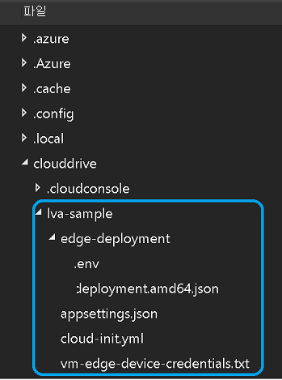

# <a name="tutorial-event-based-video-recording-to-the-cloud-and-playback-from-the-cloud"></a>자습서: 클라우드에 이벤트 기반 비디오 녹화 및 클라우드에서 재생

이 자습서에서는 Azure Live Video Analytics on Azure IoT Edge를 사용하여 라이브 비디오 원본의 일부를 클라우드의 Azure Media Services에 선택적으로 녹화하는 방법에 대해 알아봅니다. 이 사용 사례는 이 자습서에서 [EVR(이벤트 기반 비디오 녹화)](event-based-video-recording-concept.md)이라고 합니다. 라이브 비디오의 일부를 녹화하려면 개체 감지 AI 모델을 사용하여 비디오의 개체를 찾고, 특정 형식의 개체가 감지되는 경우에만 비디오 클립을 녹화합니다. Media Services를 사용하여 녹화된 비디오 클립을 재생하는 방법도 알아봅니다. 이 기능은 관심 있는 비디오 클립을 보관해야 하는 다양한 시나리오에 유용합니다. 

이 자습서에서는 다음을 수행합니다.

> [!div class="checklist"]
> * 관련 리소스 설치
> * EVR을 수행하는 코드 검사
> * 샘플 코드 실행
> * 결과 검사 및 비디오 보기

[!INCLUDE [quickstarts-free-trial-note](../../../includes/quickstarts-free-trial-note.md)]

## <a name="suggested-pre-reading"></a>추천 참고 자료  

시작하기 전에 다음 문서를 참조하세요.

* [Live Video Analytics on IoT Edge 개요](overview.md)
* [Live Video Analytics on IoT Edge 용어](terminology.md)
* [미디어 그래프 개념](media-graph-concept.md) 
* [이벤트 기반 비디오 녹화](event-based-video-recording-concept.md)
* [자습서: IoT Edge 모듈 개발](https://docs.microsoft.com/azure/iot-edge/tutorial-develop-for-linux)
* [deployment.*.template.json을 편집하는 방법](https://github.com/microsoft/vscode-azure-iot-edge/wiki/How-to-edit-deployment.*.template.json)
* [IoT Edge 배포 매니페스트에서 경로를 선언하는 방법](https://docs.microsoft.com/azure/iot-edge/module-composition#declare-routes)에 대한 섹션

## <a name="prerequisites"></a>필수 구성 요소

이 자습서의 필수 구성 요소는 다음과 같습니다.

* 개발 컴퓨터의 [Visual Studio Code](https://code.visualstudio.com/)([Azure IoT Tools](https://marketplace.visualstudio.com/items?itemName=vsciot-vscode.azure-iot-tools) 및 [C#](https://marketplace.visualstudio.com/items?itemName=ms-dotnettools.csharp) 확장 포함)

    > [!TIP]
    > Docker를 설치하라는 메시지가 표시될 수 있습니다. 이 메시지는 무시하세요.
* 개발 머신에 설치된 [.NET Core 3.1 SDK](https://dotnet.microsoft.com/download/dotnet-core/thank-you/sdk-3.1.201-windows-x64-installer)
* [Live Video Analytics 리소스 설치 스크립트](https://github.com/Azure/live-video-analytics/tree/master/edge/setup) 및 [환경 설정](https://review.docs.microsoft.com/en-us/azure/media-services/live-video-analytics-edge/detect-motion-emit-events-quickstart?branch=release-preview-media-services-lva#set-up-the-environment) 완료

이러한 단계가 완료되면 다음과 같은 관련 Azure 리소스가 Azure 구독에 배포됩니다.

* Azure IoT Hub
* Azure Storage 계정
* Azure Media Services 계정
* [IoT Edge 런타임](https://docs.microsoft.com/azure/iot-edge/how-to-install-iot-edge-linux)이 설치된 Azure의 Linux VM

## <a name="concepts"></a>개념

이벤트 기반 비디오 녹화는 이벤트에서 트리거되는 비디오 녹화 프로세스를 나타냅니다. 이 이벤트는 다음에서 생성될 수 있습니다.
- 비디오 신호 자체의 처리(예: 비디오에서 움직이는 개체를 감지하는 경우)
- 독립적인 원본(예: 문 열기) 

또는 특정 이벤트가 발생한 것을 추론 서비스에서 감지하는 경우에만 녹화를 트리거할 수도 있습니다. 이 자습서에서는 고속도로에서 이동하는 차량의 비디오를 사용하고, 트럭이 감지될 때마다 비디오 클립을 녹화합니다.


이 다이어그램은 [미디어 그래프](media-graph-concept.md) 및 원하는 시나리오를 수행하는 추가 모듈을 그림으로 표현한 것입니다. 다음 4개의 IoT Edge 모듈이 포함되어 있습니다.

* Live Video Analytics on IoT Edge 모듈
* HTTP 엔드포인트 내부에서 AI 모델을 실행하는 에지 모듈. 이 AI 모듈은 다양한 형식의 개체를 감지할 수 있는 [YOLO v3](https://github.com/Azure/live-video-analytics/tree/master/utilities/video-analysis/yolov3-onnx) 모델을 사용합니다.
* 개체를 계산하고 필터링하는 사용자 지정 모듈(다이어그램에서는 개체 카운터라고 함). 이 자습서에서는 개체 카운터를 빌드하고 배포합니다.
* RTSP 카메라를 시뮬레이션하는 [RTSP 시뮬레이터 모듈](https://github.com/Azure/live-video-analytics/tree/master/utilities/rtspsim-live555)
    
다이어그램에서 볼 수 있듯이 미디어 그래프에서 [RTSP 원본](media-graph-concept.md#rtsp-source) 노드를 사용하여 고속도로에서 시뮬레이션된 라이브 교통 비디오를 캡처하고 해당 비디오를 두 개의 경로로 보냅니다.

* 첫 번째 경로는 지정된(축소된) 프레임 속도로 비디오 프레임을 출력하는 [프레임 속도 필터 프로세서](media-graph-concept.md#frame-rate-filter-processor) 노드의 경로입니다. 이러한 비디오 프레임은 HTTP 확장 노드로 보내집니다. 그런 다음, 노드에서 프레임을 이미지로 개체 감지기인 YOLO v3 AI 모듈에 릴레이합니다. 노드는 모델에서 감지된 개체(교통 차량)인 결과를 받습니다. 그런 다음, HTTP 확장 노드에서 IoT Hub 메시지 싱크 노드를 통해 결과를 IoT Edge 허브에 게시합니다.
* objectCounter 모듈이 IoT Edge 허브에서 메시지를 받도록 설정되며, 여기에는 개체 감지 결과(교통 차량)가 포함됩니다. 모듈은 이러한 메시지를 확인하고 설정을 통해 구성된 특정 형식의 개체를 찾습니다. 이러한 개체가 있으면 이 모듈에서 메시지를 IoT Edge 허브에 보냅니다. 이러한 "개체 발견" 메시지는 미디어 그래프의 IoT Hub 원본 노드로 라우팅됩니다. 이러한 메시지를 받으면 미디어 그래프의 IoT Hub 원본 노드에서 [신호 게이트 프로세서](media-graph-concept.md#signal-gate-processor) 노드를 트리거합니다. 그러면 신호 게이트 프로세서 노드가 구성된 시간 동안 열립니다. 비디오는 이 시간 동안 게이트를 통과하여 자산 싱크 노드로 이동합니다. 그런 다음, 라이브 스트림의 해당 부분이 [자산 싱크](media-graph-concept.md#asset-sink) 노드를 통해 Azure Media Services 계정의 [자산](terminology.md#asset)에 기록됩니다.

## <a name="set-up-your-development-environment"></a>개발 환경 설정

시작하기 전에 [필수 구성 요소](#prerequisites)의 세 번째 항목을 완료했는지 확인합니다. 리소스 설치 스크립트가 완료되면 중괄호를 선택하여 폴더 구조를 표시합니다. ~/clouddrive/lva-sample 디렉터리 아래에 만들어진 몇 개의 파일을 볼 수 있습니다.



이 자습서에서 다루는 파일은 다음과 같습니다.

* **~/clouddrive/lva-sample/edge-deployment/.env**: Visual Studio Code에서 모듈을 에지 디바이스에 배포하는 데 사용하는 속성이 포함되어 있습니다.
* **~/clouddrive/lva-sample/appsetting.json**: Visual Studio Code에서 샘플 코드를 실행하는 데 사용합니다.

이러한 파일은 다음 단계를 수행하는 데 필요합니다.

1. GitHub 링크(https://github.com/Azure-Samples/live-video-analytics-iot-edge-csharp )의 리포지토리를 복제합니다.
1. Visual Studio Code를 시작하고, 리포지토리를 다운로드한 폴더를 엽니다.
1. Visual Studio Code에서 src/cloud-to-device-console-app 폴더로 이동하고, **appsettings.json**이라는 파일을 만듭니다. 이 파일에는 프로그램을 실행하는 데 필요한 설정이 포함되어 있습니다.
1. ~/clouddrive/lva-sample/appsettings.json 파일의 콘텐츠를 복사합니다. 텍스트는 다음과 같습니다.

    ```
    {  
        "IoThubConnectionString" : "HostName=xxx.azure-devices.net;SharedAccessKeyName=iothubowner;SharedAccessKey=XXX",  
        "deviceId" : "lva-sample-device",  
        "moduleId" : "lvaEdge"  
    }
    ```

    IoT Hub 연결 문자열을 사용하면 Visual Studio Code를 사용하여 Azure IoT Hub를 통해 명령을 에지 모듈에 보낼 수 있습니다.
    
1. 다음으로, src/edge 폴더로 이동하고, **.env**라는 파일을 만듭니다.
1. ~/clouddrive/lva-sample/.env 파일의 콘텐츠를 복사합니다. 텍스트는 다음과 같습니다.

    ```
    SUBSCRIPTION_ID="<Subscription ID>"  
    RESOURCE_GROUP="<Resource Group>"  
    AMS_ACCOUNT="<AMS Account ID>"  
    IOTHUB_CONNECTION_STRING="HostName=xxx.azure-devices.net;SharedAccessKeyName=iothubowner;SharedAccessKey=xxx"  
    AAD_TENANT_ID="<AAD Tenant ID>"  
    AAD_SERVICE_PRINCIPAL_ID="<AAD SERVICE_PRINCIPAL ID>"  
    AAD_SERVICE_PRINCIPAL_SECRET="<AAD SERVICE_PRINCIPAL ID>"  
    INPUT_VIDEO_FOLDER_ON_DEVICE="/home/lvaadmin/samples/input"  
    OUTPUT_VIDEO_FOLDER_ON_DEVICE="/home/lvaadmin/samples/output"  
    APPDATA_FOLDER_ON_DEVICE="/var/local/mediaservices"
    CONTAINER_REGISTRY_USERNAME_myacr="<your container registry username>"  
    CONTAINER_REGISTRY_PASSWORD_myacr="<your container registry username>"      
    ```

## <a name="examine-the-template-file"></a>템플릿 파일 검사 

이전 단계에서는 Visual Studio Code를 시작하고 샘플 코드가 포함된 폴더를 열었습니다.

Visual Studio Code에서 src/edge로 이동합니다. 만든 .env 파일 및 몇 가지 배포 템플릿 파일이 표시됩니다. 이 템플릿은 에지 디바이스(Azure Linux VM)에 배포할 에지 모듈을 정의합니다. .env 파일에는 Media Services 자격 증명과 같이 이러한 템플릿에 사용되는 변수에 대한 값이 포함되어 있습니다.

src/edge/deployment.objectCounter.template.json 파일을 엽니다. **모듈** 섹션 아래에는 위의 "개념" 섹션에서 나열한 항목에 해당하는 4개의 항목이 있습니다.

* **lvaEdge**: Live Video Analytics on IoT Edge 모듈
* **yolov3**: YOLO v3 모델을 사용하여 빌드된 AI 모듈
* **rtspsim**: RTSP 시뮬레이터
* **objectCounter**: yolov3의 결과에서 특정 개체를 찾는 모듈

objectCounter 모듈의 경우 "image" 값에 사용되는 (${MODULES.objectCounter}) 문자열을 확인합니다. 이는 IoT Edge 모듈을 개발하는 방법에 대한 [자습서](https://docs.microsoft.com/azure/iot-edge/tutorial-develop-for-linux)를 기반으로 합니다. Visual Studio Code에서 objectCounter 모듈의 코드가 src/edge/modules/objectCounter 아래에 있음을 자동으로 인식합니다. 

IoT Edge 배포 매니페스트에서 경로를 선언하는 방법은 [이 섹션](https://docs.microsoft.com/azure/iot-edge/module-composition#declare-routes)을 참조하세요. 그런 다음, 템플릿 JSON 파일의 경로를 검사합니다. 다음 사항을 확인합니다.

* LVAToObjectCounter를 사용하여 특정 이벤트를 objectCounter 모듈의 특정 엔드포인트로 보내는 방법
* ObjectCounterToLVA를 사용하여 트리거 이벤트를 lvaEdge 모듈의 특정 엔드포인트(IoT Hub 원본 노드여야 함)로 보내는 방법
* 이 자습서를 실행할 때 objectCounterToIoTHub를 디버그 도구로 사용하여 objectCounter의 출력을 보는 방법

> [!NOTE]
> "truck"이라는 태그가 지정되고 신뢰 수준이 50% 이상인 개체를 찾도록 설정된 objectCounter 모듈의 desired 속성을 확인하세요.

## <a name="generate-and-deploy-the-iot-edge-deployment-manifest"></a>IoT Edge 배포 매니페스트 생성 및 배포 

배포 매니페스트는 에지 디바이스에 배포되는 모듈 및 해당 모듈의 구성 설정을 정의합니다. 다음 단계에 따라 템플릿 파일에서 매니페스트를 생성한 다음, 에지 디바이스에 배포합니다.

Visual Studio Code를 사용하여 [이러한 지침](https://docs.microsoft.com/azure/iot-edge/tutorial-develop-for-linux#build-and-push-your-solution)에 따라 Docker에 로그인합니다. 그런 다음, **IoT Edge 솔루션 빌드 및 푸시**를 선택합니다. 이 단계에서는 src/edge/deployment.objectCounter.template.json을 사용합니다.


이 작업은 개체 수를 계산하는 objectCounter 모듈을 빌드하고 이미지를 Azure Container Registry로 푸시합니다.

* .env 파일에 CONTAINER_REGISTRY_USERNAME_myacr 및 CONTAINER_REGISTRY_PASSWORD_myacr 환경 변수가 정의되었는지 확인합니다.

이 단계에서는 IoT Edge 배포 매니페스트를 src/edge/config/deployment.objectCounter.amd64.json에 만듭니다. 마우스 오른쪽 단추로 해당 파일을 클릭하고 **단일 디바이스용 배포 만들기**를 선택합니다.


Live Video Analytics on IoT Edge와 관련된 첫 번째 자습서인 경우 Visual Studio Code에서 IoT Hub 연결 문자열을 입력하라는 메시지를 표시합니다. appsettings.json 파일에서 복사할 수 있습니다.

다음으로, Visual Studio Code에서 IoT Hub 디바이스를 선택하라는 메시지를 표시합니다. lva-sample-device라는 IoT Edge 디바이스를 선택합니다.

이 단계에서는 IoT Edge 디바이스에 에지 모듈을 배포하는 작업이 시작되었습니다.
약 30초 후에 Visual Studio Code의 왼쪽 아래 섹션에서 Azure IoT Hub를 새로 고칩니다. lvaEdge, rtspsim, yolov3 및 objectCounter라는 4개의 모듈이 배포되어 있음을 알 수 있습니다.


## <a name="prepare-for-monitoring-events"></a>이벤트 모니터링 준비

objectCounter 모듈 및 Live Video Analytics on IoT Edge 모듈의 이벤트를 확인하려면 다음 단계를 수행합니다.

1. Visual Studio Code에서 탐색기 창을 열고, 왼쪽 아래 모서리에서 **Azure IoT Hub**를 찾습니다.
1. **디바이스** 노드를 펼칩니다.
1. 마우스 오른쪽 단추로 lva-sample-device 파일을 클릭하고, **기본 제공 이벤트 엔드포인트 모니터링 시작**을 선택합니다.

   

## <a name="run-the-program"></a>프로그램 실행

1. Visual Studio Code에서 src/cloud-to-device-console-app/operations.json으로 이동합니다.

1. **GraphTopologySet** 노드 아래에서 다음을 편집합니다.

    `"topologyUrl" : "https://raw.githubusercontent.com/Azure/live-video-analytics/master/MediaGraph/topologies/evr-hubMessage-assets/topology.json"`
    
1. 다음으로, **GraphInstanceSet** 및 **GraphTopologyDelete** 노드 아래에서 다음을 편집합니다.

    `"topologyName" : "EVRtoAssetsOnObjDetect"`
1. F5 키를 선택하여 디버깅 세션을 시작합니다. **터미널** 창에 일부 메시지가 출력되어 표시됩니다.

1. operations.json 파일이 GraphTopologyList 및 GraphInstanceList를 호출하여 시작됩니다. 이전 빠른 시작 또는 자습서가 완료된 후에 리소스를 정리한 경우 이 작업에서 빈 목록을 반환하고, 다음과 같이 **Enter** 키를 선택할 수 있도록 일시 중지합니다.

    ```
    --------------------------------------------------------------------------
    Executing operation GraphTopologyList
    -----------------------  Request: GraphTopologyList  --------------------------------------------------
    {
      "@apiVersion": "1.0"
    }
    ---------------  Response: GraphTopologyList - Status: 200  ---------------
    {
      "value": []
    }
    --------------------------------------------------------------------------
    Executing operation WaitForInput
    Press Enter to continue
    ```

1. **터미널** 창에서 **Enter** 키가 선택되면 다음 직접 메서드 호출 세트가 수행됩니다.
   * 이전 topologyUrl을 사용하여 GraphTopologySet에 대한 호출
   * 다음 본문을 사용하여 GraphInstanceSet에 대한 호출
     
        ```
        {
          "@apiVersion": "1.0",
          "name": "Sample-Graph-1",
          "properties": {
            "topologyName": "EVRtoAssetsOnObjDetect",
            "description": "Sample graph description",
            "parameters": [
              {
                "name": "rtspUrl",
                "value": "rtsp://rtspsim:554/media/camera-300s.mkv"
              },
              {
                "name": "rtspUserName",
                "value": "testuser"
              },
              {
                "name": "rtspPassword",
                "value": "testpassword"
              }
            ]
          }
        }
        ```
    
   * 그래프 인스턴스를 시작하고 비디오 흐름을 시작하는 GraphInstanceActivate에 대한 호출
   * 그래프 인스턴스가 실행 중 상태임을 보여 주는 GraphInstanceList에 대한 두 번째 호출
     
1. 이제 **터미널** 창의 출력이 **계속하려면 Enter 키를 누르세요**라는 메시지에서 일시 중지됩니다. 지금은 **Enter** 키를 선택하지 마세요. 위로 스크롤하여 호출한 직접 메서드에 대한 JSON 응답 페이로드를 확인합니다.

1. 이제 Visual Studio Code에서 **출력** 창으로 전환하면 Live Video Analytics on IoT Edge 모듈에서 IoT Hub로 보내는 메시지가 표시됩니다.

   이러한 메시지에 대한 내용은 다음 섹션에서 다룹니다.
     
1. 그래프 인스턴스가 계속 실행되어 비디오를 녹화합니다. RTSP 시뮬레이터가 원본 비디오를 계속 반복합니다. 다음 섹션에서 설명하는 메시지를 검토합니다. 그런 다음, 인스턴스를 중지하려면 **터미널** 창으로 돌아가서 **Enter** 키를 선택합니다. 다음과 같은 일련의 호출을 수행하여 리소스를 정리합니다.

   * 그래프 인스턴스를 비활성화하는 GraphInstanceDeactivate에 대한 호출
   * 인스턴스를 삭제하는 GraphInstanceDelete에 대한 호출
   * 토폴로지를 삭제하는 GraphTopologyDelete에 대한 호출
   * 이제 목록이 비어 있음을 보여 주는 GraphTopologyList에 대한 최종 호출

## <a name="interpret-the-results"></a>결과 해석 

미디어 그래프를 실행하면 Live Video Analytics on IoT Edge 모듈에서 특정 진단 및 작업 이벤트를 IoT Edge 허브에 보냅니다. 이러한 이벤트는 Visual Studio Code의 **출력** 창에 표시되는 메시지입니다. 여기에는 body 섹션 및 applicationProperties 섹션이 포함되어 있습니다. 이러한 섹션이 나타내는 내용을 이해하려면 [IoT Hub 메시지 작성 및 읽기](https://docs.microsoft.com/azure/iot-hub/iot-hub-devguide-messages-construct)를 참조하세요.

다음 메시지에서 애플리케이션 속성 및 본문의 콘텐츠는 Live Video Analytics 모듈에서 정의됩니다.

## <a name="diagnostics-events"></a>진단 이벤트

### <a name="mediasessionestablished-event"></a>MediaSessionEstablished 이벤트 

미디어 그래프가 인스턴스화되면 RTSP 원본 노드는 RTSP 시뮬레이터 컨테이너에서 실행되는 RTSP 서버에 연결을 시도합니다. 성공하면 이 이벤트가 출력됩니다. 이벤트 유형은 Microsoft.Media.MediaGraph.Diagnostics.MediaSessionEstablished입니다.

```
[IoTHubMonitor] [5:53:17 PM] Message received from [lva-sample-device/lvaEdge]:
{
  "body": {
    "sdp": "SDP:\nv=0\r\no=- 1586450538111534 1 IN IP4 XXX.XX.XX.XX\r\ns=Matroska video+audio+(optional)subtitles, streamed by the LIVE555 Media Server\r\ni=media/camera-300s.mkv\r\nt=0 0\r\na=tool:LIVE555 Streaming Media v2020.03.06\r\na=type:broadcast\r\na=control:*\r\na=range:npt=0-300.000\r\na=x-qt-text-nam:Matroska video+audio+(optional)subtitles, streamed by the LIVE555 Media Server\r\na=x-qt-text-inf:media/camera-300s.mkv\r\nm=video 0 RTP/AVP 96\r\nc=IN IP4 0.0.0.0\r\nb=AS:500\r\na=rtpmap:96 H264/90000\r\na=fmtp:96 packetization-mode=1;profile-level-id=4D0029;sprop-parameter-sets=XXXXXXXXXXXXXXXXXXXXXX\r\na=control:track1\r\n"
  },
  "applicationProperties": {
    "topic": "/subscriptions/{subscriptionID}/resourceGroups/{resource-group-name}/providers/microsoft.media/mediaservices/{ams-account-name}",
    "subject": "/graphInstances/Sample-Graph-1/sources/rtspSource",
    "eventType": "Microsoft.Media.Graph.Diagnostics.MediaSessionEstablished",
    "eventTime": "2020-05-17T17:53:16.981Z",
    "dataVersion": "1.0"
  }
}
```


* 이 메시지는 진단 이벤트(MediaSessionEstablished)입니다. RTSP 원본 노드(주체)에서 RTSP 시뮬레이터와의 연결을 설정하고 라이브 피드(시뮬레이션된)를 받기 시작했음을 나타냅니다.
* applicationProperties의 subject 섹션은 메시지가 생성된 그래프 토폴로지의 노드를 참조합니다. 이 경우 메시지는 RTSP 원본 노드에서 시작됩니다.
* applicationProperties의 eventType 섹션은 진단 이벤트임을 나타냅니다.
* eventTime 섹션은 이벤트가 발생한 시간을 나타냅니다. 이는 교통 비디오(MKV 파일)가 라이브 스트림으로 모듈에 도착하기 시작한 시간입니다.
* body 섹션에는 진단 이벤트에 대한 데이터가 포함됩니다. 이 경우 [SDP](https://en.wikipedia.org/wiki/Session_Description_Protocol) 세부 정보입니다.


## <a name="operational-events"></a>작업 이벤트

미디어 그래프가 잠시 실행되면 objectCounter 모듈에서 이벤트를 받게 됩니다. 

```
[IoTHubMonitor] [5:53:44 PM] Message received from [lva-sample-device/objectCounter]:
{
  "body": {
    "count": 2
  },
  "applicationProperties": {
    "eventTime": "2020-05-17T17:53:44.062Z"
  }
}
```

applicationProperties 섹션에는 이벤트 시간이 포함됩니다. 이는 objectCounter 모듈에서 yolov3 모듈의 결과에 관심 있는 개체(트럭)가 포함된 것을 관찰한 시간입니다.

비디오에서 다른 트럭이 감지됨에 따라 이러한 이벤트가 더 많이 표시될 수 있습니다.

### <a name="recordingstarted-event"></a>RecordingStarted 이벤트

개체 카운터에서 이벤트를 보낸 직후에 Microsoft.Media.Graph.Operational.RecordingStarted 유형의 이벤트가 표시됩니다.

```
[IoTHubMonitor] [5:53:46 PM] Message received from [lva-sample-device/lvaEdge]:
{
  "body": {
    "outputType": "assetName",
    "outputLocation": "sampleAssetFromEVR-LVAEdge-20200517T175346Z"
  },
  "applicationProperties": {
    "topic": "/subscriptions/{subscriptionID}/resourceGroups/{resource-group-name}/providers/microsoft.media/mediaservices/{ams-account-name}",
    "subject": "/graphInstances/Sample-Graph-1/sinks/assetSink",
    "eventType": "Microsoft.Media.Graph.Operational.RecordingStarted",
    "eventTime": " 2020-05-17T17:53:46.132Z",
    "dataVersion": "1.0"
  }
}
```

applicationProperties의 subject 섹션은 이 메시지를 생성한 그래프의 자산 싱크 노드를 참조합니다. body 섹션에는 출력 위치에 대한 정보가 포함됩니다. 이 경우 비디오가 녹화되는 Azure Media Services 자산의 이름입니다. 이 값을 적어 두세요.

### <a name="recordingavailable-event"></a>RecordingAvailable 이벤트

자산 싱크 노드에서 비디오를 자산에 업로드하면 Microsoft.Media.Graph.Operational.RecordingAvailable 유형의 이 이벤트를 내보냅니다.

```
[IoTHubMonitor] [5:54:15 PM] Message received from [lva-sample-device/lvaEdge]:
{
  "body": {
    "outputType": "assetName",
    "outputLocation": "sampleAssetFromEVR-LVAEdge-20200517T175346Z"
  },
  "applicationProperties": {
    "topic": "/subscriptions/{subscriptionID}/resourceGroups/{resource-group-name}/providers/microsoft.media/mediaservices/{ams-account-name}",
    "subject": "/graphInstances/Sample-Graph-1/sinks/assetSink",
    "eventType": "Microsoft.Media.Graph.Operational.RecordingAvailable",
    "eventTime": "2020-05-17T17:54:15.808Z",
    "dataVersion": "1.0"
  }
}
```

이 이벤트는 플레이어 또는 클라이언트에서 비디오 재생을 시작하는 데 충분한 데이터가 자산에 기록되었음을 나타냅니다. applicationProperties의 subject 섹션은 이 메시지를 생성한 그래프의 AssetSink 노드를 참조합니다. body 섹션에는 출력 위치에 대한 정보가 포함됩니다. 이 경우 비디오가 녹화되는 Azure Media Services 자산의 이름입니다.

### <a name="recordingstopped-event"></a>RecordingStopped 이벤트

[토폴로지](https://github.com/Azure/live-video-analytics/tree/master/MediaGraph/topologies/evr-hubMessage-assets/topology.json)에서 신호 게이트 프로세서 노드의 활성화 설정(maximumActivationTime)을 검사하면 30초 동안 비디오를 보낸 후에 게이트가 닫히도록 설정되어 있음을 알 수 있습니다. RecordingStarted 이벤트가 시작되고 약 30초 후에 Microsoft.Media.Graph.Operational.RecordingStopped 유형의 이벤트가 표시됩니다. 이 이벤트는 자산 싱크 노드에서 비디오를 자산에 녹화하지 않도록 중지했음을 나타냅니다.

```
[IoTHubMonitor] [5:54:15 PM] Message received from [lva-sample-device/lvaEdge]:
{
  "body": {
    "outputType": "assetName",
    "outputLocation": "sampleAssetFromEVR-LVAEdge-20200517T175346Z"
  },
  "applicationProperties": {
    "topic": "/subscriptions/{subscriptionID}/resourceGroups/{resource-group-name}/providers/microsoft.media/mediaservices/{ams-account-name}",
    "subject": "/graphInstances/Sample-Graph-1/sinks/assetSink",
    "eventType": "Microsoft.Media.Graph.Operational.RecordingStopped",
    "eventTime": "2020-05-17T17:54:15.040Z",
    "dataVersion": "1.0"
  }
}
```

이 이벤트는 기록이 중지되었음을 나타냅니다. applicationProperties의 subject 섹션은 이 메시지를 생성한 그래프의 AssetSink 노드를 참조합니다. body 섹션에는 출력 위치에 대한 정보가 포함됩니다. 이 경우 비디오가 녹화되는 Azure Media Services 자산의 이름입니다.

## <a name="media-services-asset"></a>Media Services 자산  

Azure Portal에 로그인하여 비디오를 보면 그래프에서 만든 Media Services 자산을 검사할 수 있습니다.

1. 웹 브라우저를 열고 [Azure Portal](https://portal.azure.com/)로 이동합니다. 자격 증명을 입력하여 포털에 로그인합니다. 기본 보기는 서비스 대시보드입니다.
1. 구독에 있는 리소스 중에서 Media Services 계정을 찾습니다. 계정 창을 엽니다.
1. **Media Services** 목록에서 **자산**을 선택합니다.

    
1. sampleAssetFromEVR-LVAEdge-{DateTime}이라는 이름으로 나열된 자산을 찾을 수 있습니다. 이는 RecordingStarted 이벤트의 outputLocation 속성에 제공된 이름입니다. 토폴로지의 assetNamePattern은 이름을 생성하는 방법을 결정합니다.
1. 자산을 선택합니다.
1. 자산 세부 정보 페이지의 **스트리밍 URL** 텍스트 상자 아래에서 **새로 만들기**를 선택합니다.

    

1. 열린 마법사에서 기본 옵션을 그대로 적용하고 **추가**를 선택합니다. 자세한 내용은 [비디오 재생](video-playback-concept.md)을 참조하세요.

    > [!TIP]
    > [스트리밍 엔드포인트가 실행 중](../latest/streaming-endpoint-concept.md)인지 확인합니다.
1. 플레이어에서 비디오를 로드해야 합니다. **재생**을 선택하여 봅니다.

> [!NOTE]
> 비디오 원본은 카메라 피드를 시뮬레이션하는 컨테이너이므로 비디오의 타임스탬프는 그래프 인스턴스를 활성화한 시간 및 비활성화한 시간과 관련이 있습니다. [여러 날 녹화본 재생](playback-multi-day-recordings-tutorial.md) 자습서에 기본 제공된 재생 컨트롤을 사용하면 화면에 표시되는 비디오에서 타임스탬프를 볼 수 있습니다.

## <a name="clean-up-resources"></a>리소스 정리

다른 자습서를 사용하려면 여기서 만든 리소스를 그대로 유지합니다. 다른 자습서를 진행할 생각이 없으면 Azure Portal로 이동하여 해당하는 리소스 그룹을 찾고, 이 자습서를 실행한 리소스 그룹을 선택하고, 리소스 그룹을 삭제합니다.

## <a name="next-steps"></a>다음 단계

* RTSP 시뮬레이터 대신 RTSP를 지원하는 [IP 카메라](https://en.wikipedia.org/wiki/IP_camera)를 사용합니다. [ONVIF 규격](https://www.onvif.org/conformant-products/) 제품 페이지에서 프로필 G, S 또는 T를 준수하는 디바이스를 찾아 RTSP를 지원하는 IP 카메라를 검색할 수 있습니다.
* Azure Linux VM 대신 AMD64 또는 X64 Linux 디바이스를 사용합니다. 이 디바이스는 IP 카메라와 동일한 네트워크에 있어야 합니다. [Linux에 Azure IoT Edge 런타임 설치](https://docs.microsoft.com/azure/iot-edge/how-to-install-iot-edge-linux)의 지침을 따릅니다. 그런 다음, [가상 Linux 디바이스에 첫 번째 IoT Edge 모듈 배포](https://docs.microsoft.com/azure/iot-edge/quickstart-linux) 빠른 시작의 지침에 따라 디바이스를 Azure IoT Hub에 등록합니다.
