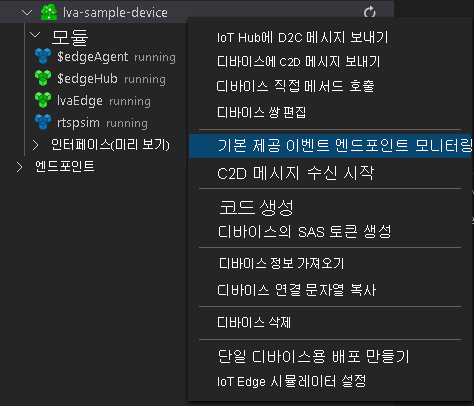

# <a name="quickstart-get-started---live-video-analytics-on-iot-edge"></a>빠른 시작: 시작 - IoT Edge의 Live Video Analytics

이 빠른 시작에서는 Live Video Analytics on IoT Edge를 시작하는 단계를 안내합니다. Azure VM을 IoT Edge 디바이스로 사용합니다. 또한 시뮬레이션된 라이브 비디오 스트림을 사용합니다. 

설치 단계가 완료되면 해당 스트림에서 동작을 감지하고 보고하는 미디어 그래프를 통해 시뮬레이션된 라이브 비디오 스트림을 실행할 수 있습니다. 다음 다이어그램에서는 해당 미디어 그래프를 그래픽으로 나타내고 있습니다.

> [!div class="mx-imgBorder"]
> :::image type="content" source="./media/analyze-live-video/motion-detection.svg" alt-text="동작 감지를 기반으로 하는 Live Video Analytics":::

IoT Edge에서 Live Video Analytics를 시작하는 방법에 대한 자세한 단계가 포함된 다음 비디오를 볼 수 있습니다.

<iframe src="https://www.microsoft.com/en-us/videoplayer/embed/RE4Hcax" width="640" height="320" allowFullScreen="true" frameBorder="0"></iframe>

## <a name="prerequisites"></a>필수 구성 요소

* 활성 구독이 있는 Azure 계정. 계정이 아직 없는 경우 [체험 계정을 만들](https://azure.microsoft.com/free/?WT.mc_id=A261C142F) 수 있습니다.
* 개발 컴퓨터의 [Visual Studio Code](https://code.visualstudio.com/). [Azure IoT Tools 확장](https://marketplace.visualstudio.com/items?itemName=vsciot-vscode.azure-iot-tools)이 있는지 확인합니다.
* 개발 컴퓨터가 연결된 네트워크에서 5671 포트를 통해 AMQP(고급 메시지 큐 프로토콜)를 허용하는지 확인합니다. 이렇게 설정하면 Azure IoT Tools에서 Azure IoT Hub와 통신할 수 있습니다.

> [!TIP]
> Azure IoT Tools 확장을 설치하는 동안 Docker를 설치하라는 메시지가 표시될 수 있습니다. 이 메시지는 무시해도 됩니다.

## <a name="set-up-azure-resources"></a>Azure 리소스 설정

이 자습서를 사용하려면 다음과 같은 Azure 리소스가 필요합니다.

* IoT Hub
* 스토리지 계정
* Azure Media Services 계정
* [IoT Edge 런타임](../../iot-edge/how-to-install-iot-edge-linux.md)이 설치된 Azure의 Linux VM

이 빠른 시작에서는 [Live Video Analytics 리소스 설치 스크립트](https://github.com/Azure/live-video-analytics/tree/master/edge/setup)를 사용하여 Azure 구독에 필요한 리소스를 배포하는 것이 좋습니다. 이렇게 하려면 다음 단계를 따르십시오.

1. [Azure Cloud Shell](https://shell.azure.com)로 이동합니다.
1. Cloud Shell을 처음 사용하는 경우 스토리지 계정 및 Microsoft Azure Files 공유를 만들 구독을 선택하라는 메시지가 표시됩니다. **스토리지 만들기** 를 선택하여 Cloud Shell 세션 정보에 대한 스토리지 계정을 만듭니다. 이 스토리지 계정은 Azure Media Services 계정에서 사용하기 위해 스크립트에서 만드는 계정과는 다릅니다.
1. Cloud Shell 창 왼쪽의 드롭다운 메뉴에서 사용자 환경으로 **Bash** 를 선택합니다.

    > [!div class="mx-imgBorder"]
    > :::image type="content" source="./media/quickstarts/env-selector.png" alt-text="동작 감지를 기반으로 하는 Live Video Analytics"
    ```
    
스크립트가 성공적으로 완료되면 구독에 필요한 모든 리소스가 표시됩니다. 스크립트 출력의 리소스 테이블에 IoT 허브 이름이 나열됩니다. `Microsoft.Devices/IotHubs` 리소스 종류를 찾고 이름을 적어 둡니다. 이 이름은 다음 단계에서 필요합니다. 

또한 스크립트는 몇 가지 구성 파일을 *~/clouddrive/lva-sample/* 디렉터리에 생성합니다. 이러한 파일은 빠른 시작에서 나중에 필요합니다.

## <a name="deploy-modules-on-your-edge-device"></a>에지 디바이스에 모듈 배포

Cloud Shell에서 다음 명령을 실행합니다.

```
az iot edge set-modules --hub-name <iot-hub-name> --device-id lva-sample-device --content ~/clouddrive/lva-sample/edge-deployment/deployment.amd64.json
```

이 명령은 다음과 같은 모듈을 에지 디바이스(이 경우 Linux VM)에 배포합니다.

* Live Video Analytics on IoT Edge(`lvaEdge` 모듈 이름)
* RTSP(Real-Time Streaming Protocol) 시뮬레이터(`rtspsim` 모듈 이름)

RTSP 시뮬레이터 모듈은 [Live Video Analytics 리소스 설치 스크립트](https://github.com/Azure/live-video-analytics/tree/master/edge/setup)를 실행할 때 에지 디바이스에 복사된 비디오 파일을 사용하여 라이브 비디오 스트림을 시뮬레이션합니다. 

이제 모듈이 배포되었지만 미디어 그래프가 활성화되지 않았습니다.

## <a name="configure-the-azure-iot-tools-extension"></a>Azure IoT Tools 확장 구성

다음 지침에 따라 Azure IoT Tools 확장을 사용하여 IoT 허브에 연결합니다.

1. Visual Studio Code에서 **확장** 탭을 열고(또는 Ctrl+Shift+X를 누름) Azure IoT Hub를 검색합니다.
1. 마우스 오른쪽 단추를 클릭하고 **확장 설정** 을 선택합니다.

    > [!div class="mx-imgBorder"]
    > :::image type="content" source="./media/run-program/extensions-tab.png" alt-text="동작 감지를 기반으로 하는 Live Video Analytics":::
1. "자세한 정보 메시지 표시"를 검색하고 활성화합니다.

    > [!div class="mx-imgBorder"]
    > :::image type="content" source="./media/run-program/show-verbose-message.png" alt-text="동작 감지를 기반으로 하는 Live Video Analytics":::
1. **보기** > **탐색기** 를 선택합니다. 또는 Ctrl+Shift+E를 선택합니다.
1. **탐색기** 탭의 왼쪽 아래 모서리에서 **Azure IoT Hub** 를 선택합니다.
1. **기타 옵션** 아이콘을 선택하여 상황에 맞는 메뉴를 표시합니다. 그런 다음, **IoT Hub 연결 문자열 설정** 을 선택합니다.
1. 입력 상자가 표시되면 IoT Hub 연결 문자열을 입력합니다. Cloud Shell에서는 *~/clouddrive/lva-sample/appsettings.json* 에서 연결 문자열을 가져올 수 있습니다.

연결에 성공하면 에지 디바이스의 목록이 표시됩니다. **lva-sample-device** 라는 하나 이상의 디바이스가 표시되어야 합니다. 이제 상황에 맞는 메뉴를 통해 IoT Edge 디바이스를 관리하고 Azure IoT Hub와 상호 작용할 수 있습니다. 에지 디바이스에 배포된 모듈을 보려면 **lva-sample-device** 아래에서 **모듈** 노드를 펼칩니다.


> [!TIP]
> 에지 디바이스(예: ARM64 디바이스)에서 자체적으로 [Live Video Analytics on IoT Edge를 수동으로 배포](deploy-iot-edge-device.md)한 경우 해당 디바이스의 Azure IoT Hub에 모듈이 표시됩니다. 해당 모듈을 선택하고 아래의 나머지 단계를 수행할 수 있습니다.

## <a name="use-direct-method-calls"></a>직접 메서드 호출 사용

이 모듈을 통해 직접 메서드를 호출하여 라이브 비디오 스트림을 분석할 수 있습니다. 자세한 내용은 [Live Video Analytics on IoT Edge에 대한 직접 메서드](direct-methods.md)를 참조하세요. 

### <a name="invoke-graphtopologylist"></a>GraphTopologyList 호출

모듈에서 모든 [그래프 토폴로지](media-graph-concept.md#media-graph-topologies-and-instances)를 열거하려면 다음을 수행합니다.

1. Visual Studio Code에서 마우스 오른쪽 단추로 **lvaEdge** 모듈을 클릭하고, **모듈 직접 메서드 호출** 을 선택합니다.
1. 표시되는 상자에서 *GraphTopologyList* 를 입력합니다.
1. 다음 JSON 페이로드를 복사한 다음, 상자에 붙여넣습니다. 그런 다음, Enter 키를 선택합니다.

    ```
    {
        "@apiVersion" : "1.0"
    }
    ```

    몇 초 안에 **출력** 창에 다음 응답이 표시됩니다.

    ```
    [DirectMethod] Invoking Direct Method [GraphTopologyList] to [lva-sample-device/lvaEdge] ...
    [DirectMethod] Response from [lva-sample-device/lvaEdge]:
    {
      "status": 200,
      "payload": {
        "value": []
      }
    }
    ```
    
    그래프 토폴로지가 만들어지지 않았으므로 이 응답이 필요합니다.
    

### <a name="invoke-graphtopologyset"></a>GraphTopologySet 호출

`GraphTopologyList`를 호출하는 단계를 사용하면 `GraphTopologySet`을 호출하여 [그래프 토폴로지](media-graph-concept.md#media-graph-topologies-and-instances)를 설정할 수 있습니다. 다음 JSON을 페이로드로 사용합니다.

```
{
    "@apiVersion": "1.0",
    "name": "MotionDetection",
    "properties": {
        "description": "Analyzing live video to detect motion and emit events",
        "parameters": [
            {
                "name": "rtspUserName",
                "type": "String",
                "description": "rtsp source user name.",
                "default": "dummyUserName"
            },
            {
                "name": "rtspPassword",
                "type": "String",
                "description": "rtsp source password.",
                "default": "dummyPassword"
            },
            {
                "name": "rtspUrl",
                "type": "String",
                "description": "rtsp Url"
            }
        ],
        "sources": [
            {
                "@type": "#Microsoft.Media.MediaGraphRtspSource",
                "name": "rtspSource",
                "endpoint": {
                    "@type": "#Microsoft.Media.MediaGraphUnsecuredEndpoint",
                    "url": "${rtspUrl}",
                    "credentials": {
                        "@type": "#Microsoft.Media.MediaGraphUsernamePasswordCredentials",
                        "username": "${rtspUserName}",
                        "password": "${rtspPassword}"
                    }
                }
            }
        ],
        "processors": [
            {
                "@type": "#Microsoft.Media.MediaGraphMotionDetectionProcessor",
                "name": "motionDetection",
                "sensitivity": "medium",
                "inputs": [
                    {
                        "nodeName": "rtspSource"
                    }
                ]
            }
        ],
        "sinks": [
            {
                "@type": "#Microsoft.Media.MediaGraphIoTHubMessageSink",
                "name": "hubSink",
                "hubOutputName": "inferenceOutput",
                "inputs": [
                    {
                        "nodeName": "motionDetection"
                    }
                ]
            }
        ]
    }
}

```

이 JSON 페이로드에서는 세 개의 매개 변수를 정의하는 그래프 토폴로지를 만듭니다. 이러한 매개 변수 중 두 개에는 기본값이 있습니다. 토폴로지에는 원본(RTSP 원본) 노드 하나, 프로세서(동작 감지 프로세서) 노드 하나, 싱크(IoT Hub 싱크) 노드 하나가 있습니다.

몇 초 안에 **출력** 창에 다음 응답이 표시됩니다.

```
[DirectMethod] Invoking Direct Method [GraphTopologySet] to [lva-sample-device/lvaEdge] ...
[DirectMethod] Response from [lva-sample-device/lvaEdge]:
{
  "status": 201,
  "payload": {
    "systemData": {
      "createdAt": "2020-05-19T07:41:34.507Z",
      "lastModifiedAt": "2020-05-19T07:41:34.507Z"
    },
    "name": "MotionDetection",
    "properties": {
      "description": "Analyzing live video to detect motion and emit events",
      "parameters": [
        {
          "name": "rtspUserName",
          "type": "String",
          "description": "rtsp source user name.",
          "default": "dummyUserName"
        },
        {
          "name": "rtspPassword",
          "type": "String",
          "description": "rtsp source password.",
          "default": "dummyPassword"
        },
        {
          "name": "rtspUrl",
          "type": "String",
          "description": "rtsp Url"
        }
      ],
      "sources": [
        {
          "@type": "#Microsoft.Media.MediaGraphRtspSource",
          "name": "rtspSource",
          "transport": "Tcp",
          "endpoint": {
            "@type": "#Microsoft.Media.MediaGraphUnsecuredEndpoint",
            "url": "${rtspUrl}",
            "credentials": {
              "@type": "#Microsoft.Media.MediaGraphUsernamePasswordCredentials",
              "username": "${rtspUserName}"
            }
          }
        }
      ],
      "processors": [
        {
          "@type": "#Microsoft.Media.MediaGraphMotionDetectionProcessor",
          "sensitivity": "medium",
          "name": "motionDetection",
          "inputs": [
            {
              "nodeName": "rtspSource",
              "outputSelectors": []
            }
          ]
        }
      ],
      "sinks": [
        {
          "@type": "#Microsoft.Media.MediaGraphIoTHubMessageSink",
          "hubOutputName": "inferenceOutput",
          "name": "hubSink",
          "inputs": [
            {
              "nodeName": "motionDetection",
              "outputSelectors": []
            }
          ]
        }
      ]
    }
  }
}
```

반환된 상태는 201입니다. 이 상태는 새 토폴로지가 만들어졌음을 나타냅니다. 

다음 단계를 수행합니다.

1. `GraphTopologySet`을 다시 호출합니다. 반환된 상태 코드는 200입니다. 이 코드는 기존 토폴로지가 성공적으로 업데이트되었음을 나타냅니다.
1. `GraphTopologySet`을 다시 호출하지만 설명 문자열을 변경합니다. 반환된 상태 코드는 200이며, 설명이 새 값으로 업데이트됩니다.
1. 이전 섹션에서 설명한 대로 `GraphTopologyList`를 호출합니다. 이제 반환된 페이로드에서 `MotionDetection` 토폴로지를 볼 수 있습니다.

### <a name="invoke-graphtopologyget"></a>GraphTopologyGet 호출

다음 페이로드를 사용하여 `GraphTopologyGet`을 호출합니다.

```
{
    "@apiVersion" : "1.0",
    "name" : "MotionDetection"
}
```

몇 초 안에 **출력** 창에 다음 응답이 표시됩니다.

```
[DirectMethod] Invoking Direct Method [GraphTopologyGet] to [lva-sample-device/lvaEdge] ...
[DirectMethod] Response from [lva-sample-device/lvaEdge]:
{
  "status": 200,
  "payload": {
    "systemData": {
      "createdAt": "2020-05-19T07:41:34.507Z",
      "lastModifiedAt": "2020-05-19T07:41:34.507Z"
    },
    "name": "MotionDetection",
    "properties": {
      "description": "Analyzing live video to detect motion and emit events",
      "parameters": [
        {
          "name": "rtspUserName",
          "type": "String",
          "description": "rtsp source user name.",
          "default": "dummyUserName"
        },
        {
          "name": "rtspPassword",
          "type": "String",
          "description": "rtsp source password.",
          "default": "dummyPassword"
        },
        {
          "name": "rtspUrl",
          "type": "String",
          "description": "rtsp Url"
        }
      ],
      "sources": [
        {
          "@type": "#Microsoft.Media.MediaGraphRtspSource",
          "name": "rtspSource",
          "transport": "Tcp",
          "endpoint": {
            "@type": "#Microsoft.Media.MediaGraphUnsecuredEndpoint",
            "url": "${rtspUrl}",
            "credentials": {
              "@type": "#Microsoft.Media.MediaGraphUsernamePasswordCredentials",
              "username": "${rtspUserName}"
            }
          }
        }
      ],
      "processors": [
        {
          "@type": "#Microsoft.Media.MediaGraphMotionDetectionProcessor",
          "sensitivity": "medium",
          "name": "motionDetection",
          "inputs": [
            {
              "nodeName": "rtspSource",
              "outputSelectors": []
            }
          ]
        }
      ],
      "sinks": [
        {
          "@type": "#Microsoft.Media.MediaGraphIoTHubMessageSink",
          "hubOutputName": "inferenceOutput",
          "name": "hubSink",
          "inputs": [
            {
              "nodeName": "motionDetection",
              "outputSelectors": []
            }
          ]
        }
      ]
    }
  }
}
```

응답 페이로드에서 다음 세부 정보를 확인합니다.

* 상태 코드가 200이며, 성공을 나타냅니다.
* 페이로드에는 `created` 타임스탬프 및 `lastModified` 타임스탬프가 포함됩니다.

### <a name="invoke-graphinstanceset"></a>GraphInstanceSet 호출

이전 그래프 토폴로지를 참조하는 그래프 인스턴스를 만듭니다. 그래프 인스턴스를 사용하면 동일한 그래프 토폴로지를 사용하여 다양한 카메라에서 라이브 비디오 스트림을 분석할 수 있습니다. 자세한 내용은 [미디어 그래프 토폴로지 및 인스턴스](media-graph-concept.md#media-graph-topologies-and-instances)를 참조하세요.

다음 페이로드를 사용하여 `GraphInstanceSet` 직접 메서드를 호출합니다.

```
{
    "@apiVersion" : "1.0",
    "name" : "Sample-Graph-1",
    "properties" : {
        "topologyName" : "MotionDetection",
        "description" : "Sample graph description",
        "parameters" : [
            { "name" : "rtspUrl", "value" : "rtsp://rtspsim:554/media/camera-300s.mkv" }
        ]
    }
}
```

이 페이로드는 다음과 같습니다.

* 인스턴스를 만들어야 하는 토폴로지 이름(`MotionDetection`)을 지정합니다.
* 그래프 토폴로지 페이로드에 기본값이 없는 `rtspUrl`에 대한 매개 변수 값을 포함합니다.

몇 초 안에 **출력** 창에 다음 응답이 표시됩니다.

```
[DirectMethod] Invoking Direct Method [GraphInstanceSet] to [lva-sample-device/lvaEdge] ...
[DirectMethod] Response from [lva-sample-device/lvaEdge]:
{
  "status": 201,
  "payload": {
    "name": "Sample-Graph-1",
    "properties": {
      "created": "2020-05-19T07:44:33.868Z",
      "lastModified": "2020-05-19T07:44:33.868Z",
      "state": "Inactive",
      "description": "Sample graph description",
      "topologyName": "MotionDetection",
      "parameters": [
        {
          "name": "rtspUrl",
          "value": "rtsp://rtspsim:554/media/camera-300s.mkv"
        }
      ]
    }
  }
}
```

응답 페이로드에서 다음을 확인합니다.

* 상태 코드가 201이며, 새 인스턴스가 만들어졌음을 나타냅니다.
* 상태가 `Inactive`이며, 그래프 인스턴스가 만들어졌지만 활성화되지 않았음을 나타냅니다. 자세한 내용은 [미디어 그래프 상태](media-graph-concept.md)를 참조하세요.

다음 단계를 수행합니다.

1. 동일한 페이로드를 사용하여 `GraphInstanceSet`을 다시 호출합니다. 반환된 상태 코드는 200입니다.
1. `GraphInstanceSet`을 다시 호출하지만 다른 설명을 사용합니다. 응답 페이로드에서 업데이트된 설명이 표시되며, 그래프 인스턴스가 성공적으로 업데이트되었음을 나타냅니다.
1. `GraphInstanceSet`을 호출하지만 이름을 `Sample-Graph-2`로 변경합니다. 응답 페이로드에서 새로 만든 그래프 인스턴스(즉, 201 상태 코드)를 확인합니다.

### <a name="invoke-graphinstanceactivate"></a>GraphInstanceActivate 호출

이제 그래프 인스턴스를 활성화하여 모듈을 통해 라이브 비디오 흐름을 시작합니다. 다음 페이로드를 사용하여 `GraphInstanceActivate` 직접 메서드를 호출합니다.

```
{
    "@apiVersion" : "1.0",
    "name" : "Sample-Graph-1"
}
```

몇 초 안에 **출력** 창에 다음 응답이 표시됩니다.

```
[DirectMethod] Invoking Direct Method [GraphInstanceActivate] to [lva-sample-device/lvaEdge] ...
[DirectMethod] Response from [lva-sample-device/lvaEdge]:
{
  "status": 200,
  "payload": null
}
```

200 상태 코드는 그래프 인스턴스가 성공적으로 활성화되었음을 나타냅니다.

### <a name="invoke-graphinstanceget"></a>GraphInstanceGet 호출

이제 다음 페이로드를 사용하여 `GraphInstanceGet` 직접 메서드를 호출합니다.

```
 {
     "@apiVersion" : "1.0",
     "name" : "Sample-Graph-1"
 }
 ```

몇 초 안에 **출력** 창에 다음 응답이 표시됩니다.

```
[DirectMethod] Invoking Direct Method [GraphInstanceGet] to [lva-sample-device/lvaEdge] ...
[DirectMethod] Response from [lva-sample-device/lvaEdge]:
{
  "status": 200,
  "payload": {
    "name": "Sample-Graph-1",
    "properties": {
      "created": "2020-05-19T07:44:33.868Z",
      "lastModified": "2020-05-19T07:44:33.868Z",
      "state": "Active",
      "description": "graph description",
      "topologyName": "MotionDetection",
      "parameters": [
        {
          "name": "rtspUrl",
          "value": "rtsp://rtspsim:554/media/camera-300s.mkv"
        }
      ]
    }
  }
}
```

응답 페이로드에서 다음 세부 정보를 확인합니다.

* 상태 코드가 200이며, 성공을 나타냅니다.
* 상태가 `Active`이며, 그래프 인스턴스가 이제 활성 상태임을 나타냅니다.

## <a name="observe-results"></a>결과 확인

만들고 활성화한 그래프 인스턴스는 동작 감지 프로세서 노드를 사용하여 들어오는 라이브 비디오 스트림에서 동작을 감지합니다. 이벤트를 IoT Hub 싱크 노드에 보냅니다. 이러한 이벤트는 IoT Edge Hub로 릴레이됩니다. 

결과를 확인하려면 다음 단계를 수행합니다.

1. Visual Studio Code에서 **탐색기** 창을 엽니다. 왼쪽 아래 모서리에서 **Azure IoT Hub** 를 찾습니다.
2. **디바이스** 노드를 펼칩니다.
3. 마우스 오른쪽 단추로 **lva-sample-device** 를 클릭한 다음, **기본 제공 이벤트 모니터링 시작** 을 선택합니다.

    
    
**출력** 창에 다음 메시지가 표시됩니다.

```
[IoTHubMonitor] [7:44:33 AM] Message received from [lva-sample-device/lvaEdge]:
{
    "body": {
    "timestamp": 143005362606360,
    "inferences": [
        {
        "type": "motion",
        "motion": {
            "box": {
            "l": 0.828452,
            "t": 0.455224,
            "w": 0.1,
            "h": 0.088889
            }
        }
        },
        {
        "type": "motion",
        "motion": {
            "box": {
            "l": 0.661088,
            "t": 0.597015,
            "w": 0.0625,
            "h": 0.051852
            }
        }
        }
    ]
    },
    "applicationProperties": {
    "topic": "/subscriptions/{subscriptionId}/resourceGroups/{resourceGroupName}/providers/microsoft.media/mediaservices/{amsAccountName}",
    "subject": "/graphInstances/Sample-Graph-1/processors/motionDetection",
    "eventType": "Microsoft.Media.Graph.Analytics.Inference",
    "eventTime": "2020-05-19T07:45:34.404Z",
    "dataVersion": "1.0"
    }
}
```

다음 세부 정보를 확인합니다.

* 메시지에는 `body` 섹션 및 `applicationProperties` 섹션이 포함되어 있습니다. 자세한 내용은 [IoT Hub 메시지 만들기 및 읽기](../../iot-hub/iot-hub-devguide-messages-construct.md)를 참조하세요.
* `applicationProperties`에서 `subject`는 메시지가 생성된 `MediaGraph`의 노드를 참조합니다. 이 경우 메시지는 동작 감지 프로세서에서 시작됩니다.
* `applicationProperties`에서 `eventType`은 이 이벤트가 분석 이벤트임을 나타냅니다.
* `eventTime` 값은 이벤트가 발생한 시간을 나타냅니다.
* `body` 섹션에는 분석 이벤트에 대한 데이터를 포함됩니다. 이 경우 이벤트는 유추 이벤트이므로 본문에 `timestamp` 및 `inferences` 데이터가 포함됩니다.
* `inferences` 섹션은 `type`이 `motion`임을 나타냅니다. `motion` 이벤트에 대한 추가 데이터를 제공합니다.

미디어 그래프를 잠시 동안 실행하면 **출력** 창에 다음 메시지가 표시됩니다.

```
[IoTHubMonitor] [7:47:45 AM] Message received from [lva-sample-device/lvaEdge]:
{
  "body": {
    "sdp": "SDP:\nv=0\r\no=- 1588948185746703 1 IN IP4 172.xx.xx.xx\r\ns=Matroska video+audio+(optional)subtitles, streamed by the LIVE555 Media Server\r\ni=media/camera-300s.mkv\r\nt=0 0\r\na=tool:LIVE555 Streaming Media v2020.04.12\r\na=type:broadcast\r\na=control:*\r\na=range:npt=0-300.000\r\na=x-qt-text-nam:Matroska video+audio+(optional)subtitles, streamed by the LIVE555 Media Server\r\na=x-qt-text-inf:media/camera-300s.mkv\r\nm=video 0 RTP/AVP 96\r\nc=IN IP4 0.0.0.0\r\nb=AS:500\r\na=rtpmap:96 H264/90000\r\na=fmtp:96 packetization-mode=1;profile-level-id=4D0029;sprop-parameter-sets={SPS}\r\na=control:track1\r\n"
  },
  "applicationProperties": {
    "dataVersion": "1.0",
    "topic": "/subscriptions/XXXXXXXX-XXXX-XXXX-XXXX-XXXXXXXXXXXX/resourceGroups/<my-resource-group>/providers/microsoft.media/mediaservices/<ams-account-name>",
    "subject": "/graphInstances/Sample-Graph-1/sources/rtspSource",
    "eventType": "Microsoft.Media.Graph.Diagnostics.MediaSessionEstablished",
    "eventTime": "2020-05-19T07:47:45.747Z"
  }
}
```

이 메시지에서 다음 세부 정보를 확인합니다.

* `applicationProperties`에서 `subject`는 메시지가 미디어 그래프의 RTSP 원본 노드에서 생성되었음을 나타냅니다.
* `applicationProperties`에서 `eventType`은 이 이벤트가 진단임을 나타냅니다.
* `body`에는 진단 이벤트에 대한 데이터가 포함됩니다. 이 경우 이벤트가 `MediaSessionEstablished`이므로 메시지에 본문이 포함됩니다.

## <a name="invoke-additional-direct-methods-to-clean-up"></a>추가 직접 메서드를 호출하여 정리

직접 메서드를 호출하여 먼저 그래프 인스턴스를 비활성화한 다음, 삭제합니다.

### <a name="invoke-graphinstancedeactivate"></a>GraphInstanceDeactivate 호출

다음 페이로드를 사용하여 `GraphInstanceDeactivate` 직접 메서드를 호출합니다.

```
{
    "@apiVersion" : "1.0",
    "name" : "Sample-Graph-1"
}
```

몇 초 안에 **출력** 창에 다음 응답이 표시됩니다.

```
[DirectMethod] Invoking Direct Method [GraphInstanceDeactivate] to [lva-sample-device/lvaEdge] ...
[DirectMethod] Response from [lva-sample-device/lvaEdge]:
{
  "status": 200,
  "payload": null
}
```

200 상태 코드는 그래프 인스턴스가 성공적으로 비활성화되었음을 나타냅니다.

다음으로, 이 문서의 앞에서 설명한 대로 `GraphInstanceGet`을 호출합니다. `state` 값을 확인합니다.

### <a name="invoke-graphinstancedelete"></a>GraphInstanceDelete 호출

다음 페이로드를 사용하여 `GraphInstanceDelete` 직접 메서드를 호출합니다.

```
{
    "@apiVersion" : "1.0",
    "name" : "Sample-Graph-1"
}
```

몇 초 안에 **출력** 창에 다음 응답이 표시됩니다.

```
[DirectMethod] Invoking Direct Method [GraphInstanceDelete] to [lva-sample-device/lvaEdge] ...
[DirectMethod] Response from [lva-sample-device/lvaEdge]:
{
  "status": 200,
  "payload": null
}
```

200 상태 코드는 그래프 인스턴스가 성공적으로 삭제되었음을 나타냅니다.

### <a name="invoke-graphtopologydelete"></a>GraphTopologyDelete 호출

다음 페이로드를 사용하여 `GraphTopologyDelete` 직접 메서드를 호출합니다.

```
{
    "@apiVersion" : "1.0",
    "name" : "MotionDetection"
}
```

몇 초 안에 **출력** 창에 다음 응답이 표시됩니다.

```
[DirectMethod] Invoking Direct Method [GraphTopologyDelete] to [lva-sample-device/lvaEdge] ...
[DirectMethod] Response from [lva-sample-device/lvaEdge]:
{
  "status": 200,
  "payload": null
}
```

200 상태 코드는 그래프 토폴로지가 성공적으로 삭제되었음을 나타냅니다.

다음 단계를 수행합니다.

1. `GraphTopologyList`를 호출하고, 모듈에 그래프 토폴로지가 포함되지 않는지 확인합니다.
1. `GraphTopologyList`와 동일한 페이로드를 사용하여 `GraphInstanceList`를 호출합니다. 그래프 인스턴스가 열거되지 않는지 확인합니다.

## <a name="clean-up-resources"></a>리소스 정리

이 애플리케이션을 계속 사용하지 않으려면 이 빠른 시작에서 만든 리소스를 삭제합니다.

## <a name="next-steps"></a>다음 단계

* [Live Video Analytics on IoT Edge를 사용하여 비디오를 녹화하는 방법](continuous-video-recording-tutorial.md)을 알아봅니다.
* [진단 메시지](monitoring-logging.md)에 대해 자세히 알아봅니다.
