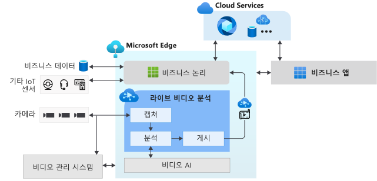

# Live Video Analytics on IoT Edge란? (미리 보기)

Live Video Analytics on IoT Edge는 Edge 및 클라우드를 포괄하는 인텔리전트 비디오 애플리케이션을 빌드하기 위한 플랫폼을 제공합니다. 이 플랫폼은 라이브 비디오를 캡처, 녹화 및 분석하는 기능과 결과(비디오 및/또는 비디오 분석)를 Azure 서비스(클라우드 및/또는 Edge)에 게시하는 기능을 제공합니다. 이 플랫폼을 사용하여 비디오 분석을 통해 IoT 솔루션을 개선할 수 있습니다. Live Video Analytics on IoT Edge 기능을 Stream Analytics on IoT Edge, Cognitive Services on IoT Edge와 같은 다른 Azure IoT Edge 모듈은 물론 Media Services, Event Hub, Cognitive Services 등과 같은 클라우드의 Azure 서비스와 결합하여 강력한 하이브리드(예: 에지 + 클라우드) 애플리케이션을 빌드할 수 있습니다.

Live Video Analytics on IoT Edge는 확장 가능한 플랫폼으로 설계되었기 때문에 복잡하게 라이브 비디오 파이프라인을 구축하고 실행할 필요 없이 다양한 비디오 분석 에지 모듈(예: Cognitive 서비스 컨테이너, 오픈 소스 기계 학습 모델 또는 사용자 고유의 데이터로 학습된 사용자 지정 모델을 사용하여 제작된 사용자 지정 에지 모듈)을 연결하여 라이브 비디오를 분석하는 데 사용할 수 있습니다.

## IoT 솔루션 개발 가속화 

다른 IoT 센서 및/또는 비즈니스 데이터의 신호와 비디오 분석을 결합하는 IoT 솔루션으로 비즈니스 의사 결정을 자동화하거나 반자동화하여 생산성을 향상시킬 수 있습니다. Live Video Analytics on IoT Edge를 사용하면 이러한 솔루션을 더 빠르게 빌드할 수 있습니다. 비즈니스와 관련된 비디오 분석 모듈 및 논리를 구축하는 데 중점을 둘 수 있으며, 이를 통해 플랫폼에서 비디오 파이프라인을 관리하고 실행하는 복잡성을 숨길 수 있습니다.

Live Video Analytics on IoT Edge를 사용하면 기존 [VMS(비디오 관리 시스템)](https://en.wikipedia.org/wiki/Video_management_system)에서 [CCTV 카메라](https://en.wikipedia.org/wiki/Closed-circuit_television_camera)를 계속 사용하고 비디오 분석 앱을 독립적으로 빌드할 수 있습니다. Live Video Analytics on IoT Edge를 Computer Vision SDK 및 도구 키트와 함께 사용하여 최첨단 IoT 솔루션을 빌드할 수 있습니다. 아래 다이어그램에서 이를 보여 줍니다.

## 지원되는 환경

Linux x86-64 및 ARM64 환경이 지원됩니다.
> [!NOTE]
> ARM64 디바이스에 대한 지원은 빌드 `1.0.4` 이상에서 사용할 수 있습니다.
> ARM64 디바이스에서 Azure IoT Edge 런타임을 실행하는 것에 대한 지원은 [공개 미리 보기](https://azure.microsoft.com/support/legal/preview-supplemental-terms/)에 있습니다.

## 시작하기

다음 개념 문서를 읽은 다음, 빠른 시작을 통해 라이브 비디오 피드에서 동작 감지를 실행해 보세요.

### 개념

* [미디어 그래프](media-graph-concept.md)
* [비디오 녹화](video-recording-concept.md)
* [비디오 재생](video-playback-concept.md)
* [연속 비디오 녹화](continuous-video-recording-concept.md)
* [이벤트 기반 비디오 녹화](event-based-video-recording-concept.md)
* [비디오 녹화가 없는 Live Video Analytics](analyze-live-video-concept.md)

## 다음 단계

* [빠른 시작: 사용자 고유의 모델로 Live Video Analytics 실행](use-your-model-quickstart.md) 문서를 따라 라이브 비디오 피드에서 동작 감지를 실행할 수 있습니다.
* [용어](terminology.md) 검토
* [Live Video Analytics 오픈 소스 자료](https://github.com/Azure/live-video-analytics) 살펴보기

