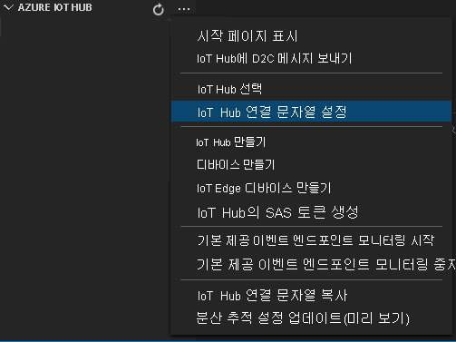

# <a name="tutorial-analyze-live-video-by-using-openvino-model-server--ai-extension-from-intel"></a>자습서: OpenVINO™ Model Server – Intel의 AI 확장을 사용하여 라이브 비디오 분석 

이 자습서에는 OpenVINO™ Model Server – Intel의 AI 확장을 사용하여 (시뮬레이션된) IP 카메라의 라이브 비디오 피드를 분석하는 방법을 보여줍니다. 유추 서버가 물체(사람, 차량 또는 자전거) 감지용 모델과 차량 분류용 모델에 액세스하는 방법을 확인할 수 있습니다. 라이브 비디오 피드의 프레임 하위 집합이 유추 서버로 전송되고, IoT Edge Hub로 결과가 전송됩니다.

이 자습서에서는 Azure VM을 IoT Edge 디바이스로 사용하고, 시뮬레이션된 라이브 비디오 스트림을 사용합니다. C#으로 작성된 샘플 코드 및 [동작 감지 및 이벤트 내보내기](detect-motion-emit-events-quickstart.md) 빠른 시작을 기반으로 합니다.

> [!NOTE]
> 이 자습서를 사용하려면 에지 디바이스로 x86-64 컴퓨터를 사용해야 합니다.

## <a name="prerequisites"></a>필수 구성 요소

* 활성 구독이 있는 Azure 계정. 계정이 아직 없는 경우 [체험 계정을 만들](https://azure.microsoft.com/free/?WT.mc_id=A261C142F) 수 있습니다.
* 다음 확장이 포함된 [Visual Studio Code](https://code.visualstudio.com/)
    * [Azure IoT Tools](https://marketplace.visualstudio.com/items?itemName=vsciot-vscode.azure-iot-tools)
    * [C#](https://marketplace.visualstudio.com/items?itemName=ms-dotnettools.csharp)
* [.NET Core 3.1 SDK](https://dotnet.microsoft.com/download/dotnet-core/3.1).
* [동작 감지 및 이벤트 내보내기](detect-motion-emit-events-quickstart.md) 빠른 시작을 완료하지 않은 경우 [Azure 리소스](detect-motion-emit-events-quickstart.md#set-up-azure-resources)를 설정하는 단계를 완료해야 합니다.

> [!TIP]
> Azure IoT Tools를 설치하는 경우 Docker를 설치하라는 메시지가 표시될 수 있습니다. 이 메시지는 무시할 수 있습니다.

## <a name="review-the-sample-video"></a>샘플 비디오 검토

Azure 리소스가 설치되면 주차장의 짧은 비디오가 IoT Edge 디바이스로 사용하는 Azure의 Linux VM에 복사됩니다. 이 빠른 시작에서는 비디오 파일을 사용하여 라이브 스트림을 시뮬레이션합니다.

[VLC 미디어 플레이어](https://www.videolan.org/vlc/)와 같은 애플리케이션을 엽니다. Ctrl+N을 선택한 다음, [비디오](https://lvamedia.blob.core.windows.net/public/lots_015.mkv)에 대한 링크를 붙여넣어 재생을 시작합니다. 주차장에 있는 차량 영상이 보입니다. 대부분은 주차되어 있고 한 대는 움직이고 있습니다.

이 빠른 시작에서는 OpenVINO™ Model Server – Intel의 AI 확장과 함께 IoT Edge의 Live Video Analytics를 사용하여 차량 등의 물체를 감지하거나 분류합니다. 결과에 따른 유추 이벤트를 IoT Edge Hub에 게시합니다.

## <a name="overview"></a>개요

> [!div class="mx-imgBorder"]
> :::image type="content" source="./media/use-intel-openvino-tutorial/http-extension-with-vino.svg" alt-text="개요":::

이 다이어그램에서는 이 빠른 시작의 신호 흐름을 보여 줍니다. [에지 모듈](https://github.com/Azure/live-video-analytics/tree/master/utilities/rtspsim-live555)은 RTSP(Real-Time Streaming Protocol) 서버를 호스팅하는 IP 카메라를 시뮬레이션합니다. [RTSP 원본](media-graph-concept.md#rtsp-source) 노드는 이 서버에서 비디오 피드를 가져와서 비디오 프레임을 [프레임 속도 필터 프로세서](media-graph-concept.md#frame-rate-filter-processor) 노드로 보냅니다. 이 프로세서는 [HTTP 확장 프로세서](media-graph-concept.md#http-extension-processor) 노드에 도달하는 비디오 스트림의 프레임 속도를 제한합니다. 

HTTP 확장 노드는 프록시 역할을 수행합니다. 비디오 프레임을 지정된 이미지 형식으로 변환합니다. 그런 다음, REST를 통해 이미지를 HTTP 엔드포인트 내부에서 AI 모델을 실행하는 다른 에지 모듈에 릴레이합니다. 이 예에서 에지 모듈은 OpenVINO™ Model Server – Intel의 AI 확장입니다. HTTP 확장 프로세서 노드는 감지 결과를 수집하고, 이벤트를 [IoT Hub 싱크](media-graph-concept.md#iot-hub-message-sink) 노드에 게시합니다. 그런 다음, 노드에서 이러한 이벤트를 [IoT Edge Hub](../../iot-edge/iot-edge-glossary.md#iot-edge-hub)에 보냅니다.

이 자습서에서는 다음을 수행합니다.

1. 미디어 그래프를 만들고, 배포하고, 수정합니다.
1. 결과를 해석합니다.
1. 리소스를 정리합니다.

## <a name="about-openvino-model-server--ai-extension-from-intel"></a>OpenVINO™ Model Server – Intel의 AI 확장 정보

Intel® Distribution of [OpenVINO™ 툴킷](https://software.intel.com/content/www/us/en/develop/tools/openvino-toolkit.html)(개방형 시각적 유추 및 신경망 최적화)은 개발자와 데이터 과학자가 컴퓨터 비전 워크로드의 속도를 높이고 딥 러닝 유추 및 배포를 간소화하고 에지에서 클라우드에 이르는 Intel® 플랫폼 전반에서 다른 유형의 데이터를 간편하게 실행하도록 설정하는 데 유용합니다. 여기에는 모델 최적화 프로그램 및 유추 엔진이 있는 Intel® Deep Learning Deployment Toolkit 및 40가지 이상의 최적화된 사전 학습 모델이 있는 [Open Model Zoo](https://github.com/openvinotoolkit/open_model_zoo) 리포지토리가 포함됩니다.

복잡한 고성능 라이브 비디오 분석 솔루션을 구축하려면 IoT Edge 모듈의 Live Video Analytics가 에지에서 규모를 활용할 수 있는 강력한 유추 엔진과 쌍을 이뤄야 합니다. 이 자습서에서는 유추 요청이 IoT Edge의 Live Video Analytics와 작동하도록 설계된 Edge 모듈인 [OpenVINO™ Model Server – Intel의 AI 확장](https://aka.ms/lva-intel-ovms)으로 전송됩니다. 유추 서버 모듈에는 OVMS(OpenVINO™ Model Server)가 포함되어 있습니다. OVMS는 컴퓨터 비전 워크로드에 고도로 최적화되고 Intel® 아키텍처용으로 개발된 OpenVINO™ 도구 키트로 구동되는 유추 서버입니다. 유추 서버와 IoT Edge 모듈의 Live Video Analytic 간에 비디오 프레임 및 추론 결과를 간편하게 교환할 수 있도록 OVMS에 확장이 추가되었기 때문에, OpenVINO™ 도구 키트 지원 모델을 실행할 수 있습니다([코드](https://github.com/openvinotoolkit/model_server/tree/master/extras/ams_wrapper)를 수정하여 유추 서버 모듈을 사용자 지정할 수 있음). Intel® 하드웨어가 제공하는 광범위한 가속 메커니즘에서 추가로 선택할 수도 있습니다. 여기에는 CPU(Atom, Core, Xeon), FPGA, VPU가 포함됩니다.

이 유추 서버의 초기 릴리스에서는 다음 [모델](https://github.com/openvinotoolkit/model_server/tree/master/extras/ams_models)에 액세스할 수 있습니다.

- 차량 감지(유추 URL: http://{module-name}:4000/vehicleDetection)
- 사람/차량/자전거 감지(유추 URL: http://{module-name}:4000/personVehicleBikeDetection)
- 차량 분류(유추 URL: http://{module-name}:4000/vehicleClassification)
- 얼굴 감지(유추 URL: http://{module-name}:4000/faceDetection)

> [!NOTE]
> Edge 모듈: OpenVINO™ Model Server – Intel의 AI 확장 및 포함된 소프트웨어를 다운로드하고 사용하면 [사용권 계약](https://www.intel.com/content/www/us/en/legal/terms-of-use.html)의 사용 약관에 동의하는 것입니다.
> Intel은 인권을 존중하며 인권 남용 공모를 방지하기 위해 최선을 다하고 있습니다. [Intel의 글로벌 인권 원칙](https://www.intel.com/content/www/us/en/policy/policy-human-rights.html)을 참조하세요. Intel의 제품 및 소프트웨어는 국제적으로 인정되는 인권 침해를 유발하거나 인권 침해에 기여하지 않는 애플리케이션에서만 사용해야 합니다.

## <a name="create-and-deploy-the-media-graph"></a>미디어 그래프를 만들고 배포

### <a name="examine-and-edit-the-sample-files"></a>샘플 파일 검사 및 편집

필수 구성 요소의 일부로 샘플 코드를 폴더에 다운로드했습니다. 다음 단계에 따라 샘플 파일을 검사하고 편집합니다.

1. Visual Studio Code에서 *src/edge*로 이동합니다. *env* 파일 및 몇 가지 배포 템플릿 파일이 표시됩니다.

    배포 템플릿은 에지 디바이스에 대한 배포 매니페스트를 나타냅니다. 일부 자리 표시자 값을 포함합니다. *.env* 파일에는 이러한 변수에 대한 값이 포함되어 있습니다.

1. *src/cloud-to-device-console-app* 폴더로 이동합니다. 여기에는 *appsettings.json* 파일 및 몇 가지 다른 파일이 표시됩니다.

    * ***c2d-console-app.csproj*** - Visual Studio Code에 대한 프로젝트 파일
    * ***operations.json*** - 프로그램을 실행하려는 작업의 목록입니다.
    * ***Program.cs*** - 샘플 프로그램 코드입니다. 이 코드에서는 다음을 수행합니다.

        * 앱 설정을 로드합니다.
        * Live Video Analytics on IoT Edge 모듈에서 공개하는 직접 메서드를 호출합니다. 모듈을 사용하여 해당 [직접 메서드](direct-methods.md)를 호출하여 라이브 비디오 스트림을 분석할 수 있습니다.
        * **터미널** 창에서 프로그램의 출력을 검사하고, **출력** 창에서 모듈에서 생성된 이벤트를 검사할 수 있도록 일시 중지합니다.
        * 리소스를 정리하는 직접 메서드를 호출합니다.


1. *operations.json* 파일을 편집합니다.
    * 그래프 토폴로지의 링크를 변경합니다.

        `"topologyUrl" : "https://raw.githubusercontent.com/Azure/live-video-analytics/master/MediaGraph/topologies/httpExtensionOpenVINO/topology.json"`

    * `GraphInstanceSet` 아래에서 이전 링크의 값과 일치하도록 그래프 토폴로지의 이름을 편집합니다.

      `"topologyName" : "InferencingWithOpenVINO"`

    * `GraphTopologyDelete` 아래에서 이름을 편집합니다.

      `"name": "InferencingWithOpenVINO"`

### <a name="generate-and-deploy-the-iot-edge-deployment-manifest"></a>IoT Edge 배포 매니페스트 생성 및 배포

1. *src/edge/deployment.openvino.template.json* 파일을 마우스 오른쪽 단추로 클릭한 다음, **IoT Edge 배포 매니페스트 생성**을 클릭합니다.

      

    *deployment.yolov3.amd64.json* 매니페스트 파일은 *src/edge/config* 폴더에 만들어집니다.

1. [동작 감지 및 이벤트 내보내기](detect-motion-emit-events-quickstart.md) 빠른 시작을 완료한 경우 이 단계를 건너뜁니다. 

    그렇지 않으면 왼쪽 아래 모서리의 **Azure IoT Hub** 창 근처에서 **기타 작업** 아이콘을 선택한 다음, **IoT Hub 연결 문자열 설정**을 선택합니다. *appsettings.json* 파일에서 문자열을 복사할 수 있습니다. 또는 Visual Studio Code 내에서 적절한 IoT 허브를 구성했는지 확인하려면 [IoT 허브 선택 명령](https://github.com/Microsoft/vscode-azure-iot-toolkit/wiki/Select-IoT-Hub)을 사용합니다.
    
    

1. *src/edge/config/deployment.openvino.amd64.json* 파일을 마우스 오른쪽 단추로 클릭한 다음, **단일 디바이스용 배포 만들기**를 클릭합니다. 

    

1. IoT Hub 디바이스를 선택하라는 메시지가 표시되면 **lva-sample-device**를 선택합니다.
1. 약 30초 후 창의 왼쪽 아래 모서리에서 Azure IoT Hub를 새로 고칩니다. 이제 에지 디바이스에 다음과 같은 배포된 모듈이 표시됩니다.

    * **lvaEdge**라는 이름의 Live Video Analytics 모듈
    * **rtspsim** 모듈 - RTSP 서버를 시뮬레이션하고 라이브 비디오 피드의 원본으로 작동합니다.
    * **openvino** 모듈 - OpenVINO™ Model Server – Intel의 AI 확장 모듈입니다. 

### <a name="prepare-to-monitor-events"></a>이벤트 모니터링 준비

마우스 오른쪽 단추로 Live Video Analytics 디바이스를 클릭하고, **기본 제공 이벤트 엔드포인트 모니터링 시작**을 선택합니다. 이 단계는 Visual Studio Code의 **출력** 창에서 IoT Hub 이벤트를 모니터링하는 데 필요합니다. 

 

### <a name="run-the-sample-program-to-detect-vehicles"></a>샘플 프로그램을 실행하여 차량 감지
이 자습서의 [그래프 토폴로지](https://raw.githubusercontent.com/Azure/live-video-analytics/master/MediaGraph/topologies/httpExtensionOpenVINO/topology.json)를 브라우저에서 열면 `inferencingUrl` 값이 `http://openvino:4000/vehicleDetection`으로 설정된 것이 보입니다. 따라서, 유추 서버가 라이브 비디오에서 차량을 감지하면 결과를 반환합니다.

1. 디버깅 세션을 시작하려면 F5 키를 선택합니다. **터미널** 창에 메시지가 출력되어 표시됩니다.
1. *operations.json* 코드가 `GraphTopologyList` 및 `GraphInstanceList` 직접 메서드를 호출하여 시작됩니다. 이전 빠른 시작이 완료된 후에 리소스를 정리한 경우 이 프로세스에서 빈 목록을 반환한 다음, 일시 중지합니다. 계속하려면 Enter 키를 선택합니다.

    **터미널** 창에 직접 메서드 호출의 다음 세트가 표시됩니다.

     * 이전 `topologyUrl`을 사용하는 `GraphTopologySet`에 대한 호출
     * 다음 본문을 사용하는 `GraphInstanceSet`에 대한 호출

         ```
         {
           "@apiVersion": "1.0",
           "name": "Sample-Graph-1",
           "properties": {
             "topologyName": "InferencingWithOpenVINO",
             "description": "Sample graph description",
             "parameters": [
               {
                 "name": "rtspUrl",
                 "value": "rtsp://rtspsim:554/media/lots_015.mkv"
               },
               {
                 "name": "rtspUserName",
                 "value": "testuser"
               },
               {
                 "name": "rtspPassword",
                 "value": "testpassword"
               }
             ]
           }
         }
         ```

     * 그래프 인스턴스 및 비디오 흐름을 시작하는 `GraphInstanceActivate`에 대한 호출
     * 그래프 인스턴스가 실행 중 상태임을 보여 주는 `GraphInstanceList`에 대한 두 번째 호출
1. **터미널** 창의 출력이 `Press Enter to continue` 프롬프트에서 일시 중지됩니다. 아직 Enter 키를 선택하지 마세요. 위로 스크롤하여 호출한 직접 메서드에 대한 JSON 응답 페이로드를 확인합니다.
1. Visual Studio Code에서 **출력** 창으로 전환합니다. Live Video Analytics on IoT Edge 모듈에서 IoT 허브에 보내는 메시지가 표시됩니다. 이 빠른 시작의 다음 섹션에서는 이러한 메시지를 설명합니다.
1. 미디어 그래프가 계속 실행되어 결과를 출력합니다. RTSP 시뮬레이터가 원본 비디오를 계속 반복합니다. 미디어 그래프를 중지하려면 **터미널** 창으로 돌아가서 Enter 키를 선택합니다. 

    일련의 다음 호출은 리소스를 정리합니다.
      * `GraphInstanceDeactivate`에 대한 호출은 그래프 인스턴스를 비활성화합니다.
      * `GraphInstanceDelete`에 대한 호출은 인스턴스를 삭제합니다.
      * `GraphTopologyDelete`에 대한 호출은 토폴로지를 삭제합니다.
      * `GraphTopologyList`에 대한 최종 호출은 목록이 비어 있음을 보여 줍니다.

## <a name="interpret-results"></a>결과 해석

미디어 그래프를 실행하면 HTTP 확장 프로세서 노드의 결과가 IoT Hub 싱크 노드를 통해 IoT 허브로 전달됩니다. **출력** 창에 표시되는 메시지에는 `body` 섹션 및 `applicationProperties` 섹션이 포함되어 있습니다. 자세한 내용은 [IoT Hub 메시지 만들기 및 읽기](../../iot-hub/iot-hub-devguide-messages-construct.md)를 참조하세요.

다음 메시지에서 Live Video Analytics 모듈은 애플리케이션 속성 및 본문의 콘텐츠를 정의합니다. 

### <a name="mediasessionestablished-event"></a>MediaSessionEstablished 이벤트

미디어 그래프가 인스턴스화되면 RTSP 원본 노드가 rtspsim-live555 컨테이너에서 실행되는 RTSP 서버에 연결을 시도합니다. 연결에 성공하면 다음 이벤트가 출력됩니다. 이벤트 유형은 `Microsoft.Media.MediaGraph.Diagnostics.MediaSessionEstablished`입니다.

```
[IoTHubMonitor] [9:42:18 AM] Message received from [lvaedgesample/lvaEdge]:
{
  "body": {
    "sdp": "SDP:\nv=0\r\no=- 1586450538111534 1 IN IP4 nnn.nn.0.6\r\ns=Matroska video+audio+(optional)subtitles, streamed by the LIVE555 Media Server\r\ni=media/lots_015.mkv\r\nt=0 0\r\na=tool:LIVE555 Streaming Media v2020.03.06\r\na=type:broadcast\r\na=control:*\r\na=range:npt=0-300.000\r\na=x-qt-text-nam:Matroska video+audio+(optional)subtitles, streamed by the LIVE555 Media Server\r\na=x-qt-text-inf:media/lots_015.mkv\r\nm=video 0 RTP/AVP 96\r\nc=IN IP4 0.0.0.0\r\nb=AS:500\r\na=rtpmap:96 H264/90000\r\na=fmtp:96 packetization-mode=1;profile-level-id=4D0029;sprop-parameter-sets=Z00AKeKQCgC3YC3AQEBpB4kRUA==,aO48gA==\r\na=control:track1\r\n"
  },
  "applicationProperties": {
    "dataVersion": "1.0",
    "topic": "/subscriptions/{subscriptionID}/resourceGroups/{name}/providers/microsoft.media/mediaservices/hubname",
    "subject": "/graphInstances/GRAPHINSTANCENAMEHERE/sources/rtspSource",
    "eventType": "Microsoft.Media.MediaGraph.Diagnostics.MediaSessionEstablished",
    "eventTime": "2020-07-24T16:42:18.1280000Z"
  }
}
```

이 메시지에서 다음 세부 정보를 확인합니다.

* 메시지는 진단 이벤트입니다. `MediaSessionEstablished`는 RTSP 원본 노드(주체)에서 RTSP 시뮬레이터에 연결하고 라이브 피드(시뮬레이션된)를 받기 시작했음을 나타냅니다.
* `applicationProperties`에서 `subject`는 메시지가 미디어 그래프의 RTSP 원본 노드에서 생성되었음을 나타냅니다.
* `applicationProperties`에서 `eventType`은 이 이벤트가 진단 이벤트임을 나타냅니다.
* `eventTime`은 이벤트가 발생한 시간을 나타냅니다.
* `body`에는 진단 이벤트에 대한 데이터가 포함됩니다. 이 경우 데이터는 [SDP(세션 설명 프로토콜)](https://en.wikipedia.org/wiki/Session_Description_Protocol) 세부 정보로 구성됩니다.

### <a name="inference-event"></a>유추 이벤트

HTTP 확장 프로세서 노드는 OpenVINO™ Model Server – AI 확장 모듈에서 유추 결과를 받습니다. 그런 다음, IoT Hub 싱크 노드를 통해 결과를 유추 이벤트로 내보냅니다. 

이러한 이벤트에서 유형은 자동차 또는 트럭과 같은 엔터티임을 나타내기 위해 `entity`로 설정됩니다. `eventTime` 값은 개체가 감지된 UTC 시간입니다. 

다음 예제에서는 차량 두 대가 감지되었으며, 신뢰도 값은 0.9를 초과합니다.

```
[IoTHubMonitor] [9:43:18 AM] Message received from [lva-sample-device/lvaEdge]:
{
  "body": {
    "inferences": [
      {
        "type": "entity",
        "subtype": "vehicleDetection",
        "entity": {
          "tag": {
            "value": "vehicle",
            "confidence": 0.9951713681221008
          },
          "box": {
            "l": 0.042635321617126465,
            "t": 0.4004564881324768,
            "w": 0.10961548984050751,
            "h": 0.07942074537277222
          }
        }
      },
      {
        "type": "entity",
        "subtype": "vehicleDetection",
        "entity": {
          "tag": {
            "value": "vehicle",
            "confidence": 0.928486168384552
          },
          "box": {
            "l": 0.2506900727748871,
            "t": 0.07512682676315308,
            "w": 0.05470699071884155,
            "h": 0.07408371567726135
          }
        }
      }
    ]
  },
  "applicationProperties": {
    "topic": "/subscriptions/{subscriptionID}/resourceGroups/{name}/providers/microsoft.media/mediaservices/hubname",
    "subject": "/graphInstances/GRAPHINSTANCENAMEHERE/processors/inferenceClient",
    "eventType": "Microsoft.Media.Graph.Analytics.Inference",
    "eventTime": "2020-07-24T16:43:18.1280000Z"
  }
}
```

메시지에서 다음 세부 정보를 확인합니다.

* `applicationProperties`에서 `subject`는 메시지가 생성된 그래프 토폴로지의 노드를 참조합니다. 
* `applicationProperties`에서 `eventType`은 이 이벤트가 분석 이벤트임을 나타냅니다.
* `eventTime` 값은 이벤트가 발생한 시간을 나타냅니다.
* `body` 섹션에는 분석 이벤트에 대한 데이터가 포함됩니다. 이 경우 이벤트는 유추 이벤트이므로 본문에 `inferences` 데이터가 포함됩니다.
* `inferences` 섹션은 `type`이 `entity`임을 나타냅니다. 이 섹션에는 엔터티에 대한 추가 데이터가 포함됩니다.

## <a name="run-the-sample-program-to-detect-persons-or-vehicles-or-bikes"></a>샘플 프로그램을 실행하여 사람, 차량 또는 자전거 감지
다른 모델을 사용하려면 그래프 토폴로지와 `operations.json` 파일을 수정해야 합니다.

[그래프 토폴로지](https://raw.githubusercontent.com/Azure/live-video-analytics/master/MediaGraph/topologies/httpExtensionOpenVINO/topology.json)를 로컬 파일(예: `C:\TEMP\topology.json`)에 복사합니다. 해당 복사본을 열고 `inferencingUrl`의 값을 `http://openvino:4000/personVehicleBikeDetection`으로 편집합니다.

그런 다음, Visual Studio Code에서 *src/cloud-to-device-console-app* 폴더로 이동하여 `operations.json` 파일을 엽니다. `topologyUrl`이 있는 줄을 다음과 같이 편집합니다.

```
      "topologyFile" : "C:\\TEMP\\topology.json" 
```
이제 위 단계를 반복하여 새 토폴로지로 샘플 프로그램을 다시 실행할 수 있습니다. 유추 결과는 차량 감지 모델의 결과와(스키마에서) 유사하며 `subtype`만 `personVehicleBikeDetection`으로 설정됩니다.

## <a name="run-the-sample-program-to-classify-vehicles"></a>샘플 프로그램을 실행하여 차량 분류
Visual Studio Code에서 이전 단계의 `topology.json` 로컬 복사본을 열고 `inferencingUrl` 값을 `http://openvino:4000/vehicleClassification`으로 편집합니다. 사람, 차량 또는 자전거를 감지하는 이전 예제를 실행한 경우에는 `operations.json` 파일을 다시 수정할 필요가 없습니다.

이제 위 단계를 반복하여 새 토폴로지로 샘플 프로그램을 다시 실행할 수 있습니다. 샘플 분류 결과는 다음과 같습니다.

```
[IoTHubMonitor] [9:44:18 AM] Message received from [lva-sample-device/lvaEdge]:
{
  "body": {
    "inferences": [
      {
        "type": "classification",
        "subtype": "color",
        "classification": {
          "tag": {
            "value": "black",
            "confidence": 0.9179772138595581
          }
        }
      },
      {
        "type": "classification",
        "subtype": "type",
        "classification": {
          "tag": {
            "value": "truck",
            "confidence": 1
          }
        }
      }
    ]
  },
  "applicationProperties": {
    "topic": "/subscriptions/{subscriptionID}/resourceGroups/{name}/providers/microsoft.media/mediaservices/hubname",
    "subject": "/graphInstances/GRAPHINSTANCENAMEHERE/processors/inferenceClient",
    "eventType": "Microsoft.Media.Graph.Analytics.Inference",
    "eventTime": "2020-07-24T16:44:18.1280000Z"
  }
}
```

## <a name="run-the-sample-program-to-detect-faces"></a>샘플 프로그램을 실행하여 얼굴 감지
Visual Studio Code에서 이전 단계의 `topology.json` 로컬 복사본을 열고 `inferencingUrl` 값을 `http://openvino:4000/faceDetection`으로 편집합니다. 사람, 차량 또는 자전거를 감지하는 이전 예제를 실행한 경우에는 `operations.json` 파일을 다시 수정할 필요가 없습니다.

이제 위 단계를 반복하여 새 토폴로지로 샘플 프로그램을 다시 실행할 수 있습니다. 샘플 감지 결과는 다음과 같습니다. (참고: 위에 사용된 주차장 비디오에는 감지 가능한 얼굴이 포함되어 있지 않습니다. - 이 모델을 시도해 보려면 다른 비디오에서 해야 합니다.)

```
[IoTHubMonitor] [9:54:18 AM] Message received from [lva-sample-device/lvaEdge]:
{
  "body": {
    "inferences": [
      {
        "type": "entity",
        "subtype": "faceDetection",
        "entity": {
          "tag": {
            "value": "face",
            "confidence": 0.9997053742408752
          },
          "box": {
            "l": 0.2559490501880646,
            "t": 0.03403960168361664,
            "w": 0.17685115337371826,
            "h": 0.45835764706134796
          }
        }
      }
    ]
  },
  "applicationProperties": {
    "topic": "/subscriptions/{subscriptionID}/resourceGroups/{name}/providers/microsoft.media/mediaservices/hubname",
    "subject": "/graphInstances/GRAPHINSTANCENAMEHERE/processors/inferenceClient",
    "eventType": "Microsoft.Media.Graph.Analytics.Inference",
    "eventTime": "2020-07-24T16:54:18.1280000Z"
  }
}
```

## <a name="clean-up-resources"></a>리소스 정리

다른 빠른 시작이나 자습서를 사용하려면 여기서 만든 리소스를 그대로 유지하세요. 그렇지 않으면 Azure Portal, 리소스 그룹으로 차례로 이동하고, 이 자습서를 실행한 리소스 그룹을 선택한 다음, 모든 리소스를 삭제하세요.

## <a name="next-steps"></a>다음 단계

고급 사용자에 대한 추가 문제를 검토합니다.

* RTSP 시뮬레이터를 사용하는 대신 RTSP를 지원하는 [IP 카메라](https://en.wikipedia.org/wiki/IP_camera)를 사용합니다. [ONVIF 규격](https://www.onvif.org/conformant-products/) 제품 페이지에서 RTSP를 지원하는 IP 카메라를 검색할 수 있습니다. G, S 또는 T 프로필을 준수하는 디바이스를 찾습니다.
* Azure Linux VM 대신 AMD64 또는 x64 Linux 디바이스를 사용합니다. 이 디바이스는 IP 카메라와 동일한 네트워크에 있어야 합니다. [Linux에 Azure IoT Edge 런타임 설치](../../iot-edge/how-to-install-iot-edge-linux.md)의 지침을 따릅니다. 그런 다음, [가상 Linux 디바이스에 첫 번째 IoT Edge 모듈 배포](../../iot-edge/quickstart-linux.md)의 지침에 따라 디바이스를 Azure IoT Hub에 등록합니다.
