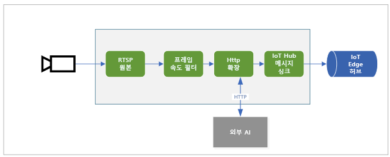

# <a name="quickstart-analyze-live-video-by-using-your-own-model"></a>빠른 시작: 사용자 고유의 모델을 사용하여 라이브 비디오 분석

이 빠른 시작에서는 Live Video Analytics on IoT Edge를 사용하여 시뮬레이션된 IP 카메라에서 라이브 비디오 피드를 분석하는 방법을 보여 줍니다. 컴퓨터 비전 모델을 적용하여 개체를 감지하는 방법을 볼 수 있습니다. 라이브 비디오 피드의 프레임 하위 집합은 유추 서비스로 보냅니다. 결과는 IoT Edge Hub로 보냅니다. 

이 빠른 시작에서는 Azure VM을 IoT Edge 디바이스로 사용하고, 시뮬레이션된 라이브 비디오 스트림을 사용합니다. C#으로 작성된 샘플 코드 및 [동작 감지 및 이벤트 내보내기](detect-motion-emit-events-quickstart.md) 빠른 시작을 기반으로 합니다. 

## <a name="prerequisites"></a>필수 구성 요소

* 활성 구독이 있는 Azure 계정. 계정이 아직 없는 경우 [체험 계정을 만들](https://azure.microsoft.com/free/?WT.mc_id=A261C142F) 수 있습니다.
* [Visual Studio Code](https://code.visualstudio.com/)(다음 확장 포함)
    * [Azure IoT Tools](https://marketplace.visualstudio.com/items?itemName=vsciot-vscode.azure-iot-tools)
    * [C#](https://marketplace.visualstudio.com/items?itemName=ms-dotnettools.csharp)
* [.NET Core 3.1 SDK](https://dotnet.microsoft.com/download/dotnet-core/3.1)
* [동작 감지 및 이벤트 내보내기](detect-motion-emit-events-quickstart.md) 빠른 시작을 완료하지 않은 경우 [Azure 리소스](detect-motion-emit-events-quickstart.md#set-up-azure-resources)를 설치해야 합니다.

> [!TIP]
> Azure IoT Tools를 설치하는 경우 Docker를 설치하라는 메시지가 표시될 수 있습니다. 이 메시지는 무시할 수 있습니다.

## <a name="review-the-sample-video"></a>샘플 비디오 검토
Azure 리소스가 설치되면 고속도로 교통에 대한 짧은 비디오가 IoT Edge 디바이스로 사용하는 Azure의 Linux VM에 복사됩니다. 이 빠른 시작에서는 비디오 파일을 사용하여 라이브 스트림을 시뮬레이션합니다.

[VLC 미디어 플레이어](https://www.videolan.org/vlc/)와 같은 애플리케이션을 엽니다. Ctrl+N을 선택한 다음, [비디오](https://lvamedia.blob.core.windows.net/public/camera-300s.mkv)에 대한 링크를 붙여넣어 재생을 시작합니다. 고속도로 교통에서 이동하는 많은 차량의 영상이 표시됩니다.

이 빠른 시작에서는 Live Video Analytics on IoT Edge를 사용하여 차량 및 사람과 같은 개체를 감지합니다. 연결된 유추 이벤트를 IoT Edge Hub에 게시합니다.

## <a name="overview"></a>개요



이 다이어그램에서는 이 빠른 시작의 신호 흐름을 보여 줍니다. [에지 모듈](https://github.com/Azure/live-video-analytics/tree/master/utilities/rtspsim-live555)은 RTSP(Real-Time Streaming Protocol) 서버를 호스팅하는 IP 카메라를 시뮬레이션합니다. [RTSP 원본](media-graph-concept.md#rtsp-source) 노드는 이 서버에서 비디오 피드를 가져와서 비디오 프레임을 [프레임 속도 필터 프로세서](media-graph-concept.md#frame-rate-filter-processor) 노드로 보냅니다. 이 프로세서는 [HTTP 확장 프로세서](media-graph-concept.md#http-extension-processor) 노드에 도달하는 비디오 스트림의 프레임 속도를 제한합니다. 

HTTP 확장 노드는 프록시 역할을 수행합니다. 비디오 프레임을 지정된 이미지 형식으로 변환합니다. 그런 다음, REST를 통해 이미지를 HTTP 엔드포인트 내부에서 AI 모델을 실행하는 다른 에지 모듈에 릴레이합니다. 이 예에서 해당 에지 모듈은 다양한 형식의 개체를 감지할 수 있는 [YOLOv3](https://github.com/Azure/live-video-analytics/tree/master/utilities/video-analysis/yolov3-onnx) 모델을 사용하여 빌드됩니다. HTTP 확장 프로세서 노드는 감지 결과를 수집하고, 이벤트를 [IoT Hub 싱크](media-graph-concept.md#iot-hub-message-sink) 노드에 게시합니다. 그런 다음, 노드에서 이러한 이벤트를 [IoT Edge Hub](../../iot-edge/iot-edge-glossary.md#iot-edge-hub)에 보냅니다.

이 빠른 시작에서는 다음을 수행합니다.

1. 미디어 그래프를 만들고 배포합니다.
1. 결과를 해석합니다.
1. 리소스를 정리합니다.


## <a name="create-and-deploy-the-media-graph"></a>미디어 그래프를 만들고 배포
    
### <a name="examine-and-edit-the-sample-files"></a>샘플 파일 검사 및 편집

필수 구성 요소의 일부로 샘플 코드를 폴더에 다운로드했습니다. 다음 단계에 따라 샘플 파일을 검사하고 편집합니다.

1. Visual Studio Code에서 *src/edge*로 이동합니다. *env* 파일 및 몇 가지 배포 템플릿 파일이 표시됩니다.

    배포 템플릿은 에지 디바이스에 대한 배포 매니페스트를 나타냅니다. 일부 자리 표시자 값을 포함합니다. *.env* 파일에는 이러한 변수에 대한 값이 포함되어 있습니다.

1. *src/cloud-to-device-console-app* 폴더로 이동합니다. 여기에는 *appsettings.json* 파일 및 몇 가지 다른 파일이 표시됩니다.

    * ***c2d-console-app.csproj*** - Visual Studio Code에 대한 프로젝트 파일
    * ***operations.json*** - 프로그램을 실행하려는 작업의 목록
    * ***Program.cs*** - 샘플 프로그램 코드 이 코드에서는 다음을 수행합니다.

        * 앱 설정을 로드합니다.
        * Live Video Analytics on IoT Edge 모듈에서 공개하는 직접 메서드를 호출합니다. 모듈을 사용하여 해당 [직접 메서드](direct-methods.md)를 호출하여 라이브 비디오 스트림을 분석할 수 있습니다.
        * **터미널** 창에서 프로그램의 출력을 검사하고, **출력** 창에서 모듈에서 생성된 이벤트를 검사할 수 있도록 일시 중지합니다.
        * 리소스를 정리하는 직접 메서드를 호출합니다.


1. *operations.json* 파일을 편집합니다.
    * 그래프 토폴로지에 대한 링크를 변경합니다.

        `"topologyUrl" : "https://raw.githubusercontent.com/Azure/live-video-analytics/master/MediaGraph/topologies/httpExtension/topology.json"`

    * `GraphInstanceSet` 아래에서 이전 링크의 값과 일치하도록 그래프 토폴로지의 이름을 편집합니다.

      `"topologyName" : "InferencingWithHttpExtension"`

    * `GraphTopologyDelete` 아래에서 이름을 편집합니다.

      `"name": "InferencingWithHttpExtension"`

### <a name="generate-and-deploy-the-iot-edge-deployment-manifest"></a>IoT Edge 배포 매니페스트 생성 및 배포

1. 마우스 오른쪽 단추로 *src/edge/ deployment.yolov3.template.json* 파일을 클릭하고, **IoT Edge 배포 매니페스트 생성**을 클릭합니다.

      

    *deployment.yolov3.amd64.json* 매니페스트 파일은 *src/edge/config* 폴더에 만들어집니다.

1. [동작 감지 및 이벤트 내보내기](detect-motion-emit-events-quickstart.md) 빠른 시작을 완료한 경우 이 단계를 건너뜁니다. 

    그렇지 않으면 왼쪽 아래 모서리의 **Azure IoT Hub** 창 근처에서 **기타 작업** 아이콘을 선택한 다음, **IoT Hub 연결 문자열 설정**을 선택합니다. *appsettings.json* 파일에서 문자열을 복사할 수 있습니다. 또는 Visual Studio Code 내에서 적절한 IoT 허브를 구성했는지 확인하려면 [IoT 허브 선택 명령](https://github.com/Microsoft/vscode-azure-iot-toolkit/wiki/Select-IoT-Hub)을 사용합니다.
    
    

1. 마우스 오른쪽 단추로 *src/edge/config/ deployment.yolov3.amd64.json*을 클릭하고, **단일 디바이스용 배포 만들기**를 선택합니다. 

    

1. IoT Hub 디바이스를 선택하라는 메시지가 표시되면 **lva-sample-device**를 선택합니다.
1. 약 30초 후 창의 왼쪽 아래 모서리에서 Azure IoT Hub를 새로 고칩니다. 이제 에지 디바이스에 다음과 같은 배포된 모듈이 표시됩니다.

    * **lvaEdge**라는 이름의 Live Video Analytics 모듈
    * **rtspsim** 모듈 - RTSP 서버를 시뮬레이션하고 라이브 비디오 피드의 원본으로 작동합니다.
    * **yolov3** 모듈 - 컴퓨터 비전을 이미지에 적용하고, 개체 형식의 여러 클래스를 반환하는 YOLOv3 개체 감지 모델입니다.
 
      

### <a name="prepare-to-monitor-events"></a>이벤트 모니터링 준비

마우스 오른쪽 단추로 Live Video Analytics 디바이스를 클릭하고, **기본 제공 이벤트 엔드포인트 모니터링 시작**을 선택합니다. 이 단계는 Visual Studio Code의 **출력** 창에서 IoT Hub 이벤트를 모니터링하는 데 필요합니다. 

 

### <a name="run-the-sample-program"></a>샘플 프로그램 실행

1. 디버깅 세션을 시작하려면 F5 키를 선택합니다. **터미널** 창에 메시지가 출력되어 표시됩니다.
1. *operations.json* 코드가 `GraphTopologyList` 및 `GraphInstanceList` 직접 메서드를 호출하여 시작됩니다. 이전 빠른 시작이 완료된 후에 리소스를 정리한 경우 이 프로세스에서 빈 목록을 반환한 다음, 일시 중지합니다. 계속하려면 Enter 키를 선택합니다.

   ```
   --------------------------------------------------------------------------
   Executing operation GraphTopologyList
   -----------------------  Request: GraphTopologyList  --------------------------------------------------
   {
   "@apiVersion": "1.0"
   }
   ---------------  Response: GraphTopologyList - Status: 200  ---------------
   {
   "value": []
   }
   --------------------------------------------------------------------------
   Executing operation WaitForInput
   Press Enter to continue
   ```

    **터미널** 창에 다음 직접 메서드 호출 세트가 표시됩니다.

     * 이전 `topologyUrl`을 사용하는 `GraphTopologySet`에 대한 호출
     * 다음 본문을 사용하는 `GraphInstanceSet`에 대한 호출

         ```
         {
           "@apiVersion": "1.0",
           "name": "Sample-Graph-1",
           "properties": {
             "topologyName": "InferencingWithHttpExtension",
             "description": "Sample graph description",
             "parameters": [
               {
                 "name": "rtspUrl",
                 "value": "rtsp://rtspsim:554/media/camera-300s.mkv"
               },
               {
                 "name": "rtspUserName",
                 "value": "testuser"
               },
               {
                 "name": "rtspPassword",
                 "value": "testpassword"
               }
             ]
           }
         }
         ```

     * 그래프 인스턴스 및 비디오 흐름을 시작하는 `GraphInstanceActivate`에 대한 호출
     * 그래프 인스턴스가 실행 중 상태임을 보여 주는 `GraphInstanceList`에 대한 두 번째 호출
1. **터미널** 창의 출력이 `Press Enter to continue` 프롬프트에서 일시 중지됩니다. 아직 Enter 키를 선택하지 마세요. 위로 스크롤하여 호출한 직접 메서드에 대한 JSON 응답 페이로드를 확인합니다.
1. Visual Studio Code에서 **출력** 창으로 전환합니다. Live Video Analytics on IoT Edge 모듈에서 IoT 허브에 보내는 메시지가 표시됩니다. 이 빠른 시작의 다음 섹션에서는 이러한 메시지에 대해 설명합니다.
1. 미디어 그래프가 계속 실행되어 결과를 출력합니다. RTSP 시뮬레이터가 원본 비디오를 계속 반복합니다. 미디어 그래프를 중지하려면 **터미널** 창으로 돌아가서 Enter 키를 선택합니다. 

    일련의 다음 호출은 리소스를 정리합니다.
      * `GraphInstanceDeactivate`에 대한 호출은 그래프 인스턴스를 비활성화합니다.
      * `GraphInstanceDelete`에 대한 호출은 인스턴스를 삭제합니다.
      * `GraphTopologyDelete`에 대한 호출은 토폴로지를 삭제합니다.
      * `GraphTopologyList`에 대한 최종 호출은 목록이 비어 있음을 보여 줍니다.

## <a name="interpret-results"></a>결과 해석

미디어 그래프를 실행하면 HTTP 확장 프로세서 노드의 결과가 IoT Hub 싱크 노드를 통해 IoT 허브로 전달됩니다. **출력** 창에 표시되는 메시지에는 `body` 섹션 및 `applicationProperties` 섹션이 포함되어 있습니다. 자세한 내용은 [IoT Hub 메시지 만들기 및 읽기](https://docs.microsoft.com/azure/iot-hub/iot-hub-devguide-messages-construct)를 참조하세요.

다음 메시지에서 Live Video Analytics 모듈은 애플리케이션 속성 및 본문의 콘텐츠를 정의합니다. 

### <a name="mediasessionestablished-event"></a>MediaSessionEstablished 이벤트

미디어 그래프가 인스턴스화되면 RTSP 원본 노드가 rtspsim-live555 컨테이너에서 실행되는 RTSP 서버에 연결을 시도합니다. 연결에 성공하면 다음 이벤트가 출력됩니다. 이벤트 유형은 `Microsoft.Media.MediaGraph.Diagnostics.MediaSessionEstablished`입니다.

```
[IoTHubMonitor] [9:42:18 AM] Message received from [lvaedgesample/lvaEdge]:
{
  "body": {
    "sdp": "SDP:\nv=0\r\no=- 1586450538111534 1 IN IP4 nnn.nn.0.6\r\ns=Matroska video+audio+(optional)subtitles, streamed by the LIVE555 Media Server\r\ni=media/camera-300s.mkv\r\nt=0 0\r\na=tool:LIVE555 Streaming Media v2020.03.06\r\na=type:broadcast\r\na=control:*\r\na=range:npt=0-300.000\r\na=x-qt-text-nam:Matroska video+audio+(optional)subtitles, streamed by the LIVE555 Media Server\r\na=x-qt-text-inf:media/camera-300s.mkv\r\nm=video 0 RTP/AVP 96\r\nc=IN IP4 0.0.0.0\r\nb=AS:500\r\na=rtpmap:96 H264/90000\r\na=fmtp:96 packetization-mode=1;profile-level-id=4D0029;sprop-parameter-sets=Z00AKeKQCgC3YC3AQEBpB4kRUA==,aO48gA==\r\na=control:track1\r\n"
  },
  "applicationProperties": {
    "dataVersion": "1.0",
    "topic": "/subscriptions/{subscriptionID}/resourceGroups/{name}/providers/microsoft.media/mediaservices/hubname",
    "subject": "/graphInstances/GRAPHINSTANCENAMEHERE/sources/rtspSource",
    "eventType": "Microsoft.Media.MediaGraph.Diagnostics.MediaSessionEstablished",
    "eventTime": "2020-04-09T16:42:18.1280000Z"
  }
}
```

이 메시지에서 다음 세부 정보를 확인합니다.

* 메시지는 진단 이벤트입니다. `MediaSessionEstablished`는 RTSP 원본 노드(주체)에서 RTSP 시뮬레이터에 연결하고 라이브 피드(시뮬레이션된)를 받기 시작했음을 나타냅니다.
* `applicationProperties`에서 `subject`는 메시지가 미디어 그래프의 RTSP 원본 노드에서 생성되었음을 나타냅니다.
* `applicationProperties`에서 `eventType`은 이 이벤트가 진단 이벤트임을 나타냅니다.
* `eventTime`은 이벤트가 발생한 시간을 나타냅니다.
* `body`에는 진단 이벤트에 대한 데이터가 포함됩니다. 이 경우 데이터는 [SDP(세션 설명 프로토콜)](https://en.wikipedia.org/wiki/Session_Description_Protocol) 세부 정보로 구성됩니다.

### <a name="inference-event"></a>유추 이벤트

HTTP 확장 프로세서 노드는 yolov3 모듈에서 유추 결과를 받습니다. 그런 다음, IoT Hub 싱크 노드를 통해 결과를 유추 이벤트로 내보냅니다. 

이러한 이벤트에서 유형은 자동차 또는 트럭과 같은 엔터티임을 나타내기 위해 `entity`로 설정됩니다. `eventTime` 값은 개체가 감지된 UTC 시간입니다. 

다음 예제에서는 신뢰 수준이 서로 다른 두 개의 자동차가 동일한 비디오 프레임에서 감지되었습니다.

```
[IoTHubMonitor] [11:37:17 PM] Message received from [lva-sample-device/lvaEdge]:
{
  "body": {
    "inferences": [
      {
        "entity": {
          "box": {
            "h": 0.0344108157687717,
            "l": 0.5756940841674805,
            "t": 0.5929375966389974,
            "w": 0.04484643936157227
          },
          "tag": {
            "confidence": 0.8714089393615723,
            "value": "car"
          }
        },
        "type": "entity"
      },
      {
        "entity": {
          "box": {
            "h": 0.03960910373263889,
            "l": 0.2750667095184326,
            "t": 0.6102327558729383,
            "w": 0.031027007102966308
          },
          "tag": {
            "confidence": 0.7042660713195801,
            "value": "car"
          }
        },
        "type": "entity"
      }
    ]
  },
  "applicationProperties": {
    "topic": "/subscriptions/{subscriptionID}/resourceGroups/{name}/providers/microsoft.media/mediaservices/hubname",
    "subject": "/graphInstances/GRAPHINSTANCENAMEHERE/processors/inferenceClient",
    "eventType": "Microsoft.Media.Graph.Analytics.Inference",
    "eventTime": "2020-04-23T06:37:16.097Z"
  }
}
```

메시지에서 다음 세부 정보를 확인합니다.

* `applicationProperties`에서 `subject`는 메시지가 생성된 그래프 토폴로지의 노드를 참조합니다. 
* `applicationProperties`에서 `eventType`은 이 이벤트가 분석 이벤트임을 나타냅니다.
* `eventTime` 값은 이벤트가 발생한 시간을 나타냅니다.
* `body` 섹션에는 분석 이벤트에 대한 데이터가 포함됩니다. 이 경우 이벤트는 유추 이벤트이므로 본문에 `inferences` 데이터가 포함됩니다.
* `inferences` 섹션은 `type`이 `entity`임을 나타냅니다. 이 섹션에는 엔터티에 대한 추가 데이터가 포함됩니다.

## <a name="clean-up-resources"></a>리소스 정리

다른 빠른 시작을 사용하려면 여기서 만든 리소스를 그대로 유지합니다. 그렇지 않으면 Azure Portal, 리소스 그룹으로 차례로 이동하고, 이 빠른 시작을 실행한 리소스 그룹을 선택한 다음, 모든 리소스를 삭제합니다.

## <a name="next-steps"></a>다음 단계

고급 사용자에 대한 추가 문제를 검토합니다.

* RTSP 시뮬레이터를 사용하는 대신 RTSP를 지원하는 [IP 카메라](https://en.wikipedia.org/wiki/IP_camera)를 사용합니다. [ONVIF 규격](https://www.onvif.org/conformant-products/) 제품 페이지에서 RTSP를 지원하는 IP 카메라를 검색할 수 있습니다. G, S 또는 T 프로필을 준수하는 디바이스를 찾습니다.
* Azure Linux VM 대신 AMD64 또는 x64 Linux 디바이스를 사용합니다. 이 디바이스는 IP 카메라와 동일한 네트워크에 있어야 합니다. [Linux에 Azure IoT Edge 런타임 설치](https://docs.microsoft.com/azure/iot-edge/how-to-install-iot-edge-linux)의 지침을 따릅니다. 그런 다음, [가상 Linux 디바이스에 첫 번째 IoT Edge 모듈 배포](https://docs.microsoft.com/azure/iot-edge/quickstart-linux)의 지침에 따라 디바이스를 Azure IoT Hub에 등록합니다.

