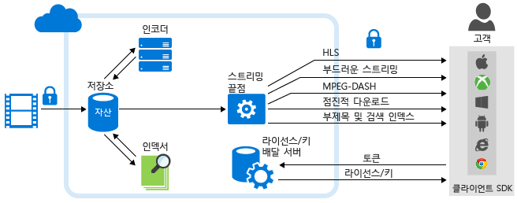

<properties
	pageTitle="Azure 미디어 서비스 분석 개요 | Microsoft Azure"
	description="Azure 미디어 서비스에서는 엔터프라이즈 규모, 규정 준수, 보안 및 전 세계 범위의 음성 및 컴퓨터 비전 서비스 컬렉션인 Azure 미디어 분석의 공개 미리 보기를 제공합니다. Azure 미디어 분석 서비스는 핵심 Azure 미디어 서비스 플랫폼 구성 요소를 사용하여 구축되었으므로 대규모 미디어를 하루에 처리할 수 있습니다. "
	services="media-services"
	documentationCenter=""
	authors="juliako"
	manager="erikre"
	editor=""/>

<tags
	ms.service="media-services"
	ms.workload="media"
	ms.tgt_pltfrm="na"
	ms.devlang="dotnet"
	ms.topic="article"
	ms.date="09/14/2016"   
	ms.author="milanga;juliako;johndeu"/>

# Azure 미디어 서비스 분석 개요 | Microsoft Azure

##개요

직원을 교육하고, 고객을 참여시키고, 비즈니스 기능을 문서화하는 기본 미디어로 비디오를 도입하는 조직 및 기업이 늘어나고 있습니다. 클라우드 컴퓨팅을 사용하면 이러한 대용량 미디어 파일을 효과적으로 저장, 스트리밍 및 액세스할 수 있지만 기업의 비디오 콘텐츠 라이브러리가 증가함에 따라 대상 그룹과의 보다 의미 있고 개인화된 상호 작용을 만들고 비즈니스 수준을 한 단계 끌어올리기 위해 비디오에서 새로운 통찰력을 추출할 수 있는 효과적인 수단이 있어야 합니다.

이러한 증가하는 시장 수요를 해결하기 위해 Azure 미디어 서비스에서는 조직과 기업이 비디오 파일에서 실질적인 통찰력을 끌어내기 쉽도록 만드는 언어 및 시각 구성 요소 모음인 미디어 분석을 엔터프라이즈 규모, 규정 준수, 보안 및 전 세계 범위로 제공합니다. Azure 미디어 분석 서비스는 핵심 Azure 미디어 서비스 플랫폼 구성 요소를 사용하여 구축되었으므로 대규모 미디어를 하루에 처리할 수 있습니다.

Azure 미디어 분석을 통해 개발자는 제한된 규모로 비디오에 대한 비전 기능을 신속하게 시작하고 이 고급 기능을 Bot 및 응용 프로그램으로 가져올 수 있습니다. Azure 미디어 분석은 대기업에 필요한 전체 규모, 규정 준수, 보안 및 전 세계 범위의 엔터프라이즈 환경에서 사용되도록 구축되었습니다.

다음 다이어그램에서는 **미디어 분석** 및 미디어 서비스 플랫폼의 다른 주요 부분을 보여 줍니다. 미디어 분석 미디어 프로세서는 MP4 파일 또는 JSON 파일을 생성합니다. 미디어 프로세서가 MP4 파일을 생한 경우 파일을 점진적으로 다운로드할 수 있습니다. 미디어 프로세서가 JSON 파일을 생성한 경우 Azure Blob 저장소에서 해당 파일을 다운로드할 수 있습니다.

## Azure 미디어 분석 서비스

- **인덱서** – Azure 미디어 인덱서를 사용하면 콘텐츠를 검색할 수 있도록 설정하고 선택 캡션 트랙을 생성할 수 있습니다. Azure 미디어 서비스에서는 보다 빠른 인덱싱 및 광범위한 언어를 지원하는 **Azure 미디어 인덱서 2 미리 보기**를 릴리스했습니다. 지원되는 언어는 영어, 스페인어, 프랑스어, 독일어, 이탈리아어, 중국어, 포르투갈어, 아랍어 등입니다. 자세한 내용 및 예제는 [Azure 미디어 인덱서 2를 사용하여 비디오 처리](media-services-process-content-with-indexer2.md)를 참조하세요.
 
- **Hyperlapse** – Microsoft Hyperlapse는 MSR(Microsoft Research)의 20여 년에 걸친 컴퓨터 비전 연구의 결과로서, 비디오 안정화 및 시간 경과를 결합하여 긴 형식의 콘텐츠에서 빠르고 소비 가능하며 매력적인 비디오를 만듭니다. 시간 경과를 만드는 것 외에 Hyperlapse를 사용하여 휴대폰 및 캠코더를 통해 캡처한 흔들리는 비디오에서 안정적인 비디오를 만들 수 있습니다. 자세한 내용 및 예제는 [Hyperlapse 미디어 파일 및 Azure 미디어 Hyperlapse](media-services-hyperlapse-content.md)를 참조하세요.
 
- **동작 감지** – 이 서비스를 사용하여 편지지 배경의 비디오에서 동작을 감지할 수 있습니다. 이는 감시 비디오 피드에서 감시 카메라로 감지된 동작 이벤트에 대해 가양성을 확인하려는 고객에게 적합합니다. 자세한 내용 및 예제는 [Azure 미디어 분석에 대한 동작 감지](media-services-motion-detection.md)를 참조하세요.
 
- **얼굴 감지 및 얼굴 감정** – 이 서비스를 사용하면 사람의 얼굴과 이들의 감정(행복, 슬픔, 놀람, 분노, 경멸, 두려움, 혐오, 무관심/중립 등)을 감지할 수 있습니다. 여기에는 이벤트 참여자의 반응을 집계하고 분석하는 등 아래에 설명된 몇 가지 유용한 산업 응용 분야가 있습니다. 자세한 내용 및 예제는 [Azure 미디어 분석에 대한 얼굴 및 감정 감지](media-services-face-and-emotion-detection.md)를 참조하세요.
 
- **비디오 요약** - 비디오 요약을 사용하면 원본 비디오에서 흥미로운 조각을 자동으로 선택하여 긴 비디오의 요약을 만들 수 있습니다. 이는 긴 비디오에서 예상되는 사항에 대한 빠른 개요를 제공하려는 경우에 유용합니다. 자세한 내용 및 예제는 [Azure 미디어 비디오 미리 보기를 사용하여 비디오 요약 만들기](media-services-video-summarization.md)를 참조하세요.

- **광학 문자 인식** - Azure 미디어 분석 OCR(광학 문자 인식)을 사용하면 비디오 파일의 텍스트 콘텐츠를 편집 및 검색 가능한 디지털 텍스트로 변환할 수 있습니다. 이 방법을 사용하면 미디어의 비디오 신호에서 의미 있는 메타데이터를 자동으로 추출할 수 있습니다.
 
- **확장성 있는 얼굴 편집** - **Azure Media Redactor**는 클라우드에서 확장성 있는 얼굴 편집 기능을 제공하는 Azure Media Analytics MP입니다. 얼굴 편집을 사용하면 선택한 개인의 얼굴을 흐리게 표시하기 위해 동영상을 수정할 수 있습니다. 공공 안전과 새 미디어 시나리오를 위해 얼굴 편집 서비스를 사용할 수 있습니다. 짧은 장면이라도 여러 명의 얼굴이 포함된 경우 수동으로 편집하려면 많은 시간이 걸릴 수 있지만 이 서비스를 사용하면 몇 번의 간단한 단계를 통해 얼굴을 편집할 수 있습니다. 자세한 내용은 [이](media-services-face-redaction.md) 문서를 참조하세요.

 
## 일반적인 시나리오

다음은 Azure 미디어 분석을 통해 전체 산업의 조직 및 기업이 비디오에서 새로운 통찰력을 수집하여 더욱 개인화된 대상 그룹 및 직원 관계를 구축하고 많은 양의 비디오 콘텐츠를 보다 효과적으로 관리할 수 있는 몇 가지 시나리오입니다.

- **콜 센터** – 소셜 미디어의 출현에도 고객 콜 센터는 여전히 고객 서비스 트랜잭션의 많은 부분을 용이하게 합니다. 이 오디오 데이터에는 고객 만족도 향상을 위해 콜 센터 직원을 교육하고 제품 로드맵을 개선하기 위해 분석할 수 있는 고객에 대한 다양한 정보가 인코딩되어 있습니다. Azure 미디어 인덱서를 사용하여 고객은 텍스트를 추출할 수 있으며, 가장 일반적인 불만, 불만의 원인 및 기타 이와 관련된 데이터에 대한 인텔리전스를 추출할 검색 인덱스 및 대시보드를 작성할 수 있습니다.

- **사용자 생성 콘텐츠 감수** – 뉴스 미디어 방송국부터 경찰서까지 많은 조직에는 비디오 및 이미지와 같은 UGC 미디어를 허용하는 공공 포털이 있습니다. 예기치 않은 이벤트로 인해 콘텐츠 양이 급증할 수 있습니다. 이러한 시나리오에서는 콘텐츠의 적합성을 수동으로 효과적으로 검토하는 것이 거의 불가능합니다. 고객은 콘텐츠 감수 서비스에 의존하여 적절한 콘텐츠에 중점을 둘 수 있습니다.

- **감시** - IP 카메라의 성장으로 감시 비디오가 급증하고 있습니다. 감시 비디오를 수동으로 검토하는 것은 많은 시간이 소요되고 실수가 발생하기 쉽습니다. Azure 미디어 분석에서는 파생물을 보다 쉽게 검토, 관리 및 생성할 수 있도록 동작 감지, 얼굴 감지 및 Hyperlapse와 같은 여러 구성 요소를 제공합니다.

## 미디어 서비스 분석 미디어 프로세서 

이 섹션에서는 모든 미디어 서비스 분석 MP(미디어 프로세서)를 나열하고 .NET 또는 REST를 사용하여 MP 개체를 가져옵니다.

### MP 이름

- Azure 미디어 인덱서 2 미리 보기
- Azure 미디어 인덱서
- Azure 미디어 Hyperlapse
- Azure 미디어 얼굴 탐지기
- Azure 미디어 동작 탐지기
- Azure 미디어 비디오 미리 보기
- Azure 미디어 OCR

### .NET

다음 함수는 지정된 MP 이름 중 하나를 사용하고 MP 개체를 반환합니다.

    static IMediaProcessor GetLatestMediaProcessorByName(string mediaProcessorName)
    {
        var processor = _context.MediaProcessors
            .Where(p => p.Name == mediaProcessorName)
            .ToList()
            .OrderBy(p => new Version(p.Version))
            .LastOrDefault();

        if (processor == null)
            throw new ArgumentException(string.Format("Unknown media processor",
                                                       mediaProcessorName));

        return processor;
    }

## REST (영문)

요청:

	GET https://media.windows.net/api/MediaProcessors()?$filter=Name%20eq%20'Azure%20Media%20OCR' HTTP/1.1
	DataServiceVersion: 1.0;NetFx
	MaxDataServiceVersion: 3.0;NetFx
	Accept: application/json
	Accept-Charset: UTF-8
	User-Agent: Microsoft ADO.NET Data Services
	Authorization: Bearer <token>
	x-ms-version: 2.12
	Host: media.windows.net
	
응답:
		
	. . .
	
	{  
	   "odata.metadata":"https://media.windows.net/api/$metadata#MediaProcessors",
	   "value":[  
	      {  
	         "Id":"nb:mpid:UUID:074c3899-d9fb-448f-9ae1-4ebcbe633056",
	         "Description":"Azure Media OCR",
	         "Name":"Azure Media OCR",
	         "Sku":"",
	         "Vendor":"Microsoft",
	         "Version":"1.1"
	      }
	   ]
	}

##데모

[Azure 미디어 분석 데모](http://azuremedialabs.azurewebsites.net/demos/Analytics.html)

##다음 단계

미디어 서비스 학습 경로를 검토합니다.

[AZURE.INCLUDE [media-services-learning-paths-include](../../includes/media-services-learning-paths-include.md)]

##피드백 제공

[AZURE.INCLUDE [media-services-user-voice-include](../../includes/media-services-user-voice-include.md)]

##관련 문서

[미디어 서비스 분석 알림](https://azure.microsoft.com/blog/introducing-azure-media-analytics/)
  

<!-- Images -->

[overview]: ./media/media-services-video-on-demand-workflow/media-services-video-on-demand.png

<!---HONumber=AcomDC_0921_2016-->