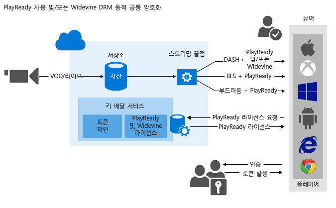

<properties 
	pageTitle="콘텐츠 보호 개요 | Microsoft Azure" 
	description="이 기사는 미디어 서비스 콘텐츠 보호에 대한 개요를 제공합니다." 
	services="media-services" 
	documentationCenter="" 
	authors="Juliako" 
	manager="erikre" 
	editor=""/>

<tags 
	ms.service="media-services" 
	ms.workload="media" 
	ms.tgt_pltfrm="na" 
	ms.devlang="na" 
	ms.topic="article" 
	ms.date="09/19/2016" 
	ms.author="juliako"/>

#콘텐츠 보호 개요

Microsoft Azure 미디어 서비스를 사용하면 컴퓨터를 떠날 때부터 저장, 처리 및 배달에 이르는 과정 내내 미디어를 보호할 수 있습니다. 미디어 서비스를 사용하면 128비트 암호화 키를 사용하는 AES(Advanced Encryption Standard) 및 PlayReady 및/또는 Widevine DRM을 사용하는 공통 암호화(CENC)로 동적 암호화된 콘텐츠를 제공할 수 있습니다. 또한 미디어 서비스는 인증된 클라이언트에 AES 키 및 PlayReady 라이선스를 전달하는 서비스를 제공합니다. 또한 다음 AMS 파트너를 사용하여 Widevine 라이선스를 배달할 수 있습니다. [Axinom](http://www.axinom.com/press/ibc-axinom-drm-6/), [EZDRM](http://ezdrm.com/), [castLabs](http://castlabs.com/company/partners/azure/).

- 다음 이미지는 "PlayReady 및/또는 Widevine DRM 동적 일반 암호화" 워크플로를 보여 줍니다. 자세한 내용은 [PlayReady 및/또는 Widevine DRM 동적 일반 암호화 사용](media-services-protect-with-drm.md)을 참조하세요.

- 다음 이미지는 "AES-128 동적 암호화" 워크플로를 보여 줍니다. 자세한 내용은 [AES-128 동적 암호화 및 키 배달 서비스 사용](media-services-protect-with-aes128.md)을 참조하세요.

>[AZURE.NOTE]동적 암호화를 사용할 수 있으려면 먼저 암호화된 콘텐츠를 스트리밍하려는 스트리밍 끝점에서 하나 이상의 스트리밍 예약 단위를 가져와야 합니다.

##자산 암호화 옵션

업로드, 저장 및 배달하려는 콘텐츠의 유형에 따라 미디어 서비스는 선택할 수 있는 다양한 암호화 옵션을 제공합니다.

###없음

암호화가 사용되지 않습니다. 기본값입니다. 이 옵션을 사용하면 콘텐츠가 전송 중인 상태이거나 저장소에 저장된 상태일 때 보호되지 않습니다.

점진적 다운로드를 사용하여 MP4를 배달하려는 경우 이 옵션을 사용하여 콘텐츠를 업로드합니다.

###StorageEncrypted

AES 256비트 암호화를 사용하여 암호화되지 않은 콘텐츠를 로컬에서 암호화한 다음에 암호화되어 저장된 Azure 저장소에 업로드하려면 **StorageEncrypted**를 사용합니다. 저장소 암호화로 보호된 자산은 자동으로 암호 해제되어 인코딩되기 전에 암호화된 파일 시스템에 배치됩니다. 그리고 필요에 따라 새 출력 자산으로 다시 업로드되기 전에 다시 암호화됩니다. 저장소 암호화를 사용하는 기본적인 사례는 디스크에 저장된 상태일 때 강력한 암호화로 고품질의 입력 미디어 파일을 보호하려는 경우입니다.

저장소에서 암호화된 자산을 배달하려면 미디어 서비스에서 콘텐츠 배달 방법을 알 수 있도록 자산의 배달 정책을 구성해야 합니다. 자산을 스트리밍하기 전에 스트리밍 서버에서 저장소 암호화를 제거하고 지정된 배달 정책(예: AES, 일반 암호화 또는 암호화 없음)을 사용하여 콘텐츠를 스트리밍합니다.

####구현 세부 정보

AMS 저장소 암호화는 **AES-CTR** 모드 암호화를 전체 파일에 적용합니다. AES CTR 모드는 임의 길이 데이터를 여백 없이 암호화할 수 있는 블록 암호화입니다. AES 알고리즘으로 카운터 블록을 암호화한 다음 암호화 또는 해독할 데이터에 대해 AES의 출력을 XOR 연산하는 방식으로 작동합니다. 사용되는 카운터 블록은 카운터 값의 0~7바이트에 InitializationVector 값을 복사하여 구조화되며 카운터 값의 8~15바이트는 0으로 설정됩니다. 16바이트 카운터 블록에서 8~15바이트(즉 최하위 바이트)는 부호 없는 64비트 단순 정수로 사용되며, 처리되는 후속 데이터 블록마다 1씩 증가하고 네트워크 바이트 순으로 유지됩니다. 이 정수가 최대값(0xFFFFFFFFFFFFFFFF)에 도달했을 때 이 값이 증가하면 카운터의 다른 64비트(즉 0~7바이트)에 미치는 영향 없이 블록 카운트가 0(8~15바이트)으로 재설정됩니다. AES-CTR 모드 암호화의 보안 유지를 위해 특정 KID의 InitializationVector 값은 파일마다 고유해야 하며 파일의 길이는 2^64블록 미만이어야 합니다. 이것은 카운터 값이 특정 키에서 재사용되지 않게 하기 위한 것입니다. CTR 모드에 대한 자세한 내용은 [이 wiki 페이지](https://en.wikipedia.org/wiki/Block_cipher_mode_of_operation#CTR)를 참조하세요(wiki 문서에서는 "InitializationVector" 대신 "Nonce"라는 용어를 사용함).

기본 알고리즘의 작동 방식을 확인 하려면 다음 메서드의 AMS.NET 구현을 살펴봅니다.

- [ApplyEncryptionTransform](https://github.com/Azure/azure-sdk-for-media-services/blob/dev/src/net/Client/Common/Common.BlobTransfer/BlobTransferBase.cs)
- [AesCtr](https://github.com/Azure/azure-sdk-for-media-services/blob/dev/src/net/Client/Common/Common.FileEncryption/FileEncryptionTransform.cs)

###CommonEncryptionProtected

일반적인 암호화로 콘텐츠를 암호화하거나 이미 암호화된 경우 콘텐츠를 업로드하려면 **CommonEncryptionProtected**를 사용합니다. PlayReady와 Widewine 모두 CENC(Common Encryption) 사양에 따라 암호화되며 AMS에서 지원됩니다.

###EnvelopeEncryptionProtected

AES(Advanced Encryption Standard)로 암호화된 HLS(HTTP 라이브 스트리밍)를 보호하거나 이미 보호된 경우 업로드하려면 **EnvelopeEncryptionProtected**를 사용합니다. AES로 이미 암호화된 HLS를 업로드하려는 경우 Transform Manager로 암호화되어 있어야 합니다.

##동적 암호화

Microsoft Azure 미디어 서비스를 사용하면 128비트 암호화 키를 사용하는 AES(Advanced Encryption Standard) 및 PlayReady 및/또는 Widevine DRM으로 동적 암호화된 콘텐츠를 제공할 수 있습니다.

현재 암호화할 수 있는 스트리밍 형식은 HLS, MPEG DASH 및 부드러운 스트리밍입니다. HDS 스트리밍 형식 또는 점진적 다운로드는 암호화할 수 없습니다.

미디어 서비스에서 자산을 암호화하려는 경우 암호화 키(CommonEncryption 또는 EnvelopeEncryption)를 자산에 연결하고 해당 키에 대해 권한 부여 정책도 구성해야 합니다.

또한 자산의 배달 정책을 구성해야 합니다. 저장소에서 암호화된 자산을 스트리밍하려면 자산 배달 정책을 구성하여 배달 방법을 지정해야 합니다.

플레이어가 스트림을 요청하면 미디어 서비스는 지정된 키를 사용하고 AES 또는 일반 암호화를 사용하여 동적으로 사용자의 콘텐츠를 암호화합니다. 스트림을 해독하기 위해 플레이어는 키 배달 서비스에서 키를 요청합니다. 사용자에게 키를 얻을 수 있는 권한이 있는지 여부를 결정하기 위해 서비스는 키에 지정된 권한 부여 정책을 평가합니다.

>[AZURE.NOTE]동적 암호화를 이용하려면 먼저 암호화된 콘텐츠를 배달할 계획인 스트리밍 끝점에 대한 주문형 스트리밍 단위를 하나 이상 가져와야 합니다. 자세한 내용은 [미디어 서비스 크기를 조정하는 방법](media-services-portal-manage-streaming-endpoints.md)을 참조하세요.

##라이선스 및 키 배달 서비스

미디어 서비스는 DRM(PlayReady 및 Widevine) 라이선스 및 AES 암호화되지 않은 키를 인증된 클라이언트에 배달하는 서비스를 제공합니다. Azure 클래식 포털, REST API 또는 Media Services SDK for .NET을 사용하여 라이선스 및 키에 대한 권한 부여 및 인증 정책을 구성할 수 있습니다.

포털을 사용하는 경우 하나의 AES 정책(모든 AES 암호화 콘텐츠에 적용됨)과 하나의 PlayReady 정책(모든 PlayReady 암호화 콘텐츠에 적용됨)을 구성할 수 있습니다. 보다 세밀하게 구성을 제어하려면 Media Services SDK for .NET을 사용하세요.

##DRM 라이선스

###PlayReady 라이선스

미디어 서비스는 PlayReady 라이선스를 배달하는 서비스를 제공합니다. 최종 사용자 플레이어(예: Silverlight)가 PlayReady로 보호된 콘텐츠를 재생하려고 하면 라이선스 배달 서비스로 요청을 보내 라이선스를 얻습니다. 라이선스 서비스에서 요청을 승인하면 클라이언트로 전송하여 지정된 콘텐츠의 암호를 해독하고 재생하는 데 사용할 수 있는 라이선스가 발급됩니다.

라이선스에는 사용자가 보호된 콘텐츠를 재생하려고 할 때 PlayReady DRM 런타임에서 적용하도록 하려는 권한 및 제한이 포함됩니다. 미디어 서비스는 PlayReady 라이선스를 구성할 수 있는 API를 제공합니다. 자세한 정보는 [미디어 서비스 PlayReady 라이선스 템플릿 개요](media-services-playready-license-template-overview.md)를 참조하세요.

###Widevine 라이선스

또한 AMS를 사용하면 Widevine DRM으로 암호화된 MPEG DASH를 배달할 수 있습니다. PlayReady와 Widewine 모두 CENC(Common Encryption) 사양에 따라 암호화됩니다. [AMS .NET SDK](https://www.nuget.org/packages/windowsazure.mediaservices/)(버전 3.5.1부터 시작) 또는 REST API를 통해 Widevine을 사용하도록 AssetDeliveryConfiguration을 구성할 수 있습니다.

미디어 서비스 .NET SDK 버전 3.5.2부터는 미디어 서비스를 사용하여 [Widevine 라이선스 템플릿](media-services-widevine-license-template-overview.md)을 구성하고 Widevine 라이선스를 얻을 수 있습니다. 또한 다음 AMS 파트너를 사용하여 Widevine 라이선스를 배달할 수 있습니다. [Axinom](http://www.axinom.com/press/ibc-axinom-drm-6/), [EZDRM](http://ezdrm.com/), [castLabs](http://castlabs.com/company/partners/azure/).

##토큰 제한

콘텐츠 키 권한 부여 정책에는 열기 또는 토큰 제한과 같은 하나 이상의 권한 부여 제한이 있을 수 있습니다. 토큰 제한 정책은 보안 토큰 서비스(STS)에 의해 발급된 토큰이 수반되어야 합니다. 미디어 서비스 지원 토큰에는 간단한 웹 토큰(SWT) 형식 및 JSON 웹 토큰(JWT) 형식의 토큰을 지원합니다. 미디어 서비스는 보안 토큰 서비스를 제공하지 않습니다. 사용자 지정 STS를 만들거나 Microsoft Azure ACS를 활용하여 토큰을 발급할 수 있습니다. 지정된 키로 서명된 토큰을 만들고 토큰 제한 구성에서 지정한 클레임을 발급하려면 반드시 STS를 구성해야 합니다. 토큰이 유효하고 해당 토큰의 클레임이 키(또는 라이선스)에 대해 구성된 클레임과 일치하는 경우 미디어 서비스 키 배달 서비스는 요청된 키(또는 라이선스)를 클라이언트에 반환합니다.

토큰 제한 정책을 구성하는 경우 기본 확인 키, 발급자 및 대상 매개 변수를 지정해야 합니다. 기본 확인 키는 토큰이 서명된 키를 포함하며 발급자는 토큰을 발행하는 보안 토큰 서비스입니다. 청중(범위) 라고도 함)은 토큰의 의도 또는 토큰이 접근을 인증하는 대상 리소스를 설명합니다. 미디어 서비스 키 배달 서비스는 이러한 토큰의 값이 템플릿 파일에 있는 값과 일치하는지 확인합니다.

##일반적인 시나리오

###저장소의 콘텐츠를 보호하고, 암호화된 스트리밍 미디어를 동적으로 배달하며, AMS 키/라이선스 배달 서비스를 사용합니다.

1. 자산에 고품질 mezzanine 파일을 수집합니다. 저장소 암호화 옵션을 자산에 적용합니다.
2. 스트리밍 끝점을 구성합니다.
1. 적응 비트 전송률 MP4 집합을 인코딩합니다. 저장소 암호화 옵션을 출력 자산에 적용합니다.
1. 재생하는 동안 동적으로 암호화하려는 경우 자산에 대한 암호화 콘텐츠 키를 만듭니다.
2. 콘텐츠 키 인증 정책을 구성합니다.
1. 자산 배달 정책(동적 패키징 및 동적 암호화에서 사용)을 구성합니다.
1. 주문형 로케이터를 만들어 자산을 게시합니다.
1. 게시된 콘텐츠를 스트리밍합니다.

자세한 내용은 [AES로 보호](media-services-protect-with-aes128.md) 및 [PlayReady 및/또는 Widevine으로 보호](media-services-protect-with-drm.md)를 참조하세요.

###사용자 고유의 암호화 및 스트리밍 서비스와 함께 미디어 서비스 키 및 라이선스 배달 서비스를 사용합니다.

자세한 내용은 [암호기/스트리밍 서버와 함께 Azure PlayReady 라이선스 서비스를 통합하는 방법](http://mingfeiy.com/integrate-azure-playready-license-service-encryptorstreaming-server)을 참조하세요.

###파트너와 통합

[castLabs를 사용하여 Azure 미디어 서비스에 DRM 라이선스 제공](media-services-castlabs-integration.md)

##미디어 서비스 학습 경로

[AZURE.INCLUDE [media-services-learning-paths-include](../../includes/media-services-learning-paths-include.md)]

##피드백 제공

[AZURE.INCLUDE [media-services-user-voice-include](../../includes/media-services-user-voice-include.md)]

##관련 링크

[Azure 미디어 서비스를 사용하여 AES 동적 암호화로 PlayReady 발표](http://mingfeiy.com/playready)

[Azure 미디어 서비스 PlayReady 라이선스 배달 가격 설명](http://mingfeiy.com/playready-pricing-explained-in-azure-media-services)

[Azure 미디어 서비스에서 AES 암호화된 스트림에 대한 디버깅 방법](http://mingfeiy.com/debug-aes-encrypted-stream-azure-media-services)

[JWT 토큰 인증을 참조하세요.](http://www.gtrifonov.com/2015/01/03/jwt-token-authentication-in-azure-media-services-and-dynamic-encryption/)

[Azure Active Directory와 Azure 미디어 서비스 OWIN MVC 기반 앱을 Azure Active Directory와 통합하고 JWT 클레임을 기반으로 하는 콘텐츠 키 배달을 제한합니다](http://www.gtrifonov.com/2015/01/24/mvc-owin-azure-media-services-ad-integration/).

[Azure ACS를 사용하여 토큰을 발급합니다](http://mingfeiy.com/acs-with-key-services).

[content-protection]: ./media/media-services-content-protection-overview/media-services-content-protection.png

<!---HONumber=AcomDC_0921_2016-->