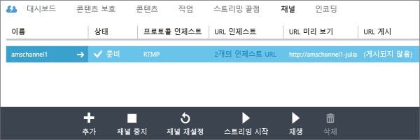
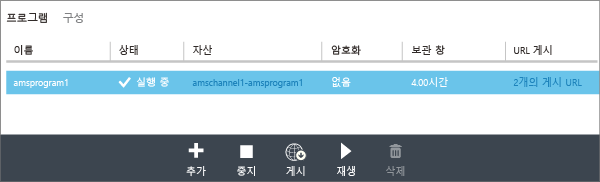
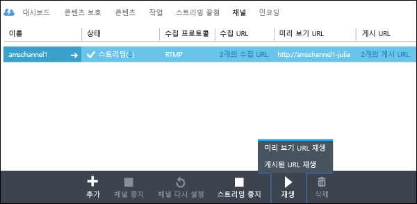
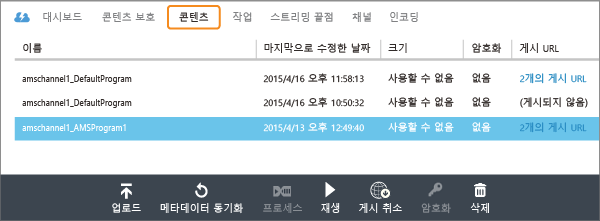

<properties 
	pageTitle="관리 포털을 사용하여 단일 비트 전송률에서 다중 비트 전송률 스트림으로 라이브 인코딩을 수행하는 채널 만들기" 
	description="이 자습서에서는 단일 비트 전송률 라이브 스트림을 받아서 다중 비트 전송률 스트림으로 인코딩하는 채널을 만드는 단계를 안내합니다." 
	services="media-services" 
	documentationCenter="" 
	authors="Juliako" 
	manager="dwrede" 
	editor=""/>

<tags 
	ms.service="media-services" 
	ms.workload="media" 
	ms.tgt_pltfrm="na" 
	ms.devlang="ne" 
	ms.topic="article" 
	ms.date="08/11/2015"
	ms.author="juliako"/>

#관리 포털을 사용하여 단일 비트 전송률에서 다중 비트 전송률 스트림으로 라이브 인코딩을 수행하는 채널 만들기(미리 보기)

> [AZURE.SELECTOR]
- [Portal](media-services-portal-creating-live-encoder-enabled-channel.md)
- [.NET SDK](media-services-dotnet-creating-live-encoder-enabled-channel.md)
- [REST API](https://msdn.microsoft.com/library/azure/dn783458.aspx)

이 자습서에서는 단일 비트 전송률 라이브 스트림을 받아서 다중 비트 전송률 스트림으로 인코딩하는 **채널**을 만드는 단계를 안내합니다.

>[AZURE.NOTE]라이브 인코딩에 사용할 수 있는 채널과 관련된 자세한 개념 정보는 [단일 비트 전송률에서 다중 비트 전송률 스트림으로 라이브 인코딩을 수행하는 채널 작업](media-services-manage-live-encoder-enabled-channels.md)을 참조하세요.

##일반적인 라이브 스트리밍 시나리오

다음은 일반적인 라이브 스트리밍 응용 프로그램을 만드는 일반적인 단계입니다.

1. 비디오 카메라를 컴퓨터에 연결합니다. RTMP, 부드러운 스트리밍 또는 RTP(MPEG-TS) 프로토콜 중 하나에서 단일 비트 전송률 스트림을 출력할 수 있는 온-프레미스 라이브 인코더를 시작하고 구성합니다. 자세한 내용은 [Azure 미디어 서비스 RTMP 지원 및 라이브 인코더](http://go.microsoft.com/fwlink/?LinkId=532824)를 참조하세요.
	
	이 단계는 채널을 만든 후에도 수행할 수 있습니다.

1. 채널을 만들고 시작합니다.

1. 채널 수집 URL을 검색합니다.

	수집 URL은 스트림을 채널로 보내기 위해 라이브 인코더를 통해 사용됩니다.
1. 채널 미리 보기 URL을 검색합니다. 

	이 URL을 사용하여 채널이 라이브 스트림을 제대로 받고 있는지 확인합니다.

3. 프로그램을 만듭니다(자산도 만들어짐).
1. 프로그램을 게시합니다(연결된 자산에 대한 주문형 로케이터가 만들어짐).  

	콘텐츠를 스트림하려는 스트리밍 끝점에서 최소 1개의 스트리밍 예약 단위가 있어야 합니다.
1. 스트리밍 및 보관을 시작할 준비가 되었으면 프로그램을 시작합니다.
2. 필요에 따라 라이브 인코더는 광고를 시작하라는 신호를 받을 수 있습니다. 광고는 출력 스트림에 삽입됩니다.
1. 이벤트 스트리밍 및 보관을 중지할 때마다 프로그램을 중지 합니다.
1. 프로그램을 삭제하고 필요에 따라 자산을 삭제합니다.   

##자습서 내용

이 자습서에서는 Azure 관리 포털을 사용하여 다음 작업을 수행합니다.

2.  스트리밍 끝점을 구성합니다.
3.  라이브 인코딩을 수행할 수 있는 채널 만들기
1.  라이브 인코더에 제공하기 위해 수집 URL 가져오기. 라이브 인코더는 이 URL을 사용하여 스트림을 채널에 수집합니다.
1.  프로그램(및 자산) 만들기
1.  자산을 게시하고 스트리밍 URL 가져오기  
1.  콘텐츠 재생 
2.  정리

##필수 조건
자습서를 완료하는 데 필요한 조건은 다음과 같습니다.

- 이 자습서를 완료하려면 Azure 계정이 필요합니다. 계정이 없는 경우 몇 분 만에 무료 평가판 계정을 만들 수 있습니다. 자세한 내용은 [Azure 무료 체험](azure.microsoft.com)을 참조하세요.
- 미디어 서비스 계정. 미디어 서비스 계정을 만들려면 [계정 만들기](media-services-create-account.md)를 참조하세요.
- 단일 비트 전송률 라이브 스트림을 보낼 수 있는 웹캠 및 인코더.

##포털을 사용하여 스트리밍 끝점 구성

Azure 미디어 서비스 작업 시 가장 일반적인 시나리오 중 하나는 클라이언트에 적응 비트 전송률 스트리밍을 제공하는 것입니다. 적응 비트 전송률 스트리밍을 사용하면 현재 네트워크 대역폭, CPU 사용률 및 기타 요인에 따라 비디오가 표시되므로 클라이언트는 더 높거나 낮은 비트 전송률 스트림으로 전환할 수 있습니다. 미디어 서비스에서 지원하는 적응 비트 전송률 스트리밍 기술은 HLS(HTTP 라이브 스트리밍), 부드러운 스트리밍, MPEG DASH 및 HDS(Adobe PrimeTime/Access 정식 사용자만 해당)입니다.

라이브 스트리밍으로 작업하는 경우 온-프레미스 라이브 인코더(이 경우에는 Wirecast)는 다중 비트 전송률 라이브 스트림을 채널에 수집합니다. 사용자가 스트림을 요청하면 미디어 서비스는 동적 패키징을 사용하여 원본 스트림을 요청된 적응 비트 전송률 스트림(HLS, DASH 또는 부드러운 스트림)으로 다시 패키지합니다.

동적 패키징을 이용하려면 콘텐츠를 배달할 계획인 **스트리밍 끝점**에 대한 스트리밍 단위를 하나 이상 가져와야 합니다.

스트리밍 예약 단위의 수를 변경하려면 다음을 수행합니다.

1. [관리 포털](https://manage.windowsazure.com/)에서 **미디어 서비스**를 클릭합니다. 그런 다음 미디어 서비스의 이름을 클릭합니다.

2. 스트리밍 끝점 페이지를 선택합니다. 그리고 수정할 스트리밍 끝점을 클릭합니다.

3. 스크리밍 단위 수를 지정하려면 크기 조정 탭을 선택하고 **예약된 용량** 슬라이더를 움직입니다.

	

4. 저장 단추를 눌러 변경 내용을 저장합니다.

	새 단위를 할당하는 작업은 완료하는 데 20분 정도 걸립니다.

	 
	>[AZURE.NOTE]현재, 스트리밍 단위의 양수 값을 0으로 변경하면 최대 1시간 동안 스트리밍을 사용하지 않을 수 있습니다.
	>
	> 24시간 동안 가장 많은 단위 수가 비용 계산에 사용됩니다. 가격 정보에 대한 자세한 내용은 [미디어 서비스 가격 정보](http://go.microsoft.com/fwlink/?LinkId=275107)를 참조하세요.

 
##채널 만들기

1.	[관리 포털](http://manage.windowsazure.com/)에서 미디어 서비스를 클릭한 후 미디어 서비스 계정 이름을 클릭합니다.
2.	채널 페이지를 선택합니다.
3.	추가+를 선택하여 새 채널을 추가합니다.

**표준** 인코딩 형식을 선택합니다. 이 형식은 라이브 인코딩에 사용할 수 있는 채널을 만들도록 지정합니다. 즉, 들어오는 단일 비트 전송률 스트림이 채널로 전송되고 지정한 라이브 인코더 설정을 사용하여 다중 비트 전송률 스트림으로 인코딩됩니다. 자세한 내용은 [단일 비트 전송률에서 다중 비트 전송률 스트림으로 라이브 인코딩을 수행하는 채널 작업](media-services-manage-live-encoder-enabled-channels.md)을 참조하세요.

![standard0][standard0]

**표준** 인코딩 형식의 경우 유효한 수집 프로토콜 옵션은 다음과 같습니다.

- 단일 비트 전송률 조각화된 MP4(부드러운 스트리밍)
- 단일 비트 전송률 RTMP
- RTP(MPEG-TS): RTP를 통한 MPEG-2 전송 스트림

각 프로토콜에 대한 자세한 설명은 [단일 비트 전송률에서 다중 비트 전송률 스트림으로 라이브 인코딩을 수행하는 채널 작업](media-services-manage-live-encoder-enabled-channels.md)을 참조하세요.

![standard1][standard1]

채널 또는 연결된 프로그램이 실행 중인 동안에는 입력 프로토콜을 변경할 수 없습니다. 다른 프로토콜을 요청하는 경우 각각의 입력 프로토콜에 대한 개별 채널을 만들어야 합니다.

**광고 구성** 페이지에서 광고 표식 신호의 원본을 지정할 수 있습니다. 포털을 사용하는 경우 API만 선택할 수 있습니다. 이는 채널 내의 라이브 인코더가 비동기 광고 표식 API를 수신해야 함을 나타냅니다. 포털을 사용하는 경우 API만 선택할 수 있습니다.

자세한 내용은 [단일 비트 전송률에서 다중 비트 전송률 스트림으로 라이브 인코딩을 수행하는 채널 작업](media-services-manage-live-encoder-enabled-channels.md)을 참조하세요.

![standard2][standard2]

**Encoding Preset(인코딩 기본 설정)** 페이지에서 시스템 기본 설정을 선택할 수 있습니다. 현재 선택할 수 있는 유일한 시스템 기본 설정은 **기본 720p**입니다.

![standard3][standard3]

**채널 만들기** 페이지에서 이 채널에 비디오를 게시하도록 허용된 IP 주소를 정의할 수 있습니다. 허용된 IP 주소는 단일 IP 주소(예: ‘10.0.0.1’), IP 주소와 CIDR 서브넷 마스크를 사용하는 IP 범위(예: ‘10.0.0.1/22’) 또는 IP 주소와 점으로 구분된 10진수 서브넷 마스크를 사용하는 IP 범위(예: ‘10.0.0.1(255.255.252.0)’)로 지정될 수 있습니다.

IP 주소가 지정되지 않고 정의된 규칙이 없는 경우 IP 주소가 허용되지 않습니다. 모든 IP 주소를 허용하려면 규칙을 만들고 0.0.0.0/0으로 설정합니다.

![standard4][standard4]

>[AZURE.NOTE]현재 미리 보기로 제공됩니다. 채널 시작에는 최대 30분까지 걸릴 수 있습니다. 채널 다시 설정에는 최대 5분까지 걸릴 수 있습니다.

채널을 만든 후 **인코더** 탭을 선택하여 채널 구성을 볼 수 있습니다. 광고와 슬레이트도 관리할 수 있습니다.

![standard5][standard5]

자세한 내용은 [단일 비트 전송률에서 다중 비트 전송률 스트림으로 라이브 인코딩을 수행하는 채널 작업](media-services-manage-live-encoder-enabled-channels.md)을 참조하세요.

##수집 URL 가져오기

채널을 만든 후 라이브 인코더에 제공할 수집 URL을 가져올 수 있습니다. 인코더는 이러한 URL을 사용하여 라이브 스트림을 입력합니다.

##프로그램 만들기 및 관리

###개요

채널은 라이브 스트림에서 세그먼트의 게시 및 저장소를 제어할 수 있는 프로그램과 연결되어 있습니다. 채널은 프로그램을 관리합니다. 채널 및 프로그램 관계는 기존 미디어와 매우 유사하여 채널에는 일정한 콘텐츠 스트림이 있고 프로그램 범위는 해당 채널에 있는 일부 시간 제한 이벤트로 지정됩니다.

**보관 창** 길이를 설정하여 프로그램에 대해 기록된 콘텐츠를 유지할 시간을 지정할 수 있습니다. 이 값은 최소 5분에서 최대 25시간 사이로 설정할 수 있습니다. 또한 보관 창 길이는 클라이언트가 현재 라이브 위치에서 이전 시간을 검색할 수 있는 최대 시간을 나타냅니다. 프로그램은 지정된 시간 동안 실행되지만 기간 길이보다 늦는 콘텐츠는 계속 삭제됩니다. 또한 이 속성의 값은 클라이언트 매니페스트가 증가할 수 있는 길이를 결정합니다.

각 프로그램은 자산에 연결됩니다. 프로그램을 게시하려면 연결된 자산에 대한 주문형 로케이터를 만들어야 합니다. 이 로케이터가 있으면 클라이언트에 제공할 수 있는 스트리밍 URL을 작성할 수 있습니다.

채널은 동시 실행 프로그램을 최대 세 개까지 지원하므로 동일한 들어오는 스트림의 보관 파일을 여러 개 만들 수 있습니다. 따라서 이벤트의 여러 부분을 필요에 따라 게시하고 보관할 수 있습니다. 예를 들어 비즈니스 요구 사항에 따라 6시간의 프로그램을 보관하고 마지막 10분만 브로드캐스트해야 할 수 있습니다. 이렇게 하려면 두 개의 동시 실행 프로그램을 만들어야 합니다. 한 프로그램은 6시간의 이벤트를 보관하도록 설정하고 프로그램은 게시하지 않습니다. 다른 프로그램은 10분 동안을 보관하도록 설정하고 프로그램을 게시합니다.

새 이벤트에 기존 프로그램을 다시 사용할 수 없습니다. 대신 프로그래밍 라이브 스트리밍 응용 프로그램 섹션에서 설명한 각각의 이벤트에 대한 새 프로그램을 만들고 시작합니다.

스트리밍 및 보관을 시작할 준비가 되었으면 프로그램을 시작합니다. 이벤트 스트리밍 및 보관을 중지할 때마다 프로그램을 중지 합니다.

보관된 콘텐츠를 삭제하려면 프로그램을 중단 및 삭제한 다음 연결된 자산을 삭제합니다. 프로그램이 자산을 사용하는 경우 삭제할 수 없습니다. 프로그램을 먼저 삭제해야 합니다.

프로그램을 중단 및 삭제한 다음에도 자산을 삭제하지 않는 한 사용자는 주문형 비디오로 보관된 콘텐츠를 스트림할 수 있어야 합니다.

보관된 콘텐츠를 보관하려는데 스트리밍에 사용할 수 있는 콘텐츠가 없는 경우 스트리밍 로케이터를 삭제합니다.

###프로그램 만들기/시작/중지

채널로 들어오는 스트림이 있으면 자산, 프로그램 및 스트리밍 로케이터를 만들어 스트리밍 이벤트를 시작할 수 있습니다. 이렇게 하면 스트림이 보관되고 스트리밍 끝점을 통해 시청자가 스트림을 사용할 수 있게 됩니다.

이벤트를 시작하는 방법에는 다음 두 가지가 있습니다.

1. **채널** 페이지에서 **추가**를 눌러 새 프로그램을 추가합니다.

	프로그램 이름, 자산 이름, 보관 창 및 암호화 옵션을 지정합니다.
	
	
	
	**지금 이 프로그램 게시**를 선택한 상태로 두면 프로그램 게시 URL이 만들어집니다.
	
	프로그램을 스트리밍할 준비가 되면 언제든지 **시작**을 누를 수 있습니다.

	프로그램을 시작한 후 재생을 눌러 콘텐츠 재생을 시작할 수 있습니다.

	

2. 또는 바로 가기를 사용하고 **채널** 페이지에서 **스트리밍 시작** 단추를 누를 수 있습니다. 그러면 자산, 프로그램 및 스트리밍 로케이터가 만들어집니다.

	프로그램 이름이 DefaultProgram으로 지정되고 보관 창은 1시간으로 설정됩니다.

	채널 페이지에서 게시된 프로그램을 재생할 수 있습니다.

	

**채널** 페이지에서 **스트리밍 중지**를 클릭하는 경우 기본 프로그램이 중지되고 삭제됩니다. 자산은 계속 그곳에 있으며 **콘텐츠** 페이지에서 자산을 게시하거나 게시 취소할 수 있습니다.

**콘텐츠** 페이지로 전환하는 경우 프로그램에 대해 만들어진 자산이 표시됩니다.

##콘텐츠 재생

콘텐츠를 스트리밍하는 데 사용할 수 있는 URL을 사용자에게 제공하려면 먼저 로케이터를 만들어(포털을 사용하여 자산을 게시하는 경우에는 로케이터가 자동으로 만들어짐) 자산을 "게시”해야 합니다(이전 섹션에 설명되어 있음). 로케이터는 자산에 포함된 파일에 대한 액세스를 제공합니다.

콘텐츠를 재생하는 데 사용하려는 스트리밍 프로토콜에 따라 채널\\프로그램의 **게시 URL** 링크에서 가져오는 URL을 수정해야 할 수 있습니다.

동적 패키징은 라이브 스트림을 지정된 프로토콜로 패키지하는 작업을 처리합니다.

기본적으로 스트리밍 URL의 형식은 다음과 같으며 스트리밍 URL을 사용하여 부드러운 스트리밍 자산을 재생할 수 있습니다.

	{streaming endpoint name-media services account name}.streaming.mediaservices.windows.net/{locator ID}/{filename}.ism/Manifest

HLS 스트리밍 URL을 작성하려면 URL에 (format=m3u8-aapl)을 추가합니다.

	{streaming endpoint name-media services account name}.streaming.mediaservices.windows.net/{locator ID}/{filename}.ism/Manifest(format=m3u8-aapl)

MPEG DASH 스트리밍 URL을 작성하려면 URL에 (format=mpd-time-csf)를 추가합니다.

	{streaming endpoint name-media services account name}.streaming.mediaservices.windows.net/{locator ID}/{filename}.ism/Manifest(format=mpd-time-csf)

콘텐츠 배달에 대한 자세한 내용은 [콘텐츠 배달](media-services-deliver-content-overview.md)을 참조하세요.

[AMS 플레이어](http://amsplayer.azurewebsites.net/azuremediaplayer.html)를 사용하여 부드러운 스트림을 재생하거나 iOS 및 Android 장치를 사용하여 HLS 버전 3을 재생할 수 있습니다.

##정리

스트리밍 이벤트를 완료하고 이전에 프로비전된 리소스를 정리하려면 다음 절차를 수행합니다.

- 인코더에서 스트림의 푸시를 중지합니다.
- 채널을 중지합니다. 채널이 중지되면 채널에 대한 요금이 발생하지 않습니다. 채널을 다시 시작해야 하는 경우 채널의 수집 URL은 동일하므로 인코더를 다시 구성하지 않아도 됩니다.
- 라이브 이벤트의 보관 파일을 주문형 스트림으로 계속 제공하지 않으려면 스트리밍 끝점을 중지할 수 있습니다. 채널이 중지된 상태이면 채널에 대한 요금이 발생하지 않습니다.
  

[standard0]: ./media/media-services-portal-creating-live-encoder-enabled-channel/media-services-create-channel-standard0.png
[standard1]: ./media/media-services-portal-creating-live-encoder-enabled-channel/media-services-create-channel-standard1.png
[standard2]: ./media/media-services-portal-creating-live-encoder-enabled-channel/media-services-create-channel-standard2.png
[standard3]: ./media/media-services-portal-creating-live-encoder-enabled-channel/media-services-create-channel-standard3.png
[standard4]: ./media/media-services-portal-creating-live-encoder-enabled-channel/media-services-create-channel-standard4.png
[standard5]: ./media/media-services-portal-creating-live-encoder-enabled-channel/media-services-create-channel-standard_encode.png

<!---HONumber=August15_HO7-->