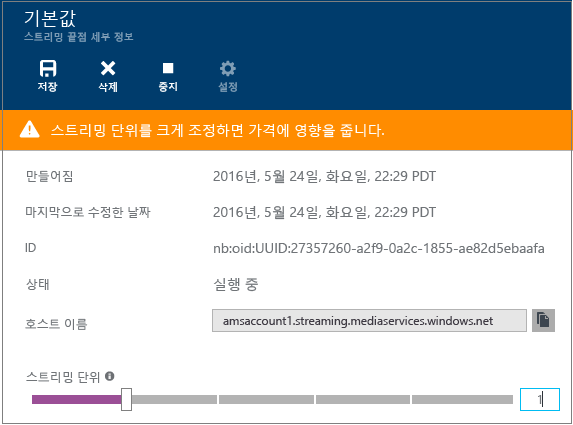
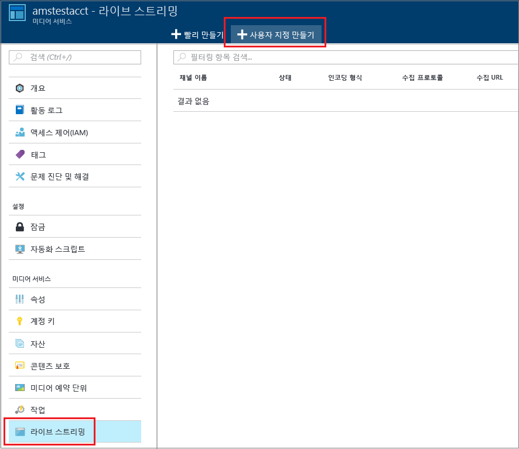
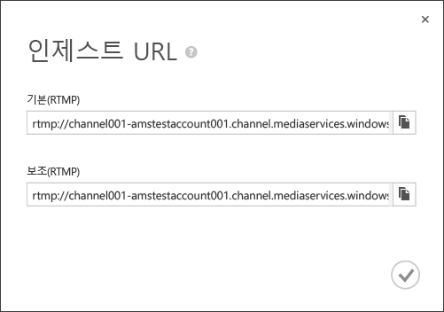
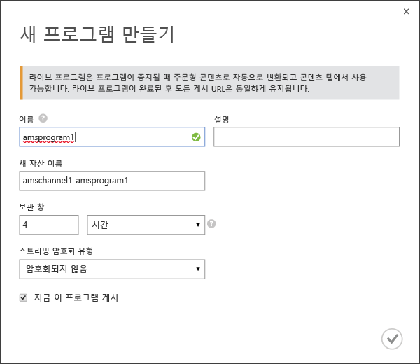
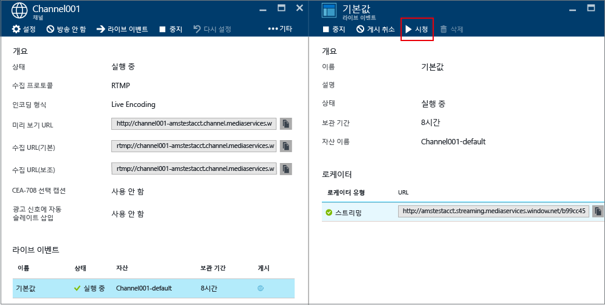
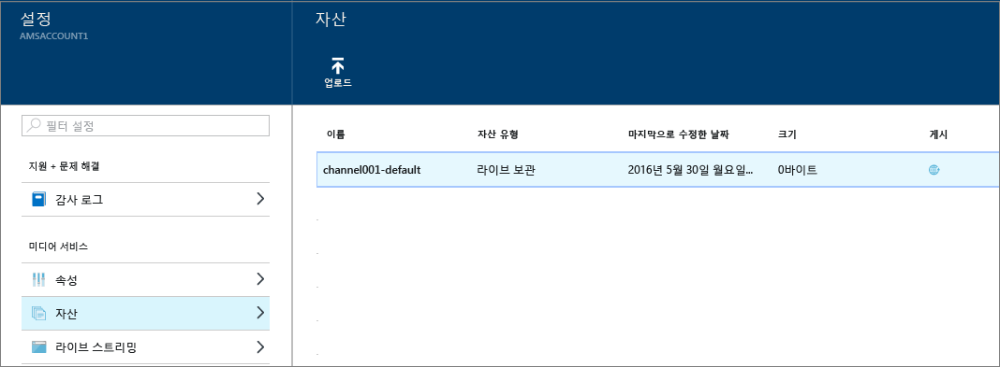

<properties 
	pageTitle="Azure Media Services를 사용하여 Azure Portal로 다중 비트 전송률 스트림을 만드는 라이브 스트리밍을 수행하는 방법 | Microsoft Azure" 
	description="이 자습서에서는 Azure 포털을 사용하여 단일 비트 전송률 라이브 스트림을 받아서 다중 비트 전송률 스트림으로 인코딩하는 채널을 만드는 단계를 안내합니다." 
	services="media-services" 
	documentationCenter="" 
	authors="anilmur" 
	manager="erikre" 
	editor=""/>

<tags 
	ms.service="media-services" 
	ms.workload="media" 
	ms.tgt_pltfrm="na" 
	ms.devlang="na" 
	ms.topic="get-started-article"
	ms.date="09/06/2016"
	ms.author="juliako;juliako"/>

#Azure Media Services를 사용하여 Azure Portal로 다중 비트 전송률 스트림을 만드는 라이브 스트리밍을 수행하는 방법

> [AZURE.SELECTOR]
- [포털](media-services-portal-creating-live-encoder-enabled-channel.md)
- [.NET](media-services-dotnet-creating-live-encoder-enabled-channel.md)
- [REST API](https://msdn.microsoft.com/library/azure/dn783458.aspx)

이 자습서에서는 단일 비트 전송률 라이브 스트림을 받아서 다중 비트 전송률 스트림으로 인코딩하는 **채널**을 만드는 단계를 안내합니다.

>[AZURE.NOTE]라이브 인코딩에 대해 사용할 수 있는 채널과 관련하여 더욱 개념적인 정보는 [Azure 미디어 서비스를 사용하여 다중 비트 전송률 스트림을 만드는 라이브 스트리밍](media-services-manage-live-encoder-enabled-channels.md)을 참조하세요.

##일반적인 라이브 스트리밍 시나리오

다음은 일반적인 라이브 스트리밍 응용 프로그램을 만드는 일반적인 단계입니다.

>[AZURE.NOTE] 현재 라이브 이벤트의 최대 권장 기간은 8시간입니다. 더 오랜 시간 채널을 실행해야 하는 경우 amslived@microsoft.com으로 문의하세요.

1. 비디오 카메라를 컴퓨터에 연결합니다. RTMP, 부드러운 스트리밍 또는 RTP(MPEG-TS) 프로토콜 중 하나에서 단일 비트 전송률 스트림을 출력할 수 있는 온-프레미스 라이브 인코더를 시작하고 구성합니다. 자세한 내용은 [Azure 미디어 서비스 RTMP 지원 및 라이브 인코더](http://go.microsoft.com/fwlink/?LinkId=532824)를 참조하세요.
	
	이 단계는 채널을 만든 후에도 수행할 수 있습니다.

1. 채널을 만들고 시작합니다.

1. 채널 수집 URL을 검색합니다.

	수집 URL은 스트림을 채널로 보내기 위해 라이브 인코더를 통해 사용됩니다.
1. 채널 미리 보기 URL을 검색합니다.

	이 URL을 사용하여 채널이 라이브 스트림을 제대로 받고 있는지 확인합니다.

3. 이벤트/프로그램을 만듭니다(자산도 만들어짐).
1. 이벤트를 게시합니다(연결된 자산에 대한 주문형 로케이터가 만들어짐).

	콘텐츠를 스트림하려는 스트리밍 끝점에서 최소 1개의 스트리밍 예약 단위가 있어야 합니다.
1. 스트리밍 및 보관을 시작할 준비가 되었으면 이벤트를 시작합니다.
2. 필요에 따라 라이브 인코더는 광고를 시작하라는 신호를 받을 수 있습니다. 광고는 출력 스트림에 삽입됩니다.
1. 이벤트 스트리밍 및 보관을 중지할 때마다 이벤트를 중지합니다.
1. 이벤트를 삭제하고 필요에 따라 자산을 삭제합니다.

##자습서 내용

이 자습서에서는 Azure 포털을 사용하여 다음 작업을 수행합니다.

2.  스트리밍 끝점을 구성합니다.
3.  라이브 인코딩을 수행할 수 있는 채널 만들기
1.  라이브 인코더에 제공하기 위해 수집 URL 가져오기. 라이브 인코더는 이 URL을 사용하여 스트림을 채널에 수집합니다.
1.  이벤트/프로그램(및 자산)을 만듭니다.
1.  자산을 게시하고 스트리밍 URL 가져오기
1.  콘텐츠 재생
2.  정리

##필수 조건
자습서를 완료하는 데 필요한 조건은 다음과 같습니다.

- 이 자습서를 완료하려면 Azure 계정이 필요합니다. 계정이 없는 경우 몇 분 만에 무료 평가판 계정을 만들 수 있습니다. 자세한 내용은 [Azure 무료 체험](https://azure.microsoft.com/pricing/free-trial/)을 참조하세요.
- 미디어 서비스 계정. 미디어 서비스 계정을 만들려면 [계정 만들기](media-services-create-account.md)를 참조하세요.
- 단일 비트 전송률 라이브 스트림을 보낼 수 있는 웹캠 및 인코더.

##스트리밍 끝점 구성 

미디어 서비스는 다중 비트 전송률 MP4를 스트리밍 형식(MPEG DASH, HLS, 부드러운 스트리밍 또는 HDS)으로 다시 패키지하지 않고도 이런 스트리밍 형식으로 배달할 수 있게 하는 동적 패키징을 제공합니다. 동적 패키징에서는 단일 저장소 형식으로 파일을 저장하고 비용을 지불하기만 하면 됩니다. 그러면 미디어 서비스가 클라이언트의 요청에 따라 적절한 응답을 빌드 및 제공합니다.

동적 패키징을 이용하려면 콘텐츠를 배달할 계획인 스트리밍 끝점에 대한 스트리밍 단위를 하나 이상 가져와야 합니다.

스트리밍 예약 단위의 수를 만들고 변경하려면 다음을 수행합니다.

1. [Azure 포털](https://portal.azure.com/)에 로그인합니다.
1. **설정** 창에서 **스트리밍 끝점**을 클릭합니다.

2. 기본 스트리밍 끝점을 클릭합니다.

	**기본 스트리밍 끝점 세부 정보** 창이 나타납니다.

3. 스트리밍 단위 수를 지정하려면 **스트리밍 단위** 슬라이더를 밉니다.

	

4. **저장** 단추를 클릭하여 변경 내용을 저장합니다.

	>[AZURE.NOTE]새 단위를 할당하는 작업은 완료하는 데 최대 20분까지 소요될 수 있습니다.

##채널 만들기

1. [Azure Portal](https://portal.azure.com/)에서 Media Services를 클릭한 후 Media Services 계정 이름을 클릭합니다.
2. **라이브 스트리밍**을 선택합니다.
3. **사용자 지정 만들기**를 선택합니다. 이 옵션을 통해 Live Encoding에 사용할 수 있는 채널을 만들 수 있습니다.

	
	
4. **설정**을 클릭합니다.
	
	1.  **Live Encoding** 채널 형식을 선택합니다. 이 형식은 라이브 인코딩에 사용할 수 있는 채널을 만들도록 지정합니다. 즉, 들어오는 단일 비트 전송률 스트림이 채널로 전송되고 지정한 라이브 인코더 설정을 사용하여 다중 비트 전송률 스트림으로 인코딩됩니다. 자세한 내용은 [Azure Media Services를 사용하여 다중 비트 전송률 스트림을 만드는 라이브 스트리밍](media-services-manage-live-encoder-enabled-channels.md)을 참조하세요. 확인을 클릭합니다.
	2. 채널의 이름을 지정합니다.
	3. 화면 아래쪽에서 확인을 클릭합니다.
	
5. **수집** 탭을 선택합니다.

	1. 이 페이지에서는 스트리밍 프로토콜을 선택할 수 있습니다. **Live Encoding** 채널 형식의 경우 올바른 프로토콜 옵션은 다음과 같습니다.
		
		- 단일 비트 전송률 조각화된 MP4(부드러운 스트리밍)
		- 단일 비트 전송률 RTMP
		- RTP(MPEG-TS): RTP를 통한 MPEG-2 전송 스트림
		
		각 프로토콜에 대한 자세한 설명은 [Azure Media Services를 사용하여 다중 비트 전송률 스트림을 만드는 라이브 스트리밍](media-services-manage-live-encoder-enabled-channels.md)을 참조하세요.
	
		채널 또는 연결된 이벤트/프로그램이 실행 중인 동안에는 프로토콜 옵션을 변경할 수 없습니다. 다른 프로토콜을 요청하는 경우 각각의 스트리밍 프로토콜에 대한 개별 채널을 만들어야 합니다.

	2. 수집에 대한 IP 제한을 적용할 수 있습니다.
	
		이 채널에 비디오를 수집하도록 허용된 IP 주소를 정의할 수 있습니다. 허용된 IP 주소는 단일 IP 주소(예: '10.0.0.1'), IP 주소와 CIDR 서브넷 마스크를 사용하는 IP 범위(예: '10.0.0.1/22'), 또는 IP 주소와 점으로 구분된 10진수 서브넷 마스크를 사용하는 IP 범위(예: '10.0.0.1(255.255.252.0)').

		IP 주소가 지정되지 않고 정의된 규칙이 없는 경우 IP 주소가 허용되지 않습니다. 모든 IP 주소를 허용하려면 규칙을 만들고 0.0.0.0/0으로 설정합니다.

6. **미리 보기** 탭에서 미리 보기에 대한 IP 제한을 적용합니다.
7. **인코딩** 탭에서 인코딩 사전 설정을 지정합니다.

	현재 선택할 수 있는 유일한 시스템 기본 설정은 **기본 720p**입니다. 사용자 지정 사전 설정을 지정하려면 Microsoft 지원 티켓을 엽니다. 그런 다음 만들어진 기본 설정의 이름을 입력합니다.

>[AZURE.NOTE] 현재 채널 시작에는 30분 이상 걸릴 수 있습니다. 채널 다시 설정에는 최대 5분까지 걸릴 수 있습니다.

채널을 만든 후 채널을 클릭하여 채널 구성을 볼 수 있는 **설정**을 선택합니다.

자세한 내용은 [Azure Media Services를 사용하여 다중 비트 전송률 스트림을 만드는 라이브 스트리밍](media-services-manage-live-encoder-enabled-channels.md)을 참조하세요.

##수집 URL 가져오기

채널을 만든 후 라이브 인코더에 제공할 수집 URL을 가져올 수 있습니다. 인코더는 이러한 URL을 사용하여 라이브 스트림을 입력합니다.

##이벤트 만들기 및 관리

###개요

채널은 라이브 스트림에서 세그먼트의 게시 및 저장소를 제어할 수 있는 이벤트/프로그램과 연결되어 있습니다. 채널은 이벤트/프로그램을 관리합니다. 채널 및 프로그램 관계는 기존 미디어와 매우 유사하여 채널에는 일정한 콘텐츠 스트림이 있고 프로그램 범위는 해당 채널에 있는 일부 시간 제한 이벤트로 지정됩니다.

**보관 창** 길이를 설정하여 이벤트에 대해 기록된 콘텐츠를 유지할 시간을 지정할 수 있습니다. 이 값은 최소 5분에서 최대 25시간 사이로 설정할 수 있습니다. 또한 보관 창 길이는 클라이언트가 현재 라이브 위치에서 이전 시간을 검색할 수 있는 최대 시간을 나타냅니다. 이벤트는 지정된 시간 동안 실행되지만 기간 길이보다 늦는 콘텐츠는 계속 삭제됩니다. 또한 이 속성의 값은 클라이언트 매니페스트가 증가할 수 있는 길이를 결정합니다.

각 이벤트는 자산에 연결됩니다. 이벤트를 게시하려면 연결된 자산에 대한 주문형 로케이터를 만들어야 합니다. 이 로케이터가 있으면 클라이언트에 제공할 수 있는 스트리밍 URL을 작성할 수 있습니다.

채널은 동시 실행 이벤트를 최대 세 개까지 지원하므로 동일한 들어오는 스트림의 보관 파일을 여러 개 만들 수 있습니다. 따라서 이벤트의 여러 부분을 필요에 따라 게시하고 보관할 수 있습니다. 예를 들어 비즈니스 요구 사항에 따라 6시간의 이벤트를 보관하고 마지막 10분만 브로드캐스트해야 합니다. 이렇게 하려면 두 개의 동시 실행되는 이벤트를 만들어야 합니다. 한 이벤트는 6시간의 이벤트를 보관하도록 설정하고 프로그램은 게시하지 않습니다. 다른 이벤트는 10분 동안을 보관하도록 설정하고 프로그램을 게시합니다.

새 이벤트에 기존 프로그램을 다시 사용할 수 없습니다. 대신, 각 이벤트에 대해 새 프로그램을 만들고 시작합니다.

스트리밍 및 보관을 시작할 준비가 되었으면 이벤트/프로그램을 시작합니다. 이벤트 스트리밍 및 보관을 중지할 때마다 이벤트를 중지합니다.

보관된 콘텐츠를 삭제하려면 이벤트를 중단 및 삭제한 다음 연결된 자산을 삭제합니다. 자산을 이벤트에서 사용하는 경우 삭제할 수 없습니다. 이벤트를 먼저 삭제해야 합니다.

이벤트를 중단 및 삭제한 다음에도 자산을 삭제하지 않는 한 사용자는 주문형 비디오로 보관된 콘텐츠를 스트림할 수 있습니다.

보관된 콘텐츠를 보관하려는데 스트리밍에 사용할 수 있는 콘텐츠가 없는 경우 스트리밍 로케이터를 삭제합니다.

###이벤트 만들기/시작/중지

채널로 들어오는 스트림이 있으면 자산, 프로그램 및 스트리밍 로케이터를 만들어 스트리밍 이벤트를 시작할 수 있습니다. 이렇게 하면 스트림이 보관되고 스트리밍 끝점을 통해 시청자가 스트림을 사용할 수 있게 됩니다.

이벤트를 시작하는 방법에는 다음 두 가지가 있습니다.

1. **채널** 페이지에서 **라이브 이벤트**를 눌러 새 이벤트를 추가합니다.

	이벤트 이름, 자산 이름, 보관 창 및 암호화 옵션을 지정합니다.
	
	
	
	**지금 이 라이브 이벤트 게시**를 선택한 상태로 두면 이벤트 게시 URL이 만들어집니다.
	
	이벤트를 스트리밍할 준비가 되면 언제든지 **시작**을 누르면 됩니다.

	이벤트를 시작하면 **시청**을 눌러 콘텐츠 재생을 시작할 수 있습니다.

2. 또는 바로 가기를 사용하고 **채널** 페이지에서 **가동 중** 단추를 누를 수 있습니다. 그러면 기본 자산, 프로그램 및 스트리밍 로케이터가 만들어집니다.

	이벤트의 이름은 **default**로 지정되고 보관 창은 8시간으로 설정됩니다.

**라이브 이벤트** 페이지에서 게시된 이벤트를 볼 수 있습니다.

**가동 안 함**을 클릭하면 라이브 이벤트를 모두 중지합니다.

##이벤트 보기

이벤트를 보려면 Azure 포털에서 **조사식**을 클릭하거나 스트리밍 URL을 복사하고 선택한 플레이어를 사용합니다.
 

라이브 이벤트가 중지되면 이벤트를 주문형 콘텐츠로 자동으로 변환합니다.

##정리

스트리밍 이벤트를 완료하고 이전에 프로비전된 리소스를 정리하려면 다음 절차를 수행합니다.

- 인코더에서 스트림의 푸시를 중지합니다.
- 채널을 중지합니다. 채널이 중지되면 채널에 대한 요금이 발생하지 않습니다. 채널을 다시 시작해야 하는 경우 채널의 수집 URL은 동일하므로 인코더를 다시 구성하지 않아도 됩니다.
- 라이브 이벤트의 보관 파일을 주문형 스트림으로 계속 제공하지 않으려면 스트리밍 끝점을 중지할 수 있습니다. 채널이 중지된 상태이면 채널에 대한 요금이 발생하지 않습니다.
  
##보관된 콘텐츠 보기

이벤트를 중단 및 삭제한 다음에도 자산을 삭제하지 않는 한 사용자는 주문형 비디오로 보관된 콘텐츠를 스트림할 수 있습니다. 자산을 이벤트에서 사용하는 경우 삭제할 수 없습니다. 이벤트를 먼저 삭제해야 합니다.

자산을 관리하려면 **설정**을 선택하고 **자산**을 클릭합니다.

##고려 사항

- 현재 라이브 이벤트의 최대 권장 기간은 8시간입니다. 더 오랜 시간 채널을 실행해야 하는 경우 amslived@microsoft.com으로 문의하세요.
- 콘텐츠를 스트림하려는 스트리밍 끝점에서 최소 1개의 스트리밍 예약 단위가 있어야 합니다.

##다음 단계

미디어 서비스 학습 경로를 검토합니다.

[AZURE.INCLUDE [media-services-learning-paths-include](../../includes/media-services-learning-paths-include.md)]

##피드백 제공

[AZURE.INCLUDE [media-services-user-voice-include](../../includes/media-services-user-voice-include.md)]

 

<!---HONumber=AcomDC_0921_2016-->