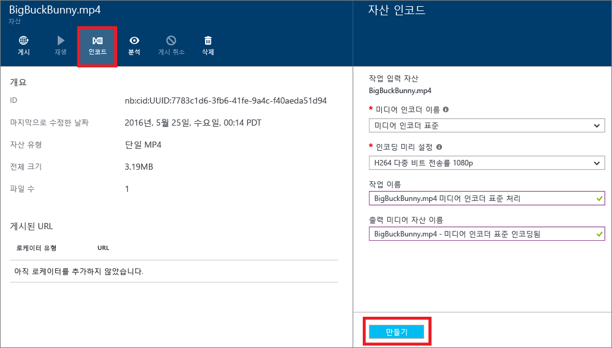

<properties
	pageTitle="Azure 포털을 통해 미디어 인코더 표준을 사용하여 자산 인코딩 | Microsoft Azure"
	description="이 자습서에서는 Azure 포털을 통해 미디어 인코더 표준을 사용하여 자산을 인코딩하는 단계를 안내합니다."
	services="media-services"
	documentationCenter=""
	authors="Juliako"
	manager="erikre"
	editor=""/>

<tags
	ms.service="media-services"
	ms.workload="media"
	ms.tgt_pltfrm="na"
	ms.devlang="na"
	ms.topic="article"
	ms.date="08/29/2016"
	ms.author="juliako"/>

# Azure 포털을 통해 미디어 인코더 표준을 사용하여 자산 인코딩

> [AZURE.NOTE] 이 자습서를 완료하려면 Azure 계정이 필요합니다. 자세한 내용은 [Azure 무료 체험](https://azure.microsoft.com/pricing/free-trial/)을 참조하세요.

Azure 미디어 서비스 작업 시 가장 일반적인 시나리오 중 하나는 클라이언트에 적응 비트 전송률 스트리밍을 제공하는 것입니다. 미디어 서비스에서 지원하는 적응 비트 전송률 스트리밍 기술은 HLS(HTTP 라이브 스트리밍), 부드러운 스트리밍, MPEG DASH 및 HDS(Adobe PrimeTime/Access 정식 사용자만 해당)입니다. 적응 비트 전송률 스트리밍을 위한 비디오를 준비하려면 소스 비디오를 다중 비트 전송률 파일로 인코딩해야 합니다. 비디오를 인코딩하는 데는 **미디어 인코더 표준** 인코더를 사용해야 합니다.

미디어 서비스는 또한 다중 비트 전송률 MP4를 스트리밍 형식(MPEG DASH, HLS, 부드러운 스트리밍 또는 HDS)으로 다시 패키지하지 않고도 이런 스트리밍 형식으로 배달할 수 있게 하는 동적 패키징을 제공합니다. 동적 패키징에서는 단일 저장소 형식으로 파일을 저장하고 비용을 지불하기만 하면 됩니다. 그러면 미디어 서비스가 클라이언트의 요청에 따라 적절한 응답을 빌드 및 제공합니다.

동적 패키징을 이용하려면 다음을 수행해야 합니다.

- 원본 파일을 다중 비트 전송률 MP4 파일 집합으로 인코딩합니다(인코딩 단계는 이 섹션의 뒷부분에서 설명).
- 콘텐츠를 배달하는 출발점이 될 스트리밍 끝점에 하나 이상의 스트리밍 단위를 구성합니다. 자세한 내용은 [스트리밍 끝점 구성](media-services-portal-vod-get-started.md#configure-streaming-endpoints)을 참조하세요.

미디어 처리의 크기를 조정하려면 [이 항목](media-services-portal-scale-media-processing.md)을 참조하세요.

## Azure 포털을 통해 인코딩

이 섹션에서는 미디어 인코더 표준을 사용하여 콘텐츠를 인코딩할 수 있는 단계를 설명합니다.

1.  **설정** 창에서 **자산**을 선택합니다.
2.  **자산** 창에서 인코딩할 자산을 선택합니다.
3.  **인코딩** 단추를 누릅니다.
4.  **자산 인코딩** 창에서 "미디어 인코더 표준" 프로세서 및 사전 설정을 선택합니다. 예를 들어 입력 비디오가 1920x1080픽셀 해상도를 포함하는 것을 알고 있는 경우 "H264 다중 비트 전송률 1080p" 사전 설정을 사용할 수 있습니다. 사전 설정에 대한 자세한 내용은 [이](https://msdn.microsoft.com/library/azure/mt269960.aspx) 문서를 참조하세요. 입력 비디오에 가장 적합한 사전 설정을 선택하는 것이 중요합니다. 낮은 해상도(640x360) 비디오가 있는 경우 기본 "H264 다중 비트 전송률 1080p" 사전 설정을 사용하지 말아야 합니다.
	
	관리를 간소화하기 위해 출력 자산의 이름과 작업 이름을 편집하는 옵션이 있습니다.
		
	
5. **만들기**를 누릅니다.

##다음 단계

[이 문서](media-services-portal-check-job-progress.md)의 설명에 따라 Azure 포털을 통해 인코딩 작업 진행률을 모니터링할 수 있습니다.

##미디어 서비스 학습 경로

[AZURE.INCLUDE [media-services-learning-paths-include](../../includes/media-services-learning-paths-include.md)]

##피드백 제공

[AZURE.INCLUDE [media-services-user-voice-include](../../includes/media-services-user-voice-include.md)]

<!---HONumber=AcomDC_0831_2016-->