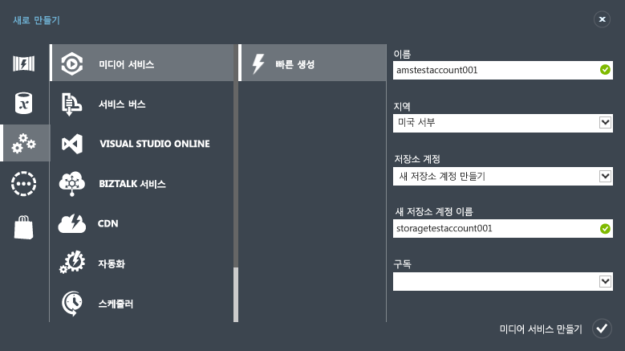
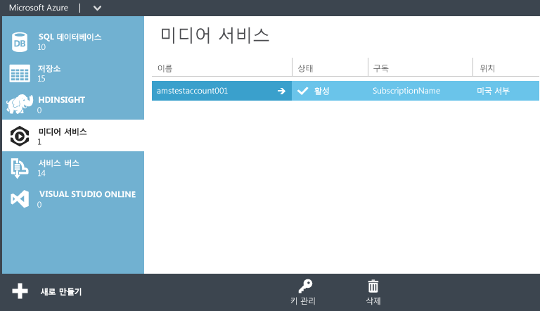
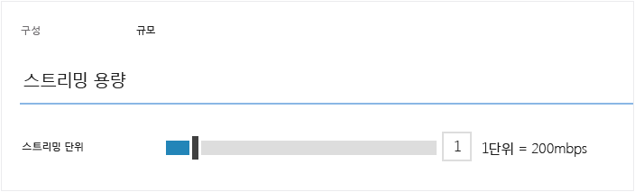

<properties
	pageTitle="Azure 관리 포털을 사용하여 주문형 비디오(VoD) 제공하기 시작"
	description="이 자습서에서는 Azure 관리 포털을 사용하여 Azure 미디어 서비스로 VoD(주문형 비디오) 콘텐츠 배달 응용 프로그램을 구현하는 단계를 안내합니다."
	services="media-services"
	documentationCenter=""
	authors="Juliako"
	manager="dwrede"
	editor=""/>

<tags
	ms.service="media-services"
	ms.workload="media"
	ms.tgt_pltfrm="na"
	ms.devlang="ne"
	ms.topic="get-started-article" 
	ms.date="04/08/2015"
	ms.author="juliako"/>

#Azure 관리 포털을 사용하여 주문형 비디오(VoD) 제공하기 시작

[AZURE.INCLUDE [media-services-selector-get-started](../../includes/media-services-selector-get-started.md)]

>[AZURE.NOTE]이 자습서를 완료하려면 Azure 계정이 필요합니다. 계정이 없는 경우 몇 분 만에 무료 평가판 계정을 만들 수 있습니다. 자세한 내용은 <a href="http://www.windowsazure.com/pricing/free-trial/?WT.mc_id=A8A8397B5" target="_blank">Azure 무료 평가판</a>을 참조하세요.

이 자습서에서는 Azure 관리 포털을 사용하여 VoD(주문형 비디오) 콘텐츠 배달 응용 프로그램을 구현하는 단계를 안내합니다.

다음 작업은 본 퀵 스타트에 표시됩니다.

1.  미디어 서비스 계정 만들기
2.  스트리밍 끝점 구성
1.  비디오 파일 업로드
1.  원본 파일을 적응 비트 전송률 MP4 파일 집합으로 인코딩
1.  자산 게시, 스트리밍 기능 사용 및 URL 점진적으로 다운로드  
1.  콘텐츠 재생

##미디어 서비스 계정 만들기

1. [관리 포털][]에서 **새로 만들기**, **미디어 서비스**, **빠른 생성**을 차례로 클릭합니다.

	

2. **이름**에 새 계정의 이름을 입력합니다. 미디어 서비스 계정 이름은 공백 없이 모두 소문자로 이루어진 3-24자의 숫자 또는 문자입니다.

3. **지역**에서 미디어 서비스 계정에 대한 메타데이터 레코드를 저장하는 데 사용할 지역을 선택합니다. 사용 가능한 미디어 서비스 지역만 드롭다운에 표시됩니다.

4. **저장소 계정**에서 미디어 서비스 계정의 미디어 콘텐츠가 포함된 Blob 저장소를 제공할 저장소 계정을 선택합니다. 미디어 서비스 계정과 동일한 지역의 기존 저장소 계정을 선택하거나 새 저장소 계정을 만들 수 있습니다. 동일한 지역에 새 저장소 계정이 생성됩니다.

5. 새 저장소 계정을 만든 경우 **새 저장소 계정 이름**에 저장소 계정의 이름을 입력합니다. 저장소 계정 이름에 대한 규칙은 미디어 서비스 계정의 경우와 같습니다.

6. 양식 맨 아래에 있는 **빠른 생성**을 클릭합니다.

	창 맨 아래에 있는 메시지 영역에서 프로세스의 상태를 모니터링할 수 있습니다.

	계정이 만들어지면 상태가 활성으로 변경됩니다.

	페이지의 맨 아래에 **키 관리** 단추가 나타납니다. 이 단추를 클릭하면 미디어 서비스 계정 이름과 기본 키 및 보조 키가 포함된 대화 상자가 표시됩니다. 프로그래밍 방식으로 미디어 서비스 계정에 액세스하려면 계정 이름과 기본 키 정보가 필요합니다.

	

	계정 이름을 두 번 클릭하면 기본적으로 퀵 스타트 페이지가 표시됩니다. 이 페이지를 통해 포털의 다른 페이지에서도 사용할 수 있는 몇 가지 관리 작업을 수행할 수 있습니다. 예를 들어 이 페이지에서 비디오 파일을 업로드하거나 콘텐츠 페이지에서 업로드할 수 있습니다.

##포털을 사용하여 스트리밍 끝점 구성

Azure 미디어 서비스 작업 시 가장 일반적인 시나리오 중 하나는 클라이언트에 적응 비트 전송률 스트리밍을 제공하는 것입니다. 적응 비트 전송률 스트리밍을 사용하면 현재 네트워크 대역폭, CPU 사용률 및 기타 요인에 따라 비디오가 표시되므로 클라이언트는 더 높거나 낮은 비트 전송률 스트림으로 전환할 수 있습니다. 미디어 서비스에서 지원하는 적응 비트 전송률 스트리밍 기술은 HLS(HTTP 라이브 스트리밍), 부드러운 스트리밍, MPEG DASH 및 HDS(Adobe PrimeTime/Access 정식 사용자만 해당)입니다.

미디어 서비스는 적응 비트 전송률 MP4 또는 부드러운 스트리밍 인코딩 콘텐츠를 미디어 서비스에서 지원되는 스트리밍 형식(MPEG DASH, HLS, 부드러운 스트리밍, HDS)으로 다시 패키지하지 않고도 이런 스트리밍 형식으로 배달할 수 있게 하는 동적 패키징을 제공합니다.

동적 패키징을 이용하려면 다음을 수행해야 합니다.

- mezzanine(원본) 파일을 적응 비트 전송률 MP4 파일 또는 적응 비트 전송률 부드러운 스트리밍 파일 집합으로 인코딩합니다(인코딩 단계는 이 자습서의 뒷부분에서 설명).  
- 콘텐츠를 배달하는 출발점이 될 **스트리밍 끝점** 에 하나 이상의 스트리밍 단위를 구성합니다.

동적 패키징에서는 단일 저장소 형식으로 파일을 저장하고 비용을 지불하기만 하면 됩니다. 그러면 미디어 서비스가 클라이언트의 요청에 따라 적절한 응답을 빌드 및 제공합니다.

스트리밍 예약 단위의 수를 변경하려면 다음을 수행합니다.

1. [관리 포털](https://manage.windowsazure.com/)에서 **미디어 서비스**를 클릭합니다. 그런 다음 미디어 서비스의 이름을 클릭합니다.

2. 스트리밍 끝점 페이지를 선택합니다. 그리고 수정할 스트리밍 끝점을 클릭합니다.

3. 스크리밍 단위 수를 지정하려면 크기 조정 탭을 선택하고 **예약된 용량** 슬라이더를 움직입니다.

	

4. 저장 단추를 눌러 변경 내용을 저장합니다.

	새 단위를 할당하는 작업은 완료하는 데 20분 정도 걸립니다.

	>[AZURE.NOTE]현재, 스트리밍 단위의 양수 값을 0으로 변경하면 최대 1시간 동안 스트리밍을 사용하지 않을 수 있습니다.
	>
	> 24시간 동안 가장 많은 단위 수가 비용 계산에 사용됩니다. 가격 정보에 대한 자세한 내용은 [미디어 서비스 가격 정보](http://go.microsoft.com/fwlink/?LinkId=275107)를 참조하세요.

##콘텐츠 업로드

1. [관리 포털](http://go.microsoft.com/fwlink/?LinkID=256666&clcid=0x409)에서 **미디어 서비스**를 클릭한 후 미디어 서비스 계정 이름을 클릭합니다.
2. 콘텐츠 페이지를 선택합니다.
3. 페이지나 포털 맨 아래에 있는 **업로드** 단추를 클릭합니다.
4. **콘텐츠 업로드** 대화 상자에서 원하는 자산 파일로 이동합니다. 파일을 클릭한 후 **열기**를 클릭하거나 **Enter** 키를 누릅니다.

	![UploadContentDialog][uploadcontent]

5. 콘텐츠 업로드 대화 상자에서 확인 단추를 클릭하여 파일 및 콘텐츠 이름을 적용합니다.
6. 업로드가 시작되며, 포털 맨 아래에서 진행 상태를 추적할 수 있습니다.  

	![JobStatus][status]

업로드가 완료되면 콘텐츠 목록에 새 자산이 나열됩니다. 편의상 이름의 끝에 "**-Source**"가 추가되어 새 콘텐츠를 인코딩 작업의 원본 콘텐츠로 추적할 수 있게 합니다.

![ContentPage][contentpage]

업로드 프로세스가 중지된 후 파일 크기 값이 업데이트되지 않는 경우 **메타데이터 동기화** 단추를 누릅니다. 그러면 자산 파일 크기가 저장소의 실제 파일 크기와 동기화되고 콘텐츠 페이지의 값이 새로 고쳐집니다.

##콘텐츠 인코딩

###개요
인터넷을 통해 디지털 비디오를 배달하려면 미디어를 압축해야 합니다. 미디어 서비스는 콘텐츠를 인코딩할 방법(예: 사용할 코덱, 파일 형식, 해상도, 비트 전송률)을 지정할 수 있는 미디어 인코더를 제공합니다.

Azure 미디어 서비스 작업 시 가장 일반적인 시나리오 중 하나는 클라이언트에 적응 비트 전송률 스트리밍을 제공하는 것입니다. 적응 비트 전송률 스트리밍을 사용하면 현재 네트워크 대역폭, CPU 사용률 및 기타 요인에 따라 비디오가 표시되므로 클라이언트는 더 높거나 낮은 비트 전송률 스트림으로 전환할 수 있습니다. 미디어 서비스에서 지원하는 적응 비트 전송률 스트리밍 기술은 HLS(HTTP 라이브 스트리밍), 부드러운 스트리밍, MPEG DASH 및 HDS(Adobe PrimeTime/Access 정식 사용자만 해당)입니다.

미디어 서비스는 적응 비트 전송률 MP4 또는 부드러운 스트리밍 인코딩 콘텐츠를 미디어 서비스에서 지원되는 스트리밍 형식(MPEG DASH, HLS, 부드러운 스트리밍, HDS)으로 다시 패키지하지 않고도 이런 스트리밍 형식으로 배달할 수 있게 하는 동적 패키징을 제공합니다.

동적 패키징을 이용하려면 다음을 수행해야 합니다.

- mezzanine(원본) 파일을 적응 비트 전송률 MP4 파일 또는 적응 비트 전송률 부드러운 스트리밍 파일 집합으로 인코딩합니다(인코딩 단계는 이 자습서의 뒷부분에서 설명).
- 콘텐츠를 배달하는 출발점이 될 스트리밍 끝점에 하나 이상의 주문형 스트리밍 단위를 구성합니다. 자세한 내용은 [주문형 스트리밍 예약 단위를 확장하는 방법](media-services-manage-origins.md#scale_streaming_endpoints/)을 참조하세요

동적 패키징에서는 단일 저장소 형식으로 파일을 저장하고 비용을 지불하기만 하면 됩니다. 그러면 미디어 서비스가 클라이언트의 요청에 따라 적절한 응답을 빌드 및 제공합니다.

동적 패키징 기능을 사용할 수 있을 뿐만 아니라, 주문형 스트리밍 예약 단위는 200Mbps 단위로 구입할 수 있는 전용 송신 용량을 제공합니다. 기본적으로 주문형 스트리밍은 다른 모든 사용자와 서버 리소스(예: 계산, 송신 기능 등)가 공유되는 공유 인스턴스 모델로 구성되어 있습니다. 주문형 스트리밍 처리량을 개선하려면 주문형 스트리밍 예약 단위를 구입하는 것이 좋습니다.

###인코딩

이 섹션에서는 관리 포털을 사용하여 Azure 미디어 인코더로 콘텐츠를 인코딩할 수 있는 단계를 설명합니다.

1.  인코딩하려는 파일을 선택합니다. 이 파일 형식에 대해 이 지원되는 경우에는 콘텐츠 페이지 아래쪽에서 프로세스 단추를 사용할 수 있습니다.
4. **프로세스** 대화 상자에서 **Azure 미디어 인코더 **프로세서를 선택합니다.5. **인코딩 구성** 중에서 하나를 선택합니다.

	![Process2][process2]

	[Azure 미디어 인코더용 작업 기본 설정 문자열](https://msdn.microsoft.com/library/azure/dn619392.aspx) 항목에서는 **적응 스트리밍 기본 설정(동적 패키징)**, **점진적 다운로드 기본 설정**, **적응 스트리밍 레거시 기본 설정** 범주에 있는 각 기본 설정에 대해 설명합니다.

	**다른** 구성에 대해서는 다음에서 설명합니다.

	+ **PlayReady 콘텐츠 보호 기능으로 인코딩**. 이 사전 설정은 PlayReady 콘텐츠 보호 기능을 통해 인코딩된 자산을 생성합니다.  

		미디어 서비스 PlayReady 라이선스 서비스는 기본적으로 사용됩니다. 클라이언트가 PlayReady로 암호화된 콘텐츠를 재생하기 위한 라이선스를 가져올 수 있는 다른 서비스를 지정하려면 REST 또는 미디어 서비스 .NET SDK API를 사용합니다. 자세한 내용은 [정적 암호화를 사용하여 콘텐츠 보호]()를 참조하여 Media Encryptor 사전 설정의 **licenseAcquisitionUrl** 속성을 설정합니다. 동적 암호화를 사용하여 **PlayReady 동적 암호화 및 License Delivery 서비스 사용**의 설명에 따라 [PlayReadyLicenseAcquisitionUrl](http://go.microsoft.com/fwlink/?LinkId=507720) 속성을 설정할 수도 있습니다.
	+ **PC/Mac에서 재생(Flash/Silverlight를 통해)**. 이 기본 설정은 다음 특성을 가진 부드러운 스트리밍 자산을 생성합니다. 44.1kHz 16비트/샘플 스테레오 오디오 CBR은 AAC를 사용하여 96kbps로 인코딩되고 720p 비디오 CBR은 H.264 기본 프로필과 2초 GOP를 사용하여 3400kbps에서 400kbps 사이의 6 비트 전송률로 인코딩됩니다.
	+ **HTML5를 통해 재생(IE/Chrome/Safari)**. 이 기본 설정은 다음 특성을 가진 단일 MP4 파일을 생성합니다. 44.1kHz 16비트/샘플 스테레오 오디오 CBR은 AAC를 사용하여 128kbps로 인코딩되고 720p 비디오 CBR은 H.264 기본 프로필을 사용하여 4500kbps로 인코딩됩니다.
	+ **iOS 장치 및 PC/Mac에서 재생**. 이 기본 설정은 부드러운 스트리밍 자산과 동일한 특성(위 설명 참조)을 갖지만 Apple HLS 스트림을 iOS 장치에 제공하는 데 사용할 수 있는 형식으로 생성합니다.

5. 그런 다음, 원하는 출력 콘텐츠 이름을 입력하거나 기본값을 적용합니다. 확인 단추를 클릭하여 인코딩 작업을 시작하고 포털 맨 아래에서 진행 상태를 추적할 수 있습니다.
6. 확인을 누릅니다.

	인코딩이 완료되고 나면 콘텐츠 페이지에 인코딩된 파일이 포함됩니다.

	인코딩 작업의 진행률을 보려면 **작업** 페이지로 전환합니다.

	인코딩이 완료된 후 파일 크기 값이 업데이트되지 않는 경우 **메타데이터 동기화** 단추를 누릅니다. 그러면 출력 자산 파일 크기가 저장소의 실제 파일 크기와 동기화되고 콘텐츠 페이지의 값이 새로 고쳐집니다.

##콘텐츠 게시

###개요

콘텐츠 스트림 또는 다운로드에 사용할 수 있는 URL을 사용자에게 제공하려면 먼저 로케이터를 만들어 자산을 "게시"해야 합니다. 로케이터는 자산에 포함된 파일에 대한 액세스를 제공합니다. 미디어 서비스는 두 가지 유형의 로케이터를 지원합니다.하나는 OnDemandOrigin 로케이터로서 미디어를 스트리밍하는 데 사용되고(예: MPEG DASH, HLS 또는 부드러운 스트리밍) 다른 하나는 SAS(공유 액세스 서명) 로케이터로서 미디어 파일을 다운로드하는 데 사용됩니다.

Azure 관리 포털을 사용하여 자산을 게시할 때 해당 로케이터가 만들어지며 URL(자산에 .ism 파일이 포함된 경우) 또는 SAS URL을 기반으로 하는 OnDemantOrigin이 제공됩니다.

SAS URL의 형식은 다음과 같습니다.

	{blob container name}/{asset name}/{file name}/{SAS signature}

스트리밍 URL에는 다음 형식이 있으며 부드러운 스트리밍 자산을 재생하는 데 사용할 수 있습니다.

	{streaming endpoint name-media services account name}.streaming.mediaservices.windows.net/{locator ID}/{filename}.ism/Manifest

HLS 스트리밍 URL을 작성하려면 URL에 (format=m3u8-aapl)을 추가합니다.

	{streaming endpoint name-media services account name}.streaming.mediaservices.windows.net/{locator ID}/{filename}.ism/Manifest(format=m3u8-aapl)

MPEG DASH 스트리밍 URL을 작성하려면 URL에 (format=mpd-time-csf)를 추가합니다.

	{streaming endpoint name-media services account name}.streaming.mediaservices.windows.net/{locator ID}/{filename}.ism/Manifest(format=mpd-time-csf)

로케이터에는 만료 날짜가 있습니다. 자산을 게시하기 위해 포털을 사용할 때 만료 날짜가 100년인 로케이터가 만들어집니다.

>[AZURE.NOTE]2015년 3월 이전에 로케이터를 만드는 데 포털을 사용한 경우에는 만료 날짜가 2년인 로케이터가 생성되었습니다.

로케이터의 만료 날짜를 업데이트하려면 [REST](http://msdn.microsoft.com/library/azure/hh974308.aspx#update_a_locator) 또는 [.NET](http://go.microsoft.com/fwlink/?LinkID=533259) API를 사용합니다. SAS 로케이터의 만료 날짜를 업데이트할 때 해당 URL도 변경됩니다.

###게시

자산을 게시하기 위해 포털을 사용하려면 다음을 수행합니다.

1. 자산을 선택합니다.
2. 다음 게시 단추를 클릭합니다.

 ![PublishedContent][publishedcontent]

##포털에서 콘텐츠 재생

**Azure 관리 포털**에서는 비디오를 테스트하는 데 사용할 수 있는 콘텐츠 플레이어를 제공합니다.

원하는 비디오를 클릭하고 포털 맨 아래에 있는 **재생** 단추를 클릭합니다.

다음과 같은 몇 가지 고려 사항이 적용됩니다.

- 비디오가 게시된 것을 확인합니다.
- **MEDIA SERVICES CONTENT PLAYER**가 기본 스트리밍 끝점에서 재생됩니다. 기본이 아닌 스트리밍 끝점에서 재생하려면 다른 플레이어를 사용합니다. 예를 들어 [Azure 미디어 서비스 플레이어](http://amsplayer.azurewebsites.net/azuremediaplayer.html)를 사용합니다.

![AMSPlayer][AMSPlayer]

##다음 단계

[VoD 응용 프로그램 빌드](media-services-video-on-demand-workflow.md) 주문형 비디오 응용 프로그램을 빌드하는 방법에 대해 자세히 알아보세요.

###추가 리소스
- <a href="http://channel9.msdn.com/Shows/Azure-Friday/Azure-Media-Services-101-Get-your-video-online-now-">Azure 미디어 서비스 101 - 지금 온라인으로 비디오 받기!</a>
- <a href="http://channel9.msdn.com/Shows/Azure-Friday/Azure-Media-Services-102-Dynamic-Packaging-and-Mobile-Devices">Azure 미디어 서비스 102 - 동적 패키징 및 모바일 장치</a>

<!-- Anchors. -->

<!-- URLs. -->
[관리 포털]: http://manage.windowsazure.com/

<!-- Images -->
[portaloverview]: ./media/media-services-portal-get-started/media-services-content-page.png
[publishedcontent]: ./media/media-services-portal-get-started/media-services-upload-content-published.png
[uploadcontent]: ./media/media-services-portal-get-started/UploadContent.png
[status]: ./media/media-services-portal-get-started/Status.png
[encoder]: ./media/media-services-manage-content/EncoderDialog2.png
[branding]: ./media/branding-reporting.png
[contentpage]: ./media/media-services-portal-get-started/media-services-content-page.png
[process]: ./media/media-services-manage-content/media-services-process-video.png
[process2]: ./media/media-services-portal-get-started/media-services-process-video2.png
[encrypt]: ./media/media-services-manage-content/media-services-encrypt-content.png
[AMSPlayer]: ./media/media-services-portal-get-started/media-services-portal-player.png
 

<!---HONumber=July15_HO3-->