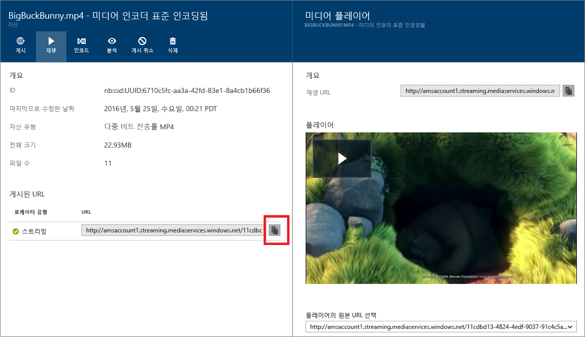

# Azure 포털을 통해 콘텐츠 게시
> [!div class="op_single_selector"]
> * [포털](media-services-portal-publish.md)
> * [.NET](media-services-deliver-streaming-content.md)
> * [REST (영문)](media-services-rest-deliver-streaming-content.md)
> 
> 

## 개요
> [!NOTE]
> 이 자습서를 완료하려면 Azure 계정이 필요합니다. 자세한 내용은 [Azure 무료 체험](https://azure.microsoft.com/pricing/free-trial/)을 참조하세요. 
> 
> 

콘텐츠를 스트리밍 또는 다운로드하는 데 사용할 수 있는 URL을 사용자에게 제공하려면 먼저 로케이터를 만들어 자산을 "게시"해야 합니다. 로케이터는 자산에 포함된 파일에 대한 액세스를 제공합니다. 미디어 서비스는 두 가지 유형의 로케이터를 지원합니다. 

* 스트리밍(OnDemandOrigin) 로케이터로, 적응 스트리밍(예: MPEG DASH, HLS 또는 부드러운 스트리밍을 스트림)에 사용합니다. 스트리밍 로케이터를 만들려면 자산에 .ism 파일이 있어야 합니다. 
* 점진적(SAS) 로케이터로, 점진적 다운로드를 통해 비디오를 배달하는 데 사용합니다.

스트리밍 URL에는 다음 형식이 있으며 부드러운 스트리밍 자산을 재생하는 데 사용할 수 있습니다.

    {streaming endpoint name-media services account name}.streaming.mediaservices.windows.net/{locator ID}/{filename}.ism/Manifest

HLS 스트리밍 URL을 작성하려면 URL에 (format=m3u8-aapl)을 추가합니다.

    {streaming endpoint name-media services account name}.streaming.mediaservices.windows.net/{locator ID}/{filename}.ism/Manifest(format=m3u8-aapl)

MPEG DASH 스트리밍 URL을 작성하려면 URL에 (format=mpd-time-csf)를 추가합니다.

    {streaming endpoint name-media services account name}.streaming.mediaservices.windows.net/{locator ID}/{filename}.ism/Manifest(format=mpd-time-csf)

SAS URL의 형식은 다음과 같습니다.

    {blob container name}/{asset name}/{file name}/{SAS signature}

자세한 내용은 [콘텐츠 제공 개요](media-services-deliver-content-overview.md)를 참조하세요.

> [!NOTE]
> 2015년 3월 이전에 로케이터를 만드는 데 포털을 사용한 경우에는 만료 날짜가 2년인 로케이터가 생성되었습니다.  
> 
> 

로케이터의 만료 날짜를 업데이트하려면 [REST](http://msdn.microsoft.com/library/azure/hh974308.aspx#update_a_locator) 또는 [.NET](http://go.microsoft.com/fwlink/?LinkID=533259) API를 사용합니다. SAS 로케이터의 만료 날짜를 업데이트할 때 해당 URL도 변경됩니다.

### 자산을 게시하기 위해 포털을 사용하려면
자산을 게시하기 위해 포털을 사용하려면 다음을 수행합니다.

1. [Azure Portal](https://portal.azure.com/)에서 Azure Media Services 계정을 선택합니다.
2. 계정 배포 진행 상태를 보려면 **설정** > **자산**을 참조하세요.
3. 게시하려는 자산을 선택합니다.
4. **게시** 단추를 클릭합니다.
5. 로케이터 유형을 선택합니다.
6. **추가**를 누릅니다.
   
    

URL이 **게시된 URL**목록에 추가됩니다.

## 포털에서 콘텐츠 재생
Azure 포털에서는 비디오를 테스트하는 데 사용할 수 있는 콘텐츠 플레이어를 제공합니다.

원하는 비디오를 클릭하고 **재생** 단추를 클릭합니다.

다음과 같은 몇 가지 고려 사항이 적용됩니다.

* 비디오가 게시된 것을 확인합니다.
* 이 **미디어 플레이어** 가 기본 스트리밍 끝점에서 재생됩니다. 기본이 아닌 스트리밍 끝점에서 재생하려면 URL 복사를 클릭하고 다른 플레이어를 사용합니다. 예를 들어 [Azure 미디어 서비스 플레이어](http://amsplayer.azurewebsites.net/azuremediaplayer.html)를 사용합니다.
* 스트리밍을 하고 있는 스트리밍 끝점이 실행 중이어야 합니다.  
* 스트리밍 끝점에서 스트리밍하려면 스트리밍 단위를 하나 이상 추가해야 합니다. 자세한 내용은 [이 항목](media-services-portal-scale-streaming-endpoints.md) 을 참조하세요.   

## 다음 단계
미디어 서비스 학습 경로를 검토합니다.

[!INCLUDE [media-services-learning-paths-include](../../includes/media-services-learning-paths-include.md)]

## 피드백 제공
[!INCLUDE [media-services-user-voice-include](../../includes/media-services-user-voice-include.md)]

<!--HONumber=Nov16_HO3-->

