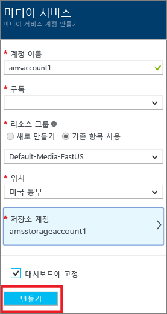
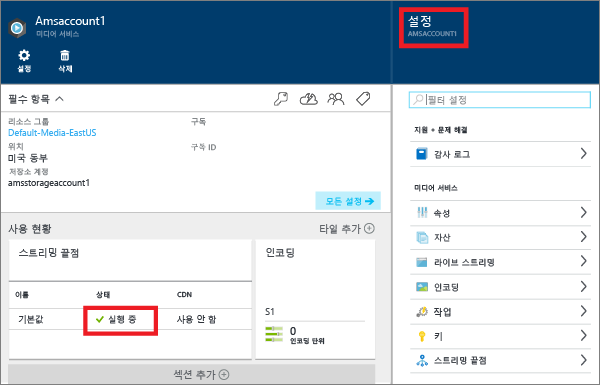
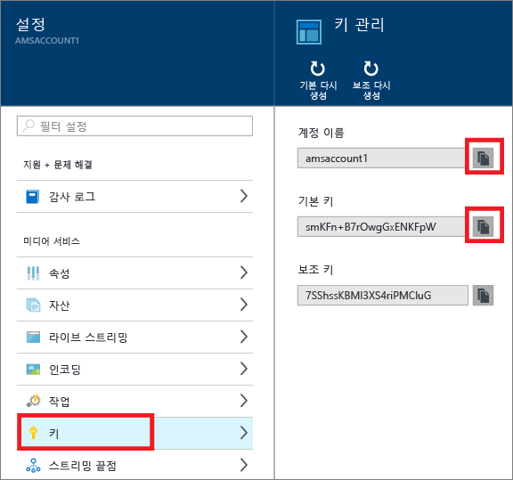
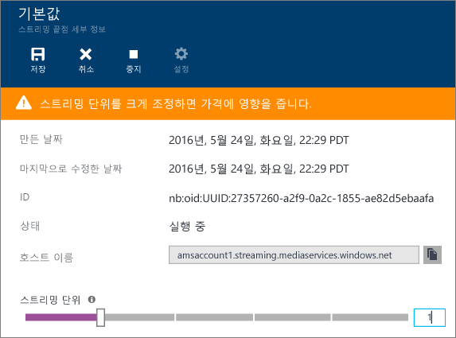
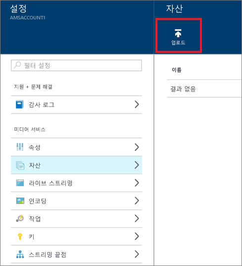
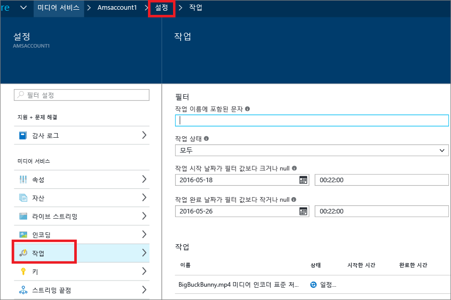

<properties
	pageTitle=" Azure 포털을 사용한 주문형 콘텐츠 제공 시작 | Microsoft Azure"
	description="이 자습서에서는 Azure 포털을 사용한 Azure 미디어 서비스(AMS) 응용 프로그램으로 기본 VoD(주문형 비디오) 콘텐츠 배달 서비스를 구현하는 단계를 안내합니다."
	services="media-services"
	documentationCenter=""
	authors="Juliako"
	manager="erikre"
	editor=""/>

<tags
	ms.service="media-services"
	ms.workload="media"
	ms.tgt_pltfrm="na"
	ms.devlang="na"
	ms.topic="get-started-article"
	ms.date="08/30/2016"
	ms.author="juliako"/>

# Azure 포털을 사용한 주문형 콘텐츠 제공 시작

[AZURE.INCLUDE [media-services-selector-get-started](../../includes/media-services-selector-get-started.md)]

이 자습서에서는 Azure 포털을 사용한 Azure 미디어 서비스(AMS) 응용 프로그램으로 기본 VoD(주문형 비디오) 콘텐츠 배달 서비스를 구현하는 단계를 안내합니다.

> [AZURE.NOTE] 이 자습서를 완료하려면 Azure 계정이 필요합니다. 자세한 내용은 [Azure 무료 체험](https://azure.microsoft.com/pricing/free-trial/)을 참조하세요.

이 자습서에는 다음 작업이 포함되어 있습니다.

1.  Azure 미디어 서비스 계정을 만듭니다.
2.  스트리밍 끝점을 구성합니다.
1.  비디오 파일을 업로드합니다.
1.  원본 파일을 적응 비트 전송률 MP4 파일 집합으로 인코딩합니다.
1.  자산을 게시하고, 스트리밍 기능을 사용하고, URL을 점진적으로 다운로드합니다.
1.  콘텐츠를 재생합니다.

## Azure 미디어 서비스 계정 만들기

이 섹션의 단계에서는 AMS 계정을 만드는 방법을 보여 줍니다.

1. [Azure 포털](https://portal.azure.com/)에 로그인합니다.
2. **+새로 만들기** > **미디어 + CDN** > **미디어 서비스**를 클릭합니다.

	

3. **미디어 서비스 계정 만들기**에 필요한 값을 입력합니다.

	
	
	1. **계정 이름**에 새 AMS 계정의 이름을 입력합니다. 미디어 서비스 계정 이름은 공백 없이 모두 소문자로 이루어진 3-24자의 숫자 또는 문자입니다.
	2. 구독에서 액세스할 수 있는 다양한 Azure 구독 중에서 선택합니다.
	
	2. **리소스 그룹**에서 새 또는 기존 리소스를 선택합니다. 리소스 그룹은 수명 주기, 권한 및 정책을 공유하는 리소스의 컬렉션입니다. [여기](resource-group-overview.md#resource-groups)(영문)를 참조하십시오.
	3. **위치**에서 미디어 서비스 계정에 대한 메타데이터 레코드 및 미디어를 저장하는 데 사용한 지리적 지역을 선택합니다. 이 지역은 미디어를 처리하고 스트림하는 데 사용됩니다. 사용 가능한 미디어 서비스 지역만 드롭다운 목록 상자에 표시됩니다.
	
	3. **저장소 계정**에서 미디어 서비스 계정의 미디어 콘텐츠가 포함된 Blob 저장소를 제공할 저장소 계정을 선택합니다. 미디어 서비스 계정과 동일한 지역의 기존 저장소 계정을 선택하거나 저장소 계정을 만들 수 있습니다. 동일한 지역에 새 저장소 계정이 생성됩니다. 저장소 계정 이름에 대한 규칙은 미디어 서비스 계정의 경우와 같습니다.

		저장소에 대한 자세한 내용은 [여기](storage-introduction.md)를 참조하세요.

	4. 계정 배포 진행 상태를 보려면 **대시보드에 고정**을 선택합니다.
	
7. 양식 맨 아래에 있는 **만들기**를 클릭합니다.

	계정이 만들어지면 상태가 **실행 중**으로 변경됩니다.

	

	AMS 계정을 관리(예: 비디오 업로드, 자산 인코딩, 작업 진행 상태 모니터링)하려면 **설정** 창을 사용합니다.

## 키 관리

프로그래밍 방식으로 미디어 서비스 계정에 액세스하려면 계정 이름과 기본 키 정보가 필요합니다.

1. Azure 포털에서 계정을 선택합니다.

	**설정** 창이 오른쪽에 나타납니다.

2. **설정** 창에서 **키**를 선택합니다.

	**키 관리** 창에 계정 이름과 기본 및 보조 키가 표시됩니다.
3. 복사 단추를 클릭하여 값을 복사합니다.
	
	

## 스트리밍 끝점 구성

Azure 미디어 서비스 작업 시 가장 일반적인 시나리오 중 하나는 클라이언트에 적응 비트 전송률 스트리밍을 통해 비디오를 제공하는 것입니다. 미디어 서비스에서 지원하는 적응 비트 전송률 스트리밍 기술은 HLS(HTTP 라이브 스트리밍), 부드러운 스트리밍, MPEG DASH 및 HDS(Adobe PrimeTime/Access 정식 사용자만 해당)입니다.

미디어 서비스는 적응 비트 전송률 MP4 인코딩 콘텐츠를 미디어 서비스에서 적시에 지원되는 각 스트리밍 형식(MPEG DASH, HLS, 부드러운 스트리밍, HDS)의 다시 패키징된 버전을 저장하지 않고도 이런 스트리밍 형식으로 배달할 수 있게 하는 동적 패키징을 제공합니다.

동적 패키징을 이용하려면 다음을 수행해야 합니다.

- mezzanine(원본) 파일을 적응 비트 전송률 MP4 파일 집합으로 인코딩합니다(인코딩 단계는 이 자습서의 뒷부분에서 설명).
- 콘텐츠를 배달하는 출발점이 될 *스트리밍 끝점*에 하나 이상의 스트리밍 단위를 만듭니다. 아래 단계는 스트리밍 단위의 수를 변경하는 방법을 보여 줍니다.

동적 패키징에서는 단일 저장소 형식으로 파일을 저장하고 비용을 지불하기만 하면 됩니다. 그러면 미디어 서비스가 클라이언트의 요청에 따라 적절한 응답을 빌드 및 제공합니다.

스트리밍 예약 단위의 수를 만들고 변경하려면 다음을 수행합니다.

1. **설정** 창에서 **스트리밍 끝점**을 클릭합니다.

2. 기본 스트리밍 끝점을 클릭합니다.

	**기본 스트리밍 끝점 세부 정보** 창이 나타납니다.

3. 스트리밍 단위 수를 지정하려면 **스트리밍 단위** 슬라이더를 밉니다.

	

4. **저장** 단추를 클릭하여 변경 내용을 저장합니다.

	>[AZURE.NOTE]새 단위를 할당하는 작업은 완료하는 데 최대 20분까지 소요될 수 있습니다.

## 파일 업로드

Azure 미디어 서비스를 사용하여 비디오를 스트림하려면 원본 비디오를 업로드하고 다중 비트 전송률로 인코딩하고 결과를 게시해야 합니다. 첫 번째 단계는 이 섹션에서 다룹니다.

1. **설정** 창에서 **자산**을 클릭합니다.

	

3. **업로드** 단추를 클릭합니다.

	**비디오 자산 업로드** 창이 나타납니다.

	>[AZURE.NOTE] 파일 크기에는 제한이 없습니다.
	
4. 컴퓨터에 원하는 비디오를 찾아 선택하고 확인을 누릅니다.

	업로드가 시작되고 파일 이름 아래에 진행 상태가 표시됩니다.

업로드가 완료되면 **자산** 창에 새 자산이 나열됩니다.

## 자산 인코딩

Azure 미디어 서비스 작업 시 가장 일반적인 시나리오 중 하나는 클라이언트에 적응 비트 전송률 스트리밍을 제공하는 것입니다. 미디어 서비스에서 지원하는 적응 비트 전송률 스트리밍 기술은 HLS(HTTP 라이브 스트리밍), 부드러운 스트리밍, MPEG DASH 및 HDS(Adobe PrimeTime/Access 정식 사용자만 해당)입니다. 적응 비트 전송률 스트리밍을 위한 비디오를 준비하려면 소스 비디오를 다중 비트 전송률 파일로 인코딩해야 합니다. 비디오를 인코딩하는 데는 **미디어 인코더 표준** 인코더를 사용해야 합니다.

미디어 서비스는 또한 다중 비트 전송률 MP4를 스트리밍 형식(MPEG DASH, HLS, 부드러운 스트리밍 또는 HDS)으로 다시 패키징하지 않고도 이런 스트리밍 형식으로 배달할 수 있게 하는 동적 패키징을 제공합니다. 동적 패키징에서는 단일 저장소 형식으로 파일을 저장하고 비용을 지불하기만 하면 됩니다. 그러면 미디어 서비스가 클라이언트의 요청에 따라 적절한 응답을 빌드 및 제공합니다.

동적 패키징을 이용하려면 다음을 수행해야 합니다.

- 원본 파일을 다중 비트 전송률 MP4 파일 집합으로 인코딩합니다(인코딩 단계는 이 섹션의 뒷부분에서 설명).
- 콘텐츠를 배달하는 출발점이 될 스트리밍 끝점에 하나 이상의 스트리밍 단위를 구성합니다. 자세한 내용은 [스트리밍 끝점 구성](media-services-portal-vod-get-started.md#configure-streaming-endpoints)을 참조하세요.

### 인코딩하는 데 포털을 사용하려면

이 섹션에서는 미디어 인코더 표준을 사용하여 콘텐츠를 인코딩할 수 있는 단계를 설명합니다.

1.  **설정** 창에서 **자산**을 선택합니다.
2.  **자산** 창에서 인코딩할 자산을 선택합니다.
3.  **인코딩** 단추를 누릅니다.
4.  **자산 인코딩** 창에서 "미디어 인코더 표준" 프로세서 및 사전 설정을 선택합니다. 예를 들어 입력 비디오가 1920x1080픽셀 해상도를 포함하는 것을 알고 있는 경우 "H264 다중 비트 전송률 1080p" 사전 설정을 사용할 수 있습니다. 사전 설정에 대한 자세한 내용은 [이](https://msdn.microsoft.com/library/azure/mt269960.aspx) 문서를 참조하세요. 입력 비디오에 가장 적합한 사전 설정을 선택하는 것이 중요합니다. 낮은 해상도(640x360) 비디오가 있는 경우 기본 "H264 다중 비트 전송률 1080p" 사전 설정을 사용하지 말아야 합니다.
	
	관리를 간소화하기 위해 출력 자산의 이름과 작업 이름을 편집하는 옵션이 있습니다.
		
	
5. **만들기**를 누릅니다.

### 인코딩 작업의 진행 상태 모니터링

인코딩 작업의 진행 상태를 모니터링하려면 **설정**(페이지 맨 위에 있음)을 클릭한 후 **작업**을 선택합니다.

## 콘텐츠 게시

콘텐츠 스트림 또는 다운로드에 사용할 수 있는 URL을 사용자에게 제공하려면 먼저 로케이터를 만들어 자산을 "게시"해야 합니다. 로케이터는 자산에 포함된 파일에 대한 액세스를 제공합니다. 미디어 서비스는 두 가지 유형의 로케이터를 지원합니다.

- 스트리밍(OnDemandOrigin) 로케이터로, 적응 스트리밍(예: MPEG DASH, HLS 또는 부드러운 스트리밍을 스트림)에 사용합니다. 스트리밍 로케이터를 만들려면 자산에 .ism 파일이 있어야 합니다.
- 점진적(SAS) 로케이터로, 점진적 다운로드를 통해 비디오를 배달하는 데 사용합니다.

스트리밍 URL에는 다음 형식이 있으며 부드러운 스트리밍 자산을 재생하는 데 사용할 수 있습니다.

	{streaming endpoint name-media services account name}.streaming.mediaservices.windows.net/{locator ID}/{filename}.ism/Manifest

HLS 스트리밍 URL을 작성하려면 URL에 (format=m3u8-aapl)을 추가합니다.

	{streaming endpoint name-media services account name}.streaming.mediaservices.windows.net/{locator ID}/{filename}.ism/Manifest(format=m3u8-aapl)

MPEG DASH 스트리밍 URL을 작성하려면 URL에 (format=mpd-time-csf)를 추가합니다.

	{streaming endpoint name-media services account name}.streaming.mediaservices.windows.net/{locator ID}/{filename}.ism/Manifest(format=mpd-time-csf)

SAS URL의 형식은 다음과 같습니다.

	{blob container name}/{asset name}/{file name}/{SAS signature}

>[AZURE.NOTE] 2015년 3월 이전에 로케이터를 만드는 데 포털을 사용한 경우에는 만료 날짜가 2년인 로케이터가 생성되었습니다.

로케이터의 만료 날짜를 업데이트하려면 [REST](http://msdn.microsoft.com/library/azure/hh974308.aspx#update_a_locator) 또는 [.NET](http://go.microsoft.com/fwlink/?LinkID=533259) API를 사용합니다. SAS 로케이터의 만료 날짜를 업데이트할 때 해당 URL도 변경됩니다.

### 자산을 게시하기 위해 포털을 사용하려면

자산을 게시하기 위해 포털을 사용하려면 다음을 수행합니다.

1. **설정** > **자산**을 선택합니다.
1. 게시하려는 자산을 선택합니다.
1. **게시** 단추를 클릭합니다.
1. 로케이터 유형을 선택합니다.
2. **추가**를 누릅니다.

	

URL이 **게시된 URL** 목록에 추가됩니다.

## 포털에서 콘텐츠 재생

Azure 포털에서는 비디오를 테스트하는 데 사용할 수 있는 콘텐츠 플레이어를 제공합니다.

원하는 비디오를 클릭하고 **재생** 단추를 클릭합니다.

다음과 같은 몇 가지 고려 사항이 적용됩니다.

- 비디오가 게시된 것을 확인합니다.
- 이 **미디어 플레이어**가 기본 스트리밍 끝점에서 재생됩니다. 기본이 아닌 스트리밍 끝점에서 재생하려면 URL 복사를 클릭하고 다른 플레이어를 사용합니다. 예를 들어 [Azure 미디어 서비스 플레이어](http://amsplayer.azurewebsites.net/azuremediaplayer.html)를 사용합니다.

##다음 단계

미디어 서비스 학습 경로를 검토합니다.

[AZURE.INCLUDE [media-services-learning-paths-include](../../includes/media-services-learning-paths-include.md)]

##피드백 제공

[AZURE.INCLUDE [media-services-user-voice-include](../../includes/media-services-user-voice-include.md)]

<!---HONumber=AcomDC_0831_2016-->