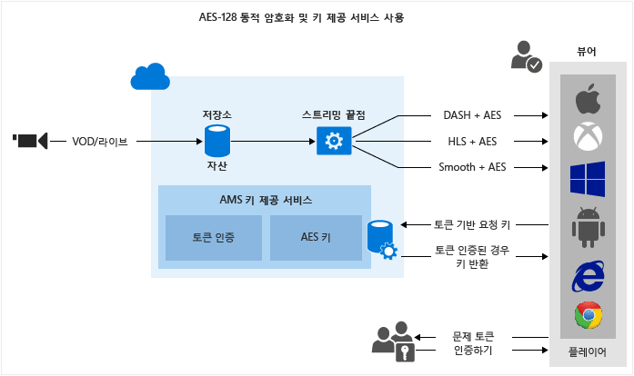

<properties
	pageTitle="AES-128 동적 암호화 및 키 전달 서비스 사용 | Microsoft Azure"
	description="Microsoft Azure 미디어 서비스를 사용하면 AES 128비트 암호화 키로 암호화된 콘텐츠를 배달할 수 있습니다. 미디어 서비스는 권한 있는 사용자에게 암호화 키를 제공하는 키 배달 서비스도 제공합니다. 이 항목에서는 AES-128로 동적으로 암호화하는 방법과 키 배달 서비스를 사용하는 방법을 보여 줍니다."
	services="media-services"
	documentationCenter=""
	authors="Juliako"
	manager="erikre"
	editor=""/>

<tags
	ms.service="media-services"
	ms.workload="media"
	ms.tgt_pltfrm="na"
	ms.devlang="na"
	ms.topic="article" 
	ms.date="09/19/2016"
	ms.author="juliako"/>

#AES-128 동적 암호화 및 키 전달 서비스 사용

> [AZURE.SELECTOR]
- [.NET](media-services-protect-with-aes128.md)
- [Java](https://github.com/southworkscom/azure-sdk-for-media-services-java-samples)
- [PHP](https://github.com/Azure/azure-sdk-for-php/tree/master/examples/MediaServices)

##개요

Microsoft Azure 미디어 서비스를 사용하면 128 비트 암호화 키를 사용하는 AES(Advanced Encryption Standard)로 암호화된 Http-Live-Streaming(HLS) 및 부드러운 스트림을 제공할 수 있습니다. 미디어 서비스는 권한 있는 사용자에게 암호화 키를 제공하는 키 배달 서비스도 제공합니다. 미디어 서비스에서 자산을 암호화하려는 경우 암호화 키를 자산에 연결하고 해당 키에 대해 권한 부여 정책도 구성해야 합니다. 플레이어가 스트림을 요청하면 미디어 서비스는 지정된 키를 사용하고 AES 암호화를 사용하여 동적으로 사용자의 콘텐츠를 암호화합니다. 스트림을 해독하기 위해 플레이어는 키 배달 서비스에서 키를 요청합니다. 사용자에게 키를 얻을 수 있는 권한이 있는지 여부를 결정하기 위해 서비스는 키에 지정된 권한 부여 정책을 평가합니다.

미디어 서비스는 키를 요청 하는 사용자를 인증 하는 여러 방법을 지원합니다. 콘텐츠 키 권한 부여 정책에는 열기 또는 토큰 제한과 같은 하나 이상의 권한 부여 제한이 있을 수 있습니다. 토큰 제한 정책은 보안 토큰 서비스(STS)에 의해 발급된 토큰이 수반되어야 합니다. 미디어 서비스는 [간단한 웹 토큰](https://msdn.microsoft.com/library/gg185950.aspx#BKMK_2)(SWT) 형식 및 [JSON 웹 토큰](https://msdn.microsoft.com/library/gg185950.aspx#BKMK_3)(JWT) 형식의 토큰을 지원합니다. 자세한 내용은 [콘텐츠 키의 권한 부여 정책 구성](media-services-protect-with-aes128.md#configure_key_auth_policy)을 참조하세요.

동적 암호화를 이용하려면 다중 비트 전송률 MP4 파일 또는 다중 비트 전송률 부드러운 스트리밍 원본 파일의 집합이 포함된 자산을 만들어야 합니다. 또한 자산의 배달 정책을 구성해야 합니다(이 항목의 뒷부분에서 설명). 이렇게 하면 스트리밍 URL에 지정된 형식에 따라 주문형 스트리밍 서버는 사용자가 선택한 프로토콜로 스트림이 배달되도록 합니다. 따라서 사용자는 단일 저장소 형식으로 파일을 저장하고 해당 파일에 대한 요금을 지불하기만 하면 되며, 미디어 서비스에서 클라이언트의 요청에 따라 적절한 응답을 작성하고 제공합니다.

이 항목은 보호된 미디어를 배달하는 응용 프로그램에 대한 작업을 수행하는 개발자에게 유용합니다. 이 항목에서는 권한 부여 정책으로 키 배달 서비스를 구성하여 권한이 있는 클라이언트만 암호화 키를 받을 수 있도록 하는 방법을 보여 줍니다. 또한 동적 암호화를 사용하는 방법도 보여 줍니다.

>[AZURE.NOTE]동적 암호화를 사용하려면 하나 이상의 배율 단위(스트리밍 단위라고도 함)를 얻어야 합니다. 자세한 내용은 [미디어 서비스 크기를 조정하는 방법](media-services-portal-manage-streaming-endpoints.md)을 참조하세요.

##AES-128 동적 암호화 및 키 배달 서비스 워크플로

다음은 AES로 자산을 암호화하고 미디어 서비스 키 배달 서비스를 사용하며 동적 암호화를 사용할 때 수행해야 하는 일반적인 단계입니다.

1. [자산을 만들고 파일을 자산에 업로드합니다](media-services-protect-with-aes128.md#create_asset).
1. [파일이 들어 있는 자산을 적응 비트 전송률 MP4 집합으로 인코딩합니다](media-services-protect-with-aes128.md#encode_asset).
1. [콘텐츠 키를 만들어 인코딩된 자산에 연결합니다](media-services-protect-with-aes128.md#create_contentkey). 미디어 서비스에서 콘텐츠 키에는 자산의 암호화 키가 들어 있습니다.
1. [콘텐츠 키의 권한 부여 정책을 구성합니다](media-services-protect-with-aes128.md#configure_key_auth_policy). 콘텐츠 키 권한 부여 정책은 사용자가 구성해야 하며 콘텐츠 키를 클라이언트에 배달하기 위해서는 해당 클라이언트를 충족시켜야 합니다.
1. [자산에 대한 배달 정책을 구성합니다](media-services-protect-with-aes128.md#configure_asset_delivery_policy). 배달 정책 구성에는 키 획득 URL 및 IV(Initialization Vector)(AES 128에는 암호화 및 해독 시 동일한 IV를 제공해야 함), 배달 프로토콜(예: MPEG DASH, HLS, HDS, 부드러운 스트리밍 또는 모두), 동적 암호화 유형(예: 봉투(envelope) 또는 동적이지 않은 암호화)이 포함됩니다.

동일한 자산의 각 프로토콜에 다른 정책을 적용할 수 있습니다. 예를 들어, Smooth/DASH에 PlayReady 암호화를, HLS에 AES 봉투(envelope)를 적용할 수 있습니다. 배달 정책에 정의되지 않은 모든 프로토콜(예: HLS만 프로토콜로 지정하는 단일 정책)은 스트리밍에서 차단됩니다. 정의한 자산 배달 정책이 없는 경우는 예외입니다. 이렇게 하면 모든 프로토콜이 허용됩니다.

1. 스트리밍 URL을 얻기 위해 [주문형 로케이터를 만듭니다](media-services-protect-with-aes128.md#create_locator).

또한 이 항목에서는 [클라이언트 응용 프로그램이 키 배달 서비스로부터 키를 요청하는 방법](media-services-protect-with-aes128.md#client_request)도 보여 줍니다.

이 항목의 끝부분에서 전체 .NET [예제](media-services-protect-with-aes128.md#example)가 나와 있습니다.

다음 이미지는 위에서 설명한 워크플로를 보여 줍니다. 여기서는 인증에 토큰을 사용합니다.

이 항목의 나머지 부분에서는 자세한 설명, 코드 예제 및 위에서 설명한 작업을 수행하는 방법을 보여주는 항목에 대한 링크를 제공합니다.

##현재 제한 사항

자산 배달 정책을 추가하거나 업데이트하는 경우 기존 로케이터(있는 경우)를 삭제하고 새 로케이터를 만들어야 합니다.

##자산 만들기 및 파일을 자산에 업로드

관리, 인코딩 및 비디오 스트림을 수행하려면 먼저 콘텐츠를 Microsoft Azure 미디어 서비스에 업로드해야 합니다. 업로드되면 이후 처리 및 스트리밍을 위해 콘텐츠가 클라우드에 안전하게 저장됩니다.

자세한 내용은 [미디어 서비스 계정에 파일 업로드](media-services-dotnet-upload-files.md)를 참조하세요.

##파일이 들어 있는 자산을 적응 비트 전송률 MP4 집합으로 인코딩

동적 암호화를 사용하는 경우 다중 비트 전송률 MP4 파일 또는 다중 비트 전송률 부드러운 스트리밍 원본 파일의 집합이 포함된 자산을 만들기만 하면 됩니다. 이렇게 하면 매니페스트 또는 조각 요청의 지정된 형식에 따라 주문형 스트리밍 서버는 사용자가 선택한 프로토콜로 스트림을 받을 수 있도록 합니다. 따라서 사용자는 단일 저장소 형식으로 파일을 저장하고 해당 파일에 대한 요금을 지불하기만 하면 되며, 미디어 서비스에서 클라이언트의 요청에 따라 적절한 응답을 작성하고 제공합니다. 자세한 내용은 [동적 패키징 개요](media-services-dynamic-packaging-overview.md) 항목을 참조하세요.

인코딩하는 방법에 관한 지침은 [미디어 인코더 표준를 사용하여 자산을 인코딩하는 방법](media-services-dotnet-encode-with-media-encoder-standard.md)을 참조하세요.

##콘텐츠 키를 만들어 인코딩된 자산에 연결

미디어 서비스에서 콘텐츠 키에는 자산을 암호화할 키가 들어 있습니다.

자세한 내용은 [콘텐츠 키 만들기](media-services-dotnet-create-contentkey.md)를 참조하세요.

##콘텐츠 키의 인증 정책을 구성합니다.

미디어 서비스는 키를 요청 하는 사용자를 인증 하는 여러 방법을 지원합니다. 콘텐츠 키 권한 부여 정책은 사용자가 구성해야 하며 이 키를 클라이언트에 배달하기 위해서는 해당 클라이언트(플레이어)를 충족시켜야 합니다. 콘텐츠 키 권한 부여 정책에는 열기, 토큰 제한 또는 IP 제한과 같은 하나 이상의 권한 부여 제한이 있을 수 있습니다.

자세한 내용은 [콘텐츠 키 권한 부여 정책 구성](media-services-dotnet-configure-content-key-auth-policy.md)을 참조하세요.

##자산 배달 정책 구성 

자산에 대한 배달 정책을 구성합니다. 자산 배달 정책 구성에는 다음이 포함됩니다.

- 키 획득 URL.
- 봉투(envelope) 암호화에 사용할 IV(Initialization Vector). AES 128에는 암호화 및 해독 시 동일한 IV를 제공해야 합니다.
- 자산 배달 프로토콜(예: MPEG DASH, HLS, HDS, 부드러운 스트리밍 또는 모두).
- 동적 암호화 유형(예: AES 봉투) 또는 동적이지 않은 암호화.

자세한 내용은 [자산 배달 정책 구성](media-services-rest-configure-asset-delivery-policy.md)을 참조하세요.

##스트리밍 URL을 얻기 위해 주문형 스트리밍 로케이터 만들기

사용자에게 Smooth, DASH 또는 HLS에 대한 스트리밍 URL을 제공해야 합니다.

>[AZURE.NOTE]자산 배달 정책을 추가하거나 업데이트하는 경우 기존 로케이터(있는 경우)를 삭제하고 새 로케이터를 만들어야 합니다.

자산을 게시하고 스트리밍 URL을 작성하는 방법은 [스트리밍 URL 작성](media-services-deliver-streaming-content.md)을 참조하세요.

##테스트 토큰 가져오기

키 권한 부여 정책에 사용된 토큰 제한에 따라 테스트 토큰을 가져옵니다.

	// Deserializes a string containing an Xml representation of a TokenRestrictionTemplate
	// back into a TokenRestrictionTemplate class instance.
	TokenRestrictionTemplate tokenTemplate = 
	    TokenRestrictionTemplateSerializer.Deserialize(tokenTemplateString);
	
	// Generate a test token based on the data in the given TokenRestrictionTemplate.
	//The GenerateTestToken method returns the token without the word “Bearer” in front
	//so you have to add it in front of the token string. 
	string testToken = TokenRestrictionTemplateSerializer.GenerateTestToken(tokenTemplate);
	Console.WriteLine("The authorization token is:\nBearer {0}", testToken);

[AMS 플레이어](http://amsplayer.azurewebsites.net/azuremediaplayer.html)를 사용하여 스트림을 테스트할 수 있습니다.

##클라이언트가 키 배달 서비스로부터 키를 요청하는 방법

이전 단계에서는 매니페스트 파일을 가리키는 URL을 생성했습니다. 클라이언트는 키 배달 서비스에 요청을 수행하기 위해 스트리밍 매니페스트 파일에서 필요한 정보를 추출해야 합니다.

###매니페스트 파일

클라이언트는 매니페스트 파일에서 URL(콘텐츠 키 Id도 포함(kid)) 값을 추출해야 합니다. 그런 다음 키 배달 서비스로부터 암호화 키 가져오기를 시도합니다. 또한 IV 값을 추출하고 이 값을 사용하여 스트림을 해독합니다. 다음 코드 조각은 부드러운 스트리밍 매니페스트의 <Protection> 요소를 보여 줍니다.

	<Protection>
	  <ProtectionHeader SystemID="B47B251A-2409-4B42-958E-08DBAE7B4EE9">
	    <ContentProtection xmlns:sea="urn:mpeg:dash:schema:sea:2012" schemeIdUri="urn:mpeg:dash:sea:2012">
	      <sea:SegmentEncryption schemeIdUri="urn:mpeg:dash:sea:aes128-cbc:2013"/>
	      <sea:KeySystem keySystemUri="urn:mpeg:dash:sea:keysys:http:2013"/>
	      <sea:CryptoPeriod IV="0xD7D7D7D7D7D7D7D7D7D7D7D7D7D7D7D7" 
	                        keyUriTemplate="https://wamsbayclus001kd-hs.cloudapp.net/HlsHandler.ashx?
	                                        kid=da3813af-55e6-48e7-aa9f-a4d6031f7b4d"/>
	    </ContentProtection>
	  </ProtectionHeader>
	</Protection>

HLS의 경우 루트 매니페스트는 세그먼트 파일로 나뉩니다.

예를 들어 매니페스트가 http://test001.origin.mediaservices.windows.net/8bfe7d6f-34e3-4d1a-b289-3e48a8762490/BigBuckBunny.ism/manifest(format=m3u8-aapl)이고 여기에는 세그먼트 파일 이름 목록이 포함됩니다.
	
	. . . 
	#EXT-X-STREAM-INF:PROGRAM-ID=1,BANDWIDTH=630133,RESOLUTION=424x240,CODECS="avc1.4d4015,mp4a.40.2",AUDIO="audio"
	QualityLevels(514369)/Manifest(video,format=m3u8-aapl)
	#EXT-X-STREAM-INF:PROGRAM-ID=1,BANDWIDTH=965441,RESOLUTION=636x356,CODECS="avc1.4d401e,mp4a.40.2",AUDIO="audio"
	QualityLevels(842459)/Manifest(video,format=m3u8-aapl)
	…

텍스트 편집기에서 세그먼트 파일 중 하나를 열면(예: http://test001.origin.mediaservices.windows.net/8bfe7d6f-34e3-4d1a-b289-3e48a8762490/BigBuckBunny.ism/QualityLevels(514369)/Manifest(video,format=m3u8-aapl)) 여기에는 해당 파일이 암호화되었음을 나타내는 #EXT-X-KEY가 포함되어야 합니다.
	
	#EXTM3U
	#EXT-X-VERSION:4
	#EXT-X-ALLOW-CACHE:NO
	#EXT-X-MEDIA-SEQUENCE:0
	#EXT-X-TARGETDURATION:9
	#EXT-X-KEY:METHOD=AES-128,
	URI="https://wamsbayclus001kd-hs.cloudapp.net/HlsHandler.ashx?
	     kid=da3813af-55e6-48e7-aa9f-a4d6031f7b4d",
	        IV=0XD7D7D7D7D7D7D7D7D7D7D7D7D7D7D7D7
	#EXT-X-PROGRAM-DATE-TIME:1970-01-01T00:00:00.000+00:00
	#EXTINF:8.425708,no-desc
	Fragments(video=0,format=m3u8-aapl)
	#EXT-X-ENDLIST
	
###키 배달 서비스로부터 키 요청

다음 코드에서는 키 배달 Uri(매니페스트에서 추출됨) 및 토큰을 사용하여 미디어 서비스 키 배달 서비스로 요청을 보내는 방법을 보여 줍니다(이 항목에서는 보안 토큰 서비스에서 간단한 웹 토큰을 가져오는 방법에 대해서는 다루지 않음).

	private byte[] GetDeliveryKey(Uri keyDeliveryUri, string token)
	{
	    HttpWebRequest request = (HttpWebRequest)WebRequest.Create(keyDeliveryUri);
	            
	    request.Method = "POST";
	    request.ContentType = "text/xml";
	    if (!string.IsNullOrEmpty(token))
	    {
	        request.Headers[AuthorizationHeader] = token;
	    }
	    request.ContentLength = 0;
	
	    var response = request.GetResponse();
	 
	    var stream = response.GetResponseStream();
	    if (stream == null)
	    {
	        throw new NullReferenceException("Response stream is null");
	    }
	
	    var buffer = new byte[256];
	    var length = 0;
	    while (stream.CanRead && length <= buffer.Length)
	    {
	        var nexByte = stream.ReadByte();
	        if (nexByte == -1)
	        {
	            break;
	        }
	        buffer[length] = (byte)nexByte;
	        length++;
	    }
	    response.Close();
	
	    // AES keys must be exactly 16 bytes (128 bits).
	    var key = new byte[length];
	    Array.Copy(buffer, key, length);
	    return key;
	}
	
##예제

1. 새 콘솔 프로젝트를 만듭니다.
1. 설치하려면 NuGet을 사용하고 Azure 미디어 서비스 .NET SDK 확장을 추가합니다. 이 패키지를 설치하면 미디어 서비스 .NET SDK도 설치되고 다른 모든 필수 종속성이 추가됩니다.
2. 계정 이름 및 키 정보가 들어 있는 구성 파일을 추가합니다.

	
		<?xml version="1.0" encoding="utf-8"?>
		<configuration>
		    <startup> 
		        <supportedRuntime version="v4.0" sku=".NETFramework,Version=v4.5" />
		    </startup>
			  <appSettings>
			
			    <add key="MediaServicesAccountName" value="AccountName"/>
			    <add key="MediaServicesAccountKey" value="AccountKey"/>
			
			    <add key="Issuer" value="http://testacs.com"/>
			    <add key="Audience" value="urn:test"/>
			  </appSettings>
		</configuration>

1. Program.cs 파일에 있는 코드를 이 섹션에 나와 있는 코드로 덮어씁니다.
	
	입력 파일이 있는 폴더를 가리키도록 변수를 업데이트해야 합니다.
			
		
		using System;
		using System.Collections.Generic;
		using System.Configuration;
		using System.IO;
		using System.Linq;
		using System.Net;
		using System.Security.Cryptography;
		using System.Text;
		using System.Threading.Tasks;
		using Microsoft.WindowsAzure.MediaServices.Client;
		using Newtonsoft.Json.Linq;
		using System.Threading;
		using Microsoft.WindowsAzure.MediaServices.Client.ContentKeyAuthorization;
		using Microsoft.WindowsAzure.MediaServices.Client.DynamicEncryption;
		using System.Web;
		using System.Globalization;
		
		namespace AESDynamicEncryptionAndKeyDeliverySvc
		{
		    class Program
		    {
		        // Read values from the App.config file.
		        private static readonly string _mediaServicesAccountName =
		            ConfigurationManager.AppSettings["MediaServicesAccountName"];
		        private static readonly string _mediaServicesAccountKey =
		            ConfigurationManager.AppSettings["MediaServicesAccountKey"];
		
		        // A Uri describing the issuer of the token.  
		        // Must match the value in the token for the token to be considered valid.
		        private static readonly Uri _sampleIssuer =
		            new Uri(ConfigurationManager.AppSettings["Issuer"]);
		        // The Audience or Scope of the token.  
		        // Must match the value in the token for the token to be considered valid.
		        private static readonly Uri _sampleAudience =
		            new Uri(ConfigurationManager.AppSettings["Audience"]);
		
		        // Field for service context.
		        private static CloudMediaContext _context = null;
		        private static MediaServicesCredentials _cachedCredentials = null;
		
		        private static readonly string _mediaFiles =
		            Path.GetFullPath(@"../..\Media");
		
		        private static readonly string _singleMP4File =
		            Path.Combine(_mediaFiles, @"BigBuckBunny.mp4");
		
		
		        static void Main(string[] args)
		        {
		            // Create and cache the Media Services credentials in a static class variable.
		            _cachedCredentials = new MediaServicesCredentials(
		                            _mediaServicesAccountName,
		                            _mediaServicesAccountKey);
		            // Used the chached credentials to create CloudMediaContext.
		            _context = new CloudMediaContext(_cachedCredentials);
		
		            bool tokenRestriction = false;
		            string tokenTemplateString = null;
		
		            IAsset asset = UploadFileAndCreateAsset(_singleMP4File);
		            Console.WriteLine("Uploaded asset: {0}", asset.Id);
		
		            IAsset encodedAsset = EncodeToAdaptiveBitrateMP4Set(asset);
		            Console.WriteLine("Encoded asset: {0}", encodedAsset.Id);
		
		            IContentKey key = CreateEnvelopeTypeContentKey(encodedAsset);
		            Console.WriteLine("Created key {0} for the asset {1} ", key.Id, encodedAsset.Id);
		            Console.WriteLine();
		
		            if (tokenRestriction)
		                tokenTemplateString = AddTokenRestrictedAuthorizationPolicy(key);
		            else
		                AddOpenAuthorizationPolicy(key);
		
		            Console.WriteLine("Added authorization policy: {0}", key.AuthorizationPolicyId);
		            Console.WriteLine();
		
		            CreateAssetDeliveryPolicy(encodedAsset, key);
		            Console.WriteLine("Created asset delivery policy. \n");
		            Console.WriteLine();
		
		            if (tokenRestriction && !String.IsNullOrEmpty(tokenTemplateString))
		            {
		                // Deserializes a string containing an Xml representation of a TokenRestrictionTemplate
		                // back into a TokenRestrictionTemplate class instance.
		                TokenRestrictionTemplate tokenTemplate =
		                    TokenRestrictionTemplateSerializer.Deserialize(tokenTemplateString);
		
		                // Generate a test token based on the data in the given TokenRestrictionTemplate.
		                // Note, you need to pass the key id Guid because we specified 
		                // TokenClaim.ContentKeyIdentifierClaim in during the creation of TokenRestrictionTemplate.
		                Guid rawkey = EncryptionUtils.GetKeyIdAsGuid(key.Id);
		
		                //The GenerateTestToken method returns the token without the word “Bearer” in front
		                //so you have to add it in front of the token string. 
		                string testToken = TokenRestrictionTemplateSerializer.GenerateTestToken(tokenTemplate, null, rawkey);
		                Console.WriteLine("The authorization token is:\nBearer {0}", testToken);
		                Console.WriteLine();
		            }
		
		            // You can use the bit.ly/aesplayer Flash player to test the URL 
		            // (with open authorization policy). 
		            // Paste the URL and click the Update button to play the video. 
		            //
		            string URL = GetStreamingOriginLocator(encodedAsset);
		            Console.WriteLine("Smooth Streaming Url: {0}/manifest", URL);
		            Console.WriteLine();
		            Console.WriteLine("HLS Url: {0}/manifest(format=m3u8-aapl)", URL);
		            Console.WriteLine();
		
		            Console.ReadLine();
		        }
		
		        static public IAsset UploadFileAndCreateAsset(string singleFilePath)
		        {
		            if (!File.Exists(singleFilePath))
		            {
		                Console.WriteLine("File does not exist.");
		                return null;
		            }
		
		            var assetName = Path.GetFileNameWithoutExtension(singleFilePath);
		            IAsset inputAsset = _context.Assets.Create(assetName, AssetCreationOptions.StorageEncrypted);
		
		            var assetFile = inputAsset.AssetFiles.Create(Path.GetFileName(singleFilePath));
		
		            Console.WriteLine("Created assetFile {0}", assetFile.Name);
		
		            var policy = _context.AccessPolicies.Create(
		                                    assetName,
		                                    TimeSpan.FromDays(30),
		                                    AccessPermissions.Write | AccessPermissions.List);
		
		            var locator = _context.Locators.CreateLocator(LocatorType.Sas, inputAsset, policy);
		
		            Console.WriteLine("Upload {0}", assetFile.Name);
		
		            assetFile.Upload(singleFilePath);
		            Console.WriteLine("Done uploading {0}", assetFile.Name);
		
		            locator.Delete();
		            policy.Delete();
		
		            return inputAsset;
		        }
		
		        static public IAsset EncodeToAdaptiveBitrateMP4Set(IAsset asset)
		        {
		            // Declare a new job.
		            IJob job = _context.Jobs.Create("Media Encoder Standard Job");
		            // Get a media processor reference, and pass to it the name of the 
		            // processor to use for the specific task.
		            IMediaProcessor processor = GetLatestMediaProcessorByName("Media Encoder Standard");
		
		            // Create a task with the encoding details, using a string preset.
		            // In this case "H264 Multiple Bitrate 720p" preset is used.
		            ITask task = job.Tasks.AddNew("My encoding task",
		                processor,
		                "H264 Multiple Bitrate 720p",
		                TaskOptions.None);
		
		            // Specify the input asset to be encoded.
		            task.InputAssets.Add(asset);
		            // Add an output asset to contain the results of the job. 
		            // This output is specified as AssetCreationOptions.None, which 
		            // means the output asset is not encrypted. 
		            task.OutputAssets.AddNew("Output asset",
		                AssetCreationOptions.StorageEncrypted);
		
		            job.StateChanged += new EventHandler<JobStateChangedEventArgs>(JobStateChanged);
		            job.Submit();
		            job.GetExecutionProgressTask(CancellationToken.None).Wait();
		
		            return job.OutputMediaAssets[0];
		        }
		
		        private static IMediaProcessor GetLatestMediaProcessorByName(string mediaProcessorName)
		        {
		            var processor = _context.MediaProcessors.Where(p => p.Name == mediaProcessorName).
		            ToList().OrderBy(p => new Version(p.Version)).LastOrDefault();
		
		            if (processor == null)
		                throw new ArgumentException(string.Format("Unknown media processor", mediaProcessorName));
		
		            return processor;
		        }
		
		        static public IContentKey CreateEnvelopeTypeContentKey(IAsset asset)
		        {
		            // Create envelope encryption content key
		            Guid keyId = Guid.NewGuid();
		            byte[] contentKey = GetRandomBuffer(16);
		
		            IContentKey key = _context.ContentKeys.Create(
		                                    keyId,
		                                    contentKey,
		                                    "ContentKey",
		                                    ContentKeyType.EnvelopeEncryption);
		
		            // Associate the key with the asset.
		            asset.ContentKeys.Add(key);
		
		            return key;
		        }
		
		        static public void AddOpenAuthorizationPolicy(IContentKey contentKey)
		        {
		            // Create ContentKeyAuthorizationPolicy with Open restrictions 
		            // and create authorization policy             
		            IContentKeyAuthorizationPolicy policy = _context.
		                                    ContentKeyAuthorizationPolicies.
		                                    CreateAsync("Open Authorization Policy").Result;
		
		            List<ContentKeyAuthorizationPolicyRestriction> restrictions =
		                new List<ContentKeyAuthorizationPolicyRestriction>();
		
		            ContentKeyAuthorizationPolicyRestriction restriction =
		                new ContentKeyAuthorizationPolicyRestriction
		                {
		                    Name = "HLS Open Authorization Policy",
		                    KeyRestrictionType = (int)ContentKeyRestrictionType.Open,
		                    Requirements = null // no requirements needed for HLS
		                        };
		
		            restrictions.Add(restriction);
		
		            IContentKeyAuthorizationPolicyOption policyOption =
		                _context.ContentKeyAuthorizationPolicyOptions.Create(
		                "policy",
		                ContentKeyDeliveryType.BaselineHttp,
		                restrictions,
		                "");
		
		            policy.Options.Add(policyOption);
		
		            // Add ContentKeyAutorizationPolicy to ContentKey
		            contentKey.AuthorizationPolicyId = policy.Id;
		            IContentKey updatedKey = contentKey.UpdateAsync().Result;
		            Console.WriteLine("Adding Key to Asset: Key ID is " + updatedKey.Id);
		        }
		
		        public static string AddTokenRestrictedAuthorizationPolicy(IContentKey contentKey)
		        {
		            string tokenTemplateString = GenerateTokenRequirements();
		
		            IContentKeyAuthorizationPolicy policy = _context.
		                                    ContentKeyAuthorizationPolicies.
		                                    CreateAsync("HLS token restricted authorization policy").Result;
		
		            List<ContentKeyAuthorizationPolicyRestriction> restrictions =
		                    new List<ContentKeyAuthorizationPolicyRestriction>();
		
		            ContentKeyAuthorizationPolicyRestriction restriction =
		                    new ContentKeyAuthorizationPolicyRestriction
		                    {
		                        Name = "Token Authorization Policy",
		                        KeyRestrictionType = (int)ContentKeyRestrictionType.TokenRestricted,
		                        Requirements = tokenTemplateString
		                    };
		
		            restrictions.Add(restriction);
		
		            //You could have multiple options 
		            IContentKeyAuthorizationPolicyOption policyOption =
		                _context.ContentKeyAuthorizationPolicyOptions.Create(
		                    "Token option for HLS",
		                    ContentKeyDeliveryType.BaselineHttp,
		                    restrictions,
		                    null  // no key delivery data is needed for HLS
		                    );
		
		            policy.Options.Add(policyOption);
		
		            // Add ContentKeyAutorizationPolicy to ContentKey
		            contentKey.AuthorizationPolicyId = policy.Id;
		            IContentKey updatedKey = contentKey.UpdateAsync().Result;
		            Console.WriteLine("Adding Key to Asset: Key ID is " + updatedKey.Id);
		
		            return tokenTemplateString;
		        }
		
		        static public void CreateAssetDeliveryPolicy(IAsset asset, IContentKey key)
		        {
		            Uri keyAcquisitionUri = key.GetKeyDeliveryUrl(ContentKeyDeliveryType.BaselineHttp);
		
		            string envelopeEncryptionIV = Convert.ToBase64String(GetRandomBuffer(16));
		    
		            // When configuring delivery policy, you can choose to associate it
		            // with a key acquisition URL that has a KID appended or
		            // or a key acquisition URL that does not have a KID appended  
		            // in which case a content key can be reused. 

		            // EnvelopeKeyAcquisitionUrl:  contains a key ID in the key URL.
		            // EnvelopeBaseKeyAcquisitionUrl:  the URL does not contains a key ID

		            // The following policy configuration specifies: 
		            // key url that will have KID=<Guid> appended to the envelope and
		            // the Initialization Vector (IV) to use for the envelope encryption.
		            
		            Dictionary<AssetDeliveryPolicyConfigurationKey, string> assetDeliveryPolicyConfiguration =
		                new Dictionary<AssetDeliveryPolicyConfigurationKey, string>
		            {
		                        {AssetDeliveryPolicyConfigurationKey.EnvelopeKeyAcquisitionUrl, keyAcquisitionUri.ToString()}
		            };
		
		            IAssetDeliveryPolicy assetDeliveryPolicy =
		                _context.AssetDeliveryPolicies.Create(
		                            "AssetDeliveryPolicy",
		                            AssetDeliveryPolicyType.DynamicEnvelopeEncryption,
		                            AssetDeliveryProtocol.SmoothStreaming | AssetDeliveryProtocol.HLS | AssetDeliveryProtocol.Dash,
		                            assetDeliveryPolicyConfiguration);
		
		            // Add AssetDelivery Policy to the asset
		            asset.DeliveryPolicies.Add(assetDeliveryPolicy);
		            Console.WriteLine();
		            Console.WriteLine("Adding Asset Delivery Policy: " +
		                assetDeliveryPolicy.AssetDeliveryPolicyType);
		        }
		
		        static public string GetStreamingOriginLocator(IAsset asset)
		        {
		
		            // Get a reference to the streaming manifest file from the  
		            // collection of files in the asset. 
		
		            var assetFile = asset.AssetFiles.Where(f => f.Name.ToLower().
		                                        EndsWith(".ism")).
		                                        FirstOrDefault();
		
		            // Create a 30-day readonly access policy. 
                	// You cannot create a streaming locator using an AccessPolicy that includes write or delete permissions.            
		            IAccessPolicy policy = _context.AccessPolicies.Create("Streaming policy",
		                TimeSpan.FromDays(30),
		                AccessPermissions.Read);
		
		            // Create a locator to the streaming content on an origin. 
		            ILocator originLocator = _context.Locators.CreateLocator(LocatorType.OnDemandOrigin, asset,
		                policy,
		                DateTime.UtcNow.AddMinutes(-5));
		
		            // Create a URL to the manifest file. 
		            return originLocator.Path + assetFile.Name;
		        }
		
		        static private string GenerateTokenRequirements()
		        {
		            TokenRestrictionTemplate template = new TokenRestrictionTemplate(TokenType.SWT);
		
		            template.PrimaryVerificationKey = new SymmetricVerificationKey();
		            template.AlternateVerificationKeys.Add(new SymmetricVerificationKey());
		            template.Audience = _sampleAudience.ToString();
		            template.Issuer = _sampleIssuer.ToString();
		
		            template.RequiredClaims.Add(TokenClaim.ContentKeyIdentifierClaim);
		
		            return TokenRestrictionTemplateSerializer.Serialize(template);
		        }
		
		        static private void JobStateChanged(object sender, JobStateChangedEventArgs e)
		        {
		            Console.WriteLine(string.Format("{0}\n  State: {1}\n  Time: {2}\n\n",
		                ((IJob)sender).Name,
		                e.CurrentState,
		                DateTime.UtcNow.ToString(@"yyyy_M_d__hh_mm_ss")));
		        }
		
		        static private byte[] GetRandomBuffer(int size)
		        {
		            byte[] randomBytes = new byte[size];
		            using (RNGCryptoServiceProvider rng = new RNGCryptoServiceProvider())
		            {
		                rng.GetBytes(randomBytes);
		            }
		
		            return randomBytes;
		        }
		    }
		}

##미디어 서비스 학습 경로

[AZURE.INCLUDE [media-services-learning-paths-include](../../includes/media-services-learning-paths-include.md)]

##피드백 제공

[AZURE.INCLUDE [media-services-user-voice-include](../../includes/media-services-user-voice-include.md)]

<!---HONumber=AcomDC_0921_2016-->