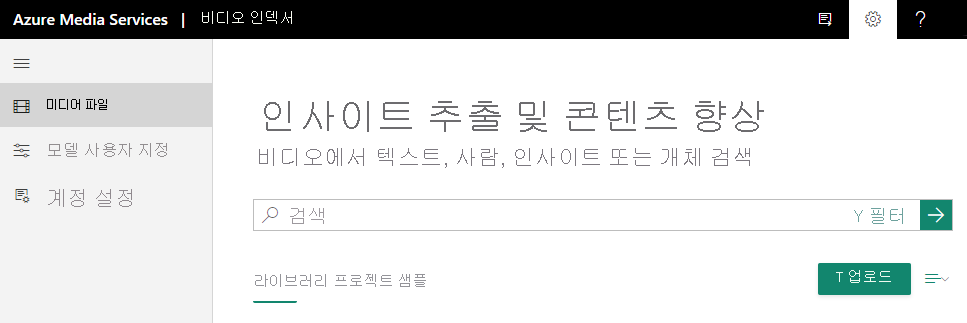

# 빠른 시작: 가입하고 첫 번째 비디오를 업로드하는 방법

이 시작 빠른 시작에서는 Video Indexer 웹 사이트에 로그인하고 첫 번째 비디오를 업로드하는 방법을 보여줍니다.

Video Indexer 계정을 만들 때 평가판 계정(특정의 체험 인덱싱 시간(분)을 가져오는 경우) 또는 유료 옵션(할당량으로 제한되지 않은 경우)을 선택할 수 있습니다. 평가판을 사용하면 Video Indexer에서 웹 사이트 사용자에게 최대 600분의 체험 인덱싱을 제공하고, API 사용자에게는 최대 2,400분의 체험 인덱싱을 제공합니다. 유료 옵션을 사용하면 [Azure 구독 및 Azure Media Services 계정에 연결되는](connect-to-azure.md) Video Indexer 계정을 만듭니다. 인덱싱 시간(분) 및 Azure Media Services 계정과 관련된 요금을 지불합니다. 

## Video Indexer에 가입

Video Indexer를 사용하여 개발을 시작하려면 [Video Indexer](https://www.videoindexer.ai/) 웹 사이트로 이동하고 가입합니다.

> [!NOTE]
> Video Indexer를 사용하기 시작하면 저장된 모든 데이터와 업로드된 콘텐츠가 Microsoft 관리 키를 사용하여 미사용으로 암호화됩니다.

## Video Indexer 웹 사이트를 사용하여 비디오 업로드

### Video Indexer에 대해 지원되는 파일 형식

Video Indexer와 함께 사용할 수 있는 파일 형식 목록은 [입력 컨테이너/파일 형식](../latest/media-encoder-standard-formats.md#input-containerfile-formats) 문서를 참조하세요.

### 비디오 업로드

1. [Video Indexer](https://www.videoindexer.ai/) 웹 사이트에서 로그인합니다.
2. 비디오를 업로드하려면 **업로드** 단추나 링크를 누릅니다.

    > [!NOTE]
    > 비디오 이름은 80자를 넘지 않아야 합니다.

    

    비디오가 업로드되면 Video Indexer가 인덱싱 및 비디오 분석을 시작합니다.

     

    Video Indexer가 분석을 완료하면 비디오에 대한 링크와 비디오 분석 결과에 관한 간단한 설명이 포함된 알림을 받게 됩니다. 예: 사람, 주제, OCR.

## 참고 항목

자세한 내용은 [비디오 업로드 및 인덱싱](upload-index-videos.md)을 참조하세요.

비디오를 업로드하고 인덱싱한 후 [Video Indexer](video-indexer-view-edit.md) 웹 사이트 또는 [Video Indexer 개발자 포털](video-indexer-use-apis.md)을 사용하여 비디오의 인사이트를 확인할 수 있습니다. 

[API 사용 시작](video-indexer-use-apis.md)

## 다음 단계

자세한 소개는 [소개 랩](https://github.com/Azure-Samples/media-services-video-indexer/blob/master/IntroToVideoIndexer.md)을 방문하세요. 

워크숍을 마치면 비디오 및 오디오 콘텐츠에서 추출할 수 있는 정보의 종류를 잘 이해할 수 있을 것이며, 콘텐츠 인텔리전스와 관련된 기회를 식별하고, Azure에서 비디오 AI를 피치하고, Video Indexer에 대한 여러 시나리오를 시연할 준비가 되어 있을 것입니다.

