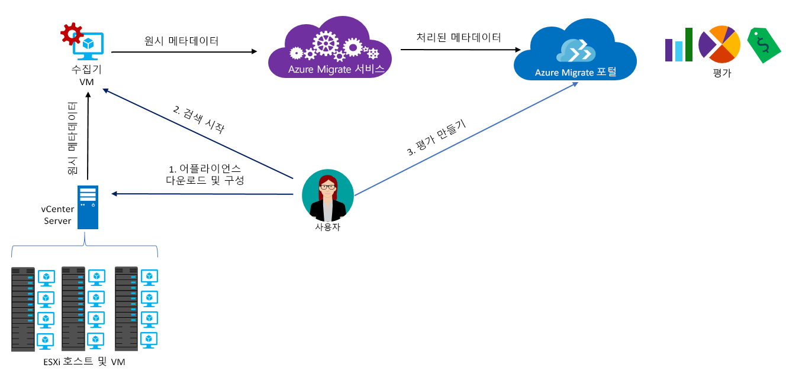

# Azure Migrate 정보

Azure Migrate 서비스는 Azure로 마이그레이션하는 온-프레미스 워크로드를 평가합니다. 이 서비스는 온-프레미스 컴퓨터의 마이그레이션 적합성 및 성능 기반 크기 조정을 평가하며, Azure에서 온-프레미스 컴퓨터를 실행할 때 드는 비용을 예측합니다. 리프트 앤 시프트 마이그레이션을 고려 중이거나 마이그레이션의 초기 평가 단계에 있는 경우 이 서비스가 가장 이상적입니다. 평가 후에는 [Azure Site Recovery](https://docs.microsoft.com/azure/site-recovery/site-recovery-overview) 및 [Azure Database Migration Service](https://docs.microsoft.com/azure/dms/dms-overview) 같은 서비스를 사용하여 컴퓨터를 Azure로 마이그레이션할 수 있습니다.

## Azure Migrate를 사용하는 이유

Azure Migrate의 기능:

- **Azure 준비 상태 평가**: 온-프레미스 컴퓨터가 Azure에서 실행하기에 적합한지 여부를 평가합니다. 
- **크기 추천 정보 가져오기**: 온-프레미스 VM의 성능 기록을 기반으로 Azure VM에 대한 권장 크기를 확인합니다. 
- **월간 비용 예측**: Azure에서 온-프레미스 컴퓨터를 실행하는 데 드는 예상 비용을 확인합니다.  
- **높은 확신을 가지고 마이그레이션**: 온-프레미스 컴퓨터의 종속성을 시각화하여 함께 마이그레이션하고 평가할 컴퓨터 그룹을 만듭니다. 

## 현재 제한 사항

- 현재 온-프레미스 VMware VM(가상 머신)에서 Azure VM으로의 마이그레이션만 평가할 수 있습니다. VMware VM은 vCenter Server(버전 5.5, 6.0 또는 6.5)에서 관리되어야 합니다.
- Hyper-V에 대한 지원은 로드맵에 있습니다. 그동안 [Azure Site Recovery Deployment Planner](http://aka.ms/asr-dp-hyperv-doc)를 사용하여 Hyper-V 워크로드의 마이그레이션을 계획하는 것이 좋습니다. 
- 단일 검색에서 최대 1500대의 VM을 검색하고, 단일 프로젝트에서 최대 1500대의 VM을 검색할 수 있습니다. 또한 단일 평가에서 최대 1500대의 VM을 평가할 수 있습니다.
- 미국 중서부 또는 미국 동부 지역에서는 Azure Migrate 프로젝트만 만들 수 있습니다. 그러나 다른 대상 Azure 위치에 대한 마이그레이션을 계획하는 기능에는 영향이 없습니다. 마이그레이션 프로젝트의 위치는 온-프레미스 환경에서 발견된 메타데이터를 저장하는 용도로만 사용됩니다.
- 마이그레이션을 평가하는 경우 Azure Migrate는 관리 디스크만 지원합니다.

## 어떤 요금이 발생하나요?

[여기](https://azure.microsoft.com/en-in/pricing/details/azure-migrate/)에서 Azure Migrate 가격 책정에 대해 자세히 알아보세요.

## 평가의 내용

평가를 통해 온-프레미스 VM에 대한 Azure 적합성을 식별하고 Azure에서 VM을 실행하기 위한 예상 비용과 적합한 크기 조정 권장 사항을 얻을 수 있습니다. 필요에 따라 평가의 속성을 변경하여 평가를 사용자 지정할 수 있습니다. 아래는 평가를 만들 때 고려하는 속성입니다. 

**속성** | **세부 정보**
--- | ---
**대상 위치** | 마이그레이션할 Azure 위치입니다.  Azure Migrate는 현재 오스트레일리아 동부, 오스트레일리아 남동부, 브라질 남부, 캐나다 중부, 캐나다 동부, 인도 중부, 미국 중부, 중국 동부, 중국 북부, 동아시아, 미국 동부, 독일 중부, 독일 북동부, 미국 동부 2, 일본 동부, 일본 서부, 한국 중부, 한국 남부, 미국 중북부, 북유럽, 미국 중남부, 동남 아시아, 인도 남부, 영국 남부, 영국 서부, 미국 서중부, 유럽 서부, 인도 서부, 미국 서부 및 미국 서부 2를 비롯한 30개 지역을 지원합니다. 기본적으로 대상 위치는 미국 서부 2로 설정되어 있습니다. 
**저장소 이중화** | 마이그레이션 후 Azure VM이 사용하게 될 [저장소 중복](https://docs.microsoft.com/azure/storage/common/storage-redundancy) 유형입니다. 기본값은 LRS(로컬 중복 저장소)입니다. Azure Migrate는 관리 디스크 기반 평가만 지원하고 관리 디스크는 LRS만 지원하므로 현재는 속성에 LRS 옵션만 있습니다. 
**크기 조정 기준** | Azure Migrate가 Azure에 사용할 VM의 적정 크기를 산정하는 데 사용되는 기준입니다. 온-프레미스 VM의 *성능 기록*에 따라 크기를 조정할 수도 있고, 성능 기록을 고려하지 않고 *온-프레미스로* VM의 크기를 조정할 수도 있습니다. 기본값은 성능 기반 크기 조정입니다.
**가격 책정 계획** | 비용을 계산하기 위해 평가 시 소프트웨어 보험이 있는지, [Azure 하이브리드 혜택](https://azure.microsoft.com/pricing/hybrid-use-benefit/) 자격이 되는지 여부를 고려합니다. 또한 개발자가 등록할 수 있는 [Azure 제품](https://azure.microsoft.com/support/legal/offer-details/)을 고려하고, 해당 제품에서 받을 구독별 할인율(%)을 지정할 수 있습니다. 
**가격 책정 계층** | 대상 Azure VM의 [가격 책정 계층(기본/표준)](../virtual-machines/windows/sizes-general.md)을 지정할 수 있습니다. 예를 들어 프로덕션 환경을 마이그레이션할 계획이라면 VM 대기 시간이 짧은 대신 더 많은 비용이 발생할 수 있는 표준 계층을 고려하는 것이 좋습니다. 반면, 개발-테스트 환경을 사용하는 경우 VM 대기 시간이 긴 대신 비용이 저렴한 기본 계층을 고려하는 것이 좋습니다. 기본적으로 [표준](../virtual-machines/windows/sizes-general.md) 계층이 사용됩니다.
**성능 기록** | 크기 조정 기준이 성능 기반인 경우에만 적용됩니다. 기본적으로 Azure Migrate는 마지막 날의 성능 기록을 온-프레미스 컴퓨터의 성능을 평가하며, 백분위 값은 95%입니다. 평가 속성에서 이러한 값을 수정할 수 있습니다. 
**쾌적 인자** | Azure Migrate는 평가 중에 버퍼(쾌적 인자)를 고려합니다. 이 버퍼는 VM의 컴퓨터 사용률 데이터(CPU, 메모리, 디스크 및 네트워크)를 기반으로 적용됩니다. 쾌적 인자는 계절별 사용량, 성능 기록 부족, 향후 사용량 증가 가능성 등의 문제를 고려합니다.   예를 들어 사용률이 20%인 10코어 VM은 일반적으로 2코어 VM이라는 결과가 나옵니다. 그러나 쾌적 인자가 2.0x이면 결과는 4코어 VM이 됩니다. 기본 쾌적 설정은 1.3x입니다.

## Azure Migrate의 작동 방식

1.  사용자가 Azure Migrate 프로젝트를 만듭니다.
2.  Azure Migrate는 수집기 어플라이언스라고 하는 온-프레미스 VM을 사용하여 온-프레미스 컴퓨터에 대한 정보를 검색합니다. 어플라이언스를 만들려면 Open Virtualization Appliance (.ova) 형식의 설치 파일을 다운로드하여 온-프레미스 vCenter Server에서 VM으로 가져옵니다.
3.  vCenter Server의 콘솔 연결을 사용하여 VM에 연결하고, 연결하는 동안 VM의 새 암호를 지정한 다음 VM에서 수집기 응용 프로그램을 실행하여 검색을 시작합니다.
4.  수집기는 VMware PowerCLI cmdlet을 사용하여 VM 메타데이터를 수집합니다. 검색은 에이전트 없이 수행되며, 및 VMware 호스트 또는 VM에 어떠한 것도 설치하지 않습니다. 수집된 메타데이터에는 VM 정보(코어, 메모리, 디스크, 디스크 크기 및 네트워크 어댑터)가 포함됩니다. 수집기는 CPU 및 메모리 사용량, 디스크 IOPS, 디스크 처리량(MBps) 및 네트워크 출력(MBps)을 포함하여 VM에 대한 성능 데이터도 수집합니다.
5.  메타데이터는 Azure Migrate 프로젝트에 푸시됩니다. Azure Portal에서 메타데이터를 볼 수 있습니다.
6.  평가를 위해 검색한 VM을 그룹으로 모읍니다. 예를 들면 동일한 응용 프로그램을 실행하는 VM을 그룹화할 수 있습니다. 더 상세한 그룹화를 위해 종속성 시각화를 사용하여 특정 컴퓨터나 그룹의 모든 시스템에 대한 종속성을 보고 그룹을 구체화할 수 있습니다.
7.  그룹이 형성되면 그룹에 대한 평가를 만듭니다. 
8.  평가가 완료되면 포털에서 보거나 Excel 형식으로 다운로드할 수 있습니다.

  

## 포트 요구 사항이 어떻게 됩니까?

다음 표에 Azure Migrate 통신에 필요한 포트가 요약되어 있습니다.

|구성 요소          |통신 대상     |필요한 포트  |이유   |
|-------------------|------------------------|---------------|---------|
|데이터 수집기          |Azure Migrate 서비스   |TCP 443        |수집기는 SSL 포트 443을 통해 서비스에 연결|
|데이터 수집기          |vCenter Server          |기본값 9443   | 기본적으로는 수집기는 9443 포트로 vCenter 서버에 연결합니다. 서버가 다른 포트에서 수신 대기하는 경우 수집기 VM에서 송신 포트로 구성되어야 합니다. |
|온-프레미스 VM     | Log Analytics 작업 영역          |[TCP 443](../log-analytics/log-analytics-windows-agent.md) |MMA 에이전트는 TCP 443을 사용하여 Log Analytics에 연결합니다. 종속성 시각화 기능을 사용하고 MMA(Microsoft Monitoring Agent) 에이전트를 설치하려는 경우에만 이 포트가 필요합니다. |

  
## 평가 후 어떻게 되나요?

Azure Migrate 서비스를 사용하여 온-프레미스 컴퓨터 마이그레이션을 평가한 후에는 몇 가지 도구를 사용하여 마이그레이션을 수행할 수 있습니다.

- **Azure Site Recovery**: 다음과 같이 Azure Site Recovery를 사용하여 Azure에 마이그레이션할 수 있습니다.
  - Azure 구독, Azure 가상 네트워크 및 저장소 계정을 비롯한 Azure 리소스를 준비합니다.
  - 마이그레이션할 온-프레미스 VMware 서버를 준비합니다. for Site Recovery에 대한 VMware 지원 요구 사항을 확인하고, 검색할 VMware 서버를 준비하고, 마이그레이션할 VM에 Site Recovery Mobility 서비스를 설치할 준비를 합니다. 
  - 마이그레이션을 설정합니다. Recovery Services 자격 증명 모음을 설정하고, 원본 및 대상 마이그레이션 설정을 구성하고, 복제 정책을 설정하고, 복제를 사용하도록 설정합니다. 재해 복구 훈련을 실행하여 VM이 Azure로 올바르게 마이그레이션되고 있는지 확인할 수 있습니다.
  - 장애 조치(failover)를 실행하여 온-프레미스 컴퓨터를 Azure로 마이그레이션합니다. 
  - [자세한 내용](../site-recovery/tutorial-migrate-on-premises-to-azure.md)은 Site Recovery 마이그레이션 자습서를 참조하세요.

- **Azure Database Migration**: 온-프레미스 컴퓨터가 SQL Server, MySQL 또는 Oracle 같은 데이터베이스를 실행 중인 경우 Azure Database Migration Service를 사용하여 Azure로 마이그레이션할 수 있습니다. [자세히 알아보기](https://azure.microsoft.com/campaigns/database-migration/).

## 다음 단계 
[자습서를 따라 하여](tutorial-assessment-vmware.md) 온-프레미스 VMware VM에 대한 평가를 만듭니다.