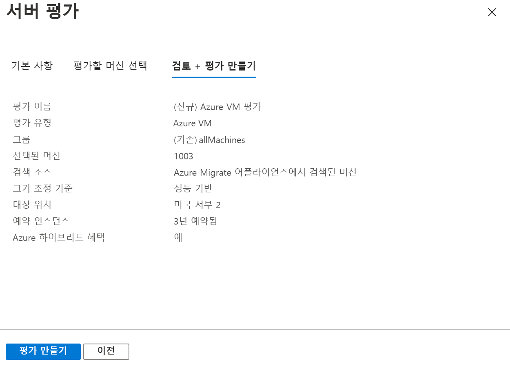

# <a name="assess-vmware-vms-with-azure-migrate-server-assessment"></a>Azure Migrate를 사용하여 VMware VM 평가: 서버 평가

이 문서에서는 Azure Migrate: 서버 평가 도구를 사용하여 온-프레미스 VMware VM을 평가하는 방법을 보여 줍니다.

[Azure Migrate](migrate-services-overview.md)는 앱, 인프라 및 워크로드를 검색, 평가 및 Microsoft Azure로 마이그레이션하는 데 도움이 되는 도구의 허브를 제공합니다. 허브에는 Azure Migrate 도구와 타사 ISV(독립 소프트웨어 공급업체) 제품이 포함되어 있습니다.


이 자습서는 VMware VM을 평가하고 Azure로 마이그레이션하는 방법을 보여 주는 시리즈의 두 번째 자습서입니다. 이 자습서에서는 다음 방법에 대해 알아봅니다.
> [!div class="checklist"]
> * Azure Migrate 프로젝트를 설정합니다.
> * 온-프레미스에서 실행되는 Azure Migrate 어플라이언스에서 VM을 평가하도록 설정합니다.
> * 온-프레미스 VM의 연속 검색을 시작합니다. 어플라이언스는 검색된 VM의 구성 및 성능 데이터를 Azure로 보냅니다.
> * 검색된 VM을 그룹화하고 해당 VM 그룹을 평가합니다.
> * 평가를 검토합니다.


> [!NOTE]
> 자습서에서는 개념 증명을 빠르게 설정할 수 있도록 시나리오에 대한 가장 간단한 배포 경로를 보여 줍니다. 자습서는 가능한 경우 기본 옵션을 사용하며, 가능한 모든 설정과 경로는 보여 주지 않습니다. 자세한 지침은 방법 문서를 검토하세요.

Azure 구독이 아직 없는 경우 시작하기 전에 [체험 계정](https://azure.microsoft.com/pricing/free-trial/)을 만듭니다.


## <a name="prerequisites"></a>필수 조건

- 이 시리즈의 첫 번째 자습서를 [완료](tutorial-prepare-vmware.md)합니다. 그렇지 않으면 이 자습서의 지침이 작동하지 않습니다.
- 첫 번째 자습서에서 수행해야 하는 작업은 다음과 같습니다.
    - Azure Migrate에 대한 [Azure 권한을 설정](tutorial-prepare-vmware.md#prepare-azure)합니다.
    - 평가할 [VMware를 준비](tutorial-prepare-vmware.md#prepare-for-vmware-vm-assessment)합니다. VMware 설정을 확인해야 하며, OVA 템플릿을 사용하여 VMware VM을 만들 수 있는 권한이 있어야 합니다. 또한 VM 검색에 사용할 계정을 설정해야 합니다. 필요한 포트를 사용할 수 있어야 하고, Azure에 액세스하는 데 필요한 URL을 알고 있어야 합니다.


## <a name="set-up-an-azure-migrate-project"></a>Azure Migrate 프로젝트 설정

새 Azure Migrate 프로젝트를 설정하는 방법은 다음과 같습니다.

1. Azure Portal > **모든 서비스**에서 **Azure Migrate**를 검색합니다.
2. **서비스** 아래에서 **Azure Migrate**를 선택합니다.
3. **개요**의 **서버 검색, 평가 및 마이그레이션** 아래에서 **서버 평가 및 마이그레이션**을 클릭합니다.

    

4. **시작**에서**도구 추가**를 클릭합니다.
5. **프로젝트 마이그레이션**에서 Azure 구독을 선택하고, 아직 없는 경우 리소스 그룹을 만듭니다.     
6. **프로젝트 세부 정보**에서 프로젝트 이름과 프로젝트를 만들려는 지역을 지정합니다. 아시아, 유럽, 영국 및 미국 지역이 지원됩니다.

    - 프로젝트 지역은 온-프레미스 VM에서 수집된 메타데이터를 저장하는 데만 사용됩니다.
    - 대상 지역은 마이그레이션을 실행할 때 선택할 수 있습니다.

    


7. **다음**을 클릭합니다.
8. **평가 도구 선택**에서 **Azure Migrate: 서버 평가** > **다음**을 차례로 선택합니다.

    

9. **마이그레이션 도구 선택**에서 **마이그레이션 도구 추가 건너뛰기** > **다음**을 차례로 선택합니다.
10. **검토 + 도구 추가**에서 설정을 검토하고, **도구 추가**를 클릭합니다.
11. Azure Migrate 프로젝트가 배포될 때까지 몇 분 정도 기다립니다. 프로젝트 페이지로 이동합니다. 프로젝트가 표시되지 않으면 Azure Migrate 대시보드의 **서버**에서 액세스할 수 있습니다.


## <a name="set-up-the-appliance-vm"></a>어플라이언스 VM 설정

Azure Migrate: 서버 평가는 경량 VMware VM 어플라이언스를 실행합니다.

- 이 어플라이언스는 VM 검색을 수행하고, VM 메타데이터 및 성능 데이터를 Azure Migrate 서버 평가에 보냅니다.
- 어플라이언스를 설정하려면 다음을 수행합니다.
    - OVA 템플릿 파일을 다운로드하여 vCenter Server로 가져옵니다.
    - 어플라이언스를 만들고, Azure Migrate 서버 평가에 연결할 수 있는지 확인합니다.
    - 어플라이언스를 처음으로 구성하고, Azure Migrate 프로젝트에 등록합니다.
- 단일 Azure Migrate 프로젝트에 대해 여러 어플라이언스를 설정할 수 있습니다. 모든 어플라이언스에서 최대 35,000개의 VM을 검색할 수 있습니다. 어플라이언스당 최대 10,000개의 서버를 검색할 수 있습니다.

### <a name="download-the-ova-template"></a>OVA 템플릿 다운로드

1. **마이그레이션 목표** > **서버** > **Azure Migrate: 서버 평가**에서 **검색**을 클릭합니다.
2. **머신 검색** > **머신이 가상화되어 있습니까?** 에서 **예, VMWare vSphere 하이퍼바이저 사용**을 클릭합니다.
3. **다운로드**를 클릭하여 .OVA 템플릿 파일을 다운로드합니다.

    


### <a name="verify-security"></a>보안 확인

배포하기 전에 OVA 파일이 안전한지 확인합니다.

1. 파일을 다운로드한 컴퓨터에서 관리자 명령 창을 엽니다.
2. 다음 명령을 실행하여 OVA에 대한 해시를 생성합니다.
    - ```C:\>CertUtil -HashFile <file_location> [Hashing Algorithm]```
    - 사용 예: ```C:\>CertUtil -HashFile C:\AzureMigrate\AzureMigrate.ova SHA256```
3. 2\.19.07.30 버전의 경우 생성된 해시는 다음 값과 일치해야 합니다. 

  **알고리즘** | **해시 값**
  --- | ---
  MD5 | 27230f3b012187860281b912ee661709
  SHA256 | c0a5b5998b7f38ac6e57ea9a808ecc4295795e18f9ca99c367585068883f06e7


### <a name="create-the-appliance-vm"></a>어플라이언스 VM 만들기

다운로드한 파일을 가져오고 VM을 만듭니다.

1. vSphere Client 콘솔에서 **파일** > **OVF 템플릿 배포**를 클릭합니다.

    

2. OVF 템플릿 배포 마법사 > **원본**에서 OVA 파일의 위치를 지정합니다.
3. **이름** 및 **위치**에서 친숙한 VM 이름을 지정합니다. VM을 호스팅할 인벤토리 개체를 선택합니다.
5. **호스트/클러스터**에서 VM이 실행될 호스트 또는 클러스터를 지정합니다.
6. **스토리지**에서 VM에 대한 스토리지 대상을 지정합니다.
7. **디스크 형식**에서 디스크 유형 및 크기를 지정합니다.
8. **네트워크 매핑**에서 VM이 연결할 네트워크를 지정합니다. 메타데이터를 Azure Migrate 서버 평가에 보내려면 네트워크에 인터넷 연결이 필요합니다.
9. 설정을 검토 및 확인한 다음 **마침**을 클릭합니다.


### <a name="verify-appliance-access-to-azure"></a>Azure에 대한 어플라이언스 액세스 확인

어플라이언스 VM에서 [Azure URL](migrate-support-matrix-vmware.md#assessment-url-access-requirements)에 연결할 수 있는지 확인합니다.


### <a name="configure-the-appliance"></a>어플라이언스 구성

다음 단계를 사용하여 어플라이언스를 설정합니다.

1. vSphere Client 콘솔에서 VM > **Open Console**을 마우스 오른쪽 단추로 클릭합니다.
2. 어플라이언스에 대한 언어, 표준 시간대 및 암호를 제공합니다.
3. VM에 연결할 수 있는 모든 머신에서 브라우저를 열고, 어플라이언스 웹앱의 URL(**https://*어플라이언스 이름 또는 IP 주소*: 44368**)을 엽니다.

   또는 앱 바로 가기를 클릭하여 어플라이언스 데스크톱에서 앱을 열 수 있습니다.
4. 웹앱 > **필수 구성 요소 설정**에서 다음을 수행합니다.
    - **라이선스**: 사용 조건에 동의하고 타사 정보를 읽습니다.
    - **연결**: 앱에서 VM이 인터넷에 액세스할 수 있는지 확인합니다. VM에서 프록시를 사용하는 경우:
        - **프록시 설정**을 클릭하고, 프록시 주소와 수신 포트를 http://ProxyIPAddress 또는 http://ProxyFQDN 형식으로 지정합니다.
        - 프록시에 인증이 필요한 경우 자격 증명을 지정합니다.
        - HTTP 프록시만 지원됩니다.
    - **시간 동기화**: 검색이 제대로 작동하려면 어플라이언스의 시간이 인터넷 시간과 동기화되어야 합니다.
    - **업데이트 설치**: 어플라이언스에서 최신 업데이트가 설치되어 있는지 확인합니다.
    - **VDDK 설치**: 어플라이언스에서 VMWare vSphere VDDK(Virtual Disk Development Kit)가 설치되어 있는지 확인합니다.
        - Azure Migrate: 서버 마이그레이션에서 Azure로 마이그레이션하는 동안 VDDK를 사용하여 머신을 복제합니다.
        - VMware에서 VDDK 6.7을 다운로드하고, 다운로드한 zip 콘텐츠를 어플라이언스의 지정된 위치에 추출합니다.

### <a name="register-the-appliance-with-azure-migrate"></a>Azure Migrate를 사용하여 어플라이언스 등록

1. **로그인**을 클릭합니다. 표시되지 않으면 브라우저에서 팝업 차단을 사용하지 않도록 설정했는지 확인합니다.
2. 새로 만들기 탭에서 Azure 자격 증명을 사용하여 로그인합니다.
    - 사용자 이름과 암호를 사용하여 로그인합니다.
    - PIN을 사용한 로그인은 지원되지 않습니다.
3. 성공적으로 로그인하면 웹앱으로 돌아갑니다.
2. Azure Migrate 프로젝트가 만들어진 구독을 선택한 다음, 해당 프로젝트를 선택합니다.
3. 어플라이언스의 이름을 지정합니다. 이름은 14자 이하의 영숫자여야 합니다.
4. **등록**을 클릭합니다.


## <a name="start-continuous-discovery"></a>연속 검색 시작

이제 어플라이언스에서 vCenter Server에 연결하고, VM 검색을 시작합니다.

1. **vCenter Server 세부 정보 지정**에서 vCenter Server의 이름(FQDN) 또는 IP 주소를 지정합니다. 기본 포트를 그대로 유지하거나 vCenter Server에서 수신하는 사용자 지정 포트를 지정할 수 있습니다.
2. **사용자 이름** 및 **암호**에서 어플라이언스가 vCenter Server에서 VM을 검색하는 데 사용할 읽기 전용 계정 자격 증명을 지정합니다. 계정에 [필요한 검색 권한](migrate-support-matrix-vmware.md#assessment-vcenter-server-permissions)이 있는지 확인합니다. 이에 따라 vCenter 계정에 대한 액세스를 제한하여 검색 범위를 지정할 수 있습니다. 검색 범위를 지정하는 방법에 대한 자세한 내용은 [여기](tutorial-assess-vmware.md#scoping-discovery)를 참조하세요.
3. **연결 유효성 검사**를 클릭하여 어플라이언스에서 vCenter Server에 연결할 수 있는지 확인합니다.
4. 연결이 설정되면 **저장 및 검색 시작**을 클릭합니다.

그러면 검색을 시작합니다. 검색된 VM의 메타데이터가 포털에 표시되는 데 약 15분이 걸립니다.

### <a name="scoping-discovery"></a>검색 범위 지정

검색 범위는 검색에 사용되는 vCenter 계정의 액세스를 제한하여 지정할 수 있습니다. 범위는 vCenter Server 데이터 센터, 클러스터, 클러스터 폴더, 호스트, 호스트 폴더 또는 개별 VM으로 설정할 수 있습니다. 

> [!NOTE]
> 현재 vCenter 계정에 vCenter VM 폴더 수준의 액세스 권한이 부여된 경우 서버 평가에서 VM을 검색할 수 없습니다. 검색 범위를 VM 폴더로 지정하려는 경우 vCenter 계정에 VM 수준의 읽기 전용 액세스 권한이 할당되도록 하여 검색을 수행할 수 있습니다.  이 작업을 수행하는 방법에 대한 지침은 다음과 같습니다.
>
> 1. 검색 범위를 지정하려는 VM 폴더의 모든 VM에 읽기 전용 권한을 할당합니다. 
> 2. VM이 호스팅되는 모든 부모 개체에 대한 읽기 전용 액세스 권한을 부여합니다. 데이터 센터까지의 계층 구조에 있는 모든 부모 개체(호스트, 호스트 폴더, 클러스터, 클러스터 폴더)가 포함됩니다. 이 권한은 모든 자식 개체에 전파할 필요가 없습니다.
> 3. 데이터 센터를 *컬렉션 범위*로 선택하는 검색에 대한 자격 증명을 사용합니다. RBAC를 설정하면 해당 vCenter 사용자가 테넌트별 VM에만 액세스할 수 있습니다.
>
> 호스트 및 클러스터의 폴더가 지원됨에 유의하세요.

### <a name="verify-vms-in-the-portal"></a>포털에서 VM 확인

검색되면 Azure Portal에서 해당 VM이 표시되는지 확인할 수 있습니다.

1. Azure Migrate 대시보드를 엽니다.
2. **Azure Migrate - 서버** > **Azure Migrate: 서버 평가** 페이지에서 **검색된 서버**의 수를 표시하는 아이콘을 클릭합니다.

## <a name="set-up-an-assessment"></a>평가 설정

Azure Migrate: 서버 평가를 사용하여 만들 수 있는 평가에는 두 가지 유형이 있습니다.

**평가** | **세부 정보** | **데이터**
--- | --- | ---
**성능 기반** | 수집된 성능 데이터를 기반으로 하는 평가 | **추천 VM 크기**: CPU 및 메모리 사용률 데이터를 기반으로 합니다.<br/><br/> **추천 디스크 유형(표준 또는 프리미엄 관리 디스크)** : 온-프레미스 디스크의 IOPS 및 처리량을 기반으로 합니다.
**온-프레미스로** | 온-프레미스 크기 조정을 기반으로 하는 평가 | **추천 VM 크기**: 온-프레미스 VM 크기를 기반으로 합니다.<br/><br> **추천 디스크 유형**: 평가를 위해 선택한 스토리지 유형 설정을 기반으로 합니다.


### <a name="run-an-assessment"></a>평가 실행

다음과 같이 평가를 실행합니다.

1. 평가를 만드는 방법에 대한 [모범 사례](best-practices-assessment.md)를 검토합니다.
2. **서버** 탭의 **Azure Migrate: 서버 평가** 타일에서 **평가**를 클릭합니다.

    

2. **서버 평가**에서 평가 이름을 지정합니다.
3. 평가 속성을 검토하려면 **모두 보기**를 클릭합니다.

    

3. **그룹 선택 또는 만들기**에서 **새로 만들기**를 선택하고 그룹 이름을 지정합니다. 그룹은 평가를 위해 하나 이상의 VM을 수집합니다.
4. **그룹에 머신 추가**에서 그룹에 추가할 VM을 선택합니다.
5. **평가 만들기**를 클릭하여 그룹을 만들고, 평가를 실행합니다.

    

6. 평가가 만들어지면 **서버** > **Azure Migrate: 서버 평가** > **평가**에서 해당 평가를 확인합니다.
7. **평가 내보내기**를 클릭하고, Excel 파일로 다운로드합니다.


## <a name="review-an-assessment"></a>평가 검토

평가에서 설명하는 항목은 다음과 같습니다.

- **Azure 준비 상태**: VM이 Azure로 마이그레이션하는 데 적합한지 여부입니다.
- **월간 예상 비용**: Azure에서 VM을 실행하는 데 들어가는 월간 예상 컴퓨팅 및 스토리지 비용입니다.
- **월간 예상 스토리지 비용**: 마이그레이션 후 디스크 스토리지에 대한 예상 비용입니다.

### <a name="view-an-assessment"></a>평가 보기

1. **마이그레이션 목표** >  **서버**의 **Azure Migrate: 서버 평가**에서 **평가**를 클릭합니다.
2. **평가**에서 해당 평가를 클릭하여 엽니다.

    

### <a name="review-azure-readiness"></a>Azure 준비 상태 검토

1. **Azure 준비 상태**에서 VM이 Azure로 마이그레이션할 준비가 되었는지 확인합니다.
2. VM 상태를 검토합니다.
    - **Azure 준비 완료**: Azure Migrate는 평가에서 VM의 크기 및 예상 비용을 추천합니다.
    - **조건과 함께 준비 완료**: 문제 및 제안된 수정 사항을 보여 줍니다.
    - **Azure를 사용할 준비 안 됨**: 문제 및 제안된 수정 사항을 보여 줍니다.
    - **알 수 없는 준비**: 데이터 가용성 문제로 인해 Azure Migrate에서 준비 상태를 평가할 수 없는 경우에 사용됩니다.

2. **Azure 준비 상태** 상태를 클릭합니다. VM 준비 상태 세부 정보를 살펴보고, 드릴다운하여 컴퓨팅, 스토리지 및 네트워크 설정을 포함한 VM 세부 정보를 확인할 수 있습니다.


### <a name="review-cost-details"></a>비용 세부 정보 검토

이 보기에서는 Azure에서 VM을 실행하는 데 들어가는 예상 컴퓨팅 및 스토리지 비용을 표시합니다.

1. 월간 컴퓨팅 및 스토리지 비용을 검토합니다. 비용은 평가된 그룹의 모든 VM에 대해 집계됩니다.

    - 예상 비용은 머신의 크기 추천 사항과 해당 디스크 및 속성을 기반으로 합니다.
    - 컴퓨팅 및 스토리지의 월간 예상 비용이 표시됩니다.
    - 예상 비용은 온-프레미스 VM을 IaaS VM으로 실행하는 데 들어가는 비용입니다. Azure Migrate 서버 평가에서는 PaaS 또는 SaaS 비용을 고려하지 않습니다.

2. 월간 예상 스토리지 비용을 검토할 수 있습니다. 이 보기에는 평가된 그룹에 대해 집계된 스토리지 비용이 표시되며, 해당 그룹은 여러 유형의 스토리지 디스크로 분할되어 있습니다.
3. 드릴다운하여 특정 VM에 대한 세부 정보를 확인할 수 있습니다.


### <a name="review-confidence-rating"></a>신뢰 등급 검토

성능 기반 평가를 실행하면 신뢰 등급이 평가에 할당됩니다.


- 별 1개(최저)에서 별 5개(최고)까지의 등급입니다.
- 신뢰 등급을 통해 평가에서 제공하는 크기 추천 사항의 안정성을 예측할 수 있습니다.
- 신뢰 등급은 평가를 계산하는 데 필요한 데이터 요소의 가용성을 기반으로 합니다.

평가에 대한 신뢰 등급은 다음과 같습니다.

**데이터 요소 가용성** | **신뢰 등급**
--- | ---
0%-20% | 별 1개
21%-40% | 별 2개
41%-60% | 별 3개
61%-80% | 별 4개
81%-100% | 별 5개

신뢰 등급의 모범 사례에 대해 [자세히 알아보세요](best-practices-assessment.md#best-practices-for-confidence-ratings).


## <a name="next-steps"></a>다음 단계

이 자습서에서는 다음을 수행했습니다.

> [!div class="checklist"]
> * Azure Migrate 어플라이언스 설정
> * 평가 만들기 및 검토

Azure Migrate 서버 마이그레이션을 사용하여 VMware VM을 Azure로 마이그레이션하는 방법을 알아보려면 이 시리즈의 세 번째 자습서로 계속 진행하세요.

> [!div class="nextstepaction"]
> [VMware VM 마이그레이션](./tutorial-migrate-vmware.md)
