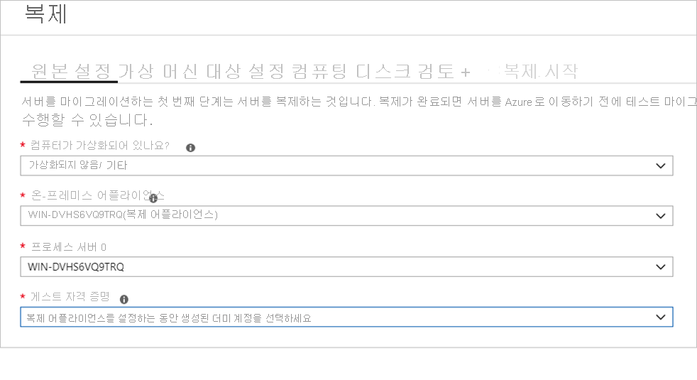
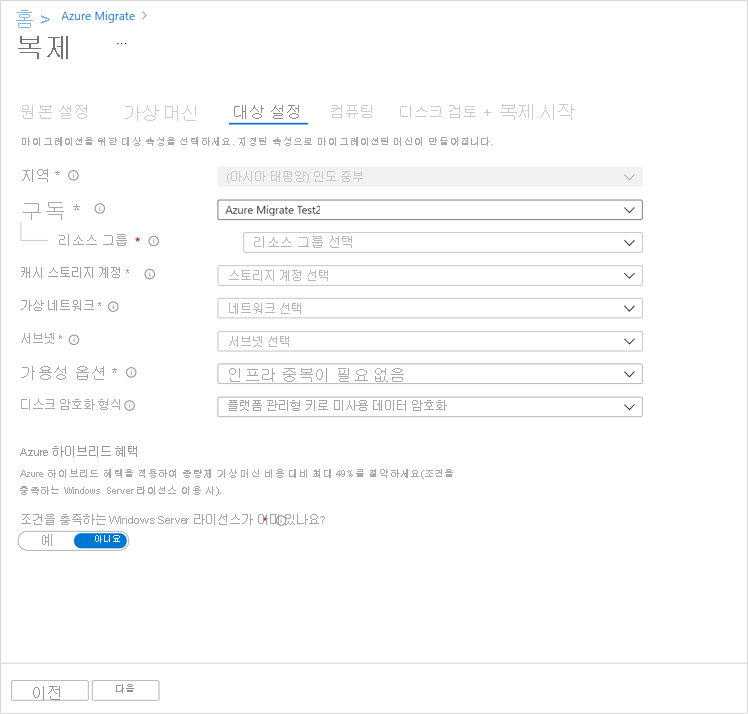

# <a name="migrate-machines-as-physical-servers-to-azure"></a>물리적 서버로 머신을 Azure에 마이그레이션

이 문서에서는 Azure Migrate:Server Migration 도구를 사용하여 머신을 물리적 서버로 Azure에 마이그레이션하는 방법을 보여줍니다. 물리적 서버로 처리하여 머신을 마이그레이션하는 것은 다음과 같은 다양한 시나리오에서 유용합니다.

- 온-프레미스 물리적 서버를 마이그레이션합니다.
- 플랫폼(예: Xen, KVM)에서 가상화된 VM을 마이그레이션합니다.
- 어떤 이유로 [Hyper-V](tutorial-migrate-hyper-v.md) 또는 [VMware ](server-migrate-overview.md) 마이그레이션에 표준 마이그레이션 프로세스를 사용할 수 없는 경우 Hyper-V 또는 VMware VM을 마이그레이션합니다.
- 프라이빗 클라우드에서 실행되는 VM을 마이그레이션합니다.
- AWS(Amazon Web Services) 또는 GCP(Google Cloud Platform)와 같은 퍼블릭 클라우드에서 실행되는 VM을 마이그레이션합니다.


[Azure Migrate](migrate-services-overview.md)는 온-프레미스 앱과 워크로드 및 클라우드 VM 인스턴스의 검색, 평가 및 Azure로의 마이그레이션을 추적할 수 있는 중앙 허브를 제공합니다. 이 허브는 평가 및 마이그레이션에 사용되는 Azure Migrate 도구뿐만 아니라 타사 ISV(독립 소프트웨어 공급업체) 제품도 제공합니다.


이 자습서에서는 다음 작업 방법을 알아봅니다.
> [!div class="checklist"]
> * Azure Migrate 서버 마이그레이션 도구를 사용하여 마이그레이션을 위해 Azure를 준비합니다.
> * 마이그레이션하려는 머신에 대한 요구 사항을 확인하고, 머신을 검색하여 Azure로 마이그레이션하는 데 사용되는 Azure Migrate 복제 어플라이언스용 머신을 준비합니다.
> * Azure Migrate 서버 마이그레이션 도구를 Azure Migrate 허브에 추가합니다.
> * 복제 어플라이언스를 설정합니다.
> * Mobility Service를 마이그레이션하려는 머신에 설치합니다.
> * 복제를 활성화합니다.
> * 테스트 마이그레이션을 실행하여 모든 것이 예상대로 작동하는지 확인합니다.
> * 전체 마이그레이션을 Azure로 실행합니다.

> [!NOTE]
> 자습서에서는 개념 증명을 빠르게 설정할 수 있도록 시나리오에 대한 가장 간단한 배포 경로를 보여 줍니다. 자습서는 가능한 경우 기본 옵션을 사용하며, 가능한 모든 설정과 경로는 보여 주지 않습니다. 자세한 지침은 Azure Migrate 방법을 검토하세요.

Azure 구독이 아직 없는 경우 시작하기 전에 [체험 계정](https://azure.microsoft.com/pricing/free-trial/)을 만듭니다.


## <a name="prerequisites"></a>사전 요구 사항

이 자습서를 시작하기 전에 다음을 수행해야 합니다.

1. 마이그레이션 아키텍처를 [검토](migrate-architecture.md)합니다.
2. Azure 계정에 다음과 같은 권한이 있는 Virtual Machine 기여자 역할이 할당되어 있는지 확인합니다.

    - 선택한 리소스 그룹에 VM 만들기
    - 선택한 가상 네트워크에 VM 만들기
    - Azure 관리 디스크에 씁니다. 

3. [Azure 네트워크를 설정합니다](../virtual-network/manage-virtual-network.md#create-a-virtual-network). Azure에 복제하면 Azure VM이 만들어지고 마이그레이션을 설정할 때 지정한 Azure 네트워크에 조인됩니다.


## <a name="prepare-azure"></a>Azure 준비

Azure Migrate 서버 마이그레이션을 사용하여 마이그레이션하려면 먼저 Azure 권한을 설정합니다.

- **프로젝트 만들기**: Azure 계정에는 Azure Migrate 프로젝트를 만들 수 있는 권한이 있어야 합니다. 

### <a name="assign-permissions-to-create-project"></a>프로젝트를 만들 수 있는 권한 할당

1. Azure Portal에서 구독을 열고, **액세스 제어(IAM)** 를 선택합니다.
2. **액세스 권한 확인**에서 관련 계정을 찾아 클릭하여 권한을 확인합니다.
3. **기여자** 또는 **소유자** 권한이 있어야 합니다.
    - Azure 체험 계정을 방금 만든 경우 자신이 구독에 대한 소유자입니다.
    - 구독 소유자가 아닌 경우 해당 역할을 할당해 주도록 소유자에게 문의합니다.

## <a name="prepare-for-migration"></a>마이그레이션 준비

### <a name="check-machine-requirements-for-migration"></a>마이그레이션에 대한 머신 요구 사항 확인

머신에서 Azure로 마이그레이션하기 위한 요구 사항을 준수하는지 확인합니다. 

> [!NOTE]
> Azure Migrate 서버 마이그레이션을 사용하는 에이전트 기반 마이그레이션은 Azure Site Recovery 서비스의 에이전트 기반 재해 복구 기능과 동일한 복제 아키텍처가 있으며, 사용되는 구성 요소 중 일부는 동일한 코드 베이스를 공유합니다. 일부 요구 사항은 Site Recovery 설명서에 연결될 수 있습니다.

1. 물리적 서버 요구 사항을 [확인](migrate-support-matrix-physical-migration.md#physical-server-requirements)합니다.
2. VM 설정을 확인합니다. Azure에 복제하는 온-프레미스 머신은 [Azure VM 요구 사항](migrate-support-matrix-physical-migration.md#azure-vm-requirements)을 준수해야 합니다.


### <a name="prepare-a-machine-for-the-replication-appliance"></a>복제 어플라이언스용 머신 준비

Azure Migrate 서버 마이그레이션은 복제 어플라이언스를 사용하여 머신을 Azure에 복제합니다. 복제 어플라이언스에서 실행하는 구성 요소는 다음과 같습니다.

- **구성 서버**: 구성 서버는 온-프레미스와 Azure 간의 통신을 조정하여 데이터 복제를 관리합니다.
- **프로세스 서버**: 프로세스 서버는 복제 게이트웨이의 역할을 합니다. 복제 데이터를 수신하여 캐싱, 압축 및 암호화를 사용하여 최적화한 후 Azure의 캐시 스토리지 계정으로 보냅니다. 

시작하기 전에 복제 어플라이언스를 호스팅할 Windows Server 2016 머신을 준비해야 합니다. 머신은 [이러한 요구 사항](migrate-replication-appliance.md)을 준수해야 합니다. 보호하려는 원본 머신에 어플라이언스를 설치해서는 안 됩니다.


## <a name="add-the-azure-migrate-server-migration-tool"></a>Azure Migrate 서버 마이그레이션 도구 추가

Azure Migrate 프로젝트를 설정한 다음, Azure Migrate 서버 마이그레이션 도구를 해당 프로젝트에 추가합니다.

1. Azure Portal > **모든 서비스**에서 **Azure Migrate**를 검색합니다.
2. **서비스** 아래에서 **Azure Migrate**를 선택합니다.
3. **개요**에서 **서버 평가 및 마이그레이션**을 클릭합니다.
4. **서버 검색, 평가 및 마이그레이션** 아래에서 **서버 평가 및 마이그레이션**을 클릭합니다.

    

5. **서버 검색, 평가 및 마이그레이션**에서 **도구 추가**를 클릭합니다.
6. **프로젝트 마이그레이션**에서 Azure 구독을 선택하고, 아직 없는 경우 리소스 그룹을 만듭니다.
7. **프로젝트 세부 정보**에서 프로젝트 이름과 프로젝트를 만들려는 지역을 지정하고, **다음**을 클릭합니다.

    

    Azure Migrate 프로젝트는 다음 지역 중 하나에서 만들 수 있습니다.

    **지리** | **지역**
    --- | ---
    아시아 | 동남아시아
    유럽 | 북유럽 또는 서유럽
    미국 | 미국 동부 또는 미국 중서부

    프로젝트에 대해 지정된 지리는 온-프레미스 VM에서 수집된 메타데이터를 저장하는 데 사용됩니다. 실제 마이그레이션에 대한 대상 지역을 선택할 수 있습니다.
8. **평가 도구 선택**에서 **평가 도구 추가 건너뛰기** > **다음**을 차례로 선택합니다.
9. **마이그레이션 도구 선택**에서 **Azure Migrate: 서버 마이그레이션** > **다음**을 차례로 선택합니다.
10. **검토 + 도구 추가**에서 설정을 검토하고, **도구 추가**를 클릭합니다.
11. 도구가 추가되면 Azure Migrate 프로젝트 > **서버** > **마이그레이션 도구**에 표시됩니다.

## <a name="set-up-the-replication-appliance"></a>복제 어플라이언스 설정

마이그레이션의 첫 번째 단계는 복제 어플라이언스를 설정하는 것입니다. 어플라이언스에 대한 설치 관리자 파일을 다운로드하여 [준비한 머신](#prepare-a-machine-for-the-replication-appliance)에서 실행합니다. 어플라이언스가 설치되면 해당 어플라이언스를 Azure Migrate 서버 마이그레이션에 등록합니다.


### <a name="download-the-replication-appliance-installer"></a>복제 어플라이언스 설치 관리자 다운로드

1. Azure Migrate 프로젝트 > **서버**, **Azure Migrate: 서버 마이그레이션**에서 **검색**을 클릭합니다.

    

3. **머신 검색** > **머신이 가상화되어 있습니까?** 에서 **가상화되지 않음/기타**를 클릭합니다.
4. **대상 지역**에서 머신을 마이그레이션하려는 Azure 지역을 선택합니다.
5. **마이그레이션의 대상 지역이 region-name인지 확인합니다.** 를 선택합니다.
6. **리소스 만들기**를 클릭합니다. 그러면 Azure Site Recovery 자격 증명 모음이 백그라운드에서 만들어집니다.
    - 이미 Azure Migrate 서버 마이그레이션을 사용하여 마이그레이션을 설정한 경우 이전에 리소스가 설정되었으므로 대상 옵션을 구성할 수 없습니다.
    - 이 단추를 클릭한 후에는 이 프로젝트의 대상 지역을 변경할 수 없습니다.
    - 이후의 모든 마이그레이션은 이 지역으로 수행됩니다.

7. **새 복제 어플라이언스를 설치하거나 기존 설치를 확장하시겠습니까?** 에서 **복제 어플라이언스 설치**를 선택합니다.
9. **복제 어플라이언스 소프트웨어를 다운로드하고 설치합니다.** 에서 어플라이언스 설치 관리자 및 등록 키를 다운로드합니다. 어플라이언스를 등록하려면 키가 필요합니다. 키는 다운로드한 후 5일 동안 유효합니다.

    

10. 어플라이언스 설정 파일 및 키 파일을 어플라이언스용으로 만든 Windows Server 2016 머신에 복사합니다.
11. 다음 절차에서 설명한 대로 복제 어플라이언스 설치 파일을 실행합니다. 설치가 완료되면 어플라이언스 구성 마법사가 자동으로 시작됩니다(어플라이언스의 바탕 화면에서 만든 cspsconfigtool 바로 가기를 사용하여 마법사를 수동으로 시작할 수도 있음). 마법사의 계정 관리 탭을 사용하여 모바일 서비스의 푸시 설치에 사용할 계정 세부 정보를 추가합니다. 이 자습서에서는 복제할 머신에 Mobility Service를 수동으로 설치하므로 이 단계에서 더미 계정을 만들고 계속 진행합니다.

12. 설치 후에 어플라이언스가 다시 시작되면 **머신 검색**의 **구성 서버 선택**에서 새 어플라이언스를 선택하고 **등록 완료**를 클릭합니다. 등록 완료에서는 복제 어플라이언스를 준비하기 위한 몇 가지 최종 작업이 수행됩니다.

    

등록을 완료한 후 검색된 머신이 Azure Migrate 서버 마이그레이션에 표시될 때까지 약간의 시간이 걸릴 수 있습니다. VM이 검색됨에 따라 **검색된 서버** 수가 증가합니다.


## <a name="install-the-mobility-service"></a>모바일 서비스 설치

마이그레이션하려는 머신에는 Mobility Service 에이전트를 설치해야 합니다. 에이전트 설치 관리자는 복제 어플라이언스에서 사용할 수 있습니다. 올바른 설치 관리자를 찾고, 마이그레이션하려는 각 머신에 에이전트를 설치합니다. 다음과 같이 수행합니다.

1. 복제 어플라이언스에 로그인합니다.
2. **%ProgramData%\ASR\home\svsystems\pushinstallsvc\repository**로 이동합니다.
3. 머신 운영 체제 및 버전에 맞는 설치 관리자를 찾습니다. [지원되는 운영 체제](https://docs.microsoft.com/azure/site-recovery/vmware-physical-azure-support-matrix#replicated-machines)를 검토하세요. 
4. 설치 관리자 파일을 마이그레이션하려는 머신에 복사합니다.
5. 어플라이언스를 배포할 때 생성된 암호가 있는지 확인합니다.
    - 파일을 머신의 임시 텍스트 파일에 저장합니다.
    - 복제 어플라이언스에서 암호를 가져올 수 있습니다. 명령줄에서 **C:\ProgramData\ASR\home\svsystems\bin\genpassphrase.exe -v**를 실행하여 현재 암호를 확인합니다.
    - 암호는 다시 생성하지 않습니다. 다시 생성하는 경우 연결이 끊어지므로 복제 어플라이언스를 다시 등록해야 합니다.


### <a name="install-on-windows"></a>Windows에 설치

1. 다음과 같이 설치 관리자 파일의 콘텐츠를 머신의 로컬 폴더(예: C:\Temp)에 추출합니다.

    ```
    ren Microsoft-ASR_UA*Windows*release.exe MobilityServiceInstaller.exe
    MobilityServiceInstaller.exe /q /x:C:\Temp\Extracted
    cd C:\Temp\Extracted
    ```
2. Mobility Service 설치 관리자를 실행합니다.
    ```
   UnifiedAgent.exe /Role "MS" /Silent
    ```
3. 에이전트를 복제 어플라이언스에 등록합니다.
    ```
    cd C:\Program Files (x86)\Microsoft Azure Site Recovery\agent
    UnifiedAgentConfigurator.exe  /CSEndPoint <replication appliance IP address> /PassphraseFilePath <Passphrase File Path>
    ```

### <a name="install-on-linux"></a>Linux에 설치

1. 다음과 같이 설치 관리자 tarball의 콘텐츠를 머신의 로컬 폴더(예: /tmp/MobSvcInstaller)에 추출합니다.
    ```
    mkdir /tmp/MobSvcInstaller
    tar -C /tmp/MobSvcInstaller -xvf <Installer tarball>
    cd /tmp/MobSvcInstaller
    ```
2. 설치 관리자 스크립트를 실행합니다.
    ```
    sudo ./install -r MS -q
    ```
3. 에이전트를 복제 어플라이언스에 등록합니다.
    ```
    /usr/local/ASR/Vx/bin/UnifiedAgentConfigurator.sh -i <replication appliance IP address> -P <Passphrase File Path>
    ```

## <a name="replicate-machines"></a>머신 복제

이제 마이그레이션할 머신을 선택합니다. 

> [!NOTE]
> 최대 10대의 머신을 함께 복제할 수 있습니다. 추가로 복제해야 하는 경우 10개씩 일괄 처리로 동시에 복제합니다.

1. Azure Migrate 프로젝트 > **서버**, **Azure Migrate: 서버 마이그레이션**에서 **복제**를 클릭합니다.

    

2. **복제** > **원본 설정** > **머신이 가상화되어 있나요?** 에서 **가상화되지 않음/기타**를 선택합니다.
3. **온-프레미스 어플라이언스**에서 설정한 Azure Migrate 어플라이언스의 이름을 선택합니다.
4. **프로세스 서버**에서 복제 어플라이언스의 이름을 선택합니다.
6. **게스트 자격 증명**에서 모바일 서비스를 수동으로 설치하는 데 사용되는 더미 계정을 지정합니다(푸시 설치는 Physical에서 지원되지 않음). 그런 다음, **다음: 가상 머신**을 클릭합니다.

    

7. **Virtual Machines**의 **평가에서 마이그레이션 설정을 가져오시겠습니까?** 에서 기본 설정인 **아니요, 수동으로 마이그레이션 설정 지정**을 그대로 유지합니다.
8. 마이그레이션하려는 각 VM을 선택합니다. 그런 다음, **다음: 대상 설정**을 클릭합니다.

    


9. **대상 설정**에서 마이그레이션할 구독 및 대상 지역을 선택하고, 마이그레이션 후 Azure VM이 상주할 리소스 그룹을 지정합니다.
10. **Virtual Network**에서 마이그레이션 후 Azure VM이 조인될 Azure VNet/서브넷을 선택합니다.
11. **Azure 하이브리드 혜택**에서

    - Azure 하이브리드 혜택을 적용하지 않으려면 **아니요**를 선택합니다. 그런 후 **Next** 를 클릭합니다.
    - 활성 Software Assurance 또는 Windows Server 구독이 적용되는 Windows Server 머신이 있고 마이그레이션할 머신에 이 혜택을 적용하려면 **예**를 선택합니다. 그런 후 **Next** 를 클릭합니다.

    

12. **컴퓨팅**에서 VM 이름, 크기, OS 디스크 유형 및 가용성 집합을 검토합니다. VM은 [Azure 요구 사항](migrate-support-matrix-physical-migration.md#azure-vm-requirements)을 준수해야 합니다.

    - **VM 크기**: 기본적으로 Azure Migrate 서버 마이그레이션은 Azure 구독에서 가장 일치하는 항목을 기준으로 크기를 선택합니다. 또는 **Azure VM 크기**에서 수동 크기를 선택합니다. 
    - **OS 디스크**: VM에 맞는 OS(부팅) 디스크를 지정합니다. OS 디스크는 운영 체제 부팅 로더 및 설치 관리자가 있는 디스크입니다. 
    - **가용성 집합**: 마이그레이션 후에 VM이 Azure 가용성 집합에 있어야 하는 경우 해당 집합을 지정합니다. 이 집합은 마이그레이션을 위해 지정한 대상 리소스 그룹에 있어야 합니다.

    

13. **디스크**에서 VM 디스크를 Azure에 복제해야 하는지 여부를 지정하고, Azure에서 디스크 유형(표준 SSD/HDD 또는 프리미엄 관리 디스크)을 선택합니다. 그런 후 **Next** 를 클릭합니다.
    - 디스크를 복제에서 제외할 수 있습니다.
    - 디스크를 제외하는 경우 마이그레이션 후 Azure VM에 표시되지 않습니다. 

    


14. **검토 및 복제 시작**에서 설정을 검토하고, **복제**를 클릭하여 서버에 대한 초기 복제를 시작합니다.

> [!NOTE]
> 복제가 시작되기 전에 언제든지 **관리** > **머신 복제 중**에서 복제 설정을 업데이트할 수 있습니다. 복제가 시작된 후에는 설정을 변경할 수 없습니다.


## <a name="track-and-monitor"></a>추적 및 모니터링

- **복제**를 클릭하면 복제 시작 작업이 시작됩니다. 
- 복제 시작 작업이 완료되면 머신에서 Azure로의 초기 복제를 시작합니다.
- 초기 복제가 완료되면 델타 복제가 시작됩니다. 온-프레미스 디스크에 대한 증분 변경 내용은 Azure의 복제본 디스크에 주기적으로 복제됩니다.


작업 상태는 포털 알림에서 추적할 수 있습니다.

**서버 복제 중**을 **Azure Migrate: 서버 마이그레이션**에서 클릭하여 복제 상태를 모니터링할 수 있습니다.


## <a name="run-a-test-migration"></a>테스트 마이그레이션 실행


델타 복제가 시작되면 Azure로 전체 마이그레이션을 실행하기 전에 VM에 대한 테스트 마이그레이션을 실행할 수 있습니다. 이 작업은 마이그레이션하기 전에 각 머신에 대해 한 번 이상 수행하는 것이 좋습니다.

- 테스트 마이그레이션을 실행하면 작동 상태를 유지하고 복제를 계속하는 온-프레미스 머신에 영향을 주지 않고 마이그레이션이 예상대로 작동하는지 확인합니다. 
- 테스트 마이그레이션은 복제된 데이터를 사용하여 Azure VM을 만들어 마이그레이션을 시뮬레이션합니다(일반적으로 Azure 구독에서 비프로덕션 VNet으로 마이그레이션).
- 복제된 테스트 Azure VM을 사용하여 마이그레이션의 유효성을 검사하고, 애플리케이션 테스트를 수행하며, 전체 마이그레이션을 수행하기 전에 문제를 해결할 수 있습니다.

다음과 같이 테스트 마이그레이션을 수행합니다.


1. **마이그레이션 목표** > **서버** > **Azure Migrate: 서버 마이그레이션**에서 **마이그레이션된 서버 테스트**를 클릭합니다.

     

2. 마우스 오른쪽 단추로 테스트할 VM을 클릭하고, **테스트 마이그레이션**을 클릭합니다.

    

3. **테스트 마이그레이션**에서 마이그레이션 후 Azure VM이 위치할 Azure VNet을 선택합니다. 비프로덕션 VNet을 사용하는 것이 좋습니다.
4. **테스트 마이그레이션** 작업이 시작됩니다. 포털 알림에서 작업을 모니터링합니다.
5. 마이그레이션이 완료되면 Azure Portal의 **Virtual Machines**에서 마이그레이션된 Azure VM을 확인합니다. 머신 이름에는 **-Test** 접미사가 있습니다.
6. 테스트가 완료되면 **머신 복제 중**에서 마우스 오른쪽 단추로 Azure VM을 클릭하고, **테스트 마이그레이션 정리**를 클릭합니다.

    


## <a name="migrate-vms"></a>VM 마이그레이션

테스트 마이그레이션이 예상대로 작동하는지 확인한 후에는 온-프레미스 머신을 마이그레이션할 수 있습니다.

1. Azure Migrate 프로젝트 > **서버** > **Azure Migrate: 서버 마이그레이션**에서 **서버 복제 중**을 클릭합니다.

    

2. **머신 복제 중**에서 마우스 오른쪽 단추로 VM > **마이그레이션**을 차례로 클릭합니다.
3. **마이그레이션** > **가상 머신을 종료하고 데이터 손실 없이 계획된 마이그레이션을 수행하시겠습니까?** 에서 **예** > **확인**을 차례로 선택합니다.
    - VM을 종료하지 않으려면 **아니요**를 선택합니다.

    참고: 물리적 서버 마이그레이션의 경우 애플리케이션을 마이그레이션 창 의 일부로 중단(애플리케이션에서 연결을 허용하지 않음)한 다음, 마이그레이션이 완료되기 전에 마이그레이션을 시작하는 것이 좋습니다(서버를 계속 실행해야 하므로 나머지 변경 내용을 동기화할 수 있음).

4. VM에 대한 마이그레이션 작업이 시작됩니다. Azure 알림에서 작업을 추적합니다.
5. 작업이 완료되면 **Virtual Machines** 페이지에서 VM을 보고 관리할 수 있습니다.

## <a name="complete-the-migration"></a>마이그레이션 완료

1. 마이그레이션이 완료되면 마우스 오른쪽 단추로 VM > **마이그레이션 중지**를 차례로 클릭합니다. 다음을 수행합니다.
    - 온-프레미스 머신에 대한 복제를 중지합니다.
    - Azure Migrate의 **서버 복제** 수에서 머신을 제거합니다. Server Migration에 연결합니다.
    - 머신에 대한 복제 상태 정보를 정리합니다.
2. Azure VM [Windows](https://docs.microsoft.com/azure/virtual-machines/extensions/agent-windows) 또는 [Linux](https://docs.microsoft.com/azure/virtual-machines/extensions/agent-linux) 에이전트를 마이그레이션된 머신에 설치합니다.
3. 데이터베이스 연결 문자열 업데이트, 웹 서버 구성 등의 마이그레이션 후 앱 조정을 수정합니다.
4. 이제 Azure에서 실행 중인 마이그레이션된 애플리케이션에서 최종 애플리케이션 및 마이그레이션 수용 테스트를 수행합니다.
5. 트래픽을 마이그레이션된 Azure VM 인스턴스로 전환합니다.
6. 로컬 VM 인벤토리에서 온-프레미스 VM을 제거합니다.
7. 로컬 백업 작업에서 온-프레미스 VM을 제거합니다.
8. 내부 문서를 업데이트하여 Azure VM의 새 위치 및 IP 주소를 표시합니다. 

## <a name="post-migration-best-practices"></a>마이그레이션 후 작업 모범 사례

- 복원력 개선:
    - Azure Backup 서비스를 통해 Azure VM을 백업하여 데이터 보안을 유지합니다. [자세히 알아보기](../backup/quick-backup-vm-portal.md).
    - Site Recovery를 통해 Azure VM을 보조 지역에 복제하면 워크로드를 계속 실행하고 지속적으로 사용할 수 있습니다. [자세히 알아보기](../site-recovery/azure-to-azure-tutorial-enable-replication.md).
- 보안 강화:
    - [Azure Security Center - Just-In-Time 관리](https://docs.microsoft.com/azure/security-center/security-center-just-in-time)를 사용하여 인바운드 트래픽 액세스를 잠그고 제한합니다.
    - [네트워크 보안 그룹](https://docs.microsoft.com/azure/virtual-network/security-overview)을 사용하여 관리 엔드포인트에 대한 네트워크 트래픽을 제한합니다.
    - [Azure Disk Encryption](https://docs.microsoft.com/azure/security/azure-security-disk-encryption-overview)을 배포하여 디스크를 보호하고 데이터를 도난 및 무단 액세스로부터 안전하게 유지합니다.
    - [IaaS 리소스 보호](https://azure.microsoft.com/services/virtual-machines/secure-well-managed-iaas/)에 대해 자세히 알아보고 [Azure Security Center](https://azure.microsoft.com/services/security-center/)를 방문하세요.
- 모니터링 및 관리 앱:
    - 리소스 사용량과 비용을 모니터링하려면 [Azure Cost Management](https://docs.microsoft.com/azure/cost-management/overview)를 배포하는 것이 좋습니다.


## <a name="next-steps"></a>다음 단계

Azure 클라우드 채택 프레임워크에서 [클라우드 마이그레이션 과정](https://docs.microsoft.com/azure/architecture/cloud-adoption/getting-started/migrate)을 조사합니다.
