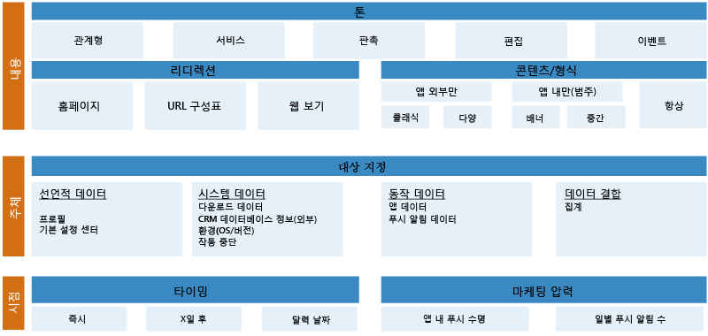
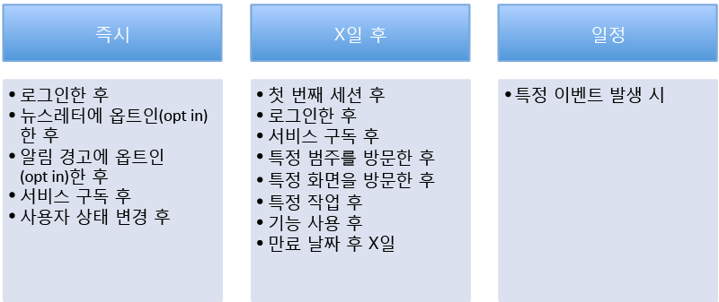

# Azure Mobile Engagement - 모범 사례 시작 가이드
> [!IMPORTANT]
> Azure Mobile Engagement는 2018/3/31에 사용이 중지됩니다. 이 페이지는 이후에 삭제됩니다.
> 

## 개요
**모바일 화면은 매우 혼잡한 환경:** 2013년의 연구에서 평균적인 모바일 장치에 응용 프로그램 27개가 설치되어 있다고 밝혀졌습니다. 일반적으로 사용자는 월간 30시간을 이러한 앱에서 보냅니다. 이 시간의 대부분은 소셜 네트워킹과 게임에 소비됩니다(약 20시간). 2014년까지 Android 시장에서 약 150만 종의 응용 프로그램을 사용자가 선택했습니다. Apple 스토어에는 약 120만 종의 앱이 있습니다. 모바일 앱 사용은 개발자들이 이 성장 시장에서 경쟁하고 있으므로 여전히 증가하고 있습니다. 

평균적인 모바일 사용자는 변화하는 관심과 앱 내 경험에 따라 앱을 매우 자주 설치하고 제거합니다. 앱의 성공을 결정하려면 단순히 앱을 설치하는 사용자 수보다 많은 것을 알아야 합니다. 앱이 얼마나 유용한지 그리고 사용 추세가 변화하고 있는지 여부를 알아야 합니다. 다음 질문이 중요하게 됩니다.

* 사용자가 앱에 흥미가 없거나 사용되지 않는다는 것을 발견하기 시작합니까? 
* 얼마나 많은 사용자가 앱 사용을 완전히 중지했습니까? 
* 앱 내 구매 추세가 증가합니까 아니면 감소합니까?
* 사용자가 앱 문제 또는 흥미 부족 때문에 워크플로를 완료하지 못하고 있습니까? 
* 새로운 콘텐츠를 사용자 기반에 제공하여 앱을 유용하고 적절하게 유지할 수 있습니까? 
* 새 콘텐츠가 모든 사용자에게 동일합니까 아니면 앱에 대한 행동을 기반으로 사용자 계층에 초점을 맞추고 있습니까? 

다음과 유사한 질문에 대한 대답은 앱의 수명과 앱에서 얻는 수익을 확장하는 데 도움이 될 수 있습니다. 또한 사용자 기반을 정의하고 유지하는 데에도 도움이 될 수 있습니다. 

미디어 관련 앱은 사용자 사이에 가장 높게 보유되는 몇 가지에 포함되는 경향이 있습니다. 그 이유 중 하나는 사용자에게 새 콘텐츠를 지속적으로 제공한다는 것입니다. 사용자 계층에게 지정된 유용한 푸시 알림을 조기에 채택하면 앱 보유에 높은 영향을 미치는 경향이 있습니다. 

Azure Mobile Engagement 프로그램은 앱 사용에 관한 세부 정보를 수집 및 분석하는 방법을 제공하여 앱의 수명과 보유를 확장하는 데 도움을 주기 위한 것입니다. 행동에 따라 사용자 기반을 분류하고 식별된 사용자 계층에 대한 푸시 알림 및 앱 내 메시지를 제공하는 데 초점을 맞춘 캠페인을 만드는 데 도움이 됩니다. 핵심 성과 지표(KPI)는 사용자가 앱의 서로 다른 측면에 대해 얼마나 활발한지 측정합니다. Azure Mobile Engagement는 이 KPI를 결정하는 데 필요한 방법을 제공합니다. 모바일 앱에 대한 매력을 높이기 위해 필요한 인프라를 제공하여 투자 회수(ROI)의 증가에 도움이 됩니다. 

Azure 고객 관리를 가장 잘 이용하려면 잘 설계된 고객 관리 계획으로 시작해야 합니다. 이 계획은 사용자 기반의 계층을 분류할 수 있도록 하기 위해 필요한 세밀한 데이터를 식별하는 데 도움이 됩니다. 행동과 앱 내 경험을 기반으로 이러한 데이터를 식별할 수 있습니다. 계획이 성공하기 위해 앱의 목표를 측정하는 KPI를 명확히 정의하는 것이 모범 사례입니다. 명확한 성능 지표가 정의된 상태에서 KPI를 분석 및 평가하는 데 사용할 세밀한 데이터를 수집하는 데 필요한 논리를 앱에 쉽게 포함시킬 수 있습니다. 이 항목은 고객 관리 계획을 사용하는 KPI 정의에 대한 모범 사례 가이드입니다. 

## 1 단계: BET 모델에 맞게 KPI 정의
KPI를 올바르게 정의하는 것은 완료하기 어려운 작업일 수 있습니다. 서로 다른 산업을 위해 설계된 앱은 고유의 특이한 사항과 목적을 가지고 있습니다. 이 때문에 접근에 혼동을 야기하는 경향이 있습니다. 이 문제를 피하기 위해 목표와 KPI를 **비즈니스**, **고객 관리** 및 **기술**의 세 가지 주 범주로 분류해야 합니다. 이 분류를 **BET 모델**이라 합니다.

좋은 계획은 일반적으로 BET 모델의 다음과 같은 각 분류에서 성공을 측정하는 KPI를 포함한 목표를 가지고 있습니다.

#### 비즈니스 KPI
비즈니스 KPI는 가장 만들기 쉬운 부분이어야 합니다. 아마도 모바일 앱을 계획할 때 모종의 형태로 이를 이미 정의했을 것입니다. 이 KPI는 일반적으로 앱의 수익과 ROI를 측정하는 데 도움이 됩니다. 다음 목록은 성과 지표를 정의하는 동안 안내 역할을 할 수 있는 비즈니스 KPI의 몇 가지 예를 제공합니다.

* 미디어 비즈니스 KPI
  * 클릭한 광고 수
  * 사용자당 페이지 방문 횟수
  * 현재 구독 수
* 게임 비즈니스 KPI 
  * 앱 내 구입 수
  * 사용자당 평균 수익(ARPU)
  * 세션당 소요된 시간
  * 게임 수준에서 재생한 횟수 및 현재 일수
* 전자 상거래 비즈니스 KPI
  * 앱을 사용한 일수
  * 사용자당 평균 수익(ARPU)
  * 체크아웃하는 동안 장바구니의 평균 금액
  * 대부분의 뷰 및 구입에 대한 제품 범주
* 은행 및 보험 비즈니스 KPI
  * 계정 수
  * 활성화된 기능
  * 방문한 페이지 수 제공
  * 클릭 또는 활성화된 경고 수       

#### 고객 관리 KPI
고객 관리 KPI는 사용자의 참여를 측정하는 성과 지표입니다. 이 영역의 추세는 앱 보유를 결정하는 데 도움이 됩니다. 다음은 이 유형의 KPI에 대한 몇 가지 예제 성과 지표입니다.

* 지난 7 일의 적극적 사용자
* 지난 7 일의 소극적 사용자 수
* 30 일 내에 앱을 사용하지 않은 사용자 수  

명백한 일부 외부 요인이 이 영역의 지표에 영향을 줄 수 있습니다. 예를 들어, 사용자가 모바일 장치를 언제나 가지고 있다고 생각할 수 있습니다. 이는 사실일 수도 있고 그렇지 않을 수도 있습니다. 게임 앱은 게임 사용자가 직장에서 퇴근하거나 학교에서 하교하는 동안 더 많이 게임을 실행한다면 휴일에 사용량이 더 많은 경향이 있을 수 있습니다.   

이 범주에서 잘 정의된 KPI는 앱과 고객 사이의 관계를 측정하는 데 도움이 됩니다.

#### 기술 KPI
이 범주에 속하는 성과 지표는 앱이 올바르게 작동하는지, 작동 중지했는지 또는 충돌하고 있는지 여부를 결정하는 데 도움이 됩니다. 이러한 지표를 통해 앱의 상태를 측정하고 사용자가 앱을 사용하지 못하게 할 수 있는 유용성 문제를 결정하는 데 도움이 될 수 있습니다. 이 범주에 대해 수집된 정보는 마케팅 팀과 관련될 수 있는 성과 정보를 포함할 수 있습니다. 또한 이 데이터는 IT와 지원 팀이 보고되지 않은 버그를 식별하도록 도와서 문제 해결에 유용할 수 있습니다. 

다음은 기술 KPI의 몇 가지 예입니다.

* 처리되지 않은 또는 처리된 예외 정보 및 개수 
* 마지막 충돌에 대한 타임 스탬프
* 마지막 클릭한 버튼 또는 마지막 방문한 페이지
* 앱의 메모리 사용량
* 앱 프레임 속도
* 앱을 실행하고 있는 OS 버전
* 앱 버전

앱 성능을 측정하고 잠재적 버그를 탐지하는 데 도움이 되도록 이러한 KPI를 정의합니다. 이 지표는 고객을 위한 수정을 제공하는 데 필요한 시간을 줄이는 데 도움이 됩니다. 또한 특정 문제를 발견한 사용자 계층을 정의하는 데 도움이 될 수 있습니다. 이 사용자 계층을 사용하여 사용 가능한 수정과 잠재적 홍보에 관한 알림을 제공하면 고객 만족을 회복하는 데 도움이 될 수 있습니다. 

#### 플레이 북 연습 1: KPI 대시보드 만들기
마케팅 전략을 정의할 때 KPI는 각각의 주 목표에 대한 뷰를 제공해야 합니다. 이는 사용자의 앱과 최종 사용자의 행동을 모니터링하는 데 풍부한 정보를 수집할 수 있는 명확히 정의된 데이터 요소여야 합니다.

아래 정보를 포함하고 있는 KPI 대시보드 만들기

1. 앱에 대한 KPI는 무엇입니까?
2. 각 KPI를 표현하는 데 사용하는 데이터 요소는 무엇입니까?
3. 내 응용 프로그램에 대한 이 데이터(즉, 화면, 설정, 시스템...)를 어디서 찾습니까?
4. 이 KPI에 대한 고객 관리 순서를 실행할 수 있습니까?

예제와 지침을 위해 [미디어 플레이 북 템플릿][Media Playbook link]에 **KPI 작성기** 워크시트를 사용할 수 있습니다.

## 2 단계: 고객 관리 프로그램
우수한 모바일 고객 관리 프로그램을 앱의 핵심 구성 요소로 생각해야 합니다. 이는 앱을 처음 사용하는 동안 사용자에 대해 실행하는 우수한 시작 프로그램을 반드시 포함해야 합니다. 이는 앱의 고객 관리 및 보유에 대해 매우 긍정적인 영향을 미치는 경향이 있습니다. 연구에 따르면 대부분의 사용자가 설치한 지 처음 몇 일 만에 앱 사용을 중지하는 것으로 나타났습니다. 사용자가 앱에 여전히 집중해 있는 동안 조기에 흥미를 일으키는 고객의 기대를 충족하거나 초과하도록 노력해야 합니다. 고객에게 앱의 주요 가치와 이점을 보여 주어야 합니다. 

푸시 알림은 조기에 모바일 장치 사용자와 계약하는 최선의 접근 방식입니다. 그러나 푸시 알림에 대한 사용자를 구분할 때 각별히 주의해야 합니다. 사용자가 스팸 또는 흥미가 없는 알림을 받는 것 같이 느끼면 심각한 영향을 미칠 수 있기 때문입니다. 몇 번 클릭한 후 사용자는 응용 프로그램을 삭제하고 다시는 돌아오지 않을 수 있습니다. 사용자가 일반적인 스팸 대신에 고도로 개인화된 앱 내 가치를 받아야 합니다.

사용자가 적극적으로 참여한 후에는 고객 관리 프로그램이 앱의 다른 측면을 추진하는 데 도움이 될 수 있습니다.

예를 들어 적극적 사용자에게 앱의 등급을 매기도록 요구하는 캠페인을 설정할 수 있습니다. 이 사용자 계층은 가장 적극적이고 앱에 대한 가장 많은 경험을 가지고 있으므로 가장 정확한 평가를 제공할 것으로 기대할 수 있습니다. 높은 앱 평가를 받은 후에는 앱의 유기적인 다운로드 및 새 고객 획득 비용 감소를 추진하는 데 도움이 될 수 있습니다.

#### 고객 관리 시퀀스
글로벌 고객 관리 프로그램은 서로 다른 고객 관리 순서를 포함하고 있습니다. 각 시퀀스는 여러 목표에 도달하는 것을 목표로 합니다.

###### 수명 푸시 순서
수명 푸시 순서에 대한 목적은 사용자의 앱 참여 수명 주기에 따라 달라집니다. 특정 사용자는 새 사용자, 소극적 또는 매우 적극적인 사용자일 수 있습니다. 고객 관리 수명 주기의 서로 다른 단계에서 사용자는 팁 또는 문서 링크의 형태로 새 콘텐츠에서 이익을 얻을 수 있습니다. 

예를 들어 새 사용자는 앱을 찾아가거나 앱을 처음 시작할 때 다음과 유사한 새 사용자 인센티브에서 이익을 얻기 위해 도움이 필요할 수 있습니다.

*"함께 하게 되어 기쁩니다! 첫 번째 달을 무료로 이용하려면 잊지 말고 로그인하세요! ").*

###### 동작 푸시 순서
동작 푸시 순서는 앱에 대해 수집된 사용자 동작을 기반으로 사용량을 증가시키는 것을 목표로 합니다.  

예를 들어 판타지 축구 앱의 매우 적극적인 사용자는 다음과 같은 푸시 알림으로 참여하면 이익을 얻을 수 있습니다.

*"John 님은 열렬한 축구 팬입니다! 우리의 NFL 섹션에 로그인하여 슈퍼볼을 무료로 이용하세요!"*

###### 수명 푸시 알림
사용자는 자신의 관심에 초점을 맞춘 관련 뉴스를 높이 평가합니다. 알림 푸시 순서는 사용자가 명확히 나타낸 관심을 기반으로 알림을 보내서 참여를 강화합니다. 이는 사용자가 앱에서 자신의 관심사를 선택할 때 명확해질 수 있습니다. 또한 사용자 앱 상호작용 중에 수집된 데이터를 기반으로 묵시적으로 결정될 수도 있습니다.

예를 들어 전자 상거래 앱 사용자는 특정 커피 브랜드를 정기적으로 구입할 수 있으며 이러한 관심은 비즈니스 KPI로 수집됩니다. 다음 경고는 이 사용자의 앱 참여를 강화할 수 있습니다.

*"안녕하세요 Wes 님, 즐겨 찾으시는 커피 브랜드 중 하나는 2015년 9월 첫째 주에 25% 할인 판매를 하고 있습니다. 고객으로 방문해 주셔서 감사하며 이 알림을 인지해 주시면 감사하겠습니다."*

###### 보존 푸시 순서
이 순서는 반복적 푸시 알림을 사용하여 정기적인 앱 참여 습관을 추진하도록 돕기 위해 사용자를 보존하는 것을 목표로 합니다. 이는 사용자가 상호작용을 좋아하는 경우 앱 보존을 높이는 데 도움이 될 수 있습니다. 

예를 들어 스포츠 관련 앱 사용자는 해당 사용자가 즐겨 찾는 팀을 기반으로 매주 다음과 같은 푸시 알림을 받을 수 있습니다.

*"200 포인트를 받을 수 있는 기회를 잡으려면 뉴욕 양키스가 토론토 블루 제이스와의 이번 주 경기에서 이길지 여부에 관한 투표에 참여하세요!"*

#### 3W 접근 방식
다른 푸시 순서를 숙지하면 최종 사용자의 참여를 이끌어 내는 데 도움이 됩니다. 그러나 알림을 개인화하려면 여전히 3W 접근 방식을 사용해야 합니다. 3W 접근 방식은 각 알림에 대해 누가, 무엇을 그리고 언제를 다루어야 합니다. 이러한 3 개의 질문을 명확하게 충족하면 알림이 참여를 위해 올바르게 집중되어야 합니다.

###### 누가: 메시지를 받을 사용자 계층
사용자에 대한 알림 푸시는 매우 민감한 의사소통 채널로 간주해야 합니다. 사용자 계층에 보내는 것으로 목표로 하는 알림은 해당 사용자 계층의 관심에 맞는 적절한 범위여야 합니다. 경로가 잘못 설정된 알림은 사용자에게 부정적 영향을 미칠 가능성이 있습니다. 사용자는 이 알림을 스팸으로 간주하여 앱을 설치하지 않을 수 있습니다. 

알림을 받을 사용자 계층을 정의할 때 특정 기술 및 동작 기준의 조합을 사용합니다. 사용자 계층을 정의하는 간단한 예는 다음 문장과 유사할 수 있습니다.

“처음 3일 전 동안에 모바일 응용 프로그램을 시작하고 로그인을 실제로 완료하지 않고 로그인 페이지를 두 번 방문한 모든 사용자.”

이 문장은 특정 시나리오를 지원하기 위해 수집해야 하는 데이터를 식별하는 데 도움이 됩니다.

###### 무엇을: 보낼 메시지
**발신음**

계층으로 구분한 사용자별로 적절한 발신음을 고객 관리에 사용합니다. 이는 분명 최종 사용자와 연결하고 사용자의 관심을 앱에서 홍보하는 좋은 방법입니다. 

**리디렉션**

응용 프로그램을 여는 것 이상의 목적으로 푸시 알림을 사용할 수 있습니다. 알림 메시지가 브로드캐스트 뉴스 또는 제품 홍보 등과 같은 컨텍스트를 제공하는 경우, 이 알림은 응용 프로그램 내의 정확한 콘텐츠에 직접 연결하는 심층 연결을 할 수 있습니다. 이 기능을 지원하려면 응용 프로그램에서 리디렉션을 관리할 수 있는 URL 구성표를 만들어야 합니다. 고객 관리 순서에서 작업할 때 이는 잊지 말아야 할 중요한 단계입니다.

다른 시스템에 대한 리디렉션을 관리할 수도 있습니다. 예를 들어 작업 URL을 사용하면 다음을 포함한 많은 다른 시스템으로 최종 사용자를 리디렉션할 수 있습니다.

* 웹 사이트
* 이미 설정된 이메일이 있는 사서함
* SMS 상자
* 다이얼 서비스
* 응용 프로그램을 평가하기 위한 응용 프로그램 저장소로 직접. 

이 기능은 최종 사용자를 참여시키고 성능을 개선하는 자동 규칙을 만들 수 있는 많은 기회를 제공합니다.

**형식/콘텐츠**

다양한 유형 및 푸시 알림 형식:

1. **알림** : 여러 순간에 사용자에게 광고 메시지를 보낼 수 있습니다(앱에서, 앱 내에 또는 아무 때나).
2. **설문 조사** : 질문을 해서 최종 사용자로부터 정보를 수집할 수 있습니다. 최종 사용자를 대상으로 기준을 만들 때 이 질문에 대한 답을 사용할 수 있습니다.
3. **데이터 푸시** : 이진 또는 base64 데이터 파일을 보내서 앱을 업데이트할 수 있습니다. 데이터 푸시에 포함된 정보는 앱에 대한 사용자의 경험을 개인화하기 위해 응용 프로그램에 전송됩니다. 응용 프로그램은 데이터 푸시의 데이터를 지원하도록 설계해야 합니다.
4. **타일(Windows 전화만 해당)**: Microsoft 푸시 알림 서비스(MPNS)를 사용하여 XML 데이터가 포함된 원시 푸시 알림을 보낼 수 있습니다(SDK 버전 0.9.0 이후 지원됨. 타일에 대한 최종 페이로드는 32KB를 초과할 수 없음). 메시지는 보드의 타일에 직접 나타납니다.
5. **웹 뷰** : 웹 뷰는 웹 콘텐츠가 포함된 팝업입니다. 이 팝업은 최종 사용자가 푸시 알림을 클릭한 경우에 나타납니다. 웹 뷰를 사용하면 최종 사용자와 더 많은 상호 작용을 할 수 있습니다.

> [!NOTE]
> 푸시 알림으로 보내는 콘텐츠가 앱 개발 및 푸시 알림 전송을 위한 해당 플랫폼(iOS, Android, Windows) 지침을 사용하여 컴파일되는지 확인합니다.
> 
> 

###### 언제: 캠페인의 타이밍
푸시 알림을 트리거하는 캠페인을 활성화하기에 가장 좋은 시기는 언제입니까? 수동이어야 합니까 아니면 자동이어야 합니까? 되풀이되어야 합니까? 적절한 시기 또는 빈도 결정은 최상의 결과로 사용자를 참여시키기 위해 필수입니다. 각 고객 관리 순서와 시나리오에 대해 푸시 알림을 전송하기에 가장 적절한 시기를 지정해야 합니다. 몇 가지 가능한 예는 다음과 같습니다.

매일 많은 알림을 전송하는 경우 사용자가 전달 내용을 스팸으로 여길 수 있다는 것을 심각하게 고려해야 합니다. 

Azure Mobile Engagement는 전달 내용을 스팸으로 여기지 않도록 하는 두 가지 방법을 제공합니다. 첫째, 미세 조각화를 사용하여 동일한 사용자를 대상으로 하지 않도록 합니다. 또한 Azure 모바일 서비스 계약 "할당량" 기능을 제공합니다. 이 기능으로 캠페인을 위해 전송되는 알림을 제한할 수 있습니다. 예를 들어 주당 기본 할당량을 5로 설정하면 캠페인 사용자 계층의 일부로 포함된 사용자가 해당 주에 알림을 5개 이상 받지 않도록 합니다.

#### 플레이 북 연습 2: 고객 관리 프로그램 만들기
목표를 요약하고 특정 순서를 사용하여 재생한다고 예상하는 캠페인을 정의하는 데 어느 정도 시간을 소비합니다. 캠피인의 알림에 3W 접근 방식을 적용해야 합니다. 

예제와 지침을 위해 [미디어 플레이 북 템플릿][Media Playbook link]에 **고객 관리 프로그램** 워크시트를 사용합니다.

## 3 단계: 앱 통합
#### 태그 계획 만들기
Azure Mobile Engagement를 앱에 통합하려면 태그 계획을 만들어야 합니다. 태그 계획은 프로젝트의 기초입니다. 이는 응용 마케팅 사양, 응용 프로그램의 워크플로 및 KPI를 측정하기 위해 앱에서 수집한 실제 태그 데이터 간의 관계를 정의합니다. 포털에서 볼 수 있는 분석을 나타냅니다. 또한 사용자 계층을 정의하고 최종 사용자를 참여시키기 위해 초점이 맞춰진 푸시 알림을 정의하는 데 도움이 됩니다. 태그 계획을 정의한 후 Azure 고객 관리 SDK를 사용하여 앱에 통합하는 코드를 쉽게 추가할 수 있습니다.

태그 계획은 응용 프로그램의 모든 내용에 태그를 지정하지 않아야 합니다. 모바일 고객 관리 전략의 일부인 태그 데이터만 포함해야 합니다. 이는 응용 프로그램 간에 따라 달라질 수 있습니다. Azure Mobile Engagement에서 제공하는 [미디어 플레이 북 템플릿][Media Playbook link]은 지정한 방법을 사용하여 태그 계획을 만드는 데 도움이 됩니다. **태그 계획** 워크시트를 태그 계획을 만드는 지침으로 사용합니다.

워크시트에 태그 섹션을 정의할 때는 매우 구체적이어야 합니다. 이는 혼동을 피하기 위해 매우 중요합니다. 각 태그를 전송하는 각 예상 시나리오를 상세하게 정의합니다. 각 태그가 포함된 작업의 이름을 포함합니다. 이러한 이름은 모두 워크시트의 **정보** 부분에 포함됩니다. 태그 계획 워크시트는 테스트 확인을 위한 주된 기준이어야 합니다. 

**수집할 데이터** 섹션에서 개발 팀은 응용 프로그램에 포함될 각 태그에 필요한 유형, 이름, 값 및 추가 정보 키/값 쌍을 찾아야 합니다.

프로젝트와 관련된 모든 팀과 함께 태그 계획을 검토하는 것이 좋습니다. 필요한 수정을 하고 모든 내용이 마케팅 및 개발 팀에 대해 명확한지 확인합니다.

**작업 명세서** 워크시트를 사용하면 프로젝트에 포함된 모든 사람을 지도하는 데 도움이 될 수 있습니다.

#### 데이터 형식
이는 Azure Mobile Engagement에 의한 데이터 지원의 일반적인 형식입니다.

###### 장치 및 사용자
Azure Mobile Engagement는 각 장치에 대해 고유한 식별자를 생성하여 사용자를 식별합니다. 이 식별자를 장치 식별자(또는 deviceid)라고 합니다. 이는 동일한 장치에서 실행 중인 모든 응용 프로그램이 같은 장치 식별자를 공유하는 방법으로 생성됩니다.

###### 세션 및 작업
세션은 사용자가 실행 중인 앱의 한 인스턴스입니다. 세션은 사용자가 앱을 시작할 때부터 중지할 때까지의 시간에 걸쳐 있습니다.

작업은 세션 중에 앱에서 수행할 수 있는 여러 작업에 대한 논리적 그룹화입니다. 일반적으로 이는 앱의 특정 화면이지만 응용 프로그램의 논리에 의해 정의된 무엇이든 작업이 될 수 있습니다. 적어도 앱에 대한 각 화면 또는 작업에 대한 태그를 지정해야 합니다. 그러면 사용자 경로를 이해할 수 있습니다.

###### 이벤트
이벤트는 앱과의 사용자 상호 작용을 보고하는 데 사용됩니다. 이는 콘텐츠 공유 또는 비디오 시작 같은 순간적인 작업일 수 있습니다. 태그 지정 이벤트는 사용자가 앱과 상호 작용하는 방법을 보여 주는 데이터 컬렉션을 제공합니다. 

###### 교육
작업은 기간이 있는 작업을 보고하는 데 사용됩니다. 몇 가지 예:

* API 호출의 실행
* 광고의 표시 시간
* 백그라운드 작업 기간 
* 구매 프로세스 기간
* 비디오 시청

###### 오류
오류는 앱이 검색한 문제를 보고 하는 데 사용됩니다. 예: 잘못된 사용자 작업 또는 API 호출 실패.

###### 응용 프로그램 정보
응용 프로그램 정보(App-Info)는 사용자의 응용 프로그램 경험과 관련된 데이터에 태그를 지정하기 위해 사용됩니다. 이는 사용자의 응용 프로그램 상호 작용에 의해 생성됩니다. 

지정된 앱 정보 키에 대해 Azure Mobile Engagement는 최근 값(기록 제외)만 기억합니다. 앱 정보는 앱 또는 최종 사용자의 상태를 표시합니다. 예: 로그인 상태 또는 사용자가 즐겨 찾는 제품 그룹.

###### 충돌 데이터
Mobile Engagement SDK에 의해 자동으로 수집된 충돌 데이터는 응용 프로그램에서 처리하지 않은 응용 프로그램 실패를 보고합니다. 예: 발생한 처리되지 않은 예외.

###### 추가 데이터
매개 변수를 사용하여 이벤트, 오류 및 작업을 향상시킬 수 있습니다. 이는 개발자가 응용 프로그램에서 구체적 데이터로 제공할 수 있는 추가 정보입니다. 이는 세분화된 구분을 정의하는 데 중요합니다. 

예를 들어 “article” 태그의 값을 사용하면 특정 문서를 본 사람을 기반으로 최종 사용자를 구분할 수 있습니다. 그러나 이것만으로 충분하지 않을 수 있습니다. 같은 “article” 태그가 작업 내에 “news_category” 같은 추가 태그도 포함하고 있으면 더 좋을 수 있습니다. 이는 사용자에 대한 즐겨 찾는 범주를 동적으로 결정하는 데 유용할 수 있습니다. 

추가 정보는 키/값 쌍으로 보고됩니다. 이 미디어 응용 프로그램에 대한 예에서 "news_category"에 대 한 추가 정보는 해당 범주에 대 한 값일 수 있습니다. 예: "스포츠", "경제" 또는 "정치".

#### 태그 및 SDK 통합
Azure Mobile Engagement SDK를 앱에 통합하기 위한 단계별 지침은 Azure 웹사이트의 [고객 관리 SDK 통합](mobile-engagement-windows-store-integrate-engagement.md) 설명서를 따르세요. 해당 페이지의 위쪽에 있는 링크에서 대상 플랫폼을 선택합니다.

Azure Mobile Engagement의 위쪽에 만들어진 앱 두 개에 대한 프로젝트를 만드는 것이 좋습니다. 한 개는 개발 및 테스트 스테이징에 대한 것이며 다른 하나는 프로덕션 스테이징에 대한 것입니다. 그런 다음 사용자 수용 테스트가 성공적일 때 IT 팀이 테스트 스테이징에서 프로덕션으로 수준을 올릴 수 있습니다.

#### 사용자 수용 테스트(UAT)
사용자 수용 테스트(UAT)에는 모든 것이 설계한 대로 작동한다고 확인하는 과정이 포함됩니다. 워크플로를 완료하고 태그 계획에 따라 모든 필요한 데이터를 수집할 수 있습니다.

* 정보 태그 지정은 문서화된 AZME 개념에 따라 시행해야 함
* 필요한 모든 정보가 수집됨추가 정보 값, 앱 정보 값 포함)
* 용어 체계는 태그 계획에 따라 일치됨
* 전송된 중복 태그 없음

앱에 포함한 모든 유형의 알림 동작을 철저히 테스트

* 앱에서 그리고 앱 내의 알림, 설문 조사, 데이터 푸시
* 텍스트/웹 뷰
* 배지 업데이트, 범주

#### 설정
Azure Mobile Engagement 설정은 매우 간단합니다. 사용자 인터페이스와 관련된 모든 설명서는 Azure Mobile Engagement 웹 사이트 [사용자 인터페이스를 탐색하는 방법](mobile-engagement-user-interface-home.md)에서 사용할 수 있습니다.

프로젝트의 사용자에 대해 올바른 역할과 역할 멤버 자격을 설정하는 것으로 시작하는 것이 좋습니다. 이렇게 하면 모든 사용자에 대해 올바른 플랫폼 액세스를 관리하는 데 도움이 됩니다. 역할은 다음을 포함할 수 있습니다.

* 관리자
* 개발자
* 뷰어 

나중에:

* 장치 ID를 등록하여 자신의 장치에서 테스트합니다.
* 계정의 설정으로 이동하고 표준 시간대를 설정하여 표준 시간대에 대해 차트 및 알림 배달 시간을 설정합니다.
* 응용 프로그램의 설정으로 이동하고 도달률 내의 대상 최종 사용자에 대해 필요한 “앱 정보”를 등록합니다.

첫번째 푸시 알림 캠페인을 실행 하는 방법에 대한 자세한 내용은 [최종 사용자에게 도달하기 위해 푸시 사용 및 관리를 시작하는 방법](mobile-engagement-how-tos.md)을 검토하세요.

## 결론
고객 관리 프로그램은 반복적이며 앱에 가장 적합한 내용을 실험하면서 지속적으로 자신의 앱을 개선해야 합니다. 

처음에 고객 관리 전략에 대한 경험을 개발하는 동안 전체 글로벌 고객 관리 전략을 만들려고 시도하지 마십시오. 단계별 접근 방식으로 자신의 KPI와 이를 활용하는 방법을 식별합니다. 고객 관리 전략은 각 앱마다 고유합니다.

몇 가지 경험을 개발한 후 고객 관리 프로그램에 대해 다음 사항의 추가를 고려할 수 있습니다.

* 추적: 사용자를 획득하고 아마도 데이터 컬렉션 소스를 정의합니다. Azure Mobile Engagement를 데이터 컬렉션 소스에 연결할 수 있습니다. 이를 통해 각 소스의 성능을 모니터링할 수 있습니다. 이 정보는 획득 투자를 최대하기 위해 흥미로울 것입니다. 
* A / B 테스트: 고객 관리 프로그램의 필수 부분입니다. 각 앱마다 자체의 구체적 사항이 있습니다. A/B 테스트를 사용하면 고객 관리 프로그램을 개선할 수 있습니다.
* 지리적 위치: 브랜드에 대해 아주 좋은 기회입니다. 이 기능 덕분에 올바른 장소와 시간에 도달할 수 있습니다. 지리적 위치의 사용을 시작하기 전에 충분한 최종 사용자 동작 데이터를 수집해 두었는지 확인하는 것이 좋습니다.
* 데이터 푸시: 데이터 푸시는 보이지 않는 푸시입니다. 데이터 푸시를 사용하여 최종 사용자 동작을 기반으로 응용 프로그램을 사용자 지정할 수 있습니다. 예를 들어 사용자 계층이 흔히 첨단 제품을 문의한다면 앱 소유자가 첨단 콘텐츠로 홈 페이지를 개인화하는 데이터 푸시를 보낼 수 있습니다.

## 다음 단계
* [Azure Mobile Engagement 계정을 만듭니다](mobile-engagement-create.md).
* 모바일 고객 관리 전략의 정의에 대한 자세한 내용을 배우려면 [모바일 고객 관리 전략 정의](mobile-engagement-define-your-mobile-engagement-strategy.md) 를 방문합니다.

<!--Image references-->

<!--Link references-->
[Media Playbook link]: https://github.com/Azure/azure-mobile-engagement-samples/tree/master/Playbooks
