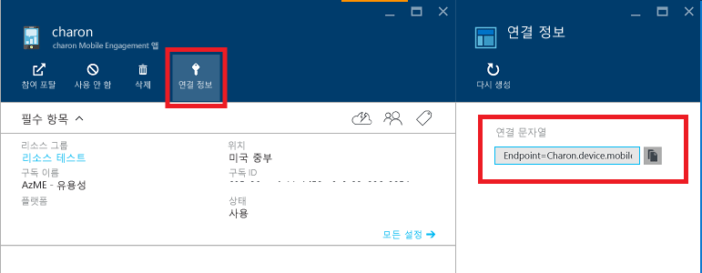

# <a name="get-started-with-azure-mobile-engagement-for-ios-apps-in-objective-c"></a>Objective C에서 iOS 앱용 Azure Mobile Engagement 시작
> [!IMPORTANT]
> Azure Mobile Engagement는 2018/3/31에 사용이 중지됩니다. 이 페이지는 이후에 삭제됩니다.
> 

[!INCLUDE [Hero tutorial switcher](../../includes/mobile-engagement-hero-tutorial-switcher.md)]

이 항목에서는 Azure Mobile Engagement를 사용하여 앱 사용법을 이해하고 iOS 응용 프로그램의 분할된 사용자에게 푸시 알림을 보내는 방법을 보여 줍니다.
이 자습서에서는 기본 데이터를 수집하고 APNS(Apple 푸시 알림 시스템)를 사용하여 푸시 알림을 받는 빈 iOS 앱을 만듭니다.

이 자습서를 사용하려면 다음이 필요합니다.

* MAC 앱 스토어에서 설치할 수 있는 XCode 8
* [Mobile Engagement iOS SDK]

이 자습서를 완료해야 다른 모든 iOS 앱용 Mobile Engagement 자습서를 진행할 수 있습니다.

> [!NOTE]
> 이 자습서를 완료하려면 활성 Azure 계정이 있어야 합니다. 계정이 없는 경우 몇 분 만에 평가판 계정을 만들 수 있습니다. 자세한 내용은 [Azure 무료 체험](https://azure.microsoft.com/pricing/free-trial/?WT.mc_id=A0E0E5C02&amp;returnurl=http%3A%2F%2Fazure.microsoft.com%2Fen-us%2Fdocumentation%2Farticles%2Fmobile-engagement-ios-get-started)을 참조하세요.
>
>

## <a id="setup-azme"></a>iOS 앱용 Mobile Engagement 설정
[!INCLUDE [Create Mobile Engagement App in Portal](../../includes/mobile-engagement-create-app-in-portal-new.md)]

## <a id="connecting-app"></a>Mobile Engagement 백 엔드에 앱 연결
이 자습서에서는 데이터를 수집하고 푸시 알림을 보내는 데 필요한 최소 집합인 "기본 통합" 방법을 설명합니다. 전체 통합 설명서는 [Mobile Engagement iOS SDK 통합](mobile-engagement-ios-sdk-overview.md)

여기서는 통합을 시연하기 위해 XCode를 사용하여 기본적인 앱을 만듭니다.

### <a name="create-a-new-ios-project"></a>새 iOS 프로젝트 만들기
[!INCLUDE [Create a new iOS Project](../../includes/mobile-engagement-create-new-ios-app.md)]

### <a name="connect-your-app-to-the-mobile-engagement-backend"></a>Mobile Engagement 백 엔드에 앱 연결
1. [Mobile Engagement iOS SDK]를 다운로드합니다.
2. 컴퓨터의 폴더에 .tar.gz 파일의 압축을 풉니다.
3. 프로젝트를 마우스 오른쪽 단추로 클릭하고 **파일 추가**를 선택합니다.

    ![][1]

4. SDK를 추출한 폴더로 이동하고 `EngagementSDK` 폴더를 선택하고 왼쪽 아래 모퉁이에 있는 **옵션**을 클릭하고 **필요한 경우 항목 복사** 확인란 및 대상의 확인란을 선택했는지 확인한 다음 **확인**을 누릅니다.

    ![][2]

5. **빌드 단계** 탭을 열고 **이진 파일과 라이브러리 연결** 메뉴에서 아래와 같이 프레임워크를 추가합니다.

    ![][3]

6. Azure 포털의 앱 **연결 정보** 페이지로 돌아가서 연결 문자열을 복사합니다.

    
7. **AppDelegate.m** 파일에 다음 코드 줄을 추가합니다.

    ```obj-c
    #import "EngagementAgent.h"
    ```
8. 이제 연결 문자열을 `didFinishLaunchingWithOptions` 대리자에 붙여넣습니다.

    ```obj-c
    - (BOOL)application:(UIApplication *)application didFinishLaunchingWithOptions:(NSDictionary *)launchOptions
    {
            [...]   
            [EngagementAgent init:@"Endpoint={YOUR_APP_COLLECTION.DOMAIN};SdkKey={YOUR_SDK_KEY};AppId={YOUR_APPID}"];
            [...]
    }
    ```

9. `setTestLogEnabled`는 SDK 로그를 통해 문제를 식별할 수 있도록 하는 선택적 문입니다.

## <a id="monitor"></a>실시간 모니터링 사용
데이터 보내기를 시작하고 사용자가 활성 상태인지 확인하려면 Mobile Engagement 백 엔드에 화면(활동)을 하나 이상 보내야 합니다.

1. **ViewController.h** 파일을 열고 **EngagementViewController.h**를 가져옵니다.

    ```obj-c
    #import "EngagementViewController.h"
    ```

2. 이제 **ViewController** 인터페이스의 상위 클래스를 `EngagementViewController`로 바꿉니다.
 
    ```obj-c
   @interface ViewController : EngagementViewController
   ```

## <a id="monitor"></a>실시간 모니터링과 앱 연결
[!INCLUDE [Connect app with real-time monitoring](../../includes/mobile-engagement-connect-app-with-monitor.md)]

## <a id="integrate-push"></a>푸시 알림 및 앱 내 메시징 사용
Mobile Engagement에서는 캠페인 컨텍스트에서 푸시 알림 및 앱 내 메시징을 사용하여 사용자 및 도달률과 상호 작용할 수 있습니다. Mobile Engagement 포털에서는 이 모듈을 도달률이라고 합니다.
다음 섹션에서는 이러한 알림과 메시지를 받도록 앱을 설정합니다.

### <a name="enable-your-app-to-receive-silent-push-notifications"></a>앱이 자동 푸시 알림을 받을 수 있도록 설정
[!INCLUDE [mobile-engagement-ios-silent-push](../../includes/mobile-engagement-ios-silent-push.md)]

### <a name="add-the-reach-library-to-your-project"></a>프로젝트에 도달률 라이브러리 추가
1. 프로젝트를 마우스 오른쪽 단추로 클릭합니다.
2. **파일 추가**를 선택합니다.
3. SDK를 추출한 폴더로 이동합니다.
4. `EngagementReach` 폴더를 선택합니다.
5. **추가**를 클릭합니다.

### <a name="modify-your-application-delegate"></a>응용 프로그램 대리자 수정
1. **AppDeletegate.m** 파일로 돌아가서 Engagement 도달률 모듈을 가져옵니다.

    ```obj-c
    #import "AEReachModule.h"
    #import <UserNotifications/UserNotifications.h>
    ```

2. 다음과 같이 `application:didFinishLaunchingWithOptions` 메서드 내에서 도달률 모듈을 만든 다음 기존 Engagement 초기화 줄에 전달합니다.

    ```obj-c
    - (BOOL)application:(UIApplication *)application didFinishLaunchingWithOptions:(NSDictionary *)launchOptions {
        AEReachModule * reach = [AEReachModule moduleWithNotificationIcon:[UIImage imageNamed:@"icon.png"]];
        [EngagementAgent init:@"Endpoint={YOUR_APP_COLLECTION.DOMAIN};SdkKey={YOUR_SDK_KEY};AppId={YOUR_APPID}" modules:reach, nil];
        [...]
        return YES;
    }
    ```

### <a name="enable-your-app-to-receive-apns-push-notifications"></a>앱이 APNS 푸시 알림을 받을 수 있도록 설정
1. 다음 줄을 `application:didFinishLaunchingWithOptions` 메서드에 추가합니다.

    ```obj-c
    if (NSFoundationVersionNumber >= NSFoundationVersionNumber_iOS_8_0)
    {
        if (NSFoundationVersionNumber > NSFoundationVersionNumber_iOS_9_x_Max)
        {
            [UNUserNotificationCenter.currentNotificationCenter requestAuthorizationWithOptions:(UNAuthorizationOptionBadge | UNAuthorizationOptionSound | UNAuthorizationOptionAlert) completionHandler:^(BOOL granted, NSError * _Nullable error) {}];
        }else
        {
            [application registerUserNotificationSettings:[UIUserNotificationSettings settingsForTypes:(UIUserNotificationTypeBadge | UIUserNotificationTypeSound | UIUserNotificationTypeAlert)   categories:nil]];
        }
        [application registerForRemoteNotifications];
    }
    else
    {
        [application registerForRemoteNotificationTypes:(UIRemoteNotificationTypeBadge | UIRemoteNotificationTypeSound | UIRemoteNotificationTypeAlert)];
    }
    ```
2. 다음과 같이 `application:didRegisterForRemoteNotificationsWithDeviceToken` 메서드를 추가합니다.

    ```obj-c
    - (void)application:(UIApplication *)application didRegisterForRemoteNotificationsWithDeviceToken:(NSData *)deviceToken
    {
            [[EngagementAgent shared] registerDeviceToken:deviceToken];
        NSLog(@"Registered Token: %@", deviceToken);
    }
    ```

3. 다음과 같이 `didFailToRegisterForRemoteNotificationsWithError` 메서드를 추가합니다.

    ```obj-c
    - (void)application:(UIApplication*)application didFailToRegisterForRemoteNotificationsWithError:(NSError*)error
    {
        NSLog(@"Failed to get token, error: %@", error);
    }
    ```

4. 다음과 같이 `didReceiveRemoteNotification:fetchCompletionHandler` 메서드를 추가합니다.

    ```obj-c
    - (void)application:(UIApplication *)application didReceiveRemoteNotification:(NSDictionary *)userInfo fetchCompletionHandler:(void (^)(UIBackgroundFetchResult result))handler
    {
        [[EngagementAgent shared] applicationDidReceiveRemoteNotification:userInfo fetchCompletionHandler:handler];
    }
    ```
    
[!INCLUDE [mobile-engagement-ios-send-push-push](../../includes/mobile-engagement-ios-send-push.md)]

<!-- URLs. -->
[Mobile Engagement iOS SDK]: http://aka.ms/qk2rnj

<!-- Images. -->
[1]: ./media/mobile-engagement-ios-get-started/xcode-add-files.png
[2]: ./media/mobile-engagement-ios-get-started/xcode-select-engagement-sdk.png
[3]: ./media/mobile-engagement-ios-get-started/xcode-build-phases.png
[4]: ./media/mobile-engagement-ios-get-started/app-connection-info-page.png
