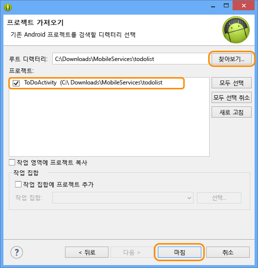
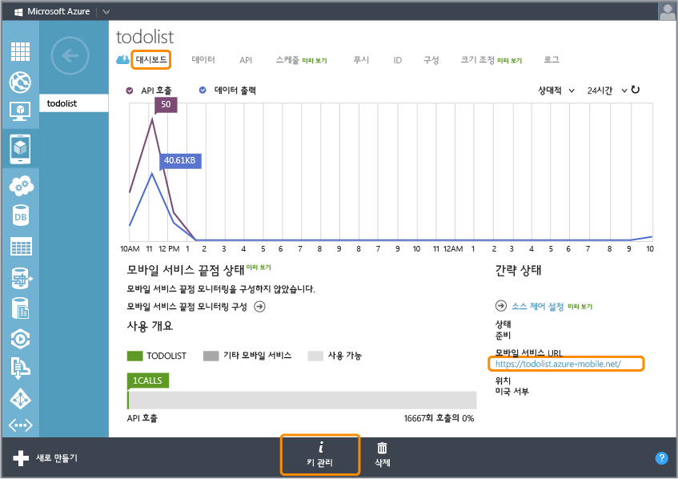

<properties linkid="develop-mobile-tutorials-get-started-with-data-android" urlDisplayName="Get Started with Data - Android" pageTitle="Get started with data (Android) | Mobile Dev Center" metaKeywords="Azure android data, Azure mobile services data, windows droid, windows android, microsoft droid, microsoft android" description="Learn how to get started using Mobile Services to leverage data in your Android app." metaCanonical="" services="" documentationCenter="Mobile" title="Get started with data in Mobile Services" authors="ricksal,glenga" solutions="" manager="" editor="" />

모바일 서비스에서 데이터 시작
=============================

[Windows 스토어 C\#](/en-us/develop/mobile/tutorials/get-started-with-data-dotnet "Windows 스토어 C#")[Windows 스토어 JavaScript](/en-us/develop/mobile/tutorials/get-started-with-data-js "Windows 스토어 JavaScript")[Windows Phone](/en-us/develop/mobile/tutorials/get-started-with-data-wp8 "Windows Phone")[iOS](/en-us/develop/mobile/tutorials/get-started-with-data-ios "iOS")[Android](/en-us/develop/mobile/tutorials/get-started-with-data-android "Android")[HTML](/en-us/develop/mobile/tutorials/get-started-with-data-html "HTML")[Xamarin.iOS](/en-us/develop/mobile/tutorials/get-started-with-data-xamarin-ios "Xamarin.iOS")[Xamarin.Android](/en-us/develop/mobile/tutorials/get-started-with-data-xamarin-android "Xamarin.Android")

이 항목에서는 Azure 모바일 서비스를 사용하여 Android 앱에서 데이터를 활용하는 방법을 보여 줍니다. 이 자습서에서는 데이터를 메모리에 저장하는 앱을 다운로드하여 새 모바일 서비스를 만들고 모바일 서비스를 앱과 통합한 후 Azure 관리 포털에 로그인하여 앱을 실행할 때 수행된 데이터 변경 내용을 확인합니다.

[자습서 보기](http://channel9.msdn.com/Series/Windows-Azure-Mobile-Services/Android-Getting-Started-With-Data-Connecting-your-app-to-Windows-Azure-Mobile-Services) [동영상 재생](http://channel9.msdn.com/Series/Windows-Azure-Mobile-Services/Android-Getting-Started-With-Data-Connecting-your-app-to-Windows-Azure-Mobile-Services) 15:32

**참고**

이 자습서는 Android 앱에서 모바일 서비스를 통해 Azure를 사용하여 데이터를 저장하고 검색할 수 있는 방법을 더욱 잘 이해할 수 있도록 돕기 위한 것입니다. 이 항목에서는 모바일 서비스 빠른 시작에서 완료한 다수의 단계를 순서대로 안내합니다. 모바일 서비스를 처음 사용하는 경우 먼저 [모바일 서비스 시작](/en-us/develop/mobile/tutorials/get-started-android) 자습서를 완료하는 것이 좋습니다.

이 자습서에서는 다음 기본 단계를 단계별로 안내합니다.

1.  [Android 앱 프로젝트 다운로드](#download-app)
2.  [모바일 서비스 만들기](#create-service)
3.  [저장소로 사용할 데이터 테이블 추가](#add-table)
4.  [모바일 서비스를 사용하도록 앱 업데이트](#update-app)
5.  [모바일 서비스에 대해 앱 테스트](#test-app)

**참고**

이 자습서를 완료하려면 Azure 계정이 필요합니다. 계정이 없는 경우 몇 분 만에 무료 평가판 계정을 만들 수 있습니다. 자세한 내용은 [Azure 무료 평가판](http://www.windowsazure.com/en-us/pricing/free-trial/?WT.mc_id=AED8DE357)을 참조하십시오.

이 자습서에는 [모바일 서비스 Android SDK](http://go.microsoft.com/fwlink/p/?LinkID=280126), Eclipse IDE(통합 개발 환경) 및 ADT(Android 개발자 도구) 플러그 인이 포함된 [Android SDK](https://go.microsoft.com/fwLink/p/?LinkID=280125), Android 4.2 이상 버전이 필요합니다.

**참고**

이 자습서에서는 Android SDK 및 모바일 서비스 Android SDK 설치에 대한 지침을 제공합니다. 다운로드한 GetStartedWithData 프로젝트에는 Android 4.2 이후 버전이 필요합니다. 하지만 모바일 서비스 SDK에 필요한 Android는 2.2 이후 버전이면 됩니다.

프로젝트 다운로드GetStartedWithData 프로젝트 다운로드
-----------------------------------------------------

### 샘플 코드 가져오기

이 자습서는 Android 앱인 [GetStartedWithData 앱](http://go.microsoft.com/fwlink/p/?LinkID=282122)을 기반으로 합니다. 이 앱의 UI는 모바일 서비스 Android 빠른 시작에서 생성된 앱과 동일합니다. 단, 추가된 항목이 로컬에서 메모리에 저장된다는 점은 예외입니다. 저장소에 데이터를 유지하는 데 필요한 코드를 추가합니다.

1.  `GetStartedWithData` 샘플 앱을 다운로드하고 컴퓨터에서 해당 파일의 압축을 풉니다.

2.  Eclipse에서 **File**과 **Import**를 클릭하고 **Android**를 확장한 후 **Existing Android Code into Workspace**를 클릭한 다음 **Next**를 클릭합니다.

	

1.  **Browse**를 클릭하고 압축을 푼 프로젝트 파일 위치로 이동한 후 **OK**를 클릭합니다. TodoActivity 프로젝트가 선택되었는지 확인합니다. 프로젝트를 작업 영역에 복사하려는 경우 **Copy projects into workspace** 상자를 선택합니다. 마지막으로, **Finish**를 클릭합니다.

	

    현재 작업 영역에 프로젝트 파일을 가져옵니다.

### Android SDK 버전 확인

[WACOM.INCLUDE [Verify SDK](../includes/mobile-services-verify-android-sdk-version.md)]

### 샘플 코드 검사 및 실행

1.  Package Explorer에서 **GetStartedWithData**, **src** 및 **.com.example.GetStartedWithData**의 압축을 푼 다음 ToDoActivity.java 파일을 검사합니다.

    

    모바일 서비스를 사용하여 이 앱을 만들기 위해 진행해야 하는 단계를 지정하는 `//TODO` 코멘트가 있습니다.

2.  **Run** 메뉴에서 **Run**을 클릭한 후 **Android Application**을 클릭하여 프로젝트를 시작합니다.

    **참고**

    Android 휴대폰이나 Android 에뮬레이터를 사용하여 이 프로젝트를 실행할 수 있습니다. Android 휴대폰으로 실행하려면 휴대폰 전용 USB 드라이버를 다운로드해야 합니다.

    Android 에뮬레이터에서 프로젝트를 실행하려면 AVD(Android Virtual Device)를 하나 이상 정의해야 합니다. AVD Manager를 사용하여 이러한 장치를 만들고 관리합니다.

3.  앱에서 *Complete the tutorial* 등의 의미 있는 텍스트를 입력하고 **Add**를 클릭합니다.

    

    메모리 내 컬렉션에 저장된 텍스트가 저장되고 아래 목록에 표시됩니다.

모바일 서비스 만들기관리 포털에서 새 모바일 서비스 만들기
---------------------------------------------------------

[WACOM.INCLUDE [mobile-services-create-new-service-data](../includes/mobile-services-create-new-service-data.md)]

새 테이블 추가모바일 서비스에 새 테이블 추가
--------------------------------------------

[WACOM.INCLUDE [mobile-services-create-new-service-data-2](../includes/mobile-services-create-new-service-data-2.md)]

앱 업데이트데이터 액세스에 모바일 서비스를 사용하도록 앱 업데이트
-----------------------------------------------------------------

이제 모바일 서비스를 사용할 수 있으므로 로컬 컬렉션 대신 모바일 서비스에 항목을 저장하도록 앱을 업데이트할 수 있습니다.

1.  [모바일 서비스 Android SDK](http://go.microsoft.com/fwlink/p/?LinkID=280126)가 아직 없는 경우 지금 다운로드하고 압축 파일의 압축을 풉니다.

2.  SDK의 `mobileservices` 폴더에 있는 `.jar` 파일을 GetStartedWithData 프로젝트의 `libs` 폴더에 복사합니다.

3.  Eclipse의 Package Explorer에서 `libs` 폴더를 마우스 오른쪽 단추로 클릭하고 **Refresh**를 클릭하면 복사된 jar 파일이 나타납니다.

	모바일 서비스 SDK 참조가 작업 영역에 추가됩니다.

1.  AndroidManifest.xml 파일을 열어 Azure에서 모바일 서비스에 액세스할 수 있게 하는 다음 줄을 추가합니다.

        <uses-permission android:name="android.permission.INTERNET" />

2.  Package Explorer에서 com.example.getstartedwithdata 패키지에 있는 TodoActivity.java 파일을 열고 다음 코드 줄의 주석 처리를 제거합니다.

        import com.microsoft.windowsazure.mobileservices.MobileServiceClient;
        import com.microsoft.windowsazure.mobileservices.MobileServiceTable;
        import com.microsoft.windowsazure.mobileservices.NextServiceFilterCallback;
        import com.microsoft.windowsazure.mobileservices.ServiceFilter;
        import com.microsoft.windowsazure.mobileservices.ServiceFilterRequest;
        import com.microsoft.windowsazure.mobileservices.ServiceFilterResponse;
        import com.microsoft.windowsazure.mobileservices.ServiceFilterResponseCallback;
        import com.microsoft.windowsazure.mobileservices.TableOperationCallback;
        import com.microsoft.windowsazure.mobileservices.TableQueryCallback;

        import java.net.MalformedURLException;

3.  모바일 서비스와 바꿀 수 있도록 앱에서 현재 사용되고 있는 메모리 내 목록을 제거합니다. **ToDoActivity** 클래스에서 기존 **toDoItemList** 목록을 정의하는 다음 코드 줄을 주석으로 처리합니다.

        public List<ToDoItem> toDoItemList = new ArrayList<ToDoItem>();

4.  이전 단계가 완료되면 프로젝트에서 빌드 오류가 표시됩니다. `toDoItemList` 변수가 사용되는 나머지 세 개 위치를 검색하여 표시된 섹션을 주석으로 처리합니다. `import java.util.ArrayList`도 제거합니다. 그러면 메모리 내 목록이 완전히 제거됩니다.

5.  이제 모바일 서비스를 추가합니다. 다음 코드 줄의 주석 처리를 제거합니다.

        private MobileServiceClient mClient;
        private private MobileServiceTable<ToDoItem> mToDoTable;

6.  파일 아래쪽에서 ProgressFilter 클래스를 찾아 주석 처리를 제거합니다. 이 클래스는 MobileServiceClient에서 네트워크 작업을 실행하는 동안 '로드' 표시기를 표시합니다.

7.  관리 포털에서 **모바일 서비스**를 클릭한 후 방금 만든 모바일 서비스를 클릭합니다.

8.  **대시보드** 탭을 클릭하여 **사이트 URL**을 기록해 두고 **키 관리**를 클릭하여 **응용 프로그램 키**를 기록해 둡니다.

	

	앱 코드에서 모바일 서비스에 액세스할 때 이 값이 필요합니다.

1.  **onCreate** 메서드에서 **MobileServiceClient** 변수를 정의하는 다음 코드 줄의 주석 처리를 해제합니다.

        try {
        // Create the Mobile Service Client instance, using the provided
        // Mobile Service URL and key
            mClient = new MobileServiceClient(
                    "MobileServiceUrl",
                    "AppKey", 
                    this).withFilter(new ProgressFilter());

            // Get the Mobile Service Table instance to use
            mToDoTable = mClient.getTable(ToDoItem.class);
        } catch (MalformedURLException e) {
            createAndShowDialog(new Exception("There was an error creating the Mobile Service. Verify the URL"), "Error");
        }

	모바일 서비스에 액세스하는 데 사용되는 새 MobileServiceClient 인스턴스가 만들어집니다. 모바일 서비스에서 데이터 저장소에 프록시를 설정하는 데 사용되는 MobileServiceTable 인스턴스도 만들어집니다.

1.  위 코드에서 `MobileServiceUrl` 및 `AppKey`를 URL 및 모바일 서비스에서 가져온 응용 프로그램 키로 바꿉니다(두 항목 순서 유지).

2.  **checkItem** 메서드에서 다음 줄의 주석 처리를 해제합니다.

        mToDoTable.update(item, new TableOperationCallback<ToDoItem>() { 
            public void onCompleted(ToDoItem entity, Exception exception,
                    ServiceFilterResponse response) {
                if(exception == null){
                    if (entity.isComplete()) {
                        mAdapter.remove(entity);
                    }
                } else {
                    createAndShowDialog(exception, "Error");  
                }
            }
        });

	그러면 항목 업데이트가 모바일 서비스에 전송되고 선택한 항목이 어댑터에서 제거됩니다.

1.  **addItem** 메서드에서 다음 줄의 주석 처리를 해제합니다.

        mToDoTable.insert(item, new TableOperationCallback<ToDoItem>() {
                
            public void onCompleted(ToDoItem entity, Exception exception,
                    ServiceFilterResponse response) {
                if(exception == null){
                    if (!entity.isComplete()) {
                        mAdapter.add(entity);
                    }
                } else {
                    createAndShowDialog(exception, "Error");
                }               
            }
        });

	이 코드는 새 항목을 만들어 원격 모바일 서비스의 테이블에 삽입합니다.

1.  **refreshItemsFromTable** 메서드에서 다음 줄의 주석 처리를 해제합니다.

        mToDoTable.where().field("complete").eq(false)
        .execute(new TableQueryCallback<ToDoItem>() {
             public void onCompleted(List<ToDoItem> result, 
                     int count, Exception exception, 
                     ServiceFilterResponse response) {
                            
                        if(exception == null){
                            mAdapter.clear();

                            for (ToDoItem item : result) {
                                mAdapter.add(item);
                            }
                        } else {
                            createAndShowDialog(exception, "Error");
                        }
                    }
                }); 

    그러면 모바일 서비스를 쿼리하여 완료로 표시되지 않은 모든 항목을 반환합니다. 바인딩을 위해 항목이 어댑터에 추가됩니다.

앱 테스트모바일 서비스에 대해 앱 테스트
---------------------------------------

앱이 백 엔드 저장소용으로 모바일 서비스를 사용하도록 업데이트되었으므로, 이제 Android 에뮬레이터나 Android 휴대폰을 사용하여 모바일 서비스에 대해 앱을 테스트할 수 있습니다.

1.  **Run** 메뉴에서 **Run**을 클릭하여 프로젝트를 시작합니다.

    그러면 Android SDK를 사용하여 빌드된 앱이 실행되며 클라이언트 라이브러리를 사용하여 모바일 서비스의 항목을 반환합니다.

2.  이전처럼 의미 있는 텍스트를 입력한 후 **Add**를 클릭합니다.

    새 항목이 삽입으로 모바일 서비스에 전송됩니다.

3.  [관리 포털](https://manage.windowsazure.com/)에서 **모바일 서비스**를 클릭한 후 해당 모바일 서비스를 클릭합니다.

4.  **데이터** 탭을 클릭한 후 **찾아보기**를 클릭합니다.

    
          
    이제 **TodoItem** 테이블에는 모바일 서비스에서 생성한 값을 비롯한 데이터가 포함되었으며, 앱의 TodoItem 클래스와 일치시키기 위해 자동으로 테이블에 열이 추가되었습니다.

이제 Android용 **데이터 시작** 자습서를 마쳤습니다.

다음 단계
---------

이 자습서에서는 Android 앱에서 모바일 서비스의 데이터로 작업하기 위한 기본 사항에 대해 설명했습니다.

다음에는 이 자습서에서 만든 GetStartedWithData 앱을 기반으로 하는 다음 자습서 중 하나를 완료해보십시오.

-   [스크립트를 사용하여 데이터 유효성 검사 및 수정](/en-us/develop/mobile/tutorials/validate-modify-and-augment-data-dotnet)
    모바일 서비스에서 서버 스크립트를 사용하여 앱에서 전송된 데이터의 유효성을 검사하고 변경하는 방법을 자세히 알아봅니다.

-   [페이징을 사용하여 쿼리 구체화](/en-us/develop/mobile/tutorials/add-paging-to-data-android)
    쿼리에 페이징을 사용하여 단일 요청으로 처리되는 데이터 양을 제어하는 방법을 알아봅니다.

데이터 시리즈를 완료한 후에는 다른 Android 자습서 중 하나를 시도해 보십시오.

-   [인증 시작](/en-us/develop/mobile/tutorials/get-started-with-users-android)
    앱 사용자를 인증하는 방법을 알아봅니다.

-   [푸시 알림 시작](/en-us/develop/mobile/tutorials/get-started-with-push-android)
    모바일 서비스를 사용하여 기본적인 푸시 알림을 앱에 보내는 방법을 알아봅니다.

