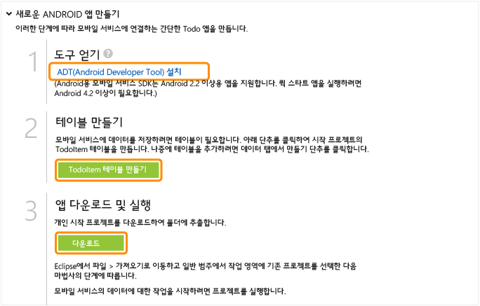

<properties pageTitle="Get Started with Azure Mobile Services for Android apps" metaKeywords="Azure android application, mobile service android, getting started Azure android, azure droid, getting started droid windows" description="Follow this tutorial to get started using Azure Mobile Services for Android development." metaCanonical="" services="" documentationCenter="Mobile" title="Get started with Mobile Services" authors="glenga" solutions="" manager="" editor="" />

모바일 서비스 시작
==================

[Windows 스토어](/en-us/documentation/articles/mobile-services-windows-store-get-started "Windows Store") [Windows Phone](/en-us/documentation/articles/mobile-services-windows-phone-get-started "Windows Phone") [iOS](/en-us/documentation/articles/mobile-services-ios-get-started "iOS") [Android](/en-us/documentation/articles/mobile-services-android-get-started "Android") [HTML](/en-us/documentation/articles/mobile-services-html-get-started "HTML") [Xamarin.iOS](/en-us/documentation/articles/partner-xamarin-mobile-services-ios-get-started "Xamarin.iOS") [Xamarin.Android](/en-us/documentation/articles/partner-xamarin-mobile-services-android-get-started "Xamarin.Android") [Sencha](/en-us/documentation/articles/partner-sencha-mobile-services-get-started/ "Sencha") [PhoneGap](/en-us/documentation/articles/mobile-services-javascript-backend-phonegap-get-started/ "PhoneGap")
[.NET 백 엔드](/en-us/documentation/articles/mobile-services-dotnet-backend-android-get-started/ ".NET 백 엔드") | [JavaScript 백 엔드](/en-us/documentation/articles/mobile-services-android-get-started/ "JavaScript 백 엔드")

이 자습서는 Azure 모바일 서비스를 사용하여 Android 앱에 클라우드 기반 백 엔드 서비스를 추가하는 방법을 보여 줍니다. 이 자습서에서는 새 모바일 서비스와 새 모바일 서비스에 앱 데이터를 저장하는 간단한 *할 일 모음* 앱을 둘 다 만듭니다.

완성된 앱의 스크린샷은 다음과 같습니다.

[자습서 보기](http://channel9.msdn.com/Series/Windows-Azure-Mobile-Services/Android-Support-in-Windows-Azure-Mobile-Services) [동영상 재생](http://channel9.msdn.com/Series/Windows-Azure-Mobile-Services/Android-Support-in-Windows-Azure-Mobile-Services)7:26

이 자습서를 완료하려면 Eclipse IDE(통합 개발 환경), ADT(Android 개발자 도구) 플러그 인 및 최신 Android 플랫폼이 포함된 [Android 개발자 도구](https://go.microsoft.com/fwLink/p/?LinkID=280125)(영문)가 필요합니다. Android 4.2 이상 버전이 필요합니다.

다운로드한 빠른 시작 프로젝트에는 Android용 모바일 서비스 SDK가 포함되어 있습니다. 이 프로젝트에는 Android 4.2 이상 버전이 필요하지만 모바일 서비스 SDK에는 Android 2.2 이상 버전만 있으면 됩니다.

**참고**

이 자습서를 완료하려면 Azure 계정이 필요합니다. 계정이 없는 경우 몇 분 만에 무료 평가판 계정을 만들 수 있습니다. 자세한 내용은 [Azure 무료 평가판](http://www.windowsazure.com/en-us/pricing/free-trial/?WT.mc_id=AE564AB28)을 참조하십시오.

새 모바일 서비스 만들기
-----------------------

[WACOM.INCLUDE [mobile-services-create-new-service](../includes/mobile-services-create-new-service.md)]

새 앱 만들기새 Android 앱 만들기
-----------------------------------------------------------------

모바일 서비스를 만든 후 관리 포털에서 쉬운 빠른 시작을 따라 모바일 서비스에 연결할 새 앱을 만들거나 기존 앱을 수정할 수 있습니다.

이 섹션에서는 모바일 서비스에 연결된 새 Android 앱을 만듭니다.

1.  관리 포털에서 **모바일 서비스**를 클릭한 후 방금 만든 모바일 서비스를 클릭합니다.

2.  빠른 시작 탭에서 **플랫폼 선택** 아래의 **Android**를 클릭하고 **새 Android 앱 만들기**를 확장합니다.

	![][6]

    This displays the three easy steps to create an Android app connected to your mobile service.

	

3.  아직 수행하지 않은 경우 로컬 컴퓨터나 가상 컴퓨터에서 [Android 개발자 도구](https://go.microsoft.com/fwLink/p/?LinkID=280125)를 다운로드하여 설치합니다.

4.  **TodoItem 테이블 만들기**를 클릭하여 앱 데이터를 저장할 테이블을 만듭니다.

5.  **앱 다운로드 및 실행**에서 **다운로드**를 클릭합니다.

	모바일 서비스에 연결된 샘플 *할 일 모음* 응용 프로그램에 대한 프로젝트가 다운로드됩니다. 압축된 프로젝트 파일을 로컬 컴퓨터에 저장하고 저장 위치를 기록해 둡니다.

Android 앱 실행
---------------

이 자습서의 최종 단계는 새 앱을 빌드하고 실행하는 것입니다.

1.  압축된 프로젝트 파일을 저장한 위치로 이동한 후 컴퓨터에서 파일 압축을 풉니다.

2.  Eclipse에서 **File**, **Import**를 차례로 클릭하고 **Android**를 확장한 후 **Existing Android Code into Workspace**, **Next**를 차례로 클릭합니다.

	

3.  **Browse**를 클릭하고 압축을 푼 프로젝트 파일 위치로 이동한 후 **OK**를 클릭합니다. TodoActivity 프로젝트가 선택되었는지 확인하고 **Finish**를 클릭합니다.

	

    This imports the project files into the current workspace.

	

4.  **Run** 메뉴에서 **Run**을 클릭하여 Android 에뮬레이터에서 프로젝트를 시작합니다.

    **참고**

    Android 에뮬레이터에서 프로젝트를 실행할 수 있으려면 AVD(Android Virtual Device)를 하나 이상 정의해야 합니다. AVD Manager를 사용하여 이러한 장치를 만들고 관리합니다.

5.  앱에서 *Complete the tutorial* 등의 의미 있는 텍스트를 입력하고 **Add**를 클릭합니다.

	![][10]

	This sends a POST request to the new mobile service hosted in Azure. Data from the request is inserted into the TodoItem table. Items stored in the table are returned by the mobile service, and the data is displayed in the list.

    **참고**

    모바일 서비스에 액세스하여 데이터를 쿼리 및 삽입하는 코드를 검토할 수 있습니다. 이 코드는 ToDoActivity.java 파일에 있습니다.

6.  관리 포털로 돌아가서 **데이터** 탭을 클릭한 후 **TodoItems** 테이블을 클릭합니다.

	![][11]
	
	This lets you browse the data inserted by the app into the table.
	
	![][12]

다음 단계
---------

이제 빠른 시작을 완료했으며 모바일 서비스에서 중요한 추가 작업을 수행하는 방법을 알아보겠습니다.

-   [데이터 시작](/en-us/develop/mobile/tutorials/get-started-with-data-android)
     모바일 서비스를 사용하여 데이터를 저장 및 쿼리하는 방법을 자세히 알아봅니다.

-   [인증 시작](/en-us/develop/mobile/tutorials/get-started-with-users-android)
     ID 공급자를 사용하여 앱 사용자를 인증하는 방법을 알아봅니다.

-   [푸시 알림 시작](/en-us/develop/mobile/tutorials/get-started-with-push-android)
     기본적인 푸시 알림을 앱에 보내는 방법을 알아봅니다.

<!-- Anchors. -->
[Getting started with Mobile Services]:#getting-started
[Create a new mobile service]:#create-new-service
[Define the mobile service instance]:#define-mobile-service-instance
[Next Steps]:#next-steps

<!-- Images. -->
[0]: ./media/mobile-services-android-get-started/mobile-quickstart-completed-android.png

[6]: ./media/mobile-services-android-get-started/mobile-portal-quickstart-android.png
[7]: ./media/mobile-services-android-get-started/mobile-quickstart-steps-android.png
[8]: ./media/mobile-services-android-get-started/mobile-eclipse-quickstart.png

[10]: ./media/mobile-services-android-get-started/mobile-quickstart-startup-android.png
[11]: ./media/mobile-services-android-get-started/mobile-data-tab.png
[12]: ./media/mobile-services-android-get-started/mobile-data-browse.png

[14]: ./media/mobile-services-android-get-started/mobile-services-import-android-workspace.png
[15]: ./media/mobile-services-android-get-started/mobile-services-import-android-project.png

<!-- URLs. -->
[Get started with data]: /en-us/develop/mobile/tutorials/get-started-with-data-android
[Get started with authentication]: /en-us/develop/mobile/tutorials/get-started-with-users-android
[Get started with push notifications]: /en-us/develop/mobile/tutorials/get-started-with-push-android
[Android SDK]: https://go.microsoft.com/fwLink/p/?LinkID=280125
[Mobile Services Android SDK]: https://go.microsoft.com/fwLink/p/?LinkID=266533

[Management Portal]: https://manage.windowsazure.com/
