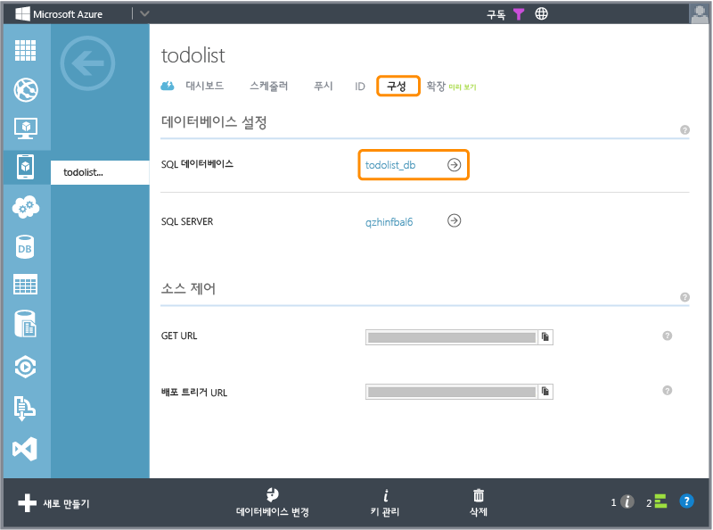
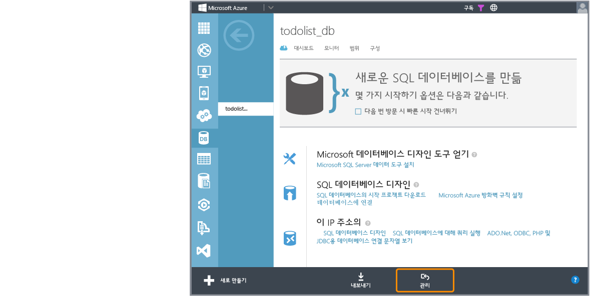

<properties pageTitle="How to use Code First Migrations .NET backend (Mobile Services)" metaKeywords="" description="" metaCanonical="" services="" documentationCenter="" title="Considerations for supporting multiple clients from a single mobile service" authors="glenga" solutions="" writer="glenga" manager="dwrede" editor="" />

.NET 백 엔드 모바일 서비스에 대한 데이터 모델 변경 방법
=======================================================

.NET 백 엔드 모바일 서비스 프로젝트에서 기본 Entity Framework Code First 데이터베이스 이니셜라이저는 [DropCreateDatabaseIfModelChanges] 클래스에서 파생됩니다. 이 이니셜라이저는 [DbContext]에 표시된 데이터 모델 변경이 감지될 때마다 데이터베이스를 삭제하고 다시 만들도록 Entity Framework에 지시합니다. 모바일 서비스 프로젝트를 로컬로 개발하는 동안에는 이 이니셜라이저를 계속 사용해야 하며, .NET 백 엔드 자습서에서는 개발자가 이 이니셜라이저를 사용하고 있다고 가정하고 설명합니다. 데이터 모델을 변경하고 데이터베이스에서 기존 데이터를 유지하려는 경우에는 Code First 마이그레이션을 사용해야 합니다. 또한 SQL 데이터베이스는 삭제할 수 없으므로 Azure에 데이터 모델 변경을 게시하려면 Code First 마이그레이션을 사용하는 것이 좋습니다.

이 항목에서는 Code First 마이그레이션을 사용하여 기존 데이터의 손실 없이 기존 SQL 데이터베이스에 대한 데이터 모델을 변경하는 방법을 보여 줍니다. 이 절차에서는 Azure에 모바일 서비스 프로젝트를 이미 게시했고, 데이터베이스에 기존 데이터가 있고, 원격 데이터 모델과 로컬 데이터 모델이 동기화되어 있다고 가정합니다.

> [WACOM.NOTE]Azure에 게시하기 전에 로컬 컴퓨터에서 데이터 모델 개발을 최대한 많이 완료하는 것이 좋습니다. .NET 백 엔드 모바일 서비스 프로젝트를 Azure에 이미 게시했고 SQL 데이터베이스 테이블 스키마가 프로젝트의 현재 데이터 모델과 일치하지 않는 경우 Code First 마이그레이션을 사용하여 게시하기 전에 테이블을 삭제하거나 수동으로 동기화해야 합니다.

로컬 컴퓨터에서 .NET 백 엔드 모바일 서비스 프로젝트를 개발 중인 경우 데이터 모델 변경이 감지될 때마다 데이터베이스를 삭제한 다음 다시 만드는 기본 이니셜라이저를 계속 사용하는 것이 데이터 모델 변경을 처리하는 가장 쉬운 방법입니다. Azure에 프로젝트를 다시 게시할 때는 이 방법을 사용할 수 없습니다. 런타임에 Azure에서 SQL 데이터베이스 삭제 권한이 없기 때문에 이니셜라이저가 실패합니다. 이는 정상적입니다.

> [WACOM.NOTE]라이브 Azure 서비스에 대한 모바일 서비스 프로젝트를 개발하여 테스트할 경우 항상 테스트 전용 모바일 서비스 인스턴스를 사용해야 합니다. 현재 프로덕션에 있거나 클라이언트 앱에서 사용 중인 모바일 서비스를 사용하여 개발하거나 테스트해서는 안 됩니다.

SQL 데이터베이스에서 테이블 삭제
--------------------------------

Azure에서 SQL 데이터베이스에 대한 마이그레이션 작업을 수행하려면 먼저 모바일 서비스에 사용된 데이터베이스 스키마에서 기존 테이블을 수동으로 삭제해야 합니다. 다음 단계를 사용하여 SQL 데이터베이스에서 기존 테이블을 삭제합니다. 데이터베이스 스키마가 현재 데이터 모델과 이미 동기화되어 있는 경우 이 단계를 건너뛰고 [마이그레이션](#migrations)을 시작할 수 있습니다.

1.  [Azure 관리 포털]에 로그인하고 모바일 서비스를 선택한 다음 **구성** 탭을 클릭하고 **SQL 데이터베이스** 링크를 클릭합니다.

    

    그러면 모바일 서비스에 사용된 데이터베이스에 대한 포털 페이지로 이동합니다.

2.  **관리** 단추를 클릭하고 SQL 데이터베이스 서버에 로그인합니다.

    

3.  SQL 데이터베이스 관리자에서 **디자인**, **테이블**을 차례로 클릭하고, 모바일 서비스의 스키마에서 테이블을 선택하고, **테이블 삭제**를 클릭한 다음 **확인**을 클릭하여 확인합니다.

    

4.  모바일 서비스의 스키마에서 각 테이블에 대해 이전 단계를 반복합니다.

    기존 테이블을 제거한 상태에서 SQL 데이터베이스에서 Code First 마이그레이션을 초기화할 수 있습니다. 모바일 서비스의 스키마에 속하지 않는 테이블은 모바일 서비스에 영향을 주지 않으므로 삭제하면 안 됩니다.

Code First 마이그레이션 사용
----------------------------

Code First 마이그레이션에서는 스냅숏 방법을 사용하여 데이터베이스에 대한 스키마를 변경하는 코드를 생성합니다. 마이그레이션을 사용하여 데이터 모델을 증분적으로 변경하고 데이터베이스의 기존 데이터를 유지할 수 있습니다. 다음 단계에서는 마이그레이션을 켜고 프로젝트, 로컬 데이터베이스 및 Azure에서 데이터 모델 변경을 적용합니다.

1.  Visual Studio의 솔루션 탐색기에서 모바일 서비스 프로젝트를 마우스 오른쪽 단추로 클릭하고 **시작 프로젝트로 설정**을 클릭합니다.

2.  **도구** 메뉴에서 **NuGet 패키지 관리자**를 확장한 다음 **패키지 관리자 콘솔**을 클릭합니다.

    Code First 마이그레이션을 관리하는 데 사용할 패키지 관리자 콘솔이 표시됩니다.

3.  패키지 관리자 콘솔에서 다음 명령을 입력합니다.

         PM> Enable-Migrations

    이 명령은 프로젝트에 대한 Code First 마이그레이션을 켭니다.

4.  콘솔에서 다음 명령을 입력합니다.

         PM> Add-Migration Initial

    이 명령은 *Initial*이라는 새 마이그레이션을 만듭니다. 마이그레이션 코드는 마이그레이션 프로젝트 폴더에 저장됩니다.

5.  App\_Start 폴더를 확장하고, WebApiConfig.cs 프로젝트 파일을 열고, 다음 **using** 문을 추가합니다.

         using System.Data.Entity.Migrations;
         using todolistService.Migrations;

    위 코드에서 *todolistService* 문자열을 프로젝트의 네임스페이스로 바꾸어야 합니다. 다운로드한 퀵 스타트 프로젝트의 경우 *mobile\_service\_name*Service로 바꿉니다.

6.  이 코드 파일에서 **Database.SetInitializer** 메서드에 대한 호출을 주석으로 처리하고 다음 코드를 뒤에 추가합니다.

         var migrator = new DbMigrator(new Configuration());
         migrator.Update();

    이 코드는 데이터베이스를 삭제하고 다시 만드는 기본 Code First 데이터베이스 이니셜라이저를 사용하지 않도록 설정하고, 대신 최신 마이그레이션을 적용하라는 명시적 요청으로 바꿉니다. 이제 마이그레이션을 만들지 않은 경우 데이터 모델을 변경하면 데이터에 액세스할 때 InvalidOperationException이 발생합니다. 이후 서비스에서는 Code First 마이그레이션을 사용하여 데이터베이스에 대한 데이터 모델 변경을 마이그레이션해야 합니다.

7.  로컬 컴퓨터에서 모바일 서비스 프로젝트를 시작하려면 F5 키를 누르십시오.

    이제 데이터베이스가 데이터 모델과 동기화됩니다. 시드 데이터를 제공한 경우 **연습**, **GET 테이블/todoitem**, **연습** 및 **보내기**를 클릭하여 시드 데이터를 확인할 수 있습니다. 자세한 내용은 [마이그레이션에서 데이터 시드](#seeding)를 참조하십시오.

8.  이제 데이터 모델을 변경하고(예: TodoItem 유형에 새 UserId 속성 추가), 프로젝트를 다시 빌드한 다음 패키지 관리자에서 다음 명령을 실행합니다.

    PM\> Add-Migration NewUserId

    이 명령은 *NewUserId*라는 새 마이그레이션을 만듭니다. 이 변경을 구현하는 새 코드 파일이 마이그레이션 폴더에 추가됩니다.  

1.  로컬 컴퓨터에서 모바일 서비스 프로젝트를 다시 시작하려면 F5 키를 다시 누르십시오.

    마이그레이션이 데이터베이스에 적용되고 데이터베이스가 데이터 모델과 다시 동기화됩니다. 시드 데이터를 제공한 경우 **연습**, **GET 테이블/todoitem**, **연습** 및 **보내기**를 클릭하여 시드 데이터를 확인할 수 있습니다. 자세한 내용은 [마이그레이션에서 데이터 시드](#seeding)를 참조하십시오.

2.  모바일 서비스를 Azure에 다시 게시하고, 클라이언트 앱을 실행하여 데이터에 액세스한 다음 데이터가 로드되고 오류가 발생하지 않는지 확인합니다.

3.  (옵션) [Azure 관리 포털]에서 모바일 서비스를 선택한 다음 **구성** 탭을 클릭하고, **SQL 데이터베이스** 링크를 클릭합니다.

    

    모바일 서비스의 데이터베이스에 대한 SQL 데이터베이스 페이지로 이동합니다.

4.  (옵션) **관리**를 클릭하고, SQL 데이터베이스 서버에 로그인한 다음 **디자인**을 클릭하여 Azure에서 스키마가 변경되었는지 확인합니다.

    

마이그레이션에서 데이터 시드
----------------------------

마이그레이션을 실행할 때 마이그레이션에서 데이터베이스에 시드 데이터를 추가하도록 할 수 있습니다. Configuration 클래스에는 데이터를 삽입 또는 업데이트하도록 재정의할 수 있는 Seed 메서드가 있습니다. 마이그레이션을 사용하도록 설정하면 Configuration.cs 코드 파일이 마이그레이션 폴더에 추가됩니다. 이 예에서는 **TodoItems** 테이블에 데이터를 시드하도록 [Seed] 메서드를 재정의하는 방법을 보여 줍니다. 최신 버전으로 마이그레이션한 후 [Seed] 메서드가 호출됩니다.

### 새 테이블 시드

다음 코드는 **TodoItems** 테이블을 새 데이터 행으로 시드합니다.

        List<TodoItem> todoItems = new List<TodoItem>
        {
            new TodoItem { Id = "1", Text = "First item", Complete = false },
            new TodoItem { Id = "2", Text = "Second item", Complete = false },
        };

        foreach (TodoItem todoItem in todoItems)
        {
            context.Set<TodoItem>().Add(todoItem);
        }
        base.Seed(context);

### 테이블에서 새 열 시드

다음 코드는 UserId 열을 시드합니다.

        context.TodoItems.AddOrUpdate(
            t => t.UserId,
                new TodoItem { UserId = 1 },
                new TodoItem { UserId = 1 },
                new TodoItem { UserId = 2 }
            );
        base.Seed(context);

이 코드는 [AddOrUpdate] 도우미 확장 메서드를 호출하여 새 UserId 열에 시드 데이터를 추가합니다. [AddOrUpdate]를 사용하면 중복 행이 생성되지 않습니다.

[DropCreateDatabaseIfModelChanges]: http://msdn.microsoft.com/query/dev12.query?appId=Dev12IDEF1&l=EN-US&k=k("System.Data.Entity.DropCreateDatabaseIfModelChanges\`1");k(TargetFrameworkMoniker-.NETFramework,Version%3Dv4.5);k(DevLang-csharp)&rd=true 
[Seed]: http://msdn.microsoft.com/ko-kr/library/hh829453(v=vs.113).aspx 
[Azure Management Portal]: https://manage.windowsazure.com/ 
[DbContext]: http://msdn.microsoft.com/ko-kr/library/system.data.entity.dbcontext(v=vs.113).aspx 
[AddOrUpdate]: http://msdn.microsoft.com/ko-kr/library/system.data.entity.migrations.idbsetextensions.addorupdate(v=vs.103).aspx

