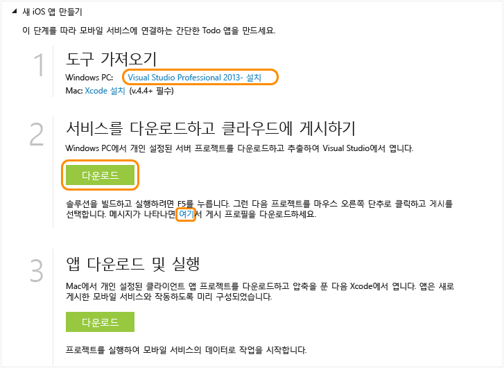

<properties pageTitle="Get Started with Azure Mobile Services for iOS apps" metaKeywords="Azure iOS application, mobile service iOS, getting started Azure iOS" description="Follow this tutorial to get started using Azure Mobile Services for iOS development. " metaCanonical="" services="" documentationCenter="Mobile" title="Get started with Mobile Services" authors="glenga" solutions="" manager="" editor="" />

모바일 서비스 시작
==================

[Windows 스토어 C\#](/en-us/documentation/articles/mobile-services-dotnet-backend-windows-store-dotnet-get-started "Windows 스토어 C#") [Windows 스토어 JavaScript](/en-us/documentation/articles/mobile-services-dotnet-backend-windows-store-javascript-get-started "Windows 스토어 JavaScript") [Windows Phone](/en-us/documentation/articles/mobile-services-dotnet-backend-windows-phone-get-started "Windows Phone") [iOS](/en-us/documentation/articles/mobile-services-dotnet-backend-ios-get-started "iOS") [Android](/en-us/documentation/articles/mobile-services-dotnet-backend-android-get-started "Android")

[.NET 백 엔드](/en-us/documentation/articles/mobile-services-dotnet-backend-ios-get-started/ ".NET 백 엔드") | [JavaScript 백 엔드](/en-us/documentation/articles/mobile-services-ios-get-started/ "JavaScript 백 엔드")

이 자습서는 Azure 모바일 서비스를 사용하여 iOS 앱에 클라우드 기반 백 엔드 서비스를 추가하는 방법을 보여 줍니다. 이 자습서에서는 새 모바일 서비스와 새 모바일 서비스에 앱 데이터를 저장하는 간단한 *할 일 모음* 앱을 둘 다 만듭니다. 만들게 될 모바일 서비스에서는 지원되는 .NET 언어를 사용하며, 서버 쪽 비즈니스 논리와 모바일 서비스 관리에 Visual Studio를 사용합니다. JavaScript를 사용하여 서버 쪽 비즈니스 논리를 작성하도록 지원하는 모바일 서비스를 만들려면 이 항목의 [JavaScript 백 엔드 버전](/en-us/documentation/articles/mobile-services-ios-get-started)을 참조하십시오.

완성된 앱의 스크린샷은 다음과 같습니다.

이 자습서를 완료하려면 XCode 4.5 및 iOS 5.0 이상 버전이 필요합니다.

**참고**

이 자습서를 완료하려면 Azure 계정이 필요합니다. 계정이 없는 경우 몇 분 만에 무료 평가판 계정을 만들 수 있습니다. 자세한 내용은 [Azure 무료 평가판](http://www.windowsazure.com/en-us/pricing/free-trial/?WT.mc_id=AE564AB28&returnurl=http%3A%2F%2Fwww.windowsazure.com%2Fen-us%2Fdevelop%2Fmobile%2Ftutorials%2Fget-started-ios%2F)을 참조하십시오.

새 모바일 서비스 만들기
-----------------------

[WACOM.INCLUDE [mobile-services-create-new-service](../includes/mobile-services-create-new-service.md)]

모바일 서비스를 로컬 컴퓨터로 다운로드
--------------------------------------

모바일 서비스를 만들었으면, 로컬 컴퓨터나 가상 컴퓨터에서 실행할 수 있는 개인화된 모바일 서비스 프로젝트를 다운로드하십시오.

1.  방금 만든 모바일 서비스를 클릭하고 빠른 시작 탭에서 **플랫폼 선택** 아래의 **iOS**를 클릭하고 **새 iOS 앱 만들기**를 확장합니다.

    

2.  아직 하지 않은 경우 Visual Studio Professional 2013 이상 버전을 다운로드하여 설치합니다.

3.  **서비스를 다운로드하고 클라우드에 게시** 아래에서 **다운로드**를 클릭합니다.

    모바일 서비스를 구현하는 Visual Studio 프로젝트가 다운로드됩니다. 압축된 프로젝트 파일을 로컬 컴퓨터에 저장하고 저장 위치를 기록해 둡니다.

4.  또한 게시 프로필을 다운로드하고, 다운로드한 파일을 로컬 컴퓨터에 저장하고, 저장 위치를 기록해 둡니다.

모바일 서비스 테스트
--------------------

[WACOM.INCLUDE [mobile-services-dotnet-backend-test-local-service](../includes/mobile-services-dotnet-backend-test-local-service.md)]

모바일 서비스 게시
------------------

[WACOM.INCLUDE [mobile-services-dotnet-backend-publish-service](../includes/mobile-services-dotnet-backend-publish-service.md)]

새 iOS 앱 만들기
----------------

이 섹션에서는 모바일 서비스에 연결된 새 iOS 앱을 만듭니다.

1.  관리 포털에서 **모바일 서비스**를 클릭한 후 방금 만든 모바일 서비스를 클릭합니다.

2.  빠른 시작 탭에서 **플랫폼 선택** 아래의 **iOS**를 클릭하고 **새 iOS 앱 만들기**를 확장합니다.

3.  아직 하지 않은 경우 [Xcode](https://go.microsoft.com/fwLink/p/?LinkID=266532) v4.4 이상 버전을 다운로드하여 설치합니다.

4.  **TodoItems 테이블 만들기**를 클릭하여 앱 데이터를 저장할 테이블을 만듭니다.

5.  **앱 다운로드 및 실행** 아래에서 **다운로드**를 클릭합니다.

  모바일 서비스 iOS SDK와 함께 모바일 서비스에 연결된 샘플 *할 일 모음* 응용 프로그램에 대한 프로젝트가 다운로드됩니다. 압축된 프로젝트 파일을 로컬 컴퓨터에 저장하고 저장 위치를 기록해 둡니다.

새 iOS 앱 실행
--------------

[WACOM.INCLUDE [mobile-services-ios-run-app](../includes/mobile-services-ios-run-app.md)]

Azure에서 실행 중인 모바일 서비스에 대해 새 클라이언트 앱을 실행하는 방법을 보여 줍니다. 로컬 컴퓨터에서 실행 중인 모바일 서비스로 iOS 앱을 테스트하려면 먼저 iOS 개발 컴퓨터에서 액세스할 수 있도록 웹 서버와 방화벽을 구성해야 합니다. 자세한 내용은 [로컬 모바일 서비스에 연결할 수 있도록 로컬 웹 서버 구성](/en-us/documentation/articles/mobile-services-dotnet-backend-how-to-configure-iis-express)을 참조하십시오.

