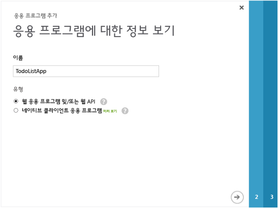
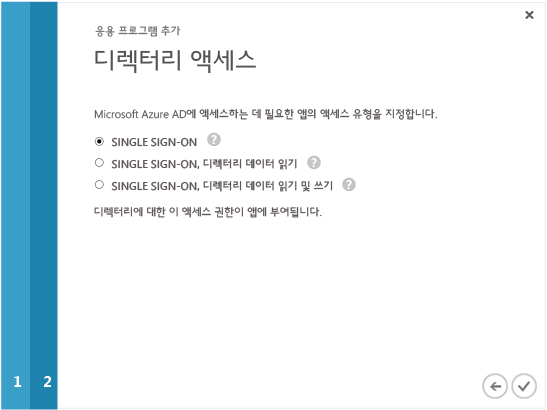
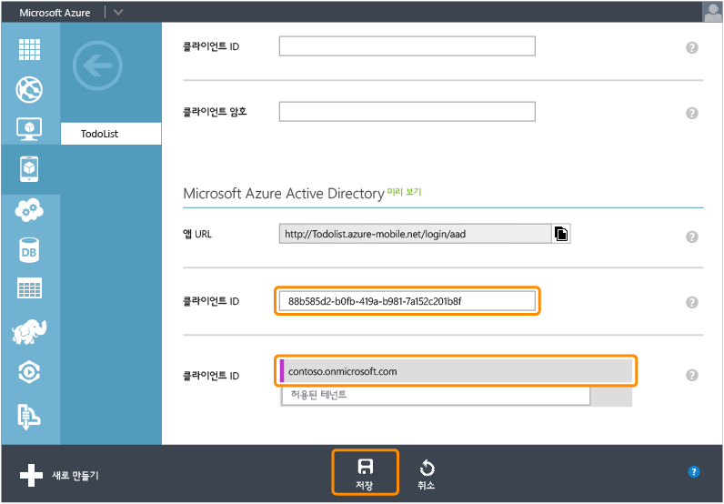

<properties linkid="develop-mobile-how-to-guides-register-for-active-directory-authentication" urlDisplayName="Register for Azure Active Directory Authentication" pageTitle="Register for Azure Active Directory authentication - Mobile Services" metaKeywords="Azure registering application, Azure Active Directory authentication, application authenticate, authenticate mobile services" description="Learn how to register for Azure Active Directory authentication in your Mobile Services application." title="Register your account to use an Azure Active Directory account login" authors="" />

Azure Active Directory 계정 로그인 사용을 위한 앱 등록
======================================================

이 항목에서는 Azure 모바일 서비스를 위한 인증 공급자로 Azure Active Directory를 사용할 수 있도록 앱을 등록하는 방법을 보여 줍니다.

> [WACOM.NOTE] 모바일 서비스를 위한 Azure Active Directory 인증 공급자는 현재 미리 보기에 있습니다. 미리 보기를 등록하려면 <mobileservices@microsoft.com>으로 문의하십시오. 그렇지 않으면 인증 공급자가 모바일 서비스의 `Identity` 탭에 표시되지 않습니다.

> [WACOM.NOTE] SSO(Single Sign-On) 또는 Windows 스토어 앱의 푸시 알림을 위해 클라이언트 기반 인증을 제공하려면 Windows 스토어에도 앱을 등록해야 합니다. 자세한 내용은 [Windows Live Connect 인증을 위해 Windows 스토어 앱 등록](/en-us/develop/mobile/how-to-guides/register-for-single-sign-on)을 참조하십시오.

1.  [Azure 관리 포털](https://manage.windowsazure.com/)에 로그온하여 **모바일 서비스**를 클릭한 후 해당 모바일 서비스를 클릭합니다.

    

2.  모바일 서비스의 **ID** 탭을 클릭합니다.

    

3.  **Azure active directory** ID 공급자 섹션까지 아래로 스크롤하여 나열된 **앱 URL**을 복사합니다.

    

4.  관리 포털에서 **Active Directory**로 이동한 다음 디렉터리를 클릭합니다.

    

5.  맨 위에 있는 **응용 프로그램** 탭을 클릭한 다음 앱을 클릭하여 **추가**합니다.

    

6.  **내 조직에서 개발 중인 응용 프로그램 추가**를 클릭합니다.

7.  응용 프로그램 추가 마법사에서 응용 프로그램의 **이름**을 입력하고 **웹 응용 프로그램 및/또는 웹 API** 유형을 클릭합니다. 계속하려면 클릭합니다.

    

8.  **로그온 URL** 상자에 모바일 서비스의 Active Directory ID 공급자 설정에서 복사한 앱 ID를 붙여넣습니다. 또한 **앱 ID URI** 상자에 URI를 입력합니다. 응용 프로그램에서는 URI를 사용하여 Single Sign-On 요청을 Azure Active Directory에 제출합니다. 계속하려면 클릭합니다.

    

9.  응용 프로그램에 대한 **Single Sign-On** 액세스 유형을 사용하려면 클릭합니다. 응용 프로그램 추가 마법사를 완료하려면 클릭합니다.

    

10. 응용 프로그램이 추가되면 맨 아래로 스크롤합니다. 그런 다음 **Enable your app to read or write directory data** 섹션을 클릭하여 확장합니다. 그런 다음 앱에 대한 **클라이언트 ID**를 클릭하여 복사합니다.

    

11. 모바일 서비스의 **ID** 탭으로 돌아갑니다. 맨 아래에 있는 Azure Active Directory ID 공급자에 대한 **클라이언트 ID** 설정에 붙여넣습니다. 그런 다음 **저장**을 클릭합니다.

    

이제 앱에서 인증하는 데 Azure Active Directory를 사용할 준비가 되었습니다.

