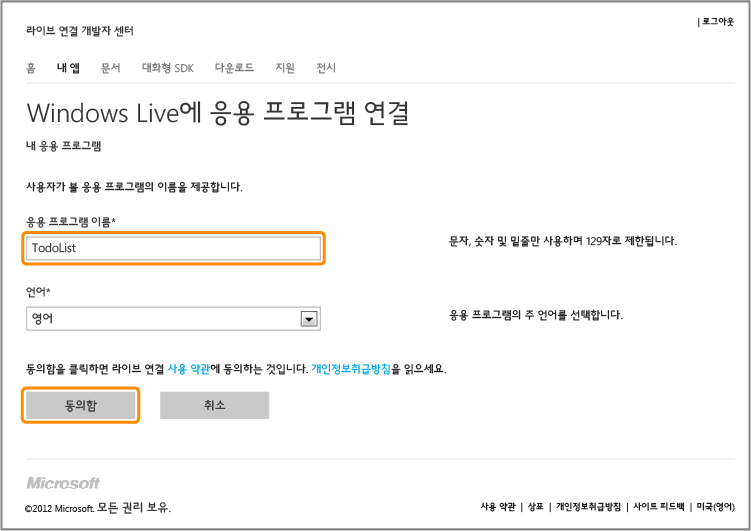
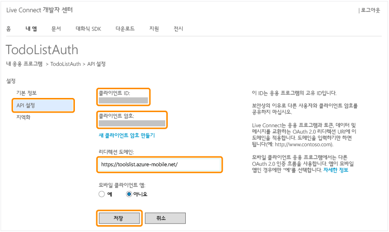

<properties pageTitle="Register for Microsoft authentication - Mobile Services" metaKeywords="Azure registering application, Azure Microsoft authentication, application authenticate, authenticate mobile services" description="Learn how to register for Microsoft authentication in your Azure Mobile Services application." metaCanonical="" disqusComments="0" umbracoNaviHide="1" title="Register your apps to use a Microsoft Account login" authors="" />

Microsoft 계정 로그인을 사용하도록 앱 등록
==========================================

이 항목에서는 Azure 모바일 서비스를 위한 인증 공급자로 Live Connect를 사용할 수 있도록 앱을 등록하는 방법을 보여 줍니다.

> [WACOM.NOTE] SSO(Single Sign-On) 또는 Windows 스토어 앱의 푸시 알림을 위해 클라이언트 기반 인증을 제공하려면 Windows 스토어에도 앱을 등록해야 합니다. 자세한 내용은 [Windows Live Connect 인증을 위해 Windows 스토어 앱 등록](/en-us/develop/mobile/how-to-guides/register-for-single-sign-on)을 참조하십시오.

1.  Live Connect 개발자 센터의 [내 응용 프로그램](http://go.microsoft.com/fwlink/p/?LinkId=262039) 페이지로 이동하고 필요한 경우 Microsoft 계정으로 로그온합니다.

2.  **응용 프로그램 만들기**를 클릭한 후 **응용 프로그램 이름**을 입력하고 **I accept**를 클릭합니다.

   	 

   	Live Connect를 사용하여 응용 프로그램을 등록합니다.

3.  **응용 프로그램 설정 페이지**를 클릭한 후 **API 설정**을 클릭하고 **클라이언트 ID** 및 **클라이언트 암호** 값을 기록해 둡니다.

   	

    
<b>보안 정보</b>
	
클라이언트 암호는 중요한 보안 자격 증명입니다. 다른 사람과 이 암호를 공유하거나 앱과 함께 배포하지 마십시오.

    

1.  **리디렉션 도메인**에서 모바일 서비스의 URL을 입력하고 **저장**을 클릭합니다.

이제 모바일 서비스에 클라이언트 ID 및 클라이언트 암호 값을 제공하여 앱에서 Microsoft 계정을 인증에 사용할 준비가 되었습니다.

