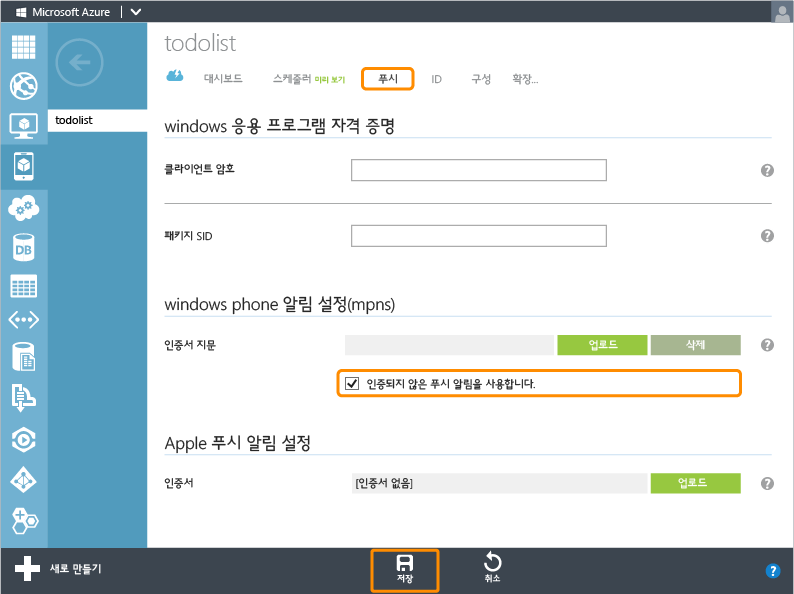

<properties pageTitle="Get started with push notifications (Windows Store) | Mobile Dev Center" metaKeywords="" description="Learn how to use Azure Mobile Services and Notification Hubs to send push notifications to your Windows Store app." metaCanonical="" services="mobile" documentationCenter="Mobile" title="Get started with push notifications in Mobile Services" authors="glenga" solutions="" manager="" editor="" />

모바일 서비스에서 푸시 알림 시작
================================

[Windows 스토어 C\#](/ko-kr/documentation/articles/mobile-services-javascript-backend-windows-store-dotnet-get-started-push "Windows 스토어 C#")[Windows 스토어 JavaScript](/ko-kr/documentation/articles/mobile-services-javascript-backend-windows-store-javascript-get-started-push "Windows 스토어 JavaScript")[Windows Phone](/ko-kr/documentation/articles/mobile-services-javascript-backend-windows-phone-get-started-push "Windows Phone")[iOS](/ko-kr/documentation/articles/mobile-services-ios-get-started-push "iOS")[Android](/ko-kr/documentation/articles/mobile-services-javascript-backend-android-get-started-push "Android")

[.NET 백 엔드](/ko-kr/documentation/articles/mobile-services-dotnet-backend-windows-phone-get-started-push/ ".NET 백 엔드") | [JavaScript 백 엔드](/ko-kr/documentation/articles/mobile-services-javascript-backend-windows-phone-get-started-push/ "JavaScript 백 엔드")

이 항목에서는 Azure 모바일 서비스를 사용하여 Windows 스토어 앱에 푸시 알림을 보내는 방법을 보여 줍니다. 이 자습서에서는 빠른 시작 프로젝트에 대한 Azure 알림 허브를 사용하여 푸시 알림을 사용하도록 설정합니다. 이 작업을 완료하면 레코드가 삽입될 때마다 모바일 서비스에서 알림 허브를 사용하여 푸시 알림을 전송합니다. 모바일 서비스를 통해 무료로 만드는 알림 허브는 모바일 서비스와 별도로 관리할 수 있으며, 다른 응용 프로그램과 서비스에서도 사용 가능합니다.

> [WACOM.NOTE]이 자습서에서는 모바일 서비스와 알림 허브의 통합에 대해 설명합니다. 이 작업은 현재 사전 검토 단계입니다. 기본적으로 알림 허브를 사용하여 푸시 알림을 보내는 기능은 JavaScript 백 엔드에서 사용되지 않습니다. 새 알림 허브를 만들었으면 통합 프로세스를 되돌릴 수 없습니다. iOS 및 Android용 푸시 알림은 현재 [이 항목 버전](/ko-kr/documentation/articles/mobile-services-windows-phone-get-started-push/)에서 설명한 기본 푸시 지원을 통해서만 사용 가능합니다.

이 자습서에서는 푸시 알림을 사용하도록 설정하는 다음 기본 단계를 단계별로 안내합니다.

1.  [알림 등록을 위해 앱 업데이트](#update-app)
2.  [푸시 알림을 전송하도록 서버 스크립트 업데이트](#update-scripts)
3.  [푸시 알림을 받기 위한 데이터 삽입](#test)

이 자습서는 모바일 서비스 quickstart를 기반으로 합니다. 이 자습서를 시작하기 전에 먼저 [모바일 서비스 시작하기](/ko-kr/documentation/articles/mobile-services-windows-phone-get-started) 또는 [데이터 시작하기](/ko-kr/documentation/articles/mobile-services-windows-phone-get-started-data)를 완료하여 프로젝트를 모바일 서비스에 연결해야 합니다. 모바일 서비스가 연결되지 않은 경우 푸시 알림 추가 마법사에서 대신 연결해줍니다.

알림 등록을 위해 앱 업데이트
----------------------------

앱에서 푸시 알림을 받을 수 있으려면 알림 채널을 등록해야 합니다.

1.  Visual Studio에서 App.xaml.cs 파일을 열고 다음 `using` 문을 추가합니다.

         using Microsoft.Phone.Notification;

2.  App.xaml.cs에 다음을 추가합니다.

         public static HttpNotificationChannel CurrentChannel { get; private set; }

         private void AcquirePushChannel()
         {
             CurrentChannel = HttpNotificationChannel.Find("MyPushChannel");

             if (CurrentChannel == null)
             {
                 CurrentChannel = new HttpNotificationChannel("MyPushChannel");
                 CurrentChannel.Open();
                 CurrentChannel.BindToShellToast();
             }

             CurrentChannel.ChannelUriUpdated +=
                 new EventHandler<NotificationChannelUriEventArgs>(async (o, args) =>
                 {

                     // Register for notifications using the new channel
                     await MobileService.GetPush()
                         .RegisterNativeAsync(CurrentChannel.ChannelUri.ToString());
                 });
         }

    이 코드는 WNS에서 앱의 ChannelURI를 검색한 후 해당 ChannelURI를 푸시 알림에 대해 등록합니다.

    > [WACOM.NOTE]이 자습서에서 모바일 서비스는 알림 메시지를 장치에 보냅니다. 타일 알림을 보내는 경우 채널에서 **BindToShellTile** 메서드를 대신 호출해야 합니다.

3.  App.xaml.cs에서 **Application\_Launching** 이벤트 처리기의 맨 위에 다음과 같은 새 **AcquirePushChannel** 메서드 호출을 추가합니다.

         AcquirePushChannel();

    이제 페이지가 로드될 때마다 등록이 요청됩니다. 등록 상태가 유지되도록 앱에서 주기적으로 등록할 수도 있습니다.

4.  **F5** 키를 눌러 앱을 실행합니다. 등록 키가 포함된 팝업 대화 상자가 표시됩니다.

5.  솔루션 탐색기에서 **속성**을 확장하고 WMAppManifest.xml 파일을 연 후 **기능** 탭을 클릭하고 **ID\_\_*CAP*\_\_PUSH\_NOTIFICATION** 기능이 선택되었는지 확인합니다.

  

  이제 앱에서 알림 메시지를 표시할 수 있습니다.

푸시 알림을 전송하도록 스크립트 업데이트
----------------------------------------

마지막으로 TodoItem 테이블에서 삽입 작업에 등록된 스크립트를 업데이트하여 알림을 보내야 합니다.

1.  **TodoItem**을 클릭하고 **스크립트**를 클릭한 후 **삽입**을 선택합니다.

  ![][10]

2.  삽입 함수를 다음의 코드로 바꾼 후 **저장**을 클릭합니다.

         function insert(item, user, request) {
         // Define a payload for the Windows Phone toast notification.
         var payload = '<?xml version="1.0" encoding="utf-8"?>' +
             '<wp:Notification xmlns:wp="WPNotification"><wp:Toast>' +
             '<wp:Text1>New Item</wp:Text1><wp:Text2>' + item.text + 
             '</wp:Text2></wp:Toast></wp:Notification>';
            
         request.execute({
             success: function() {
                 // If the insert succeeds, send a notification.
                push.mpns.send(null, payload, 'toast', 22, {
                     success: function(pushResponse) {
                         console.log("Sent push:", pushResponse);
                         request.respond();
                         },              
                         error: function(pushResponse) {
                             console.log("Error Sending push:", pushResponse);
                             request.respond(500, { error: pushResponse });
                             }
                         });
                     }
                 });      
         }

    삽입이 성공한 후 이 삽입 스크립트는 모든 Windows Phone 앱 등록에 푸시 알림(삽입된 항목의 텍스트와 함께)을 전송합니다.

3.  **푸시** 탭을 클릭하고 **인증되지 않은 푸시 알림을 사용하도록 설정합니다.**를 선택한 다음 **저장**을 클릭합니다.

  

    이렇게 하면 푸시 알림을 보낼 수 있도록 모바일 서비스가 인증되지 않은 모드에서 MPNS에 연결됩니다.

    > [WACOM.NOTE]이 자습서에서는 인증되지 않은 모드로 MPNS를 사용합니다. 이 모드에서 MPNS는 장치 채널로 전송할 수 있는 알림 수를 제한합니다. 이 제한을 제거하려면 **업로드**를 클릭하고 인증서를 선택하여 인증서를 생성 및 업로드해야 합니다. 인증서 생성에 대한 자세한 내용은 [Windows Phone의 푸시 알림을 보내도록 인증된 웹 서비스 설정](http://msdn.microsoft.com/ko-kr/library/windowsphone/develop/ff941099(v=vs.105).aspx)을 참조하십시오.

앱에서 푸시 알림 테스트
-----------------------

1.  Visual Studio에서 F5 키를 눌러 앱을 실행합니다.

2.  앱에서 "hello push" 텍스트를 텍스트 상자에 입력한 후 **저장**을 클릭합니다.

  ![][4]

  추가된 항목을 저장하기 위해 삽입 요청이 모바일 서비스로 전송됩니다. 응용 프로그램이 **hello push**라는 내용의 알림 메시지를 받게 됩니다.

다음 단계
---------

이 자습서에서는 Windows 스토어 앱에서 모바일 서비스의 데이터로 작업하기 위한 기본 사항에 대해 설명했습니다. 다음에는 이 자습서에서 만든 GetStartedWithData 앱을 기반으로 하는 다음 자습서 중 하나를 완료해보십시오.

-   [알림 허브 시작하기](/en-us/manage/services/notification-hubs/getting-started-windows-dotnet/)
   Windows 스토어 앱에서 알림 허브를 활용하는 방법에 대해 알아보십시오.

-   [구독자에게 알림 보내기](/en-us/manage/services/notification-hubs/breaking-news-dotnet/)
   관심이 있는 범주에 대해 푸시 알림을 등록하고 받아보는 방법에 대해 알아보십시오.

-   [사용자에게 알림 보내기](/en-us/manage/services/notification-hubs/notify-users/)
   모바일 서비스에서 장치와 상관없이 특정 사용자에게 푸시 알림을 보내는 방법에 대해 알아보십시오.

-   [사용자에게 플랫폼 간 알림 보내기](/en-us/manage/services/notification-hubs/notify-users-xplat-mobile-services/)
   백 엔드에 플랫폼 전용 페이로드를 마련할 필요 없이 템플릿을 사용하여 모바일 서비스에서 푸시 알림을 보내는 방법에 대해 알아보십시오.

다음의 모바일 서비스 항목에 대해서도 자세히 알아보십시오.

-   [데이터 시작하기](/ko-kr/documentation/articles/mobile-services-windows-phone-get-started-data)
   모바일 서비스를 사용하여 데이터를 저장 및 쿼리하는 방법에 대해 자세히 알아보십시오.

-   [인증 시작하기](/ko-kr/documentation/articles/mobile-services-windows-phone-get-started-users)
   Windows 계정으로 앱의 사용자를 인증하는 방법에 대해 알아보십시오.

-   [모바일 서비스 서버 스크립트 참조](http://go.microsoft.com/fwlink/?LinkId=262293)
   서버 스크립트의 등록 및 사용에 대해 자세히 알아보십시오.

-   [모바일 서비스 .NET 방법 개념 참조](/ko-kr/documentation/articles/mobile-services-windows-dotnet-how-to-use-client-library)
   .NET과 함께 모바일 서비스를 사용하는 방법에 대해 자세히 알아보십시오.

<!-- Images. -->
[1]: ./media/mobile-services-javascript-backend-windows-phone-get-started-push/mobile-app-enable-push-wp8.png
[2]: ./media/mobile-services-javascript-backend-windows-phone-get-started-push/mobile-quickstart-push1-wp8.png
[3]: ./media/mobile-services-javascript-backend-windows-phone-get-started-push/mobile-quickstart-push2-wp8.png
[4]: ./media/mobile-services-javascript-backend-windows-phone-get-started-push/mobile-quickstart-push3-wp8.png
[5]: ./media/mobile-services-javascript-backend-windows-phone-get-started-push/mobile-quickstart-push4-wp8.png
[10]: ./media/mobile-services-javascript-backend-windows-phone-get-started-push/mobile-insert-script-push2.png
[11]: ./media/mobile-services-javascript-backend-windows-phone-get-started-push/mobile-push-tab.png