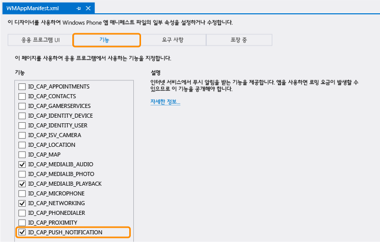

<properties pageTitle="Get started with push notifications (Windows Phone) | Mobile Dev Center" metaKeywords="" description="Learn how to use Azure Mobile Services to send push notifications to your Windows Phone app." metaCanonical="" services="" documentationCenter="Mobile" title="Get started with push notifications in Mobile Services" authors="glenga" solutions="" manager="" editor="" />

모바일 서비스에서 푸시 알림 시작
================================

[Windows 스토어 C\#](/ko-kr/documentation/articles/mobile-services-windows-store-dotnet-get-started-push "Windows 스토어 C#")[Windows 스토어 JavaScript](/ko-kr/documentation/articles/mobile-services-windows-store-javascript-get-started-push "Windows 스토어 JavaScript")[Windows Phone](/ko-kr/documentation/articles/mobile-services-windows-phone-get-started-push "Windows Phone")[iOS](/ko-kr/documentation/articles/mobile-services-ios-get-started-push "iOS")[Android](/ko-kr/documentation/articles/mobile-services-android-get-started-push "Android")[Xamarin.iOS](/ko-kr/documentation/articles/partner-xamarin-mobile-services-ios-get-started-push "Xamarin.iOS")[Xamarin.Android](/ko-kr/documentation/articles/partner-xamarin-mobile-services-android-get-started-push "Xamarin.Android")

[.NET 백 엔드](/ko-kr/documentation/articles/mobile-services-dotnet-backend-windows-phone-get-started-push/ ".NET 백 엔드") | [JavaScript 백 엔드](/ko-kr/documentation/articles/mobile-services-windows-phone-get-started-push/ "JavaScript 백 엔드")

이 토픽은 Azure 모바일 서비스를 사용하여 Windows Phone 8 앱에 푸시 알림을 보내는 방법을 보여 줍니다. 이 자습서에서는 MPNS(Microsoft 푸시 알림 서비스)를 사용하여 빠른 시작 프로젝트에 푸시 알림을 추가합니다. 완료하면 레코드가 삽입될 때마다 모바일 서비스에서 푸시 알림을 보냅니다.

> [WACOM.NOTE]이제 모바일 서비스가 Azure 알림 허브와 통합되어 템플릿, 여러 플랫폼, 크기 조정 등의 추가 푸시 알림 기능을 지원합니다. 이 통합 기능은 현재 Preview 상태입니다. 자세한 내용은 이 버전의 [푸시 알림 시작](/ko-kr/documentation/articles/mobile-services-javascript-backend-windows-phone-get-started-push/)을 참조하십시오.

이 자습서에서는 푸시 알림을 사용하도록 설정하는 다음 기본 단계를 단계별로 안내합니다.

1.  [Registrations 테이블 만들기](#create-table)
2.  [앱에 푸시 알림 추가](#add-push)
3.  [푸시 알림을 보내도록 스크립트 업데이트](#update-scripts)
4.  [알림을 받기 위해 데이터 삽입](#test)

이 자습서에는 [Visual Studio 2012 Express for Windows Phone](https://go.microsoft.com/fwLink/p/?LinkID=268374) 이상 버전이 필요합니다.

이 자습서는 모바일 서비스 빠른 시작을 기반으로 합니다. 이 자습서를 시작하기 전에 먼저 [모바일 서비스 시작](/en-us/develop/mobile/tutorials/get-started-wp8)을 완료해야 합니다.

> [WACOM.NOTE]매일 사용자당 500개 이상의 메시지를 보내는 경우 대신 알림 허브를 사용해야 합니다. 자세한 내용은 [알림 허브 시작](/en-us/manage/services/notification-hubs/getting-started-windows-dotnet/)을 참조하십시오.

새 테이블 만들기
----------------

[WACOM.INCLUDE [mobile-services-create-new-push-table](../includes/mobile-services-create-new-push-table.md)]

푸시 알림 추가앱에 푸시 알림 추가
---------------------------------

1.  Visual Studio에서 프로젝트 파일 MainPage.xaml.cs를 열고 새 **Registrations** 클래스를 만드는 다음 코드를 추가합니다.

         public class Registrations
         {
             public string Id { get; set; }

             [JsonProperty(PropertyName = "handle")]
             public string Handle { get; set; }
         }

    Handle 속성은 채널 URI를 저장하는 데 사용됩니다.

2.  App.xaml.cs 파일을 열고 다음 using 문을 추가합니다.

         using Microsoft.Phone.Notification;

3.  App.xaml.cs에 다음을 추가합니다.

         public static HttpNotificationChannel CurrentChannel { get; private set; }

         private void AcquirePushChannel()
         {
             CurrentChannel = HttpNotificationChannel.Find("MyPushChannel");

             if (CurrentChannel == null)
             {
                 CurrentChannel = new HttpNotificationChannel("MyPushChannel");
                 CurrentChannel.Open();
                 CurrentChannel.BindToShellTile();
             }
                      
            IMobileServiceTable<Registrations> registrationsTable = App.MobileService.GetTable<Registrations>();
            var registration = new Registrations { Handle = CurrentChannel.Uri };
            await registrationsTable.InsertAsync(registration);
         }

	This code acquires and stores a channel for a push notification subscription and binds it to the app's default tile.

    **참고**

    이 자습서에서 모바일 서비스는 대칭 이동 타일 알림을 장치에 보냅니다. 알림 메시지를 보내는 경우 채널에서 **BindToShellToast** 메서드를 대신 호출해야 합니다. 알림과 타일 알림을 둘 다 지원하려면 **BindToShellTile** 및 **BindToShellToast**를 둘 다 호출합니다.

4.  App.xaml.cs에서 **Application\_Launching** 이벤트 처리기의 맨 위에 다음과 같은 새 **AcquirePushChannel** 메서드 호출을 추가합니다.

         AcquirePushChannel();

    This guarantees that the **CurrentChannel** property is initialized each time the application is launched.

5.  솔루션 탐색기에서 **속성**을 확장하고 WMAppManifest.xml 파일을 연 후 **기능** 탭을 클릭하고 **ID\_\_*CAP*\_\_PUSH\_NOTIFICATION** 기능이 선택되었는지 확인합니다.

	
	
	이제 앱이 푸시 알림을 받을 수 있습니다.

삽입 스크립트 업데이트관리 포털에서 등록된 삽입 스크립트 업데이트
-----------------------------------------------------------------

[WACOM.INCLUDE [mobile-services-update-registrations-script](../includes/mobile-services-update-registrations-script.md)]

1.  **TodoItem**을 클릭하고 **스크립트**를 클릭한 후 **삽입**을 선택합니다.

    ![][10]

2.  insert 함수를 다음 코드로 바꾼 후 **저장**을 클릭합니다.

		function insert(item, user, request) {
    		request.execute({
                 success: function() {
                    request.respond();
                    sendNotifications();
                }
    		});

            function sendNotifications() {
                var registrationsTable = tables.getTable('Registrations');
                registrationsTable.read({
                    success: function(registrations) {
                        registrations.forEach(function(registration) {
                            push.mpns.sendFlipTile(registration.uri, {
                                title: item.text
                            }, {
                                success: function(pushResponse) {
                                    console.log("Sent push:", pushResponse);
                                }
                            });
                        });
                    }
                });
    		}

         }

    이 삽입 스크립트는 **Registrations** 테이블에 저장된 모든 채널에 삽입된 항목의 텍스트가 포함된 푸시 알림을 보냅니다.

앱 테스트앱에서 푸시 알림 테스트
--------------------------------

1.  Visual Studio의 **빌드** 메뉴에서 **솔루션 배포**를 선택합니다.

2.  에뮬레이터에서 왼쪽으로 살짝 밀어 설치된 앱 목록을 표시하고 새 **TodoList** 앱을 찾습니다.

3.  앱 아이콘을 길게 누르고 상황에 맞는 메뉴에서 **시작 화면에 고정**을 선택합니다.

	

	**TodoList**라는 타일이 시작 메뉴에 고정됩니다.

4.  **TodoList**라는 타일을 탭하여 앱을 시작합니다.

	

5.  앱에서 "hello push" 텍스트를 텍스트 상자에 입력한 후 **Save**를 클릭합니다.

    ![][4]

	추가된 항목을 저장하기 위해 삽입 요청이 모바일 서비스로 전송됩니다.

6.  **Start** 단추를 눌러 시작 메뉴로 돌아갑니다.

	

	응용 프로그램이 푸시 알림을 받고 이제 타일 제목이 **hello push**로 표시됩니다.

다음 단계
---------

이 자습서는 모바일 서비스에서 제공하는 기본 푸시 알림 기능을 보여 줍니다. 플랫폼 간 알림 보내기, 구독 기반 라우팅, 대량 볼륨 등의 고급 기능이 앱에 필요한 경우 모바일 서비스와 함께 Azure 알림 허브를 사용하는 것이 좋습니다. 자세한 내용은 다음과 같은 알림 허브 토픽 중 하나를 참조하십시오.

-   [알림 허브 시작](/en-us/manage/services/notification-hubs/get-started-notification-hubs-wp8/)
     Windows 스토어 앱에서 알림 허브를 활용하는 방법을 알아봅니다.

-   [알림 허브 정의](/en-us/develop/net/how-to-guides/service-bus-notification-hubs/)
     알림을 만들고 여러 플랫폼의 사용자에게 푸시하는 방법을 알아봅니다.

-   [구독자에게 알림 보내기](/en-us/manage/services/notification-hubs/breaking-news-wp8/)
     사용자가 관심 있는 범주에 대한 푸시 알림을 등록 및 수신하는 방법을 알아봅니다.

다음과 같은 모바일 서비스 토픽에 대해 자세히 알아보는 것이 좋습니다.

-   [데이터 시작](/en-us/develop/mobile/tutorials/get-started-with-data-wp8)
     모바일 서비스를 사용하여 데이터를 저장 및 쿼리하는 방법을 자세히 알아봅니다.

-   [인증 시작](/en-us/develop/mobile/tutorials/get-started-with-users-wp8)
     Windows 계정을 사용하여 앱 사용자를 인증하는 방법을 알아봅니다.

-   [모바일 서비스 서버 스크립트 참조](http://go.microsoft.com/fwlink/?LinkId=262293)
     서버 스크립트를 등록 및 사용하는 방법을 자세히 알아봅니다.

-   [모바일 서비스 .NET 방법 개념 참조](/en-us/develop/mobile/how-to-guides/work-with-net-client-library/)
     .NET과 함께 모바일 서비스를 사용하는 방법을 자세히 알아봅니다.

<!-- Anchors. -->
[Create the Registrations table]: #create-table
[Update scripts to send push notifications]: #update-scripts
[Add push notifications to the app]: #add-push
[Insert data to receive notifications]: #test
[Next Steps]:#next-steps

<!-- Images. -->
[1]: ./media/mobile-services-windows-phone-get-started-push/mobile-app-enable-push-wp8.png
[2]: ./media/mobile-services-windows-phone-get-started-push/mobile-quickstart-push1-wp8.png
[3]: ./media/mobile-services-windows-phone-get-started-push/mobile-quickstart-push2-wp8.png
[4]: ./media/mobile-services-windows-phone-get-started-push/mobile-quickstart-push3-wp8.png
[5]: ./media/mobile-services-windows-phone-get-started-push/mobile-quickstart-push4-wp8.png
[10]: ./media/mobile-services-windows-phone-get-started-push/mobile-insert-script-push2.png

<!-- URLs. -->
[Mobile Services SDK]: https://go.microsoft.com/fwLink/p/?LinkID=268375
[Visual Studio 2012 Express for Windows Phone]: https://go.microsoft.com/fwLink/p/?LinkID=268374
[Get started with Mobile Services]: /en-us/develop/mobile/tutorials/get-started-wp8
[Get started with data]: /en-us/develop/mobile/tutorials/get-started-with-data-wp8
[Get started with authentication]: /en-us/develop/mobile/tutorials/get-started-with-users-wp8
[Get started with push notifications]: /en-us/develop/mobile/tutorials/get-started-with-push-wp8
[Push notifications to app users]: /en-us/develop/mobile/tutorials/push-notifications-to-users-wp8
[Authorize users with scripts]: /en-us/develop/mobile/tutorials/authorize-users-in-scripts-wp8

[Azure Management Portal]: https://manage.windowsazure.com/
[mpns object]: http://go.microsoft.com/fwlink/p/?LinkId=271130
[Mobile Services server script reference]: http://go.microsoft.com/fwlink/?LinkId=262293
[Mobile Services .NET How-to Conceptual Reference]: /en-us/develop/mobile/how-to-guides/work-with-net-client-library/
[Get started with Notification Hubs]: /en-us/manage/services/notification-hubs/get-started-notification-hubs-wp8/
[What are Notification Hubs?]: /en-us/develop/net/how-to-guides/service-bus-notification-hubs/
[Send notifications to subscribers]: /en-us/manage/services/notification-hubs/breaking-news-wp8/
[Send notifications to users]: /en-us/manage/services/notification-hubs/notify-users/
[Send cross-platform notifications to users]: /en-us/manage/services/notification-hubs/notify-users-xplat-mobile-services/
