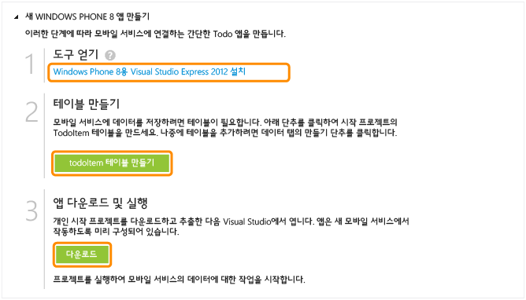

<properties pageTitle="Get Started with Azure Mobile Services for Windows Phone apps" metaKeywords="" description="Follow this tutorial to get started using Azure Mobile Services for Windows Phone development. " metaCanonical="" services="" documentationCenter="Mobile" title="Get started with Mobile Services" authors="glenga" solutions="" manager="" editor="" />

모바일 서비스 시작
==================

[Windows 스토어](/ko-kr/documentation/articles/mobile-services-windows-store-get-started "Windows 스토어")[Windows Phone](/ko-kr/documentation/articles/mobile-services-windows-phone-get-started "Windows Phone")[iOS](/ko-kr/documentation/articles/mobile-services-ios-get-started "iOS")[Android](/ko-kr/documentation/articles/mobile-services-android-get-started "Android")[HTML](/ko-kr/documentation/articles/mobile-services-html-get-started "HTML")[Xamarin.iOS](/ko-kr/documentation/articles/partner-xamarin-mobile-services-ios-get-started "Xamarin.iOS")[Xamarin.Android](/ko-kr/documentation/articles/partner-xamarin-mobile-services-android-get-started "Xamarin.Android")[Sencha](/ko-kr/documentation/articles/partner-sencha-mobile-services-get-started/ "Sencha")[PhoneGap](/ko-kr/documentation/articles/mobile-services-javascript-backend-phonegap-get-started/ "PhoneGap")

[.NET 백 엔드](/ko-kr/documentation/articles/mobile-services-dotnet-backend-windows-phone-get-started/ ".NET 백 엔드") | [JavaScript 백 엔드](/ko-kr/documentation/articles/mobile-services-windows-phone-get-started/ "JavaScript 백 엔드")

이 자습서는 Azure 모바일 서비스를 사용하여 Windows Phone 8 앱에 클라우드 기반 백 엔드 서비스를 추가하는 방법을 보여 줍니다. 이 자습서에서는 새 모바일 서비스와 새 모바일 서비스에 앱 데이터를 저장하는 간단한 *할 일 모음* 앱을 둘 다 만듭니다.

동영상을 시청하려는 경우 오른쪽에 있는 클립은 이 자습서와 동일한 단계를 따릅니다. 동영상에서 Nick Harris는 모바일 서비스를 소개한 후 첫 번째 모바일 서비스를 만들고 Windows 스토어 앱에서 해당 서비스에 연결하는 과정을 단계별로 안내합니다.

[자습서 보기](http://go.microsoft.com/fwlink/?LinkId=290816) [동영상 재생](http://go.microsoft.com/fwlink/?LinkId=290816) 13:18

이 자습서에서는 새 모바일 서비스와 새 모바일 서비스에 앱 데이터를 저장하는 간단한 *할 일 모음* 앱을 둘 다 만듭니다. 만드는 모바일 서비스는 서버 쪽 비즈니스 논리에 JavaScript를 사용합니다. Visual Studio를 사용하여 지원되는 .NET 언어로 서버 쪽 비즈니스 논리를 작성할 수 있게 해 주는 모바일 서비스를 만들려면 이 토픽의 [.NET 백 엔드 버전](/ko-kr/documentation/articles/mobile-services-dotnet-backend-windows-phone-get-started)을 참조하십시오.

완성된 앱의 스크린샷은 다음과 같습니다.

**참고**

이 자습서를 완료하려면 Azure 모바일 서비스 기능이 사용되는 Azure 계정이 필요합니다.

-   계정이 없는 경우 몇 분 만에 무료 평가판 계정을 만들 수 있습니다. 자세한 내용은 [Azure 무료 평가판](http://www.windowsazure.com/ko-kr/pricing/free-trial/?WT.mc_id=A30A4DDE2&returnurl=http%3A%2F%2FFen-us%2Fdocumentation%2Farticles%2Fmobile-services-windows-phone-get-started%2F)을 참조하십시오.

새 모바일 서비스 만들기
-----------------------

[WACOM.INCLUDE [mobile-services-create-new-service](../includes/mobile-services-create-new-service.md)]

새 앱 만들기새 Windows Phone 앱 만들기
-----------------------------------------------------------------------

모바일 서비스를 만든 후 관리 포털에서 쉬운 빠른 시작을 따라 모바일 서비스에 연결할 새 앱을 만들거나 기존 앱을 수정할 수 있습니다.

이 섹션에서는 모바일 서비스에 연결된 새 Windows Phone 8 앱을 만듭니다.

1.  관리 포털에서 **모바일 서비스**를 클릭한 후 방금 만든 모바일 서비스를 클릭합니다.

2.  빠른 시작 탭에서 **플랫폼 선택** 아래의 **Windows Phone 8**을 클릭하고 **새 Windows Phone 8 앱 만들기**를 확장합니다.

	![][6]
	
	This displays the three easy steps to create a Windows Phone app connected to your mobile service.

	

3.  아직 수행하지 않은 경우 로컬 컴퓨터에서 [Visual Studio 2012 Express for Windows Phone](https://go.microsoft.com/fwLink/p/?LinkID=268374)을 다운로드하여 설치합니다.

4.  **TodoItem 테이블 만들기**를 클릭하여 앱 데이터를 저장할 테이블을 만듭니다.

5.  **앱 다운로드 및 실행**에서 **다운로드**를 클릭합니다.

	모바일 서비스에 연결된 샘플 *할 일 모음* 응용 프로그램에 대한 프로젝트가 다운로드됩니다. 압축된 프로젝트 파일을 로컬 컴퓨터에 저장하고 저장 위치를 기록해 둡니다.

새 Windows Phone 앱 실행
------------------------

이 자습서의 최종 단계는 새 앱을 빌드하고 실행하는 것입니다.

1.  압축된 프로젝트 파일을 저장한 위치로 이동한 후 컴퓨터에서 파일 압축을 풀고 Visual Studio에서 솔루션 파일을 엽니다.

2.  **F5** 키를 눌러 프로젝트를 다시 빌드하고 앱을 시작합니다.

3.  앱에서 *Complete the tutorial* 등의 의미 있는 텍스트를 입력하고 **Save**를 클릭합니다.

    ![][10]

    This sends a POST request to the new mobile service hosted in Azure. Data from the request is inserted into the TodoItem table. Items stored in the table are returned by the mobile service, and the data is displayed in the list.

    > [WACOM.NOTE] 모바일 서비스에 액세스하여 데이터를 쿼리 및 삽입하는 코드를 검토할 수 있습니다. 이 코드는 MainPage.xaml.cs 파일에 있습니다.

4.  관리 포털로 돌아가서 **데이터** 탭을 클릭한 후 **TodoItems** 테이블을 클릭합니다.

    ![][11]

    This lets you browse the data inserted by the app into the table.

    ![][12]

다음 단계
---------

이제 빠른 시작을 완료했으며 모바일 서비스에서 중요한 추가 작업을 수행하는 방법을 알아보겠습니다.

-   [데이터 시작](/en-us/develop/mobile/tutorials/get-started-with-data-wp8)
     모바일 서비스를 사용하여 데이터를 저장 및 쿼리하는 방법을 자세히 알아봅니다.

-   [인증 시작](/en-us/develop/mobile/tutorials/get-started-with-users-wp8)
     ID 공급자를 사용하여 앱 사용자를 인증하는 방법을 알아봅니다.

-   [푸시 알림 시작](/en-us/develop/mobile/tutorials/get-started-with-push-wp8)
     기본적인 푸시 알림을 앱에 보내는 방법을 알아봅니다.

<!-- Anchors. -->
[Getting started with Mobile Services]:#getting-started
[Create a new mobile service]:#create-new-service
[Define the mobile service instance]:#define-mobile-service-instance
[Next Steps]:#next-steps

<!-- Images. -->
[0]: ./media/mobile-services-windows-phone-get-started/mobile-quickstart-completed-wp8.png

[6]: ./media/mobile-services-windows-phone-get-started/mobile-portal-quickstart-wp8.png
[7]: ./media/mobile-services-windows-phone-get-started/mobile-quickstart-steps-wp8.png
[8]: ./media/mobile-services-windows-phone-get-started/mobile-vs-project-wp8.png

[10]: ./media/mobile-services-windows-phone-get-started/mobile-quickstart-startup-wp8.png
[11]: ./media/mobile-services-windows-phone-get-started/mobile-data-tab.png
[12]: ./media/mobile-services-windows-phone-get-started/mobile-data-browse.png

<!-- URLs. -->
[Get started with data]: /en-us/develop/mobile/tutorials/get-started-with-data-wp8
[Get started with authentication]: /en-us/develop/mobile/tutorials/get-started-with-users-wp8
[Get started with push notifications]: /en-us/develop/mobile/tutorials/get-started-with-push-wp8
[Visual Studio 2012 Express for Windows Phone]: https://go.microsoft.com/fwLink/p/?LinkID=268374
[Mobile Services SDK]: https://go.microsoft.com/fwLink/p/?LinkID=268375

[Management Portal]: https://manage.windowsazure.com/
[.NET backend version]: /ko-kr/documentation/articles/mobile-services-dotnet-backend-windows-phone-get-started
