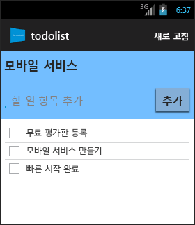
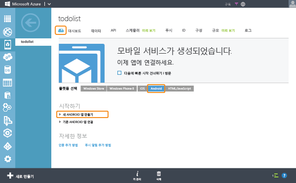

<properties
	pageTitle="Android 앱에 대해 Azure 모바일 서비스 시작(JavaScript 백 엔드)"
	description="이 자습서에 따라 Azure 모바일 서비스를 사용하여 Android 개발을 시작할 수 있습니다(JavaScript 백 엔드)."
	services="mobile-services"
	documentationCenter="android"
	authors="RickSaling"
	manager="dwrede"
	editor=""/>

<tags
	ms.service="mobile-services"
	ms.workload="mobile"
	ms.tgt_pltfrm="mobile-android"
	ms.devlang="java"
	ms.topic="article"
	ms.date="09/04/2015"
	ms.author="ricksal"/>

# Android에 대해 모바일 서비스 시작(JavaScript 백 엔드)

[AZURE.INCLUDE [mobile-services-selector-get-started](../../includes/mobile-services-selector-get-started.md)]

이 자습서는 Azure 모바일 서비스를 사용하여 Android 앱에 클라우드 기반 백 엔드 서비스를 추가하는 방법을 보여 줍니다. 이 자습서에서는 새 모바일 서비스와 새 모바일 서비스에 앱 데이터를 저장하는 간단한 **할 일 모음** 앱을 둘 다 만듭니다.

> [AZURE.VIDEO android-support-in-windows-azure-mobile-services]

완성된 앱의 스크린샷은 다음과 같습니다. 

## 필수 조건

이 자습서를 완료하려면 Android Studio 통합 개발 환경이 포함된 [Android 개발자 도구][Android Studio] 및 최신 Android 플랫폼이 필요합니다. Android 4.2 이상 버전이 필요합니다.

다운로드한 퀵 스타트 프로젝트에는 Android용 Azure 모바일 서비스 SDK가 포함되어 있습니다.

> [AZURE.IMPORTANT]이 자습서를 완료하려면 Azure 계정이 필요합니다. 계정이 없는 경우 몇 분 만에 무료 평가판 계정을 만들 수 있습니다. 자세한 내용은 [Azure 무료 체험](http://azure.microsoft.com/pricing/free-trial/?WT.mc_id=AE564AB28)을 참조하세요.

## 새 모바일 서비스 만들기

[AZURE.INCLUDE [mobile-services-create-new-service](../../includes/mobile-services-create-new-service.md)]

## 새 Android 앱 만들기

모바일 서비스를 만든 후 관리 포털에서 쉬운 빠른 시작을 따라 모바일 서비스에 연결할 새 앱을 만들거나 기존 앱을 수정할 수 있습니다.

이 섹션에서는 모바일 서비스에 연결된 새 Android 앱을 만듭니다.

1.  관리 포털에서 **모바일 서비스**를 클릭한 후 방금 만든 모바일 서비스를 클릭합니다.

2. 빠른 시작 탭에서 **플랫폼 선택** 아래의 **Android**를 클릭하고 **새 Android 앱 만들기**를 확장합니다.

   	

   	모바일 서비스에 연결된 Android 앱을 만드는 간편한 3단계가 표시됩니다.

  	

3. 아직 하지 않은 경우 로컬 컴퓨터나 가상 컴퓨터에서 [Android 개발자 도구][Android SDK]를 다운로드하여 설치합니다.

4. **TodoItem 테이블 만들기**를 클릭하여 앱 데이터를 저장할 테이블을 만듭니다.

5. 이제 앱을 다운로드합니다.
	- 최신 앱 버전에서는 모바일 서비스 Android SDK 2.0을 사용합니다. <a href="https://github.com/RickSaling/mobile-services-samples/tree/futures">여기</a>에서 해당 버전을 다운로드할 수 있습니다. **Zip 다운로드**를 클릭하고 압축을 풀면 Android 폴더 아래의 GettingStarted에 프로젝트가 추가됩니다.

	- 이전 버전에서는 이전 버전의 SDK를 사용합니다. 이를 사용하려면 **앱 다운로드 및 실행** 아래에서 **다운로드**를 클릭합니다. 모바일 서비스에 연결된 샘플 _할 일 모음_ 응용 프로그램에 대한 프로젝트가 다운로드됩니다. 프로젝트 파일은 압축되므로 해당 위치로 이동한 후 컴퓨터에 파일 압축을 풉니다.

## Android 앱 실행

[AZURE.INCLUDE [mobile-services-run-your-app](../../includes/mobile-services-android-get-started.md)]

### 코드 보기(선택 사항)

완성된 앱의 소스 코드를 참조하려면 [여기](https://github.com/RickSaling/mobile-services-samples/tree/androidStudio/GettingStarted/AndroidStudio)로 이동하세요.

이 자습서의 Eclipse 버전을 참조하려면 [시작(Eclipse)](mobile-services-android-get-started-ec.md)으로 이동하세요.

## 다음 단계
이제 빠른 시작을 완료했으며 모바일 서비스에서 중요한 추가 작업을 수행하는 방법을 알아보겠습니다.

* [데이터 시작]  모바일 서비스를 사용하여 데이터를 저장 및 쿼리하는 방법을 자세히 알아봅니다.

* [인증 시작]  ID 공급자를 사용하여 앱 사용자를 인증하는 방법을 알아봅니다.

* [푸시 알림 시작]  기본적인 푸시 알림을 앱에 보내는 방법을 알아봅니다.

<!-- Anchors. -->
[Getting started with Mobile Services]: #getting-started
[Create a new mobile service]: #create-new-service
[Define the mobile service instance]: #define-mobile-service-instance
[Next Steps]: #next-steps

<!-- Images. -->
[0]: ./media/mobile-services-android-get-started/mobile-quickstart-completed-android.png
[6]: ./media/mobile-services-android-get-started/mobile-portal-quickstart-android.png
[7]: ./media/mobile-services-android-get-started/mobile-quickstart-steps-android-AS.png
[8]: ./media/mobile-services-android-get-started/mobile-eclipse-quickstart.png
[10]: ./media/mobile-services-android-get-started/mobile-quickstart-startup-android.png
[11]: ./media/mobile-services-android-get-started/mobile-data-tab.png
[12]: ./media/mobile-services-android-get-started/mobile-data-browse.png
[14]: ./media/mobile-services-android-get-started/mobile-services-import-android-workspace.png
[15]: ./media/mobile-services-android-get-started/mobile-services-import-android-project.png

<!-- URLs. -->
[Get started (Eclipse)]: mobile-services-android-get-started-ec.md
[데이터 시작]: mobile-services-android-get-started-data.md
[인증 시작]: mobile-services-android-get-started-users.md
[푸시 알림 시작]: mobile-services-javascript-backend-android-get-started-push.md
[Android SDK]: https://go.microsoft.com/fwLink/p/?LinkID=280125
[Android Studio]: https://developer.android.com/sdk/index.html
[Mobile Services Android SDK]: https://go.microsoft.com/fwLink/p/?LinkID=266533

[Management Portal]: https://manage.windowsazure.com/

<!---HONumber=Sept15_HO2-->