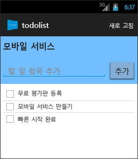

<properties
	pageTitle="Android 앱에 대해 Azure 모바일 서비스 시작"
	description="이 자습서에 따라 Azure 모바일 서비스를 사용하여 Android 개발을 시작할 수 있습니다."
	services="mobile-services"
	documentationCenter="android"
	authors="RickSaling"
	manager="erikre"
	editor=""/>

<tags
	ms.service="mobile-services"
	ms.workload="mobile"
	ms.tgt_pltfrm="mobile-android"
	ms.devlang="java"
	ms.topic="get-started-article"
	ms.date="07/21/2016"
	ms.author="ricksal"/>

# 모바일 서비스 시작

[AZURE.INCLUDE [mobile-services-selector-get-started](../../includes/mobile-services-selector-get-started.md)]

&nbsp;

[AZURE.INCLUDE [mobile-service-note-mobile-apps](../../includes/mobile-services-note-mobile-apps.md)]
> 이 항목에 해당하는 모바일 앱 버전은 [Azure 모바일 앱에서 Android 앱 만들기](../app-service-mobile/app-service-mobile-android-get-started.md)를 참조하세요.

이 자습서는 Azure 모바일 서비스를 사용하여 Android 앱에 클라우드 기반 백 엔드 서비스를 추가하는 방법을 보여 줍니다. 이 자습서에서는 새 모바일 서비스와 새 모바일 서비스에 앱 데이터를 저장하는 간단한 _할 일 모음_ 앱을 둘 다 만듭니다. 생성되는 모바일 서비스에서는 Visual Studio에서 지원되는 .NET 언어를 서버 쪽 비즈니스 논리와 모바일 서비스 관리에 사용합니다. JavaScript에서 서버 쪽 비즈니스 논리를 작성할 수 있게 해 주는 모바일 서비스를 만들려면 이 항목의 [JavaScript 백 엔드 버전](mobile-services-android-get-started.md)을 참조하세요.

완성된 앱의 스크린샷은 다음과 같습니다.

이 자습서를 완료하려면 Android Studio 통합 개발 환경이 포함된 [Android 개발자 도구][Android Studio] 및 최신 Android 플랫폼이 필요합니다. Android 4.2 이상 버전이 필요합니다.

다운로드한 퀵 스타트 프로젝트에는 Android용 모바일 서비스 SDK가 포함되어 있습니다.

> [AZURE.IMPORTANT] 이 자습서를 완료하려면 Azure 계정이 필요합니다. 계정이 없는 경우 Azure 평가판을 등록하고 최대 10개의 무료 모바일 서비스를 사용할 수 있습니다. 이러한 서비스는 평가판 사용 기간이 끝난 후에도 계속 사용할 수 있습니다. 자세한 내용은 [Azure 무료 체험](https://azure.microsoft.com/pricing/free-trial/?WT.mc_id=AE564AB28)을 참조하십시오.

## 새 모바일 서비스 만들기

[AZURE.INCLUDE [mobile-services-dotnet-backend-create-new-service](../../includes/mobile-services-dotnet-backend-create-new-service.md)]

## 로컬 컴퓨터에 모바일 서비스 다운로드

모바일 서비스를 만들었으므로 이제 로컬 컴퓨터 또는 가상 컴퓨터에서 실행할 수 있는 개인 설정된 모바일 서비스 프로젝트를 다운로드합니다.

1. 방금 만든 모바일 서비스를 클릭한 다음 빠른 시작 탭에서 **플랫폼 선택** 아래의 **Android**를 클릭하고 **새 Android 앱 만들기**를 확장합니다.

	![][1]

2. 아직 하지 않은 경우 [Visual Studio Professional 2013](https://go.microsoft.com/fwLink/p/?LinkID=391934) 이상 버전을 다운로드하여 설치합니다.

3. 2단계에서 **서비스를 다운로드하고 클라우드에 게시** 아래의 **다운로드**를 클릭합니다.

	모바일 서비스를 구현하는 Visual Studio 프로젝트가 다운로드됩니다. 압축된 프로젝트 파일을 로컬 컴퓨터에 저장하고 저장 위치를 기록해 둡니다.

## 모바일 서비스 테스트

[AZURE.INCLUDE [mobile-services-dotnet-backend-test-local-service](../../includes/mobile-services-dotnet-backend-test-local-service.md)]

## 모바일 서비스 게시

[AZURE.INCLUDE [mobile-services-dotnet-backend-publish-service](../../includes/mobile-services-dotnet-backend-publish-service.md)]

## 새 Android 앱 만들기

이 섹션에서는 모바일 서비스에 연결된 새 Android 앱을 만듭니다.

1. [Azure 클래식 포털]에서 **모바일 서비스**를 클릭한 후 방금 만든 모바일 서비스를 클릭합니다.

2. 빠른 시작 탭에서 **플랫폼 선택** 아래의 **Android**를 클릭하고 **새 Android 앱 만들기**를 확장합니다.

	![][2]

3. 아직 하지 않은 경우 로컬 컴퓨터나 가상 컴퓨터에서 [Android 개발자 도구][Android SDK]를 다운로드하여 설치합니다.

4. **Download and run your app** 아래에서 **다운로드**를 클릭합니다.

  	모바일 서비스에 연결된 샘플 _할 일 모음_ 응용 프로그램에 대한 프로젝트가 다운로드됩니다. 압축된 프로젝트 파일을 로컬 컴퓨터에 저장하고 저장 위치를 기록해 둡니다.

## Android 앱 실행

[AZURE.INCLUDE [mobile-services-run-your-app](../../includes/mobile-services-android-get-started.md)]

## 다음 단계
이제 퀵 스타트를 완료했으며 모바일 서비스에서 중요한 추가 작업을 수행하는 방법을 알아보겠습니다.

* [앱에 푸시 알림 추가]  기본적인 푸시 알림을 앱에 보내는 방법을 알아봅니다.

* [앱에 인증 추가]  앱의 특정 등록된 사용자에 대한 백 엔드 데이터에 액세스를 제한하는 방법을 알아봅니다.

* [모바일 서비스 .NET 백 엔드 문제 해결]   모바일 서비스 .NET 백 엔드에서 발생할 수 있는 문제를 진단 및 해결하는 방법을 알아봅니다.

<!-- Anchors. -->
[Getting started with Mobile Services]: #getting-started
[Create a new mobile service]: #create-new-service
[Define the mobile service instance]: #define-mobile-service-instance
[Next Steps]: #next-steps

<!-- Images. -->
[0]: ./media/mobile-services-dotnet-backend-android-get-started/mobile-quickstart-completed-android.png
[1]: ./media/mobile-services-dotnet-backend-android-get-started/mobile-quickstart-steps-vs-AS.png
[2]: ./media/mobile-services-dotnet-backend-android-get-started/mobile-quickstart-steps-android-AS.png

[6]: ./media/mobile-services-dotnet-backend-android-get-started/mobile-portal-quickstart-android.png
[7]: ./media/mobile-services-dotnet-backend-android-get-started/mobile-quickstart-steps-android.png
[8]: ./media/mobile-services-dotnet-backend-android-get-started/mobile-eclipse-quickstart.png

[10]: ./media/mobile-services-dotnet-backend-android-get-started/mobile-quickstart-startup-android.png
[11]: ./media/mobile-services-dotnet-backend-android-get-started/mobile-data-tab.png
[12]: ./media/mobile-services-dotnet-backend-android-get-started/mobile-data-browse.png

[14]: ./media/mobile-services-dotnet-backend-android-get-started/mobile-services-import-android-workspace.png
[15]: ./media/mobile-services-dotnet-backend-android-get-started/mobile-services-import-android-project.png

<!-- URLs. -->
[Get started (Eclipse)]: mobile-services-dotnet-backend-android-get-started-ec.md
[앱에 푸시 알림 추가]: mobile-services-dotnet-backend-android-get-started-push.md
[앱에 인증 추가]: mobile-services-dotnet-backend-android-get-started-auth.md
[Android SDK]: https://go.microsoft.com/fwLink/p/?LinkID=280125
[Android Studio]: https://developer.android.com/sdk/index.html
[Mobile Services Android SDK]: https://go.microsoft.com/fwLink/p/?LinkID=266533
[모바일 서비스 .NET 백 엔드 문제 해결]: mobile-services-dotnet-backend-how-to-troubleshoot.md

[Azure 클래식 포털]: https://manage.windowsazure.com/

<!---HONumber=AcomDC_0727_2016-->