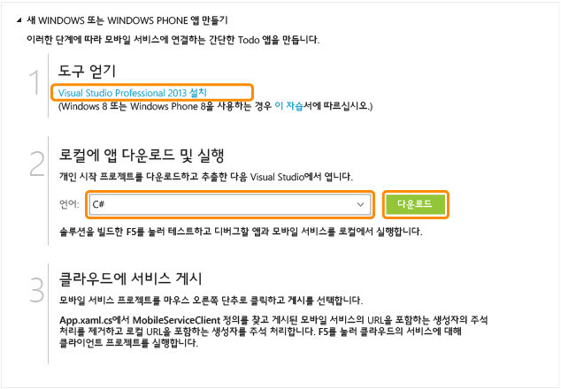

<properties
	pageTitle="Windows 유니버설 앱을 위한 모바일 서비스 시작 | Microsoft Azure"
	description="이 자습서에 따라 Azure 모바일 서비스를 사용하여 C#에서 유니버설 Windows 앱을 개발할 수 있습니다."
	services="mobile-services"
	documentationCenter="windows"
	authors="ggailey777"
	manager="dwrede"
	editor=""/>

<tags
	ms.service="mobile-services"
	ms.workload="mobile"
	ms.tgt_pltfrm="mobile-windows"
	ms.devlang="dotnet"
	ms.topic="hero-article" 
	ms.date="10/02/2015"
	ms.author="glenga"/>

# 모바일 서비스 시작

[AZURE.INCLUDE [mobile-services-selector-get-started](../../includes/mobile-services-selector-get-started.md)]&nbsp;

[AZURE.INCLUDE [mobile-services-hero-slug](../../includes/mobile-services-hero-slug.md)]
 
이 자습서에서는 Azure 모바일 서비스를 사용하여 범용 Windows 앱에 클라우드 기반 백 엔드 서비스를 추가하는 방법을 보여 줍니다. 유니버설 Windows 앱 솔루션에는 Windows 스토어 8.1 및 Windows Phone 스토어 8.1 앱용 프로젝트와 공통 공유 프로젝트가 포함됩니다. 자세한 내용은 [Windows 및 Windows Phone을 대상으로 하는 범용 Windows 앱 작성](http://msdn.microsoft.com/library/windows/apps/xaml/dn609832.aspx)을 참조하세요.

이 자습서에서는 새 모바일 서비스와 새 모바일 서비스에 앱 데이터를 저장하는 간단한 *할 일 모음* 앱을 둘 다 만듭니다. 생성되는 모바일 서비스에서는 Visual Studio에서 지원되는 .NET 언어를 서버 쪽 비즈니스 논리와 모바일 서비스 관리에 사용합니다. JavaScript에서 서버 쪽 비즈니스 논리를 작성하는 데 사용할 수 있는 모바일 서비스를 만들려면 이 항목의 JavaScript 백 엔드 버전을 참조하세요.

>[AZURE.NOTE]이 항목에서는 Azure 관리 포털을 사용하여 새 모바일 서비스 프로젝트 및 유니버설 Windows 앱을 만드는 방법을 보여 줍니다. Visual Studio 2013 업데이트 3를 사용하면 기존 Visual Studio 솔루션에 새 모바일 서비스 프로젝트를 추가할 수도 있습니다. 자세한 내용은 [기존 앱에 모바일 서비스 추가](mobile-services-dotnet-backend-windows-universal-dotnet-get-started-data.md)를 참조하세요.

>Windows Phone 8.0 또는 Windows Phone Silverlight 8.1 앱 프로젝트에 모바일 서비스를 추가하려면 [기존 Windows Phone 앱에 모바일 서비스 추가](mobile-services-dotnet-backend-windows-phone-get-started-data.md)를 참조하세요.

[AZURE.INCLUDE [mobile-services-windows-universal-get-started](../../includes/mobile-services-windows-universal-get-started.md)]

이 자습서를 완료하려면 다음이 필요합니다.

* 활성 Azure 계정. 계정이 없는 경우 Azure 평가판을 등록하고 최대 10개의 무료 모바일 서비스를 사용할 수 있습니다. 이러한 서비스는 평가판 사용 기간이 끝난 후에도 계속 사용할 수 있습니다. 자세한 내용은 [Azure 무료 체험](http://azure.microsoft.com/pricing/free-trial/?WT.mc_id=A0E0E5C02&amp;returnurl=http%3A%2F%2Fazure.microsoft.com%2Fko-KR%2Fdocumentation%2Farticles%2Fmobile-services-dotnet-backend-windows-store-dotnet-get-started%2F)을 참조하세요.
* [Visual Studio 2013].

## 새 모바일 서비스 만들기

[AZURE.INCLUDE [mobile-services-dotnet-backend-create-new-service](../../includes/mobile-services-dotnet-backend-create-new-service.md)]

## 새 유니버설 Windows 앱 만들기

모바일 서비스를 만든 후 관리 포털에서 쉬운 빠른 시작을 따라 모바일 서비스에 연결할 새 앱을 만들거나 기존 앱을 수정할 수 있습니다.

이 섹션에서는 모바일 서비스에 연결된 새 유니버설 Windows 앱을 만듭니다.

1. 관리 포털에서 **모바일 서비스**를 클릭한 후 방금 만든 모바일 서비스를 클릭합니다.

2. 빠른 시작 탭에서 **플랫폼 선택** 아래의 **Windows**를 클릭하고 **새 Windows 스토어 앱 만들기**를 확장합니다.

   	모바일 서비스에 연결된 Windows 스토어 앱을 만드는 간편한 세 가지 단계가 표시됩니다.

  	

3. 아직 수행하지 않은 경우 로컬 컴퓨터나 가상 컴퓨터에 [Visual Studio 2013]을 다운로드하여 설치합니다.

4. **앱 및 서비스를 로컬로 다운로드 및 실행**에서 Windows 스토어 앱의 언어를 선택하고 **다운로드**를 클릭합니다.

  	모바일 서비스 및 여기에 연결된 샘플 _할 일 모음_ 응용 프로그램 모두를 위한 프로젝트가 포함된 솔루션이 다운로드됩니다. 압축된 프로젝트 파일을 로컬 컴퓨터에 저장하고 저장 위치를 기록해 둡니다.

## 로컬 모바일 서비스에 대해 앱 테스트

[AZURE.INCLUDE [mobile-services-dotnet-backend-test-local-service-dotnet](../../includes/mobile-services-dotnet-backend-test-local-service-dotnet.md)]

>[AZURE.NOTE]모바일 서비스에 액세스하여 데이터를 쿼리 및 삽입하는 코드를 검토할 수 있습니다. 이 코드는 MainPage.xaml.cs 파일에 있습니다.

## 모바일 서비스 게시

[AZURE.INCLUDE [mobile-services-dotnet-backend-publish-service](../../includes/mobile-services-dotnet-backend-publish-service.md)]

<ol start="4">
<li>
공유 코드 프로젝트에서 App.xaml.cs 파일을 열어 <a href="http://msdn.microsoft.com/library/Windowsazure/microsoft.windowsazure.mobileservices.mobileserviceclient.aspx" target="_blank">MobileServiceClient</a> 인스턴스를 만드는 코드를 찾은 다음, <em>localhost</em>를 사용하여 이 클라이언트를 만드는 코드는 주석 처리하고 원격 모바일 서비스 URL을 사용하여 클라이언트를 만드는 코드는 주석 처리를 제거합니다. 결과는 다음과 같습니다.

        <pre><code>public static MobileServiceClient MobileService = new MobileServiceClient(
            "https://todolist.azure-mobile.net/",
            "XXXX-APPLICATION-KEY-XXXXX");</code></pre>

	
이제 클라이언트가 Azure에 게시된 모바일 서비스에 액세스할 수 있습니다.
</li>
</ol>

## Azure에서 호스트되는 모바일 서비스에 대해 앱 테스트

모바일 서비스가 게시되고 Azure에서 호스트되는 원격 모바일 서비스에 클라이언트가 연결되었으므로 이제 항목 저장소에 Azure를 사용하여 앱을 실행할 수 있습니다.

[AZURE.INCLUDE [mobile-services-windows-universal-test-app](../../includes/mobile-services-windows-universal-test-app.md)]

## 다음 단계
이제 퀵 스타트를 완료했으며 모바일 서비스에서 중요한 추가 작업을 수행하는 방법을 알아보겠습니다.

* [기존 앱에 모바일 서비스 추가][Get started with data]  모바일 서비스를 사용하여 데이터를 저장 및 쿼리하는 방법을 자세히 알아봅니다.

* [오프라인 데이터 동기화 시작]  오프라인 데이터 동기화를 활용하여 응답성과 견고성이 뛰어난 앱을 제작하는 방법을 알아봅니다.

* [모바일 서비스 앱에 인증 추가][Get started with authentication]  ID 공급자를 사용하여 앱 사용자를 인증하는 방법을 알아봅니다.

* [앱에 푸시 알림 추가][Get started with push notifications]  기본적인 푸시 알림을 앱에 보내는 방법을 알아봅니다.

* [모바일 서비스 .NET 백 엔드 문제 해결]   모바일 서비스 .NET 백 엔드에서 발생할 수 있는 문제를 진단 및 해결하는 방법을 알아봅니다.

범용 Windows 앱에 대한 자세한 내용은 [단일 모바일 서비스에서 여러 장치 플랫폼 지원](mobile-services-how-to-use-multiple-clients-single-service.md#shared-vs)을 참조하세요.

[AZURE.INCLUDE [app-service-disqus-feedback-slug](../../includes/app-service-disqus-feedback-slug.md)]

<!-- Anchors. -->

<!-- Images. -->

<!-- URLs. -->
[Visual Studio 2013]: https://go.microsoft.com/fwLink/p/?LinkID=257546
[Get started with data]: mobile-services-dotnet-backend-windows-universal-dotnet-get-started-data.md
[Get started with data]: ../mobile-services-dotnet-backend-windows-store-dotnet-get-started-data.md
[오프라인 데이터 동기화 시작]: mobile-services-windows-store-dotnet-get-started-offline-data.md
[Get started with authentication]: ../mobile-services-dotnet-backend-windows-store-dotnet-get-started-users.md
[Get started with push notifications]: ../mobile-services-dotnet-backend-windows-store-dotnet-get-started-push.md
[Visual Studio Professional 2013]: https://go.microsoft.com/fwLink/p/?LinkID=257546
[Mobile Services SDK]: http://go.microsoft.com/fwlink/?LinkId=257545
[JavaScript and HTML]: mobile-services-win8-javascript/
[Management Portal]: https://manage.windowsazure.com/
[모바일 서비스 .NET 백 엔드 문제 해결]: mobile-services-dotnet-backend-how-to-troubleshoot.md
 

<!---HONumber=Oct15_HO2-->