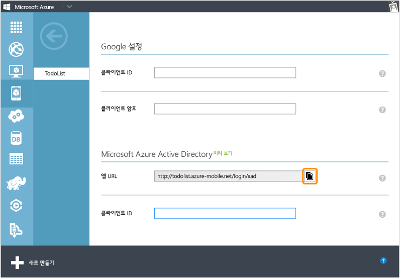
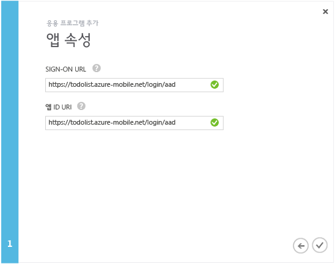

<properties 
	pageTitle="Azure Active Directory 인증 등록 | Azure 모바일 서비스" 
	description="모바일 서비스 응용 프로그램에서 Azure Active Directory 인증을 위해 등록하는 방법에 대해 알아봅니다." 
	authors="wesmc7777" 
	services="mobile-services" 
	documentationCenter="" 
	manager="dwrede" 
	editor=""/>

<tags 
	ms.service="mobile-services" 
	ms.workload="mobile" 
	ms.tgt_pltfrm="multiple" 
	ms.devlang="multiple" 
	ms.topic="article" 
	ms.date="06/15/2015" 
	ms.author="wesmc"/>

# Azure Active Directory 계정 로그인 사용을 위한 앱 등록

[AZURE.INCLUDE [mobile-services-selector-register-identity-provider](../../includes/mobile-services-selector-register-identity-provider.md)]

##개요

이 항목에서는 모바일 서비스를 위한 인증 공급자로 Azure Active Directory를 사용할 수 있도록 앱을 등록하는 방법을 보여 줍니다.

##앱 등록

>[AZURE.NOTE]이 항목에 설명된 단계는 앱에서 [서비스 지향 로그인 작업](http://msdn.microsoft.com/library/azure/dn283952.aspx)을 사용할 때 [모바일 서비스 앱에 인증 추가](../mobile-services-dotnet-backend-windows-store-dotnet-get-started-users.md) 자습서와 함께 사용하기 위해 작성되었습니다. 또는 앱이 Azure Active Directory 및 .NET 백 엔드 서비스에 대해 [클라이언트에서 지시하는 로그인 작업](http://msdn.microsoft.com/library/azure/jj710106.aspx)을 요구하는 경우 [Active Directory 인증 라이브러리 Single Sign-On으로 앱 인증](mobile-services-windows-store-dotnet-adal-sso-authentication.md) 자습서부터 시작해야 합니다.

1. [Azure 관리 포털]에 로그온하고 모바일 서비스로 이동한 후 **ID** 탭을 클릭한 다음 아래로 스크롤하여 **Azure Active Directory** ID 공급자 섹션으로 이동하고 표시되는 **앱 URL**을 복사합니다.

    

2. 관리 포털의 **Active Directory**로 이동한 후 디렉터리, **도메인**을 차례로 클릭하고 디렉터리의 기본 도메인을 적어둡니다.

3. **응용 프로그램** > **추가** > **내 조직에서 개발 중인 응용 프로그램 추가**를 클릭합니다.

4. 응용 프로그램 추가 마법사에서 응용 프로그램의 **이름**을 입력하고 **웹 응용 프로그램 및/또는 웹 API** 유형을 클릭합니다.

    

5. **로그온 URL** 상자에 모바일 서비스에서 복사한 앱 URL 값을 붙여 넣습니다. **앱 ID URI** 상자에 같은 고유 값을 입력하고 클릭하여 계속 진행합니다.
 
    

6. 응용 프로그램이 추가되면 **구성** 탭을 클릭하고 앱용 **클라이언트 ID**를 복사합니다.

    >[AZURE.NOTE].Net 백 엔드 모바일 서비스에 대해, 경로 _signin-aad_가 뒤에 추가되는 모바일 서비스의 URL이 되도록 **Single Sign-on** 아래의 **회신 URL** 값도 편집해야 합니다. 예: `https://todolist.azure-mobile.net/signin-aad`

7. 모바일 서비스의 **ID** 탭으로 돌아가 복사한 **클라이언트 ID** 값을 Azure Active Directory ID 공급자 값으로 붙여 넣습니다.
 
    

8.  **허용되는 테넌트** 목록에서 응용 프로그램을 등록한 디렉터리의 도메인을 입력합니다(예: `contoso.onmicrosoft.com`). 그런 후 **저장**을 클릭합니다.

이제 앱에서 인증하는 데 Azure Active Directory를 사용할 준비가 되었습니다.

<!-- Anchors. -->

<!-- Images. -->

<!-- URLs. -->
[Azure 관리 포털]: https://manage.windowsazure.com/

 

<!---HONumber=July15_HO4-->