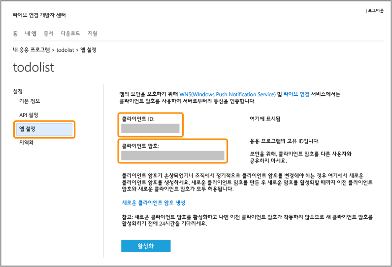

<properties
	pageTitle="Microsoft 인증 등록 | Microsoft Azure"
	description="Azure 모바일 서비스 응용 프로그램에서 Microsoft 인증을 위해 등록하는 방법을 알아봅니다."
	authors="ggailey777"
	services="mobile-services"
	documentationCenter="Mobile"
	manager="dwrede"
	editor=""/>

<tags 
	ms.service="mobile-services" 
	ms.workload="mobile" 
	ms.tgt_pltfrm="NA" 
	ms.devlang="multiple" 
	ms.topic="article" 
	ms.date="07/21/2016" 
	ms.author="glenga"/>

# 앱을 등록하여 Microsoft 계정을 인증에 사용

[AZURE.INCLUDE [mobile-service-note-mobile-apps](../../includes/mobile-services-note-mobile-apps.md)]

&nbsp;

[AZURE.INCLUDE [mobile-services-selector-register-identity-provider](../../includes/mobile-services-selector-register-identity-provider.md)]

## 개요

이 항목에서는 Azure 모바일 서비스와 함께 인증 공급자로 Microsoft 계정을 사용할 수 있도록 모바일 앱을 등록하는 방법을 보여줍니다. 동일한 단계로 Live SDK를 사용하여 서비스 지향 인증 및 클라이언트에서 지시하는 인증에 모두 적용합니다.

##Windows 개발자 센터에서 Windows 스토어 앱 등록

먼저 Windows 개발자 센터에 Windows 스토어 앱이 등록되어야 합니다. Windows 앱을 등록하면 Single Sign-On 동작을 사용할 수 있습니다.

>[AZURE.NOTE]Windows Phone 8, Windows Phone 8.1 Silverlight 및 비Windows 앱은 섹션을 건너뛸 수 있습니다.

1. 앱을 아직 등록하지 않은 경우 [Windows 개발자 센터](https://dev.windows.com/dashboard/Application/New)로 이동하여 Microsoft 계정으로 로그온한 후 앱 이름을 입력하고 **앱 이름 예약**을 클릭합니다.

3. Visual Studio에서 Windows 앱 프로젝트를 열고 솔루션 탐색기에서 Windows 스토어 앱 프로젝트를 마우스 오른쪽 단추로 클릭한 다음 **스토어** > **응용 프로그램을 스토어에 연결...**을 클릭합니다.

  	

5. 마법사에서 **로그인**을 클릭한 다음 Microsoft 계정으로 로그인하여 예약한 앱 이름을 선택하고 **다음** > **연결**을 클릭합니다.

6. (선택 사항) 유니버설 Windows 8.1 앱의 경우 Windows Phone 스토어 프로젝트에 대해 4~5단계를 반복합니다.

6. 새 앱의 Windows 개발자 센터 페이지로 돌아가서 **서비스** > **푸시 알림**을 클릭합니다.

7. **푸시 알림** 페이지에서 **WNS(Windows 푸시 알림 서비스) 및 Microsoft Azure 모바일 서비스** 아래의 **Live 서비스 사이트**를 클릭합니다.
 
	앱에 대한 Microsoft 계정 앱 설정 페이지를 표시합니다.

8. **패키지 SID** 값을 적어 둡니다. Azure 포털에 이 SID를 저장하면 Windows 앱에 Single Sign-On과 푸시 알림을 모두 사용할 수 있습니다.

다음으로 Windows 앱에 대한 Microsoft 계정 인증을 구성하는 네 가지 단계를 다음 섹션에서 시작합니다.

## Microsoft 계정 등록 구성 및 모바일 서비스에 연결

이전 섹션에서 이미 Windows 앱을 등록한 경우 2단계로 건너뛸 수 있습니다.

1. 비 Windows 스토어 앱의 경우, Microsoft 계정 개발자 센터의 [내 응용 프로그램](http://go.microsoft.com/fwlink/p/?LinkId=262039) 페이지로 이동하여 Microsoft 계정으로 로그온하고(필요한 경우), **응용 프로그램 만들기**를 클릭한 다음 **응용 프로그램 이름**을 입력하고 **동의함**을 클릭합니다.

   	이는 Microsoft 계정으로 앱 이름을 예약하고 앱에 대한 Microsoft 계정 페이지를 표시합니다.

2. 앱에 대한 Microsoft 계정 페이지에서 **API 설정**을 클릭하고 **모바일 또는 데스크톱 클라이언트 앱**을 사용하도록 설정합니다. 그런 다음 모바일 서비스 URL을 **대상 도메인**으로 설정하고 **리디렉션 URL**에서 다음 URL 형식 중 하나를 제공한 후 **저장**을 클릭합니다.

	+ **.NET 백 엔드**: `https://<mobile_service>.azure-mobile.net/signin-microsoft`
	+ **JavaScript 백 엔드**: `https://<mobile_service>.azure-mobile.net/login/microsoftaccount`

	 >[AZURE.NOTE]모바일 서비스 백 엔드 유형에 맞는 리디렉션 URL 경로 형식을 사용하고 있는지 확인합니다. 형식이 올바르지 않으면 인증이 실패합니다. **루트 도메인**이 자동으로 채워집니다. &nbsp;

    

4. **앱 설정**을 클릭하고 **클라이언트 ID**, **클라이언트 암호** 및 **패키지 SID** 값을 기록해 둡니다.

   	

    > [AZURE.NOTE] 클라이언트 암호는 중요한 보안 자격 증명입니다. 다른 사람과 클라이언트 암호를 공유하거나 앱과 함께 배포하지 마세요. Windows 스토어 앱 등록에서만 패키지 SID 필드가 보입니다.

4. [Azure 클래식 포털]에서 모바일 서비스에 대한 **ID** 탭을 클릭하고 ID 공급자로부터 얻은 클라이언트 ID, 클라이언트 암호 및 패키지 SID를 입력한 다음 **저장**을 클릭합니다.

	>[AZURE.NOTE]Windows Phone 8, Windows Phone 스토어 8.1 Silverlight 또는 비Windows 앱에 대한 패키지 SID 값을 제공할 필요가 없습니다.

이제 모바일 서비스와 앱이 모두 Microsoft 계정으로 동작하도록 구성되었습니다.

<!-- Anchors. -->

<!-- Images. -->

<!-- URLs. -->

[Submit an app page]: http://go.microsoft.com/fwlink/p/?LinkID=266582
[My Applications]: http://go.microsoft.com/fwlink/p/?LinkId=262039

[Azure 클래식 포털]: https://manage.windowsazure.com/

<!---HONumber=AcomDC_0727_2016-->