# Azure Monitor 시작
Azure Monitor는 Azure 리소스를 모니터링하는 단일 원본이 되는 플랫폼 서비스입니다. Azure에서 Azure Monitor를 통해 리소스의 메트릭과 로그에 대해 시각화, 쿼리, 라우팅, 보관 및 조치를 수행할 수 있습니다. Azure Portal, [Monitor PowerShell Cmdlet](insights-powershell-samples.md), [플랫폼 간 CLI](insights-cli-samples.md) 또는 [Azure Monitor REST API](https://msdn.microsoft.com/library/dn931943.aspx)를 사용하여 데이터 작업을 수행할 수 있습니다. 이 문서에서는 데모용 포털을 사용하여 Azure Monitor의 몇 가지 주요 구성 요소에 대해 살펴봅니다.

## 연습
1. 포털에서 **모든 서비스**로 이동하고 **모니터** 옵션을 찾습니다. 왼쪽 탐색 표시줄에서 항상 쉽게 액세스할 수 있게 별 모양 아이콘을 클릭하여 이 옵션을 즐겨찾기 목록에 추가합니다.

    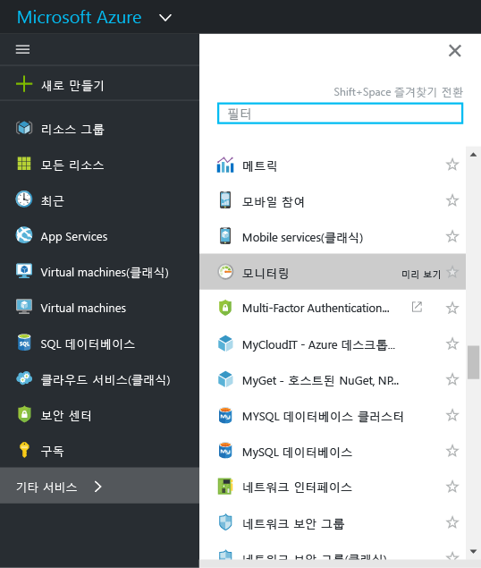
2. **모니터** 옵션을 클릭하여 **모니터** 페이지를 엽니다. 이 페이지에 모든 모니터링 설정과 데이터가 하나의 보기로 통합됩니다. 처음에는 **활동 로그** 섹션이 열립니다.

    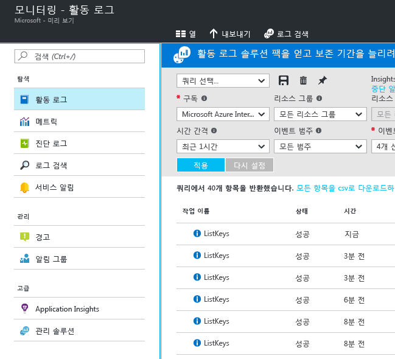

    Azure Monitor에는 데이터 모니터링의 3가지 기본 범주, 즉 **활동 로그**, **메트릭** 및 **진단 로그**가 있습니다.
3. **활동 로그** 를 클릭하여 활동 로그 섹션이 표시되는지 확인합니다.

    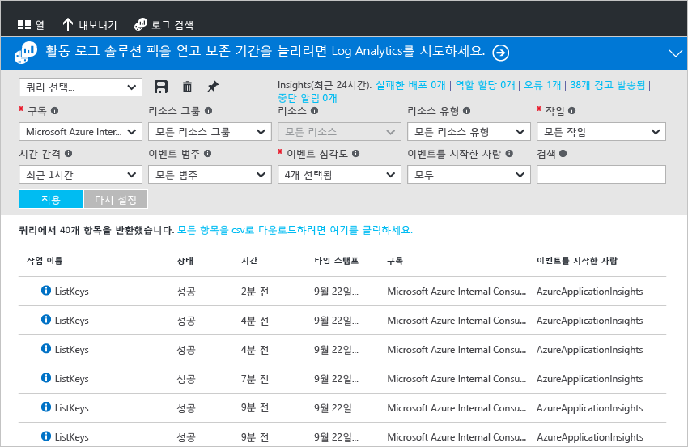

    [**활동 로그**](monitoring-overview-activity-logs.md)는 구독에서 리소스에 대해 수행한 모든 작업을 설명합니다. 구독에서 활동 로그를 통해 리소스에 수행된 만들기, 업데이트 또는 삭제 작업에 대해 ‘누가, 무엇을, 언제’를 판단할 수 있습니다. 예를 들어 활동 로그를 통해 웹앱이 중지된 시기와 웹앱을 중지한 사람을 알 수 있습니다. 활동 로그 이벤트는 90일 동안 플랫폼에 저장되어 쿼리에서 사용할 수 있습니다.

    공통 필터에 대한 쿼리를 만들어 저장한 다음 가장 중요한 쿼리를 포털 대시보드에 고정하면 기준에 부합하는 이벤트가 발생할 경우 항상 알 수 있습니다.
4. 지난 주의 특정 리소스 그룹에 대해 보기를 필터링한 다음 **저장** 단추를 클릭합니다. 쿼리에 이름을 지정합니다. 

    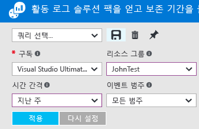
5. 이제 **고정** 단추를 클릭합니다.

    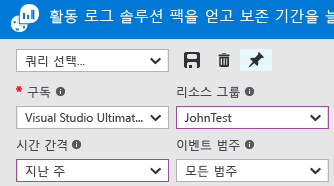

    이 연습의 보기 대부분을 대시보드에 고정할 수 있습니다. 이렇게 하면 서비스에 대한 운영 데이터 정보를 제공하는 단일 출처를 만들 수 있습니다.
6. 대시보드로 돌아갑니다. 이제 쿼리(및 결과 수)가 대시보드에 표시됩니다. 이러한 쿼리와 결과는 구독에서 최근에 발생한 상위 프로필 작업(예: 할당된 새 작업 또는 삭제된 VM)을 신속히 파악하려는 경우에 유용합니다.

    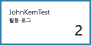
7. **모니터** 타일로 돌아가 **메트릭** 섹션을 클릭합니다. 먼저 페이지 맨 위에 있는 드롭다운 옵션을 통해 필터링하고 선택하여 리소스를 선택해야 합니다.

    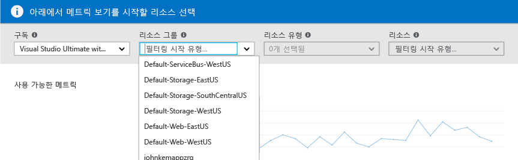

    모든 Azure 리소스에서 [**메트릭**](monitoring-overview-metrics.md)을 내보냅니다. 이 보기는 리소스에서 수행하는 방식을 쉽게 이해할 수 있도록 모든 메트릭을 단일 창에 모아 놓습니다. 또한 **메트릭(미리 보기)** 탭을 클릭하여 [새로운 메트릭 차트 환경](https://aka.ms/azuremonitor/new-metrics-charts)을 확인합니다.
8. 사용자가 리소스를 선택하면 모든 사용 가능한 메트릭이 페이지의 왼쪽에 표시됩니다. 메트릭을 선택하고 그래프 형식 및 시간 범위를 수정하면 여러 메트릭을 한 번에 차트로 표시할 수 있습니다. 이 리소스에 대해 설정한 모든 메트릭 경로도 확인할 수 있습니다.

    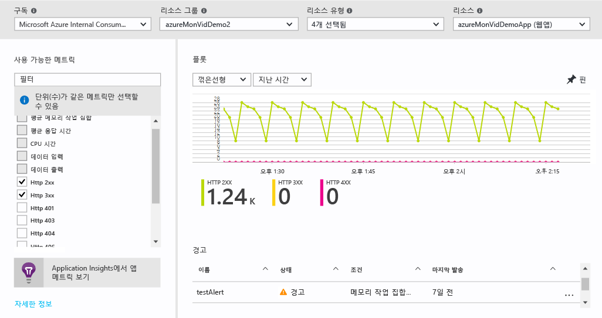

   > [!NOTE]
   > 일부 메트릭은 리소스에 대해 [Application Insights](../application-insights/app-insights-overview.md) 및/또는 Windows/Linux Azure 진단을 사용하도록 설정한 경우에만 사용할 수 있습니다.
   >
   >
9. 차트가 만족스러우면 **고정** 단추를 사용하여 대시보드에 고정합니다.
10. **모니터**로 돌아가서 **진단 로그**를 클릭합니다.

    

    [**진단 로그**](monitoring-overview-of-diagnostic-logs.md)는 특정 리소스의 작업 관련 데이터를 제공하는 *리소스에서* 내보낸 로그입니다. 예를 들어 네트워크 보안 그룹 규칙 카운터와 논리 앱 워크플로 로그는 모두 진단 로그의 형식입니다. 이러한 로그는 저장소 계정에 저장되고, 이벤트 허브로 스트리밍되며, [Log Analytics](../log-analytics/log-analytics-overview.md)로 보낼 수 있습니다. Log Analytics는 고급 검색 및 경고를 위한 Microsoft의 운영 인텔리전스 제품입니다.

    포털에서는 구독의 모든 리소스 목록을 확인 및 필터링하여 활성화된 진단 로그 유무를 파악할 수 있습니다.
11. 진단 로그 페이지에서 리소스를 클릭합니다. 진단 로그가 저장소 계정에 저장된 경우 직접 다운로드할 수 있는 시간별 로그 목록이 표시됩니다.

    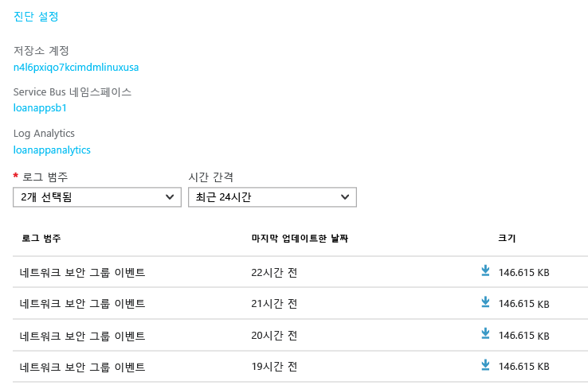

    저장소 계정에 대한 보관, Event Hubs로의 스트리밍 또는 Log Analytics 작업 영역에 보내기를 설정하거나 해당 설정을 수정할 수 있는 **진단 설정**를 클릭할 수도 있습니다.

    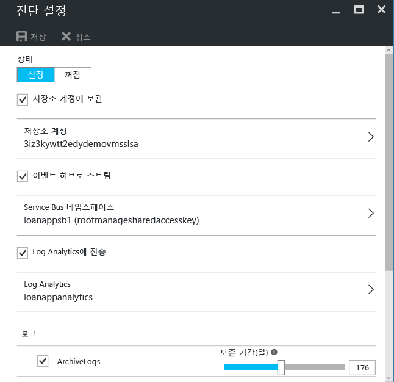

    Log Analytics에 대한 진단 로그를 설정한 후에는 포털의 **로그 검색** 섹션에서 검색할 수 있습니다.
12. 모니터 페이지의 **경고** 섹션으로 이동합니다.

    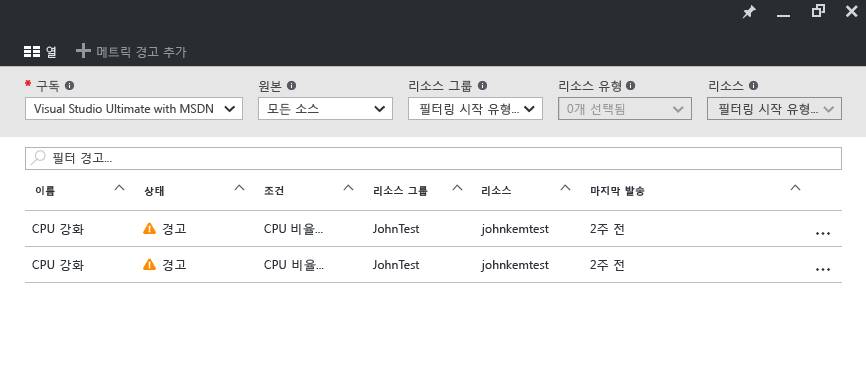

    여기서 Azure 리소스에 대한 모든 [**경고**](monitoring-overview-alerts.md)를 관리할 수 있습니다. 여기에는 메트릭, 활동 로그 이벤트, Application Insights 웹 테스트(위치) 및 Application Insights 사전 진단에 대한 경고가 포함됩니다. 경고는 전송될 이메일 또는 웹후크 URL에 대한 HTTP POST를 트리거할 수 있습니다.
13. 경고를 만들려면 **메트릭 경고 추가** 를 클릭합니다.

    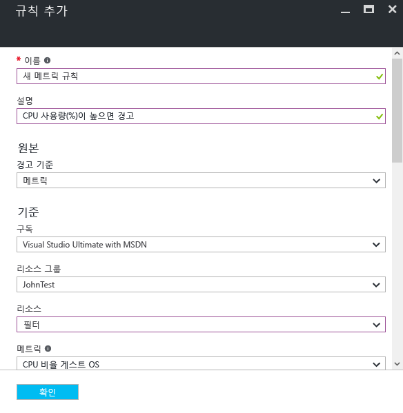

    그런 다음 대시보드에 경고를 고정하여 언제든 간편하게 상태를 확인할 수 있습니다.

    이제 Azure Monitor에는 1분이라는 낮은 빈도로 평가할 수 있는 [**근 실시간 메트릭 경고**](https://aka.ms/azuremonitor/near-real-time-alerts)(미리 보기)가 있습니다.
    
14. 모니터 섹션에는 [Application Insights](../application-insights/app-insights-overview.md) 응용 프로그램 및 [Log Analytics](../log-analytics/log-analytics-overview.md) 관리 솔루션에 대한 링크도 포함됩니다. 이러한 다른 Microsoft 제품은 Azure Monitor와 자연스럽게 통합됩니다.
15. Application Insights나 Log Analytics를 사용하지 않을 경우 기존 모니터링, 로깅, 경고 제품과 Azure Monitor를 함께 사용할 수 있습니다. 통합 방법에 대한 지침 및 전체 목록은 [파트너 페이지](monitoring-partners.md) 를 참조하세요.

다음 단계를 수행하고 모든 관련 타일을 대시보드에 고정하면 다음과 같이 응용 프로그램 및 인프라에 대한 통합 보기를 만들 수 있습니다.

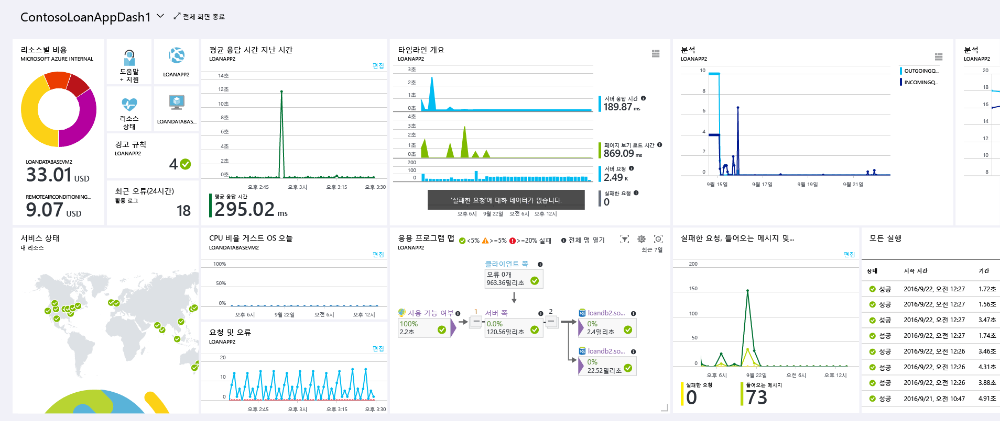

## 다음 단계
* [Azure Monitor 개요](monitoring-overview.md)
