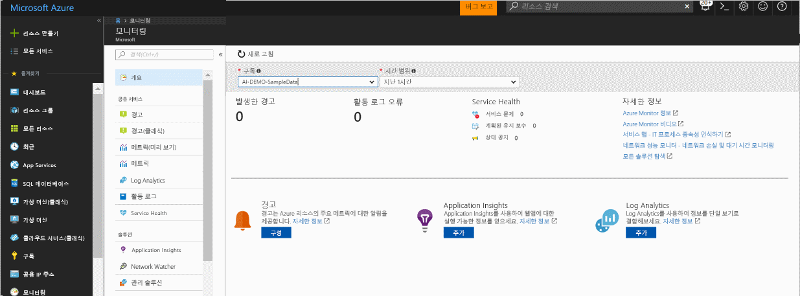
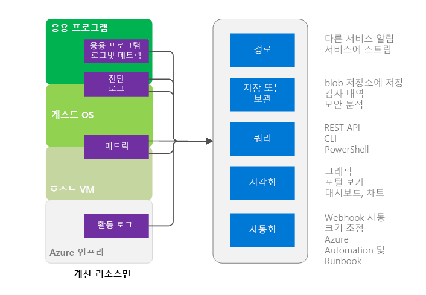
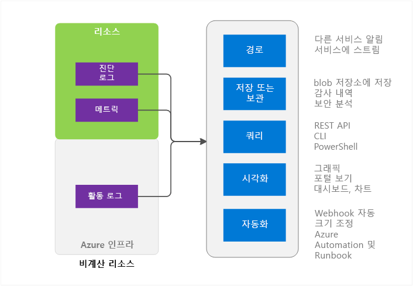

# Azure Monitor 개요
이 문서에서는 Microsoft Azure의 Azure Monitor 서비스에 대해 간략히 설명합니다. Azure Monitor 기능에 대해 설명하고 Azure Monitor를 사용하는 방법에 대한 추가 정보를 제공합니다.  소개하는 비디오를 사용하려면 이 문서의 아래쪽에 있는 다음 단계 링크를 참조하세요. 

## Azure Monitor 및 다른 Microsoft 모니터링 제품
Azure Monitor는 대부분의 Microsoft Azure 서비스에 대한 기본 수준의 인프라 메트릭과 로그를 제공합니다. 아직도 Azure Monitor에 데이터를 삽입하지 않는 Azure 서비스는 나중에 삽입할 것입니다.

Microsoft는 온-프레미스 설치도 사용하는 개발자, DevOps 또는 IT 작업에 추가 모니터링 기능을 제공하는 추가 제품과 서비스를 제공합니다. 이와 같이 다양한 제품과 서비스가 작동하는 방법에 대한 개요와 이해는 [Microsoft Azure 모니터링](monitoring-overview.md)을 참조하세요.

## 포털 개요 페이지

Azure Monitor의 기본 페이지를 통해 도움을 받을 수 있습니다. 
- Azure에서 제공하는 모니터링 기능을 이해합니다.
- Azure 플랫폼 및 프리미엄 모니터링 기능을 검색, 구성 및 등록합니다.

해당 페이지는 등록을 포함한 탐색을 위한 시작점이며 다른 서비스에서 큐레이트된 주목할 만한 문제를 표시하고 사용자가 상황에 맞게 이동할 수 있도록 합니다.
 

페이지를 열 때 읽기 액세스 권한이 있는 구독 중에 선택할 수 있습니다. 선택한 구독에서 다음을 확인할 수 있습니다.

- **트리거된 경고 및 경고 원본** - 이 표에서는 요약 수, 경고 원본 및 선택한 기간 동안 발생한 경고 횟수를 보여줍니다. 이전 및 최신 경고 모두에 적용됩니다. [최신 Azure Alerts](monitoring-overview-unified-alerts.md)에 대해 자세히 알아봅니다. 
- **활동 로그 오류** - Azure 리소스 중에 오류 수준의 심각도를 가진 이벤트가 기록된 경우 대략적인 수를 보고 활동 로그 페이지를 클릭하여 각 이벤트를 조사할 수 있습니다.
- **Azure Service Health** - Service Health 서비스 문제, 계획된 유지 관리 이벤트 및 상태 권고의 수를 확인할 수 있습니다. Azure Service Health는 Azure 인프라의 문제가 서비스에 영향을 줄 때 개인 설정된 정보를 제공합니다.  자세한 내용은 [Azure Service Health](../service-health/service-health-overview.md)를 참조하세요.  
- **Application Insights** - 현재 구독에서 각 AppInsights 리소스는 KPI를 참조하세요. KPI는 ASP.NET 웹앱, Java, Node 및 일반 응용 프로그램 유형인 서버 쪽 응용 프로그램 모니터링에 대해 최적화됩니다. KPI는 요청 속도, 응답 기간, 실패 속도 및 가용성 %에 대한 메트릭을 포함합니다. 

Log Analytics 또는 Application Insights에 등록하지 않았거나 현재 구독에서 Azure 경고를 구성하지 않은 경우 페이지에서는 온보딩 프로세스를 시작하는 링크를 제공합니다.

## Azure Monitor 원본 - Compute 하위 집합

Compute 서비스에는 다음이 포함됩니다. 
- Cloud Services 
- Virtual Machines 
- Virtual Machine 확장 집합 
- Service Fabric

### 응용 프로그램 - 진단 로그, 응용 프로그램 로그 및 메트릭
응용 프로그램은 계산 모델의 게스트 OS에서 실행될 수 있으며, 고유한 로그 및 메트릭 집합을 제공합니다. Azure Monitor는 Azure 진단 확장(Windows 또는 Linux)을 사용하여 대부분의 응용 프로그램 수준 메트릭과 로그를 수집합니다. 유형에는 다음이 포함됩니다.

* 성능 카운터
* 응용 프로그램 로그
* Windows 이벤트 로그
* .NET 이벤트 원본
* IIS 로그
* 매니페스트 기반 ETW
* 크래시 덤프
* 고객 오류 로그

진단 확장이 없으면 CPU 사용량과 같은 몇 가지 메트릭만 사용할 수 있습니다. 

### 호스트 및 게스트 VM 메트릭
앞에 나열된 계산 리소스에는 상호 작용하는 전용 호스트 VM과 게스트 OS가 있습니다. 호스트 VM 및 게스트 OS는 Hyper-V 하이퍼바이저 모델에서 루트 VM 및 게스트 VM과 동일합니다. 둘 다에서 메트릭을 수집할 수 있습니다. 또한 게스트 OS에서 진단 로그도 수집할 수 있습니다.   

### 활동 로그
Azure 인프라에 표시되는 대로 리소스에 대한 자세한 내용은 활동 로그(이전에 작업 또는 감사 로그라고도 함)를 검색할 수 있습니다. 이러한 로그는 리소스가 생성되거나 소멸된 시간과 같은 정보를 포함합니다.  자세한 내용은 [활동 로그 개요](monitoring-overview-activity-logs.md)를 참조하세요. 

## Azure Monitor 소스 - 기타 등등

### 리소스 - 메트릭 및 진단 로그
수집 가능한 메트릭과 진단 로그는 리소스 종류에 따라 다릅니다. 예를 들어 Web Apps는 디스크 IO 및 CPU 사용률에 대한 통계를 제공합니다. 이러한 메트릭은 큐 크기 및 메시지 처리량과 같은 메트릭을 대신 제공하는 Service Bus 큐에는 존재하지 않습니다. 각 리소스에 대해 수집 가능한 메트릭 목록은 [지원되는 메트릭](monitoring-supported-metrics.md)에서 제공됩니다. 

### 호스트 및 게스트 VM 메트릭
리소스와 특정 호스트 VM 또는 게스트 VM 간에는 일대일 매핑이 반드시 필요하지는 않으므로 메트릭을 사용할 수 없습니다.

### 활동 로그
활동 로그는 계산 리소스와 동일합니다.  

## 모니터링 데이터 사용
데이터를 수집하고 나면 Azure Monitor에서 다음 작업을 수행할 수 있습니다.

### 라우팅
모니터링 데이터를 다른 위치에 스트리밍할 수 있습니다. 

이러한 예로 다음이 포함됩니다.

- 다양한 시각화 및 분석 도구를 사용할 수 있도록 Application Insights에 보냅니다.
- 타사 도구로 라우팅할 수 있도록 Event Hubs로 보냅니다. 

### 저장 및 보관
일부 모니터링 데이터는 이미 설정된 시간 동안 Azure Monitor에 저장되어 사용할 수 있습니다. 
- 메트릭은 90일 동안 저장됩니다. 
- 활동 로그 항목은 90일 동안 저장됩니다. 
- 진단 로그는 전혀 저장되지 않습니다. 

데이터를 위에 나열된 기간보다 더 오래 저장하려면 Azure 저장소를 사용할 수 있습니다. 모니터링 데이터는 설정한 보존 정책에 따라 저장소 계정에 보관됩니다. Azure 저장소에서 데이터가 차지하는 공간에 대해 비용을 지불해야 합니다. 

이 데이터를 사용하는 몇 가지 방법은 다음과 같습니다.

- 기록된 경우 Azure 내부 또는 외부의 다른 도구를 사용하여 데이터를 읽고 처리할 수 있습니다.
- 로컬 보관을 위해 데이터를 로컬로 다운로드하거나, 연장된 기간 동안 데이터를 유지하기 위해 클라우드의 보존 정책을 변경할 수 있습니다.  
- 보관을 위해 Azure 저장소에 데이터를 무한정 그대로 둘 수 있습니다. 

### 쿼리
Azure Monitor REST API, 플랫폼 간 CLI(명령줄 인터페이스), PowerShell cmdlet 또는 .NET SDK를 사용하여 시스템 또는 Azure 저장소의 데이터에 액세스할 수 있습니다.

이러한 예로 다음이 포함됩니다.

* 작성한 사용자 지정 모니터링 응용 프로그램에 대한 데이터 가져오기
* 사용자 지정 쿼리를 만들고 이 데이터를 타사 응용 프로그램으로 보내기

### 시각화
모니터링 데이터를 그래픽과 차트로 시각화하면 데이터 자체를 살펴보는 것보다 훨씬 빠르게 추세를 파악할 수 있습니다.  

몇 가지 시각화 방법은 다음과 같습니다.

* Azure 포털 사용
* Azure Application Insights로 데이터 라우팅
* Microsoft PowerBI로 데이터 라우팅
* 라이브 스트리밍 또는 Azure 저장소의 보관 파일에서 데이터를 읽는 도구를 사용하여 타사 시각화 도구로 데이터 라우팅

### 자동화
> [!NOTE]
> Microsoft Azure에서 경고의 지속적인 변화의 일환으로, 이제 경고에 대한 통합된 환경을 사용할 수 있습니다. [새 Azure 경고](monitoring-overview-unified-alerts.md)에 대한 자세한 내용

Azure 경고에서 모니터링 데이터를 사용하여 경고를 트리거하거나 전체 프로세스를 트리거할 수 있습니다. 이러한 예로 다음이 포함됩니다.

* 데이터를 사용하여 응용 프로그램 부하에 따라 계산 인스턴스 크기를 자동으로 조정
* 메트릭 또는 로그 조건에 따라 이메일을 보냅니다. 
* 웹 URL(웹후크)을 호출하여 Azure 외부 시스템에서 동작 실행
* Azure 자동화에서 runbook을 시작하여 다양한 태스크 수행

## Azure Monitor에 액세스하는 방법
일반적으로 다음 방법 중 하나를 사용하여 데이터 추적, 라우팅 및 검색을 조작할 수 있습니다. 일부 방법은 일부 동작 및 데이터 형식에 사용할 수 없습니다.

* [Azure Portal](https://portal.azure.com)
* [PowerShell](insights-powershell-samples.md)  
* [CLI(플랫폼 간 명령줄 인터페이스)](insights-cli-samples.md)
* [REST API](https://docs.microsoft.com/rest/api/monitor/)
* [.NET SDK](http://www.nuget.org/packages/Microsoft.Azure.Management.Monitor)

## 다음 단계
자세한 정보
- Azure Monitor 비디오 연습은  
[Azure Monitor 시작](https://channel9.msdn.com/Blogs/Azure-Monitoring/Get-Started-with-Azure-Monitor)에서 제공됩니다. 
- Azure Monitor를 사용할 수 있는 시나리오를 설명하는 비디오는 [Microsoft Azure 모니터링 및 진단 탐색](https://channel9.msdn.com/events/Ignite/2016/BRK2234) 및 [Azure Monitor(Ignite 2016 비디오)](https://myignite.microsoft.com/videos/4977)에서 제공됩니다.
- [Azure Monitor 시작](monitoring-get-started.md)에서 Azure Monitor 인터페이스를 통해 실행합니다.
- 클라우드 서비스, Virtual Machine, 가상 머신 확장 집합 또는 Service Fabric 응용 프로그램에서 문제를 진단하려는 경우 [Azure 진단 확장](../azure-diagnostics.md)을 설정합니다.
- [Application Insights](https://azure.microsoft.com/documentation/services/application-insights/) - App Service 웹앱에서 문제를 진단하려는 경우
- [Azure Storage 문제 해결](../storage/common/storage-e2e-troubleshooting.md) - 저장소 Blob, 테이블 및 큐를 사용하는 경우
- [Log Analytics](https://azure.microsoft.com/documentation/services/log-analytics/)
